# AM Kernels

## Introduction

The **AM Kernels** module is a collection of benchmark programs, demonstration kernels, and test suites that run on top of the [Abstract Machine (AM)](Abstract%20Machine%20(AM).md) hardware abstraction layer. These programs serve as both validation tools for CPU/simulator correctness and performance measurement benchmarks for the **YSYX ("一生一芯")** educational project.

The module is organized into three main categories:

| Category | Purpose |
|----------|---------|
| **Kernels** | Interactive demonstration programs (games, emulators, OS demos) |
| **Benchmarks** | Standardized performance measurement suites (CoreMark, Dhrystone, MicroBench) |
| **Tests** | CPU correctness tests and AM API validation tests |

All programs in this module use only the **TRM** (Turing Machine) and **IOE** (I/O Devices) models of the Abstract Machine, making them portable across all supported ISAs (x86, RISC-V, MIPS32, LoongArch32r) and platforms (NEMU, NPC, QEMU, Spike, native).

---

## Architecture Overview

```mermaid
graph TB
    subgraph "AM Kernels"
        subgraph "Kernels (Interactive)"
            HELLO["hello<br/>Basic output test"]
            DEMO["demo<br/>Graphics demo"]
            SNAKE["snake<br/>Snake game"]
            SLIDER["slider<br/>Image slideshow"]
            BAD_APPLE["bad-apple<br/>Video player"]
            TYPING["typing-game<br/>Typing game"]
            YIELD_OS["yield-os<br/>Cooperative OS"]
            THREAD_OS["thread-os<br/>Multi-threaded OS"]
            LITENES["litenes<br/>NES emulator"]
            BLOCKCHAIN["blockchain<br/>Blockchain demo"]
            NEMU_KERNEL["nemu<br/>NEMU-in-NEMU"]
        end

        subgraph "Benchmarks"
            COREMARK["CoreMark<br/>EEMBC standard"]
            DHRYSTONE["Dhrystone<br/>Integer perf"]
            MICROBENCH["MicroBench<br/>Custom suite"]
        end

        subgraph "Tests"
            CPU_TESTS["cpu-tests<br/>ISA correctness"]
            AM_TESTS["am-tests<br/>AM API tests"]
            ALU_TESTS["alu-tests<br/>ALU verification"]
        end
    end

    subgraph "Abstract Machine API"
        TRM["TRM<br/>Turing Machine"]
        IOE["IOE<br/>I/O Devices"]
    end

    subgraph "Platform"
        NEMU["NEMU Emulator"]
        NPC["NPC Simulator"]
        SPIKE["Spike Simulator"]
        NATIVE["Native Platform"]
    end

    HELLO --> TRM
    DEMO --> IOE
    SNAKE --> IOE
    SLIDER --> IOE
    BAD_APPLE --> IOE
    TYPING --> IOE
    YIELD_OS --> TRM
    YIELD_OS --> CTE
    THREAD_OS --> TRM
    THREAD_OS --> CTE
    THREAD_OS --> MPE
    LITENES --> IOE
    BLOCKCHAIN --> TRM
    NEMU_KERNEL --> TRM

    COREMARK --> TRM
    COREMARK --> IOE
    DHRYSTONE --> TRM
    DHRYSTONE --> IOE
    MICROBENCH --> TRM
    MICROBENCH --> IOE

    CPU_TESTS --> TRM
    AM_TESTS --> TRM
    AM_TESTS --> IOE
    AM_TESTS --> CTE
    AM_TESTS --> VME
    AM_TESTS --> MPE
    ALU_TESTS --> TRM

    TRM --> NEMU
    TRM --> NPC
    TRM --> SPIKE
    TRM --> NATIVE
    IOE --> NEMU
    IOE --> NPC
    IOE --> SPIKE
    IOE --> NATIVE
```

---

## Kernels (Interactive Programs)

The kernels directory contains demonstration programs that showcase the capabilities of the Abstract Machine platform. They range from simple "Hello World" to a full NES emulator.

### 1. hello

The simplest AM kernel — prints "Hello, AbstractMachine!" along with the `mainargs` parameter.

**Source:** `kernels/hello/hello.c`

```c
int main(const char *args) {
  const char *fmt =
    "Hello, AbstractMachine!\n"
    "mainargs = '%'.\n";
  for (const char *p = fmt; *p; p++) {
    (*p == '%') ? putstr(args) : putch(*p);
  }
  return 0;
}
```

**AM APIs Used:** `putch()`, `putstr()` (TRM)

### 2. demo

A graphics demonstration program (source in `kernels/demo/`) that showcases the GPU framebuffer capabilities of the AM IOE.

**AM APIs Used:** `ioe_init()`, `io_read(AM_GPU_CONFIG)`, `io_write(AM_GPU_FBDRAW, ...)` (IOE)

### 3. snake

A classic Snake game rendered on the GPU framebuffer.

**Source:** `kernels/snake/snake.c`

**Key Components:**

| Component | Type | Description |
|-----------|------|-------------|
| `point_t` | `struct` | 2D coordinate `{x, y}` |
| `dim_t` | `struct` | Dimensions `{width, height}` |
| `rect_t` | `struct` | Rectangle `{top, bottom, left, right}` |
| `snake_t` | `struct` | Snake state with circular body buffer, length, and death flag |
| `dir_t` | `enum` | Direction: `NONE, UP, DOWN, LEFT, RIGHT` |

**Game Flow:**

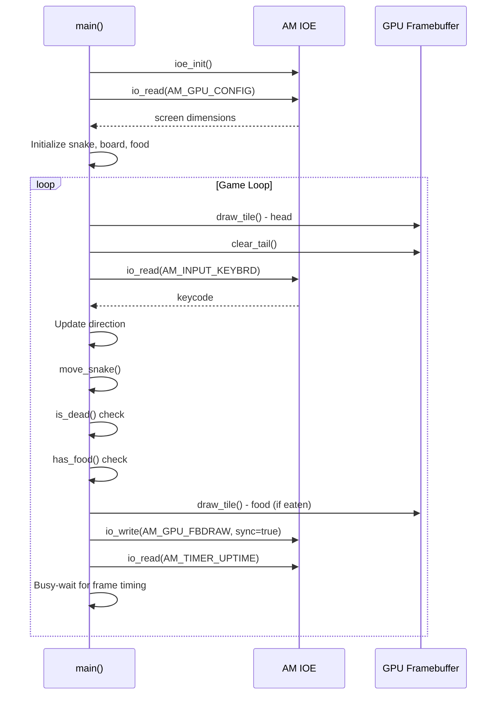

**AM APIs Used:** `ioe_init()`, `AM_GPU_CONFIG`, `AM_GPU_FBDRAW`, `AM_INPUT_KEYBRD`, `AM_TIMER_UPTIME` (IOE)

### 4. slider

An image slideshow that displays pre-encoded images on the GPU framebuffer, cycling through them every 5 seconds.

**Source:** `kernels/slider/main.c`

**AM APIs Used:** `ioe_init()`, `AM_GPU_FBDRAW`, `AM_TIMER_UPTIME` (IOE)

### 5. bad-apple

A video player that plays the "Bad Apple" animation using terminal output (ASCII art) and optionally audio playback.

**Source:** `kernels/bad-apple/bad-apple.c`

**Key Components:**

| Component | Type | Description |
|-----------|------|-------------|
| `frame_t` | `struct` | Video frame with pixel data packed as bits `{uint8_t pixel[VIDEO_ROW * VIDEO_COL / 8]}` |

**Data Flow:**

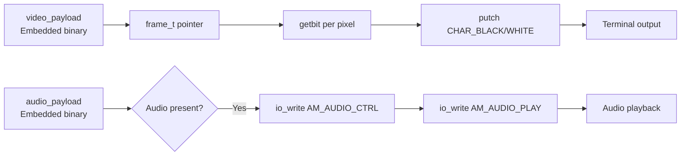

**AM APIs Used:** `ioe_init()`, `AM_TIMER_UPTIME`, `AM_AUDIO_CONFIG`, `AM_AUDIO_CTRL`, `AM_AUDIO_PLAY`, `putch()` (TRM)

### 6. typing-game

A typing practice game that displays falling characters and tests the player's typing speed.

**Source:** `kernels/typing-game/`

**AM APIs Used:** `ioe_init()`, `AM_INPUT_KEYBRD`, `AM_GPU_FBDRAW`, `AM_TIMER_UPTIME` (IOE)

### 7. yield-os

A minimal cooperative multitasking operating system that demonstrates context switching between two threads using the AM CTE (Context and Trap Extension).

**Source:** `kernels/yield-os/yield-os.c`

**Key Components:**

| Component | Type | Description |
|-----------|------|-------------|
| `PCB` | `union` | Process Control Block: 32KB stack + `Context *cp` |

**Execution Flow:**

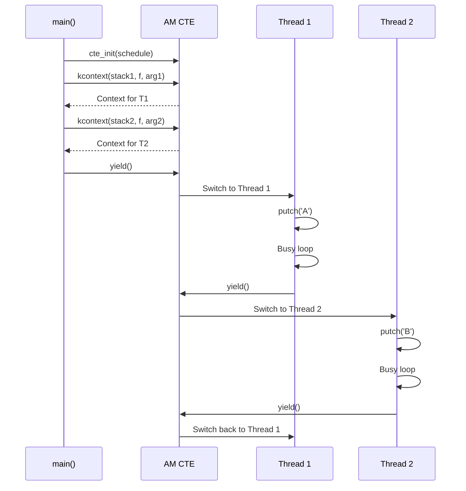

**AM APIs Used:** `cte_init()`, `kcontext()`, `yield()`, `putch()` (TRM)

### 8. thread-os

A multi-threaded operating system demonstrating cooperative multitasking across multiple CPU cores using the AM MPE (Multi-Processing Extension).

**Source:** `kernels/thread-os/thread-os.c`

**Key Components:**

| Component | Type | Description |
|-----------|------|-------------|
| `Task` | `union` | Task control block: name, next pointer, entry function, context, 12KB stack |
| `currents[MAX_CPU]` | `Task*[]` | Per-CPU current task pointers |
| `locked` | `int` | Global spinlock for atomic printf |

**Execution Flow:**

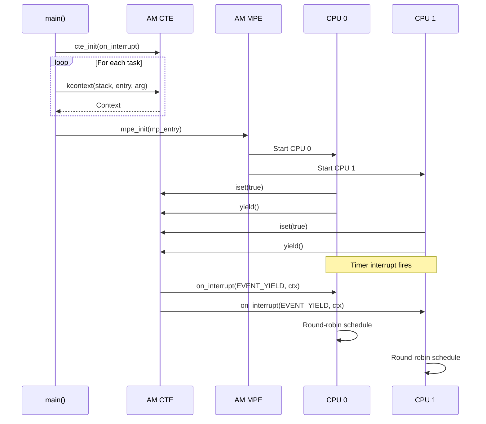

**Scheduling Algorithm:**
```c
Context *on_interrupt(Event ev, Context *ctx) {
  if (!current) current = &tasks[0];
  else          current->context = ctx;
  do {
    current = current->next;
  } while ((current - tasks) % cpu_count() != cpu_current());
  return current->context;
}
```

Each CPU core independently round-robins through the task list, skipping tasks that belong to other cores (using modulo arithmetic).

**AM APIs Used:** `cte_init()`, `kcontext()`, `yield()`, `iset()`, `cpu_current()`, `cpu_count()`, `mpe_init()`, `atomic_xchg()`, `printf()` (TRM)

### 9. litenes (LiteNES)

A minimal NES (Nintendo Entertainment System) emulator that can play Super Mario Bros. It emulates the 6502 CPU, PPU (Picture Processing Unit), and PSG (Programmable Sound Generator).

**Source:** `kernels/litenes/`

**Key Components:**

| Component | File | Description |
|-----------|------|-------------|
| `CPU_STATE` | `cpu-internal.h` | 6502 CPU state: PC, SP, A, X, Y, P registers |
| `PPU_STATE` | `ppu.h` | PPU state: control registers, scroll, address, scanline |
| `ines_header` | `fce.c` | iNES ROM header: signature, PRG/CHR block counts, ROM type |
| `mmc_id` | `mmc.h` | MMC (Memory Mapper Controller) ID for bank switching |

**CPU State (`CPU_STATE`):**
```c
typedef struct {
  word PC;    // Program Counter (16-bit)
  byte SP;    // Stack Pointer
  byte A, X, Y; // Accumulator, Index Registers
  byte P;     // Processor Status (flags)
} CPU_STATE;
```

**PPU State (`PPU_STATE`):**
```c
typedef struct {
  byte PPUCTRL;    // $2000 - Control
  byte PPUMASK;    // $2001 - Mask
  byte PPUSTATUS;  // $2002 - Status
  byte OAMADDR;    // $2003 - OAM Address
  byte OAMDATA;    // $2004 - OAM Data
  word PPUSCROLL;  // $2005 - Scroll (X, Y)
  word PPUADDR;    // $2006 - VRAM Address
  word PPUDATA;    // $2007 - VRAM Data
  int x, scanline; // Current rendering position
} PPU_STATE;
```

**iNES ROM Header (`ines_header`):**
```c
typedef struct {
  char signature[4];  // "NES\x1A"
  byte prg_block_count; // Number of 16KB PRG-ROM banks
  byte chr_block_count; // Number of 8KB CHR-ROM/VROM banks
  word rom_type;        // Flags: mirroring, mapper, etc.
  byte reserved[8];
} ines_header;
```

**Emulator Architecture:**

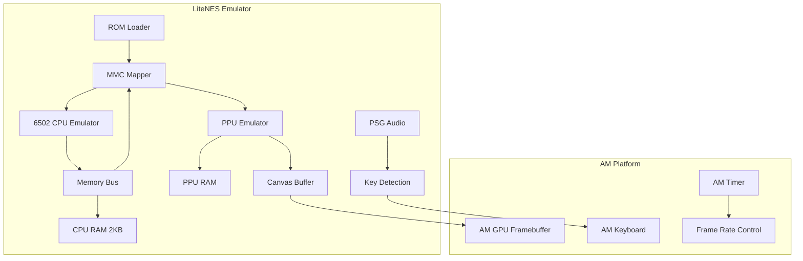

**Emulation Loop:**
```c
void fce_run() {
  while(1) {
    wait_for_frame();  // 60 FPS timing
    int scanlines = 262;
    while (scanlines-- > 0) {
      ppu_cycle();     // PPU renders one scanline
      psg_detect_key(); // Audio/key detection
    }
    // Screen updated via fce_update_screen()
  }
}
```

**AM APIs Used:** `ioe_init()`, `AM_GPU_CONFIG`, `AM_GPU_FBDRAW`, `AM_TIMER_UPTIME`, `AM_INPUT_KEYBRD`, `printf()` (TRM)

### 10. blockchain

A blockchain demonstration kernel (source in `kernels/blockchain/`).

**AM APIs Used:** TRM only

### 11. nemu

A "NEMU-in-NEMU" kernel that runs the NEMU emulator within the AM environment (source in `kernels/nemu/`).

**AM APIs Used:** TRM only

---

## Benchmarks

The benchmarks directory contains standardized performance measurement suites used to evaluate CPU and system performance.

### 1. CoreMark

CoreMark is a standardized benchmark from EEMBC (Embedded Microprocessor Benchmark Consortium) that tests the performance of a CPU core. It runs three algorithms:

1. **List processing** (linked list operations)
2. **Matrix manipulation** (matrix multiply)
3. **State machine** (finite state machine)

**Source:** `benchmarks/coremark/`

**Key Components:**

| Component | Type | File | Description |
|-----------|------|------|-------------|
| `list_data` | `struct` | `coremark.h` | List node data: `{ee_s16 data16, idx}` |
| `list_head` | `struct` | `coremark.h` | Linked list head: `{next, info}` |
| `mat_params` | `struct` | `coremark.h` | Matrix parameters: `{N, A, B, C}` |
| `core_results` | `struct` | `coremark.h` | Benchmark results: seeds, CRC, scores |
| `core_portable` | `struct` | `core_portme.h` | Platform portability info: `{portable_id}` |
| `CORE_TICKS` | `typedef` | `core_portme.h` | Time measurement type (`uint32_t`) |

**Data Structures:**

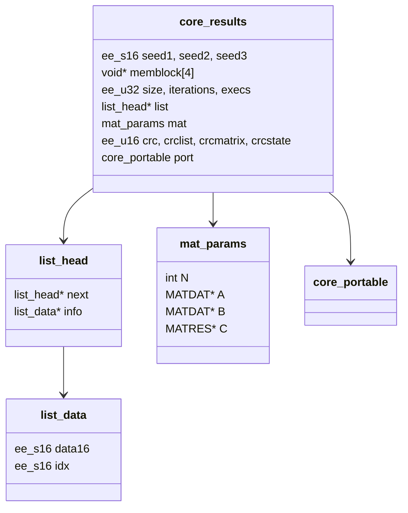

**Benchmark Flow:**

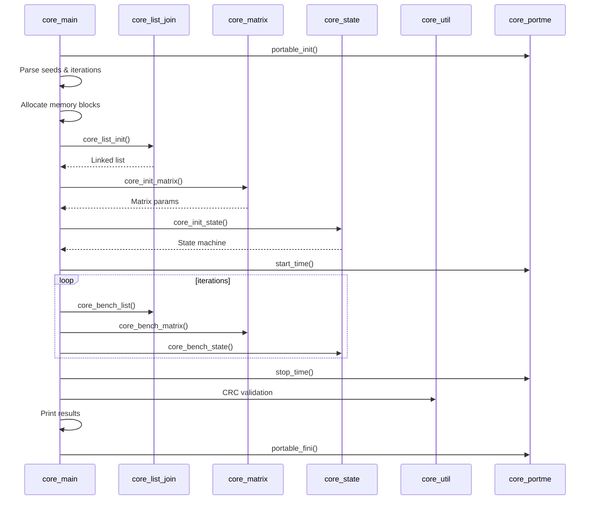

**AM Integration:** The CoreMark port uses `AM_TIMER_UPTIME` for timing via `core_portme.c`:
```c
static uint32_t uptime_ms() { return io_read(AM_TIMER_UPTIME).us / 1000; }
void start_time(void) { start_time_val = uptime_ms(); }
void stop_time(void) { stop_time_val = uptime_ms(); }
```

### 2. Dhrystone

Dhrystone is a classic synthetic benchmark that measures integer performance by executing a representative mix of operations (assignments, control statements, procedure calls).

**Source:** `benchmarks/dhrystone/dry.c`

The benchmark runs a fixed number of iterations (default: 500,000) and measures the elapsed time using `AM_TIMER_UPTIME`.

**AM Integration:**
```c
static uint32_t uptime_ms() { return io_read(AM_TIMER_UPTIME).us / 1000; }
#define Start_Timer() Begin_Time = uptime_ms()
#define Stop_Timer()  End_Time   = uptime_ms()
```

### 3. MicroBench

A custom benchmark suite that tests various computational workloads with different input sizes (test, train, ref, huge).

**Source:** `benchmarks/microbench/`

**Key Components:**

| Component | Type | File | Description |
|-----------|------|------|-------------|
| `Setting` | `struct` | `benchmark.h` | Benchmark configuration: `{size, mlim, ref, checksum}` |
| `Benchmark` | `struct` | `benchmark.h` | Benchmark descriptor: `{prepare, run, validate, name, desc, settings[4]}` |
| `Result` | `struct` | `benchmark.h` | Benchmark result: `{pass, usec}` |

**Benchmark List:**

| Name | Description | Algorithm |
|------|-------------|-----------|
| `qsort` | Quick sort | Sorting |
| `queen` | Queen placement | Backtracking |
| `bf` | Brainf\*\*k interpreter | Interpretation |
| `fib` | Fibonacci number | Recursion |
| `sieve` | Eratosthenes sieve | Prime generation |
| `15pz` | A\* 15-puzzle search | Heuristic search |
| `dinic` | Dinic's maxflow algorithm | Graph algorithm |
| `lzip` | Lzip compression | Data compression (QuickLZ) |
| `ssort` | Suffix sort | String algorithm |
| `md5` | MD5 digest | Cryptographic hash |

**Compression Components (QuickLZ):**

The lzip benchmark uses the QuickLZ data compression library, which defines the following state structures:

| Component | Type | Description |
|-----------|------|-------------|
| `qlz_state_compress` | `struct` | Compression state: hash table, stream buffer, counter |
| `qlz_state_decompress` | `struct` | Decompression state: hash table, stream buffer, counter |
| `qlz_hash_compress` | `struct` | Compression hash entry: cache + offset pointers |
| `qlz_hash_decompress` | `struct` | Decompression hash entry: offset pointers |

**Benchmark Execution Flow:**

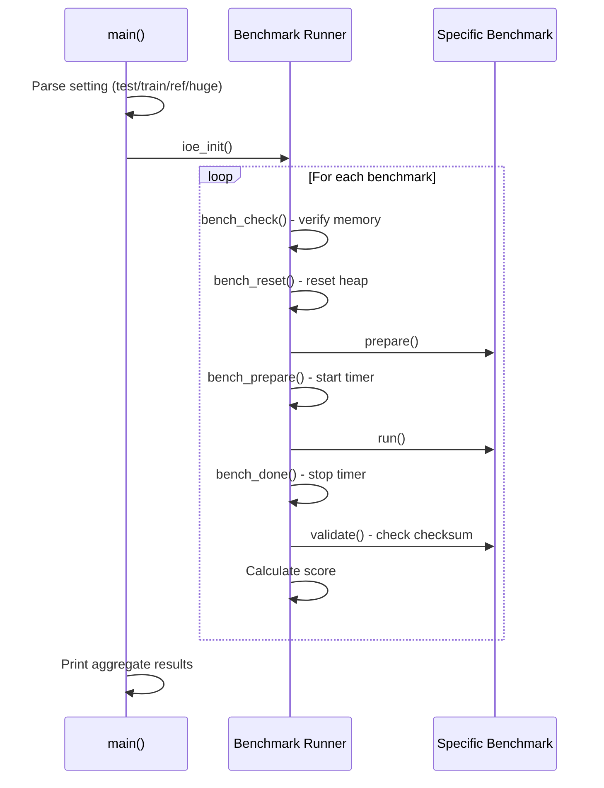

**Scoring Formula:**
```c
static uint32_t score(Benchmark *b, uint64_t usec) {
  if (usec == 0) return 0;
  return (uint64_t)(REF_SCORE) * setting->ref / usec;
}
```

The reference score is 100,000 marks on an Intel i9-9900K @ 3.60GHz.

**AM APIs Used:** `ioe_init()`, `AM_TIMER_UPTIME`, `printf()` (TRM), `bench_alloc()` (custom heap allocator)

---

## Tests

The tests directory contains verification suites for CPU correctness and AM API functionality.

### 1. cpu-tests

A comprehensive suite of CPU instruction tests that verify the correctness of ISA implementations.

**Source:** `tests/cpu-tests/`

**Test List:**

| Test | Description |
|------|-------------|
| `add.c` | Integer addition |
| `add-longlong.c` | 64-bit addition |
| `sub-longlong.c` | 64-bit subtraction |
| `mul-longlong.c` | 64-bit multiplication |
| `div.c` | Division operations |
| `bit.c` | Bitwise operations |
| `shift.c` | Shift operations |
| `load-store.c` | Memory load/store |
| `mov-c.c` | Conditional moves |
| `movsx.c` | Sign extension moves |
| `if-else.c` | Conditional branching |
| `switch.c` | Switch statements |
| `recursion.c` | Recursive function calls |
| `fact.c` | Factorial computation |
| `fib.c` | Fibonacci sequence |
| `prime.c` | Prime number generation |
| `mersenne.c` | Mersenne prime calculation |
| `goldbach.c` | Goldbach's conjecture |
| `leap-year.c` | Leap year calculation |
| `pascal.c` | Pascal's triangle |
| `max.c` | Maximum value |
| `min3.c` | Minimum of three values |
| `sum.c` | Summation |
| `bubble-sort.c` | Bubble sort |
| `quick-sort.c` | Quick sort |
| `select-sort.c` | Selection sort |
| `matrix-mul.c` | Matrix multiplication |
| `crc32.c` | CRC32 checksum |
| `string.c` | String operations |
| `hello-str.c` | String output |
| `to-lower-case.c` | Case conversion |
| `shuixianhua.c` | Narcissistic numbers |
| `wanshu.c` | Perfect numbers |
| `unalign.c` | Unaligned memory access |
| `dummy.c` | Minimal test |

### 2. am-tests

A test suite that validates the functionality of all AM API models (TRM, IOE, CTE, VME, MPE).

**Source:** `tests/am-tests/`

**Test List:**

| Flag | Test Name | AM Models Required | Description |
|------|-----------|-------------------|-------------|
| `h` | hello | TRM | Basic output test |
| `i` | hello_intr | IOE, CTE | Interrupt/yield test |
| `d` | devscan | IOE | Device scanning |
| `m` | mp_print | MPE | Multiprocessor test |
| `t` | rtc_test | IOE | Real-time clock test |
| `k` | keyboard_test | IOE | Keyboard input test |
| `v` | video_test | IOE | GPU display test |
| `a` | audio_test | IOE | Audio playback test |
| `p` | vm_test | CTE, VME | Virtual memory test |
| `c` | putch_test | TRM | Character output test |

**Usage:**
```bash
make run mainargs=h    # Run hello test
make run mainargs=v    # Run video test
make run mainargs=p    # Run virtual memory test
```

### 3. alu-tests

ALU (Arithmetic Logic Unit) verification tests that generate exhaustive test cases for arithmetic operations.

**Source:** `tests/alu-tests/`

**Key Component:**
- `gen_alu_test.c` - Test case generator for ALU operations

---

## Component Relationships

### Dependency Graph

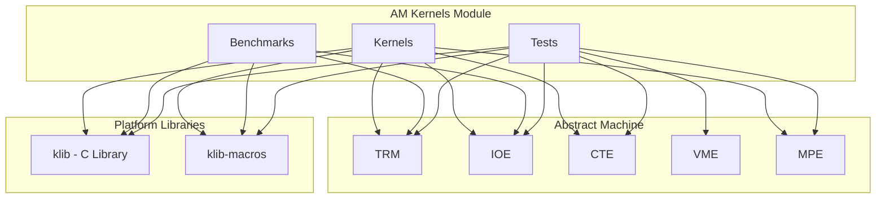

### Shared Data Types

The AM Kernels module defines several data types that are shared across multiple programs:

| Type | Used By | Description |
|------|---------|-------------|
| `point_t` | snake, typing-game | 2D point `{x, y}` |
| `dim_t` | snake, typing-game | Dimensions `{width, height}` |
| `rect_t` | snake, typing-game | Rectangle `{top, bottom, left, right}` |
| `frame_t` | bad-apple | Video frame with packed pixel data |
| `CPU_STATE` | litenes | 6502 CPU register state |
| `PPU_STATE` | litenes | NES PPU register state |
| `ines_header` | litenes | iNES ROM header format |
| `qlz_state_compress` | microbench/lzip | QuickLZ compression state |
| `qlz_state_decompress` | microbench/lzip | QuickLZ decompression state |
| `qlz_hash_compress` | microbench/lzip | QuickLZ compression hash entry |
| `qlz_hash_decompress` | microbench/lzip | QuickLZ decompression hash entry |
| `Setting` | microbench | Benchmark configuration |
| `Benchmark` | microbench | Benchmark descriptor |
| `Result` | microbench | Benchmark result |
| `list_data` | coremark | Linked list data node |
| `list_head` | coremark | Linked list head node |
| `mat_params` | coremark | Matrix benchmark parameters |
| `core_results` | coremark | CoreMark results container |
| `core_portable` | coremark | Platform portability info |

---

## Build System

Each kernel, benchmark, and test has its own `Makefile` that includes the common AM build infrastructure. The typical build flow is:

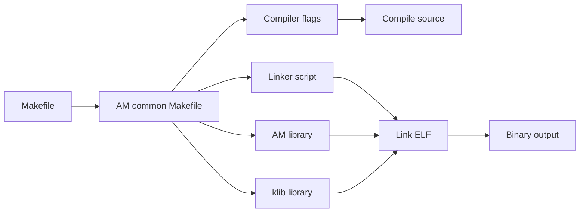

**Common build targets:**
```bash
make ARCH=riscv64-nemu     # Build for RISC-V on NEMU
make ARCH=x86_64-nemu      # Build for x86 on NEMU
make ARCH=native           # Build for native platform
make run                   # Build and run
make run mainargs=test     # Build and run with arguments
```

---

## References

- [Abstract Machine (AM)](Abstract%20Machine%20(AM).md) - The hardware abstraction layer that all AM Kernels programs run on
- [NEMU Emulator](NEMU%20Emulator.md) - The NEMU emulator (also runnable as an AM kernel)
- [Navy Apps](Navy%20Apps.md) - User-space applications that also use the AM API
- [FCEUX NES Emulator](FCEUX%20NES%20Emulator.md) - The full FCEUX emulator (LiteNES is a simplified version)
- [NPC Simulator](NPC%20Simulator.md) - Another simulator platform supported by AM
