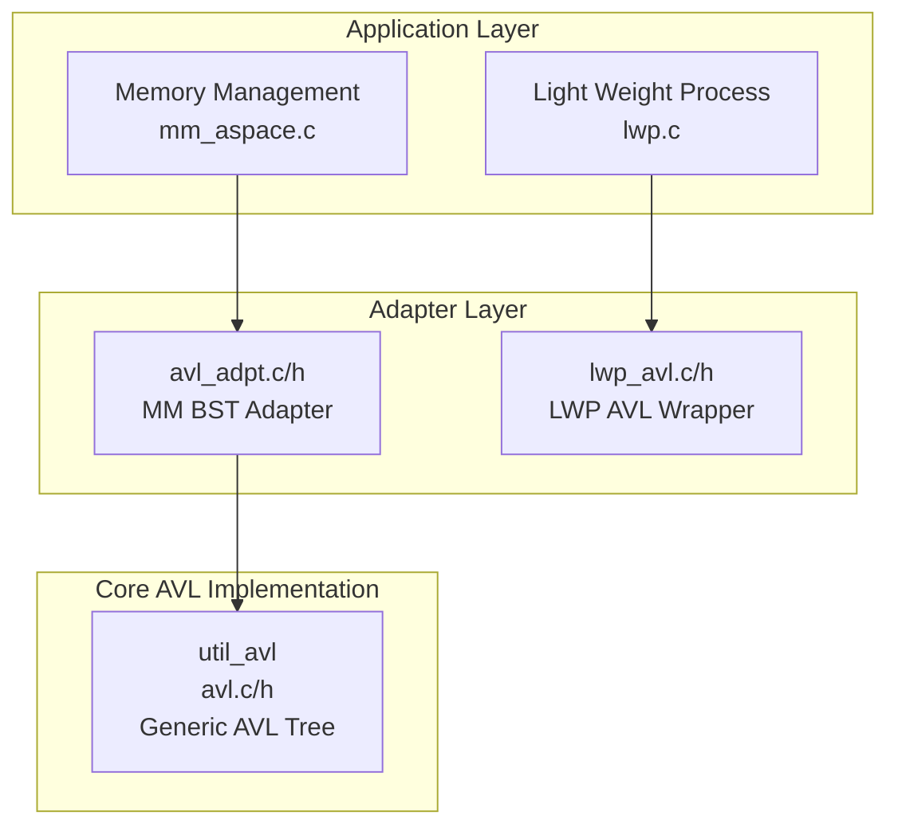
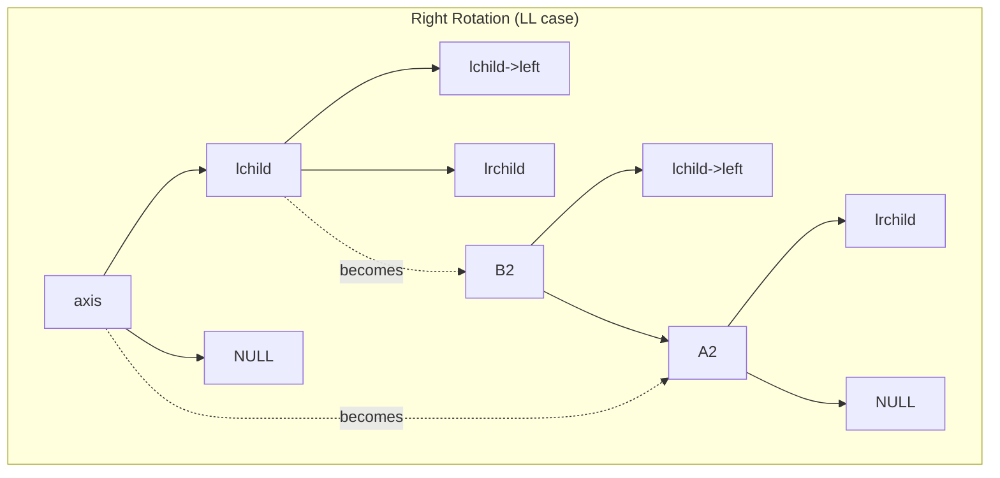
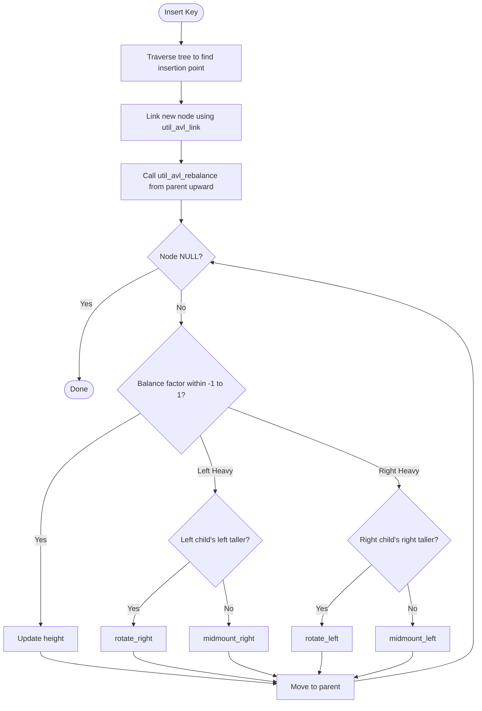
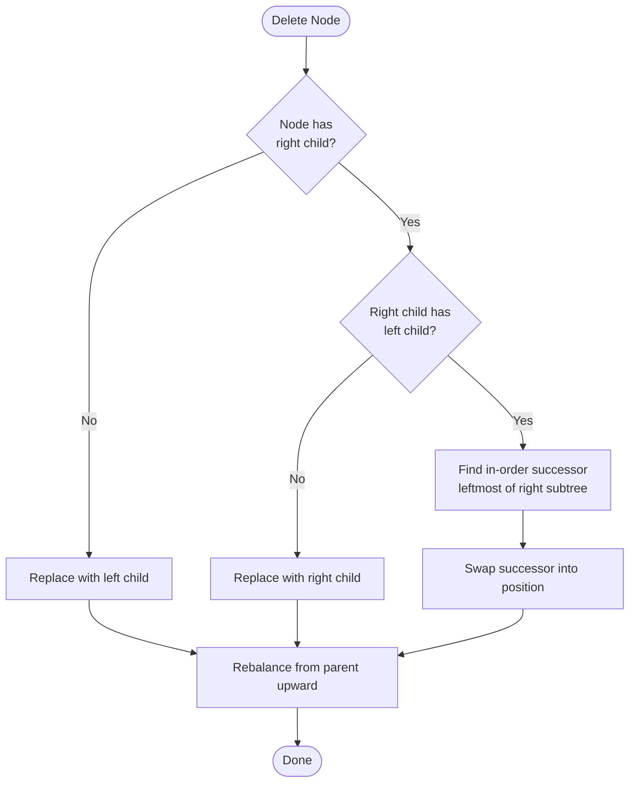
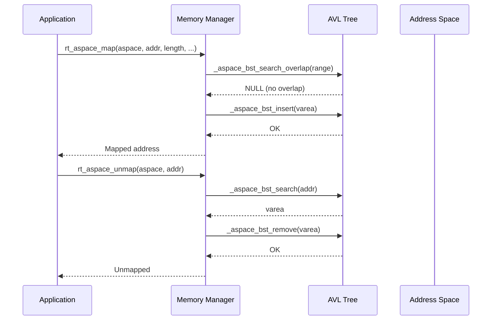
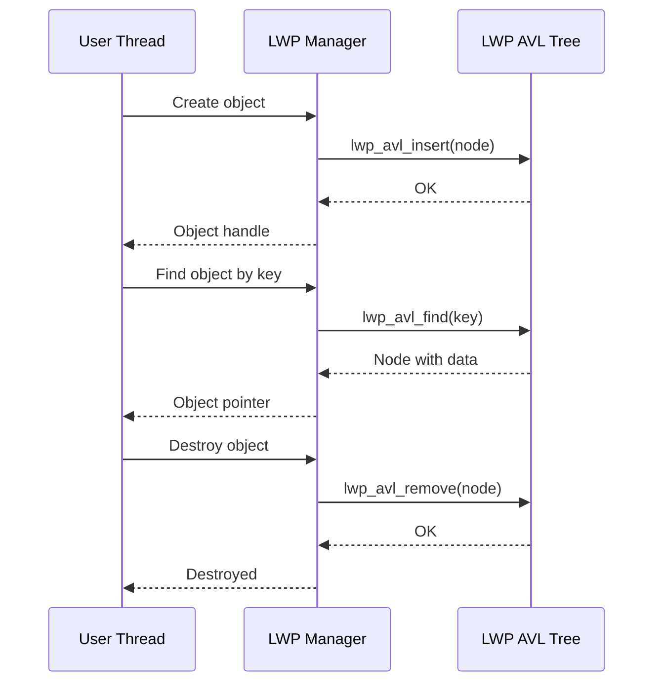
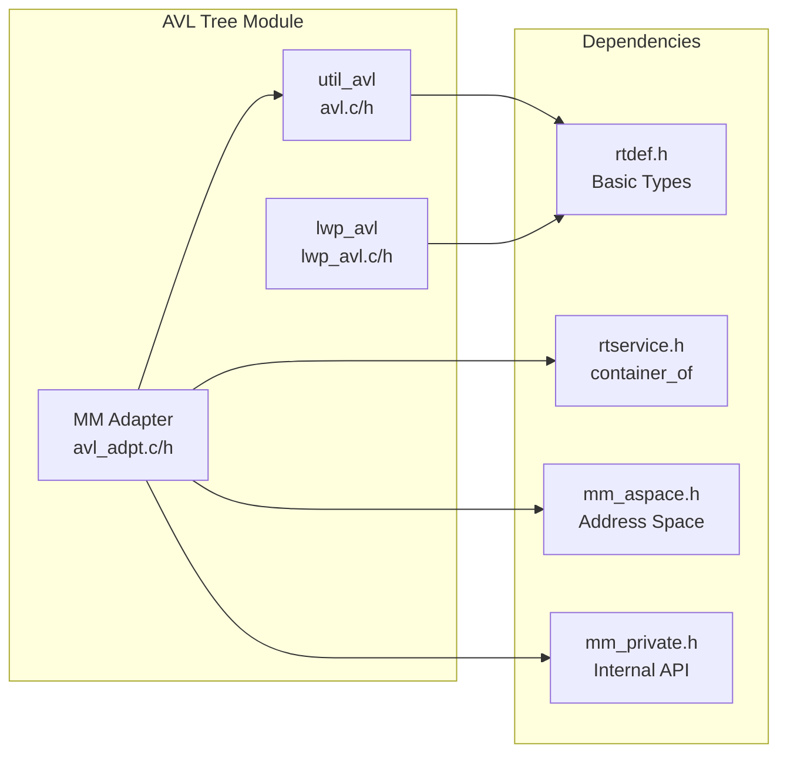

# AVL Tree Module

## Introduction

The AVL Tree module provides a self-balancing binary search tree (BST) implementation for the RT-Thread operating system. Named after its inventors Adelson-Velsky and Landis, the AVL tree guarantees O(log n) time complexity for search, insertion, and deletion operations by maintaining a height balance property: for every node, the heights of its left and right subtrees differ by at most 1.

RT-Thread contains **two distinct AVL tree implementations** serving different purposes:

1. **Generic AVL Tree (`util_avl`)** — A lightweight, generic AVL tree in the `libadt` (Library Abstract Data Types) component, designed for general-purpose use with minimal memory overhead. It is used primarily by the Memory Management (MM) subsystem for organizing virtual memory areas (vareas).

2. **LWP AVL Tree (`lwp_avl`)** — A specialized AVL tree within the Light Weight Process (LWP) subsystem, which embeds the key and data pointer directly into the node structure. It is used for managing per-process objects and address-based object lookups.

---

## Architecture Overview

The AVL Tree module is organized into three layers:



### Component Relationships

| Component | File(s) | Role |
|-----------|---------|------|
| **Core AVL** | `components/utilities/libadt/avl.c`, `avl.h` | Generic self-balancing BST with parent pointers and height tracking |
| **MM Adapter** | `components/mm/avl_adpt.c`, `avl_adpt.h` | Wraps the generic AVL for virtual address space management |
| **LWP AVL** | `components/lwp/lwp_avl.c`, `lwp_avl.h` | Standalone AVL with embedded key/data for process object management |

---

## Core Data Structures

### 1. Generic AVL Node (`util_avl_struct`)

Defined in `components/utilities/libadt/avl.h`:

```c
struct util_avl_struct
{
    struct util_avl_struct *avl_left;   // Left child
    struct util_avl_struct *avl_right;  // Right child
    struct util_avl_struct *parent;     // Parent node (NULL for root)
    size_t height;                      // Height of this subtree
};
```

Key design decisions:
- **Parent pointer**: Enables non-recursive traversal and simplifies rebalancing after insertion/removal.
- **Height stored in node**: Avoids recomputing heights during rebalancing, improving performance.
- **No embedded key/data**: The node is intended to be embedded within a container structure (e.g., `rt_varea`) using `container_of` macros, making it a generic intrusive data structure.

### 2. AVL Tree Root (`util_avl_root`)

```c
struct util_avl_root
{
    struct util_avl_struct *root_node;  // Pointer to root node (AVL_ROOT = NULL when empty)
};

#define AVL_ROOT ((struct util_avl_struct *)0)
```

### 3. MM Adapter Structures (`avl_adpt.h`)

```c
typedef struct _aspace_node
{
    struct util_avl_struct node;  // Embedded AVL node
} *_aspace_node_t;

typedef struct _aspace_tree
{
    struct util_avl_root tree;    // AVL tree root
} *_aspace_tree_t;
```

The `rt_varea` (virtual memory area) structure embeds `_aspace_node`:

```c
struct rt_varea
{
    void *start;                  // Start address
    rt_size_t size;               // Size of the region
    rt_size_t offset;             // Offset within backing store
    rt_size_t attr;               // MMU attributes
    rt_size_t flag;               // Flags
    struct rt_aspace *aspace;     // Parent address space
    struct rt_mem_obj *mem_obj;   // Backing memory object
    struct _aspace_node node;     // AVL tree node (embedded)
    struct rt_page *frames;       // Page frames
    void *data;                   // Private data
};
```

### 4. LWP AVL Node (`lwp_avl_struct`)

Defined in `components/lwp/lwp_avl.h`:

```c
struct lwp_avl_struct
{
    struct lwp_avl_struct *avl_left;   // Left child
    struct lwp_avl_struct *avl_right;  // Right child
    int avl_height;                    // Height of this subtree
    avl_key_t avl_key;                 // Key (size_t)
    void *data;                        // Pointer to associated data
};
```

Key differences from the generic AVL:
- **Embedded key and data pointer**: No need for `container_of` — the node itself carries the payload.
- **`int` height instead of `size_t`**: Slightly smaller footprint.
- **No parent pointer**: Uses an explicit stack during insertion/removal for rebalancing.

---

## Core Algorithms

### Height and Balance

The AVL property is maintained by tracking the height of each node:

```c
#define HEIGHT_OF(node) ((node) ? (node)->height : 0)
```

A node is considered unbalanced when the heights of its left and right children differ by more than 1:

- **Left-heavy**: `HEIGHT_OF(left) > HEIGHT_OF(right) + 1`
- **Right-heavy**: `HEIGHT_OF(right) > HEIGHT_OF(left) + 1`

### Rotation Operations

Four rotation primitives are used to restore balance:



| Rotation | Function | Case | Description |
|----------|----------|------|-------------|
| **Right Rotation** | `rotate_right()` | Left-Left (LL) | Left child becomes new root; axis becomes right child |
| **Left Rotation** | `rotate_left()` | Right-Right (RR) | Right child becomes new root; axis becomes left child |
| **Left-Right (Midmount Right)** | `midmount_right()` | Left-Right (LR) | Left child's right child becomes new root |
| **Right-Left (Midmount Left)** | `midmount_left()` | Right-Left (RL) | Right child's left child becomes new root |

### Insertion Flow



### Deletion Flow



---

## API Reference

### Generic AVL Tree (`util_avl`)

| Function | Description |
|----------|-------------|
| `util_avl_link()` | Link a new node into the tree at a given position (inline) |
| `util_avl_rebalance()` | Rebalance the tree upward from a given node to the root |
| `util_avl_remove()` | Remove a node from the tree and rebalance |
| `util_avl_next()` | Get the in-order successor of a node (inline) |
| `util_avl_prev()` | Get the in-order predecessor of a node (inline) |
| `util_avl_first()` | Get the first (leftmost) node in the tree (inline) |
| `util_avl_last()` | Get the last (rightmost) node in the tree (inline) |

### MM BST Adapter (`_aspace_bst_*`)

| Function | Description |
|----------|-------------|
| `_aspace_bst_init()` | Initialize an address space's AVL tree |
| `_aspace_bst_search()` | Find a varea containing a given virtual address |
| `_aspace_bst_search_exceed()` | Find the lowest varea with start >= given address |
| `_aspace_bst_search_overlap()` | Find any varea overlapping a given address range |
| `_aspace_bst_insert()` | Insert a varea into the address space tree |
| `_aspace_bst_remove()` | Remove a varea from the address space tree |

### LWP AVL Tree (`lwp_avl`)

| Function | Description |
|----------|-------------|
| `lwp_avl_insert()` | Insert a node into the LWP AVL tree |
| `lwp_avl_remove()` | Remove a node from the LWP AVL tree |
| `lwp_avl_find()` | Find a node by key |
| `lwp_avl_traversal()` | Traverse the tree in-order, calling a callback for each node |
| `lwp_map_find_first()` | Find the first (leftmost) node in the tree |

---

## Data Flow and Usage

### Memory Management (MM) Usage

The AVL tree is the core data structure for organizing virtual memory areas (vareas) within an address space (`rt_aspace`).



The search operations use two comparison strategies:
- **`compare_overlap()`**: Returns 0 if ranges overlap, enabling overlap detection for mapping validation.
- **`compare_exceed()`**: Compares by start address only, enabling "find first varea after address X" queries.

### LWP Usage

The LWP subsystem uses its own AVL tree for:
1. **Object management**: `lwp->object_root` stores per-process objects keyed by object ID.
2. **Address-based lookups**: `lwp->address_search_head` enables fast lookup of objects by their memory address.



---

## Dependencies



### Module Dependencies

| Module | Reference | Relationship |
|--------|-----------|--------------|
| [Memory Management](Memory%20Management.md) | Uses `util_avl` via `avl_adpt` | The MM subsystem uses the AVL tree to organize virtual memory areas within address spaces |
| [LWP (Light Weight Process)](LWP%20%28Light%20Weight%20Process%29.md) | Uses `lwp_avl` directly | LWP uses its own AVL tree for per-process object management |
| [RT-Thread Kernel](RT-Thread%20Kernel.md) | Provides `rtdef.h` types | The AVL tree depends on basic RT-Thread type definitions |

---

## Performance Characteristics

| Operation | Time Complexity | Notes |
|-----------|----------------|-------|
| Search | O(log n) | Balanced tree guarantees logarithmic depth |
| Insertion | O(log n) | Includes rebalancing cost |
| Deletion | O(log n) | Includes rebalancing cost |
| In-order traversal | O(n) | Via `util_avl_next()` / `lwp_avl_traversal()` |
| Find first/last | O(log n) | Follow leftmost/rightmost pointers |

### Memory Overhead

| Implementation | Per-node overhead | Notes |
|---------------|-------------------|-------|
| `util_avl_struct` | 4 pointers + 1 `size_t` | ~28 bytes on 32-bit, ~40 bytes on 64-bit |
| `lwp_avl_struct` | 2 pointers + 1 `int` + 1 key + 1 data ptr | ~20 bytes on 32-bit, ~32 bytes on 64-bit |

---

## Design Rationale

### Why Two Implementations?

1. **Separation of concerns**: The generic `util_avl` is a pure data structure with no knowledge of its payload. The LWP AVL embeds key/data for simplicity in its use case.

2. **Parent pointer vs. stack**: The generic AVL uses parent pointers for rebalancing, which simplifies the code but adds 4-8 bytes per node. The LWP AVL uses an explicit stack during operations, saving memory but requiring a fixed maximum depth (`avl_maxheight = 32`).

3. **Intrusive vs. non-intrusive**: The generic AVL is intrusive (node is embedded in the container), which is ideal for the MM subsystem where vareas are allocated and freed independently. The LWP AVL is semi-intrusive (node contains key/data pointers), which simplifies object management.

### Why AVL Instead of Red-Black Tree?

- **Faster lookups**: AVL trees are more strictly balanced than red-black trees, providing faster lookups (at the cost of slightly slower insertions/deletions).
- **Memory-constrained environments**: AVL trees are well-suited for RT-Thread's target embedded systems where predictable performance is critical.
- **Simplicity**: The AVL implementation is compact and easy to verify for correctness in safety-critical embedded contexts.

---

## Related Documentation

- [Memory Management](Memory%20Management.md) — Details on how the AVL tree is used for virtual memory area management
- [LWP (Light Weight Process)](LWP%20%28Light%20Weight%20Process%29.md) — Details on LWP object management using AVL trees
- [RT-Thread Kernel](RT-Thread%20Kernel.md) — Core kernel types and infrastructure
