# Abstract Machine (AM)

## Introduction

The **Abstract Machine (AM)** is a hardware abstraction layer that provides a uniform, platform-independent programming interface for system-level software. It serves as the foundational layer between hardware (real or simulated) and higher-level software components such as operating system kernels (e.g., Nanos-lite), user applications (Navy Apps), and benchmark suites (AM Kernels).

The AM defines five abstract machine models, each encapsulating a specific set of hardware capabilities:

| Model | Name | Purpose |
|-------|------|---------|
| **TRM** | Turing Machine | Minimal computation: heap, putch, halt |
| **IOE** | I/O Devices | Device access: UART, timer, keyboard, GPU, audio, disk, network |
| **CTE** | Context and Trap Extension | Interrupt/exception handling and context switching |
| **VME** | Virtual Memory Extension | Address space management and page mapping |
| **MPE** | Multi-Processing Extension | Multi-core CPU support and atomic operations |

The AM is designed for the **YSYX ("一生一芯")** educational project, where it runs on top of various hardware simulators (NEMU, NPC) and real hardware (QEMU, Spike, native platform), enabling the same software stack to execute across different ISAs (x86, RISC-V, MIPS32, LoongArch32r) without modification.

---

## Architecture Overview

The AM module follows a layered architecture where platform-independent abstractions sit above platform-specific implementations.

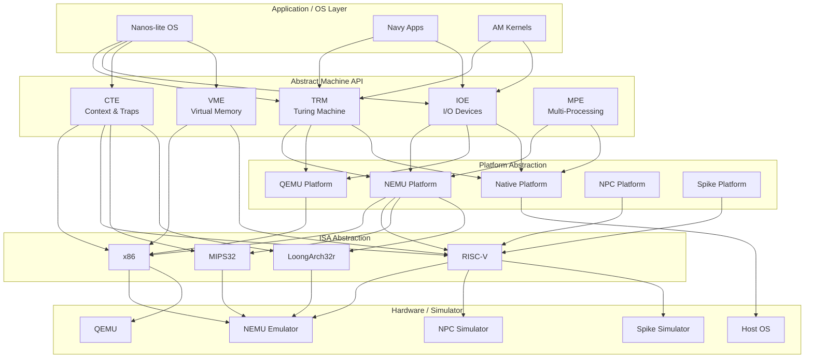

---

## Core Components

### 1. Core Data Structures

The AM defines several fundamental data structures that are shared across all models.

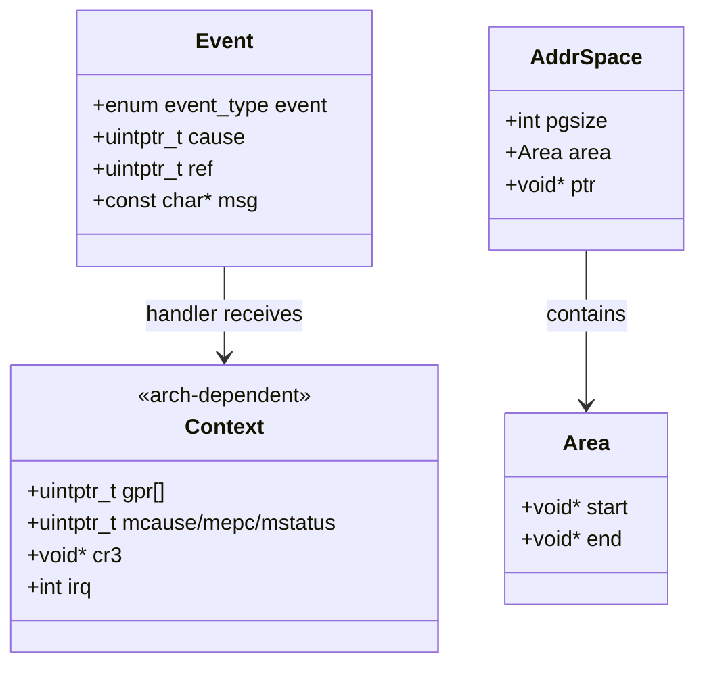

#### `Area`
Represents a contiguous memory region `[start, end)`. Used throughout the AM to describe memory ranges such as the heap, kernel stacks, and address space boundaries.

```c
typedef struct {
  void *start, *end;
} Area;
```

#### `Event`
Describes an event that triggers a context switch or trap. The event type determines how the handler should process it.

```c
typedef struct {
  enum {
    EVENT_NULL = 0,
    EVENT_YIELD, EVENT_SYSCALL, EVENT_PAGEFAULT, EVENT_ERROR,
    EVENT_IRQ_TIMER, EVENT_IRQ_IODEV,
  } event;
  uintptr_t cause, ref;
  const char *msg;
} Event;
```

#### `Context`
An **architecture-dependent** structure that holds the full CPU register state during a context switch. Each ISA defines its own `Context` layout:

- **x86 (NEMU)**: `esi, ebx, eax, eip, edx, eflags, ecx, cs, esp, edi, ebp, cr3, irq`
- **RISC-V**: `gpr[NR_REGS], mcause, mstatus, mepc` (with `pdir` aliased to `gpr[0]`)
- **Native**: `ksp, vm_head, ucontext_t` (wraps host OS `ucontext`)

#### `AddrSpace`
Represents a protected address space with virtual memory support. Contains the page size, user memory area, and an architecture-dependent pointer (typically a page table/directory pointer).

```c
typedef struct {
  int pgsize;
  Area area;
  void *ptr;
} AddrSpace;
```

---

### 2. TRM: Turing Machine

The **Turing Machine** model provides the minimal set of operations required for computation: a heap memory area, character output, and program termination.

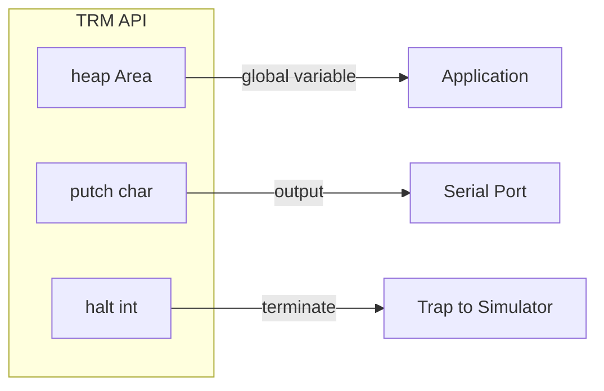

**Key Components:**

| Component | Description |
|-----------|-------------|
| `heap` | Global `Area` defining the available heap memory (from `_heap_start` to `PMEM_END`) |
| `putch(char ch)` | Outputs a single character to the serial port (or stdout on native) |
| `halt(int code)` | Terminates the program with an exit code via a simulator trap |

**Implementation (NEMU platform):**
```c
Area heap = RANGE(&_heap_start, PMEM_END);

void putch(char ch) {
  outb(SERIAL_PORT, ch);  // Write to serial port MMIO
}

void halt(int code) {
  nemu_trap(code);  // Trigger simulator trap
  while (1);
}
```

**Startup Flow:**
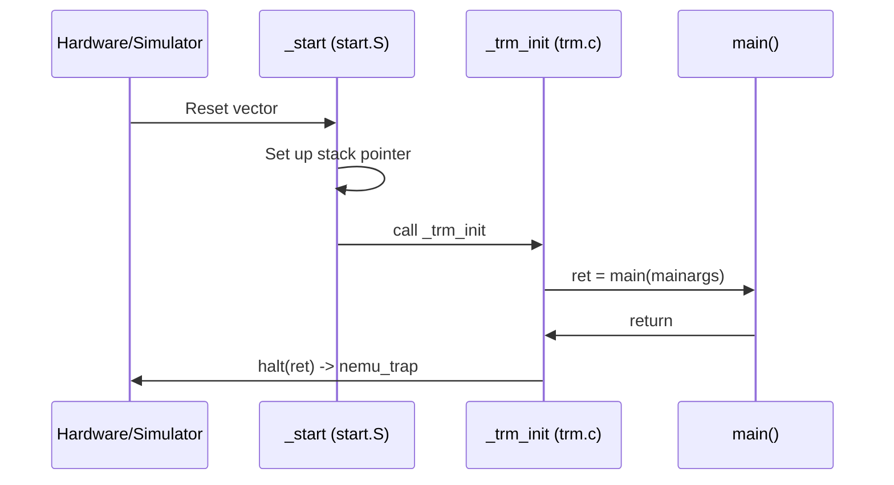

---

### 3. IOE: Input/Output Devices

The **I/O Devices** model provides a uniform interface for accessing hardware devices through a register-based read/write mechanism.

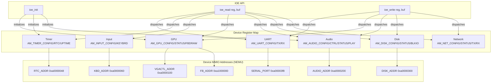

#### Device Register Definitions

Devices are defined using the `AM_DEVREG` macro, which generates both an enum constant and a typed struct for each register:

```c
#define AM_DEVREG(id, reg, perm, ...) \
  enum { AM_##reg = (id) }; \
  typedef struct { __VA_ARGS__; } AM_##reg##_T;
```

| ID | Register | Permission | Fields |
|----|----------|------------|--------|
| 1 | `UART_CONFIG` | RD | `bool present` |
| 2 | `UART_TX` | WR | `char data` |
| 3 | `UART_RX` | RD | `char data` |
| 4 | `TIMER_CONFIG` | RD | `bool present, has_rtc` |
| 5 | `TIMER_RTC` | RD | `int year, month, day, hour, minute, second` |
| 6 | `TIMER_UPTIME` | RD | `uint64_t us` |
| 7 | `INPUT_CONFIG` | RD | `bool present` |
| 8 | `INPUT_KEYBRD` | RD | `bool keydown; int keycode` |
| 9 | `GPU_CONFIG` | RD | `bool present, has_accel; int width, height, vmemsz` |
| 10 | `GPU_STATUS` | RD | `bool ready` |
| 11 | `GPU_FBDRAW` | WR | `int x, y; void *pixels; int w, h; bool sync` |
| 12 | `GPU_MEMCPY` | WR | `uint32_t dest; void *src; int size` |
| 13 | `GPU_RENDER` | WR | `uint32_t root` |
| 14 | `AUDIO_CONFIG` | RD | `bool present; int bufsize` |
| 15 | `AUDIO_CTRL` | WR | `int freq, channels, samples` |
| 16 | `AUDIO_STATUS` | RD | `int count` |
| 17 | `AUDIO_PLAY` | WR | `Area buf` |
| 18 | `DISK_CONFIG` | RD | `bool present; int blksz, blkcnt` |
| 19 | `DISK_STATUS` | RD | `bool ready` |
| 20 | `DISK_BLKIO` | WR | `bool write; void *buf; int blkno, blkcnt` |
| 21 | `NET_CONFIG` | RD | `bool present` |
| 22 | `NET_STATUS` | RD | `int rx_len, tx_len` |
| 23 | `NET_TX` | WR | `Area buf` |
| 24 | `NET_RX` | WR | `Area buf` |

#### Convenience Macros

```c
// Read a device register
#define io_read(reg) \
  ({ reg##_T __io_param; \
    ioe_read(reg, &__io_param); \
    __io_param; })

// Write a device register
#define io_write(reg, ...) \
  ({ reg##_T __io_param = (reg##_T) { __VA_ARGS__ }; \
    ioe_write(reg, &__io_param); })
```

#### IOE Dispatch Mechanism

The IOE uses a **lookup table** (`lut[128]`) indexed by register ID to dispatch read/write operations:

```mermaid
flowchart LR
    A[ioe_read/ioe_write] --> B{LUT[reg] exists?}
    B -->|Yes| C[Call handler function]
    B -->|No| D[Call fail handler]
    C --> E[Handler reads/writes MMIO]
    D --> F[panic: access nonexist register]
```

---

### 4. CTE: Context and Trap Extension

The **Context and Trap Extension** manages interrupt/exception handling and context switching between kernel and user mode.

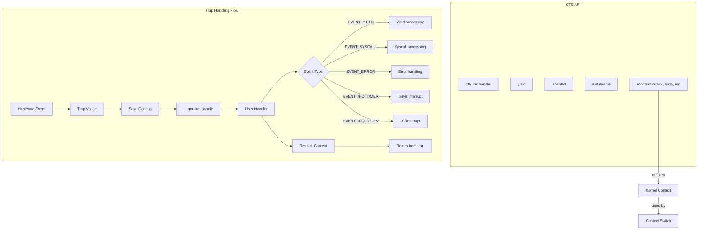

#### Trap Handling (x86-NEMU)

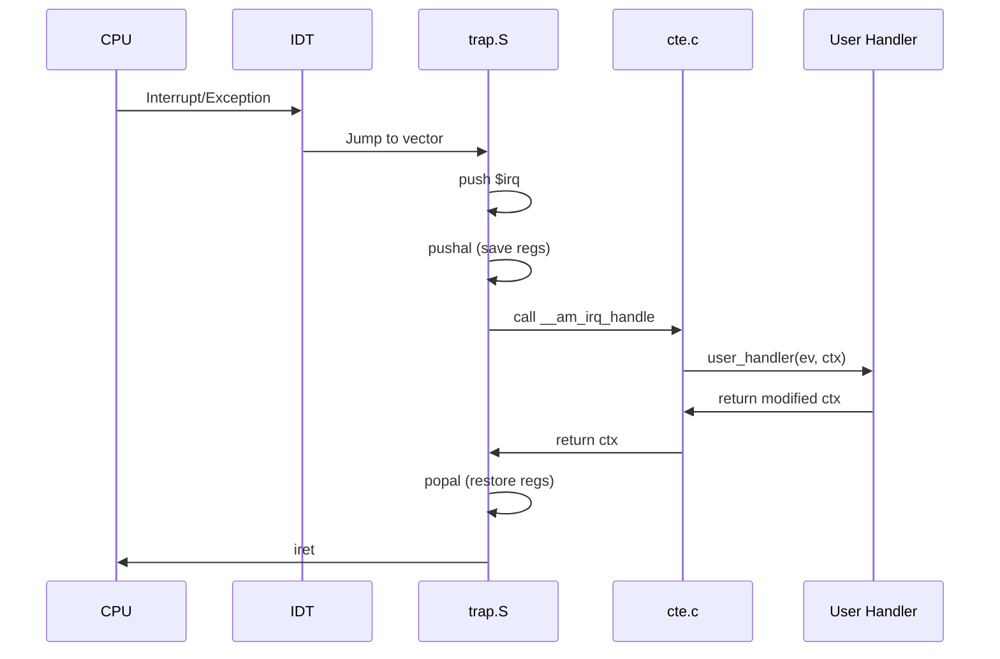

#### Trap Handling (RISC-V-NEMU)

```mermaid
sequenceDiagram
    participant CPU as CPU
    participant TRAP as trap.S
    participant CTE as cte.c
    participant HANDLER as User Handler

    CPU->>TRAP: ecall/ebreak/interrupt
    TRAP->>TRAP: Save regs to stack
    TRAP->>TRAP: csrr mcause, mstatus, mepc
    TRAP->>CTE: mv a0, sp; call __am_irq_handle
    CTE->>HANDLER: user_handler(ev, ctx)
    HANDLER->>CTE: return modified ctx
    CTE->>TRAP: mv sp, a0
    TRAP->>TRAP: csrw mstatus, mepc
    TRAP->>TRAP: Restore regs from stack
    TRAP->>CPU: mret
```

#### Context Creation

The `kcontext()` function creates a kernel-mode context for a new thread:

```c
// RISC-V implementation
Context *kcontext(Area kstack, void (*entry)(void *), void *arg) {
  Context *c = (Context *)((uintptr_t)kstack.end - sizeof(Context));
  memset(c, 0, sizeof(Context));
  c->mepc = (uintptr_t)entry;       // Entry point
  c->gpr[2] = (uintptr_t)kstack.end; // x2 = sp (stack pointer)
  c->gpr[10] = (uintptr_t)arg;       // x10 = a0 (first argument)
  c->mstatus = 0x1800;               // MIE=1, MPIE=1
  return c;
}
```

---

### 5. VME: Virtual Memory Extension

The **Virtual Memory Extension** provides address space management, page table manipulation, and user-mode context creation.

```mermaid
graph TB
    subgraph "VME API"
        VME_INIT[vme_init pgalloc, pgfree]
        PROTECT[protect as]
        UNPROTECT[unprotect as]
        MAP[map as, va, pa, prot]
        UCONTEXT[ucontext as, kstack, entry]
    end

    subgraph "Address Space Lifecycle"
        AS_INIT[Create Address Space] --> ALLOC_PT[Allocate Page Table]
        ALLOC_PT --> MAP_KERNEL[Map Kernel Space]
        MAP_KERNEL --> MAP_USER[Map User Pages]
        MAP_USER --> SWITCH[Switch Address Space]
        SWITCH --> RUN[Run User Process]
    end

    subgraph "Page Table Structure"
        PD[Page Directory]
        PT[Page Table]
        PD --> PT
        PT --> PAGE[Physical Page]
    end

    VME_INIT -->|initializes| KAS[Kernel Address Space]
    PROTECT -->|creates| USER_AS[User Address Space]
    MAP -->|modifies| PAGE_TABLE[Page Table]
    UCONTEXT -->|creates| USER_CTX[User Context]
```

#### VME Initialization (x86-NEMU)

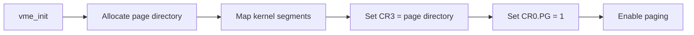

#### Address Space Protection

```c
void protect(AddrSpace *as) {
  PTE *updir = (PTE*)(pgalloc_usr(PGSIZE));
  as->ptr = updir;
  as->area = USER_SPACE;  // e.g., 0x40000000 - 0xc0000000
  as->pgsize = PGSIZE;    // 4096 bytes
  // Copy kernel page table entries
  memcpy(updir, kas.ptr, PGSIZE);
}
```

#### Context Switching with VME

The VME integrates with CTE to switch address spaces during context switches:

```c
void __am_get_cur_as(Context *c) {
  c->cr3 = (vme_enable ? (void *)get_cr3() : NULL);
}

void __am_switch(Context *c) {
  if (vme_enable && c->cr3 != NULL) {
    set_cr3(c->cr3);  // Switch page directory
  }
}
```

---

### 6. MPE: Multi-Processing Extension

The **Multi-Processing Extension** provides support for multi-core CPUs and atomic operations.

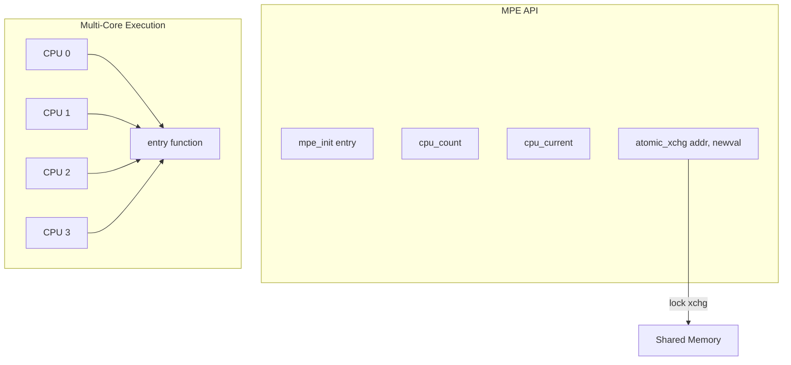

**Implementation (NEMU platform - single core):**
```c
bool mpe_init(void (*entry)()) {
  entry();                    // Run entry on single CPU
  panic("MPE entry returns"); // Should never return
}

int cpu_count() { return 1; }     // Single core
int cpu_current() { return 0; }   // Always CPU 0

int atomic_xchg(int *addr, int newval) {
  return atomic_exchange(addr, newval);  // C11 atomic
}
```

**Implementation (x86 with SMP):**
```c
static inline int xchg(int *addr, int newval) {
  int result;
  asm volatile ("lock xchg %0, %1":
    "+m"(*addr), "=a"(result) : "1"(newval) : "cc", "memory");
  return result;
}
```

---

## Platform Implementations

### NEMU Platform

The NEMU platform is the primary target for the YSYX project. It runs on the **NEMU emulator**, which simulates various ISAs.

**Memory Map (NEMU):**
| Region | Address | Size |
|--------|---------|------|
| Physical Memory | `0x80000000` | 128 MB |
| Framebuffer (FB) | `0xa1000000` | 2 MB |
| MMIO Region | `0xa0000000` | 4 KB |
| Serial Port | `0xa00003f8` | - |
| Keyboard | `0xa0000060` | - |
| RTC | `0xa0000048` | - |
| VGA Controller | `0xa0000100` | - |
| Audio | `0xa0000200` | - |
| Disk | `0xa0000300` | - |

**Source Files:**
| File | Purpose |
|------|---------|
| `platform/nemu/trm.c` | TRM implementation (heap, putch, halt) |
| `platform/nemu/ioe/ioe.c` | IOE dispatch and initialization |
| `platform/nemu/ioe/timer.c` | Timer device (uptime, RTC) |
| `platform/nemu/ioe/input.c` | Keyboard input device |
| `platform/nemu/ioe/gpu.c` | GPU framebuffer device |
| `platform/nemu/ioe/audio.c` | Audio playback device |
| `platform/nemu/ioe/disk.c` | Disk block I/O device |
| `platform/nemu/mpe.c` | Multi-processing (single core) |

### Native Platform

The native platform runs directly on the host OS (Linux/macOS) using POSIX APIs, enabling debugging and testing without a simulator.

**Source Files:**
| File | Purpose |
|------|---------|
| `native/trm.c` | TRM using `putchar` and `exit` |
| `native/cte.c` | CTE using `ucontext` for context switching |
| `native/vme.c` | VME using `mmap` for virtual memory |
| `native/ioe.c` | IOE using SDL for input/display |
| `native/mpe.c` | MPE using pthreads for multi-core |
| `native/trap.S` | Signal-based trap handling |

### ISA-Specific Implementations

Each ISA provides architecture-specific trap handling and context structures:

| ISA | Files | Context Structure |
|-----|-------|-------------------|
| **x86** | `x86/nemu/cte.c`, `trap.S`, `vme.c` | GPRs + cr3 + irq |
| **RISC-V** | `riscv/nemu/cte.c`, `trap.S`, `vme.c` | GPRs + mcause + mstatus + mepc |
| **MIPS32** | `mips/nemu/cte.c`, `trap.S`, `vme.c` | GPRs + cp0 registers |
| **LoongArch32r** | `loongarch/nemu/cte.c`, `trap.S`, `vme.c` | GPRs + CSR registers |

---

## Build System

The AM uses a sophisticated Makefile-based build system that supports cross-compilation for multiple architectures and platforms.

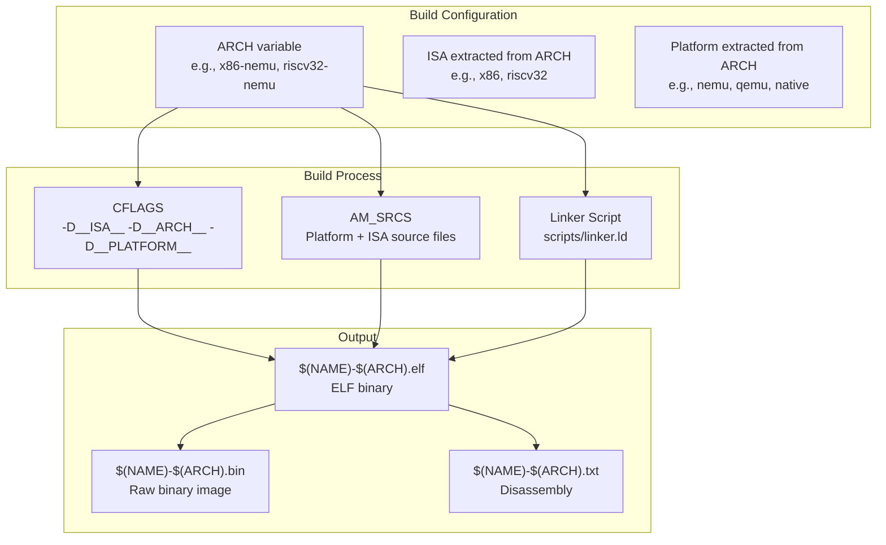

**Architecture-Specific Makefile Fragments:**
| File | Example Targets |
|------|----------------|
| `scripts/x86-nemu.mk` | x86 on NEMU emulator |
| `scripts/riscv32-nemu.mk` | RISC-V 32-bit on NEMU |
| `scripts/riscv64-nemu.mk` | RISC-V 64-bit on NEMU |
| `scripts/mips32-nemu.mk` | MIPS32 on NEMU |
| `scripts/loongarch32r-nemu.mk` | LoongArch32r on NEMU |
| `scripts/native.mk` | Native host execution |
| `scripts/x86-qemu.mk` | x86 on QEMU |
| `scripts/spike.mk` | RISC-V on Spike simulator |

---

## Dependencies and Relationships

### Internal Dependencies

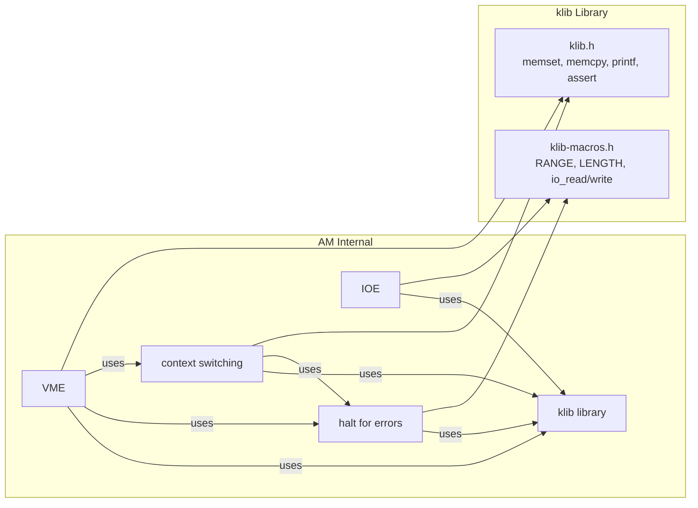

### External Dependencies

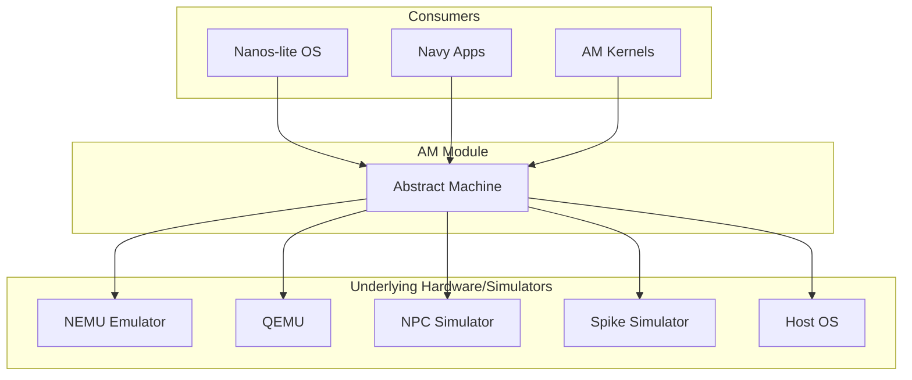

---

## Data Flow Examples

### Character Output Flow

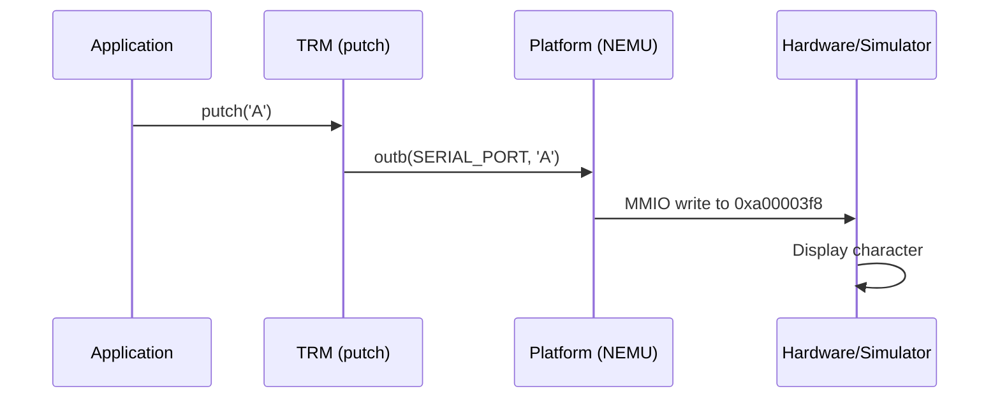

### Keyboard Input Flow

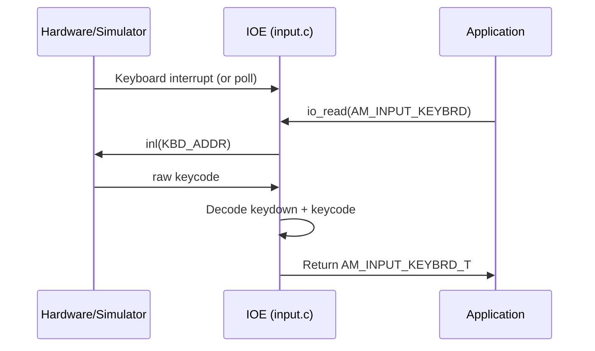

### Context Switch Flow

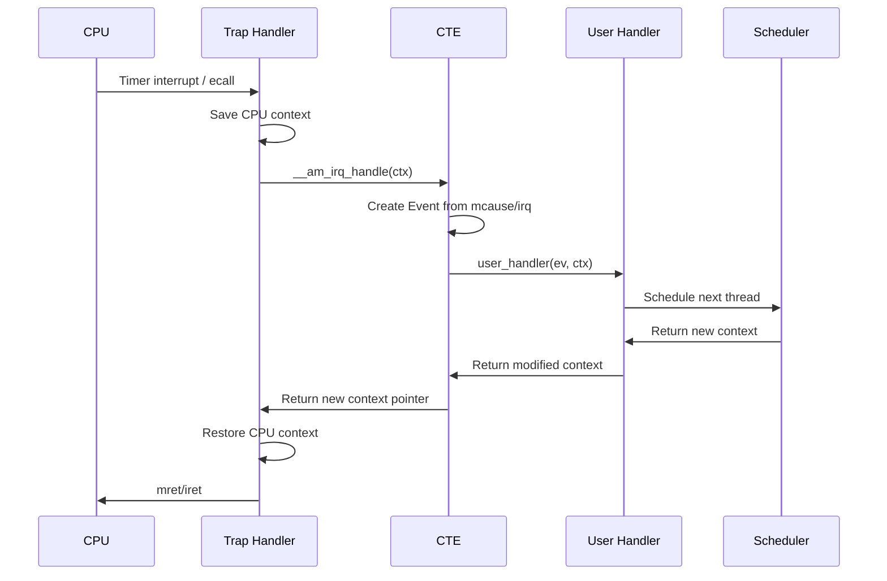

---

## Key Macros and Utilities

The AM provides several utility macros through `klib-macros.h`:

| Macro | Description |
|-------|-------------|
| `RANGE(st, ed)` | Creates an `Area` from start and end pointers |
| `LENGTH(arr)` | Returns the number of elements in an array |
| `ROUNDUP(a, sz)` | Rounds up `a` to the nearest multiple of `sz` |
| `ROUNDDOWN(a, sz)` | Rounds down `a` to the nearest multiple of `sz` |
| `IN_RANGE(ptr, area)` | Checks if `ptr` is within `area` |
| `io_read(reg)` | Reads a device register |
| `io_write(reg, ...)` | Writes to a device register |
| `panic(s)` | Prints a message and halts |
| `panic_on(cond, s)` | Conditionally panics |
| `putstr(s)` | Prints a string using `putch` |
| `static_assert(const_cond)` | Compile-time assertion |

---

## References

- [NEMU Emulator](NEMU%20Emulator.md) - The primary emulator target for AM
- [NPC Simulator](NPC%20Simulator.md) - The RISC-V NPC simulator target
- [Nanos-lite](Nanos-lite.md) - The educational OS that runs on top of AM
- [AM Kernels](AM%20Kernels.md) - Benchmark and demo kernels using AM
- [klib Library](klib%20Library.md) - The minimal C library used by AM
- [RT-Thread Kernel](RT-Thread%20Kernel.md) - RTOS kernel with similar abstraction concepts
