# FAL (Flash Abstraction Layer)

## Introduction

The Flash Abstraction Layer (FAL) is a component of the RT-Thread operating system that provides a unified, abstracted interface for managing flash storage devices and partitions. It sits between the low-level flash hardware drivers and higher-level system components (such as the Device File System (DFS), MTD NOR subsystem, and user applications), enabling:

- **Hardware Independence**: Applications and higher-level subsystems interact with flash through a standardized API, regardless of the underlying flash hardware (NOR, NAND, SPI flash, on-chip flash, etc.).
- **Partition Management**: Flash devices can be divided into logical partitions with names, offsets, and sizes, allowing organized storage of bootloaders, applications, file systems, configuration data, and more.
- **RT-Thread Device Integration**: FAL partitions can be exposed as RT-Thread block devices, character devices, or MTD NOR devices, making them accessible through the standard RT-Thread device framework and POSIX file I/O.

---

## Architecture Overview

FAL follows a layered architecture with three primary abstraction levels:

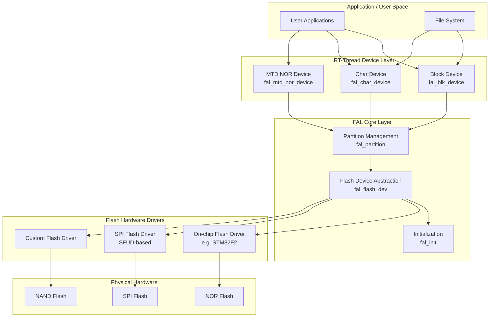

---

## Core Components

### 1. Flash Device Abstraction (`fal_flash_dev`)

The `fal_flash_dev` structure represents a physical flash device. It encapsulates the device's properties and provides a standardized operation interface.

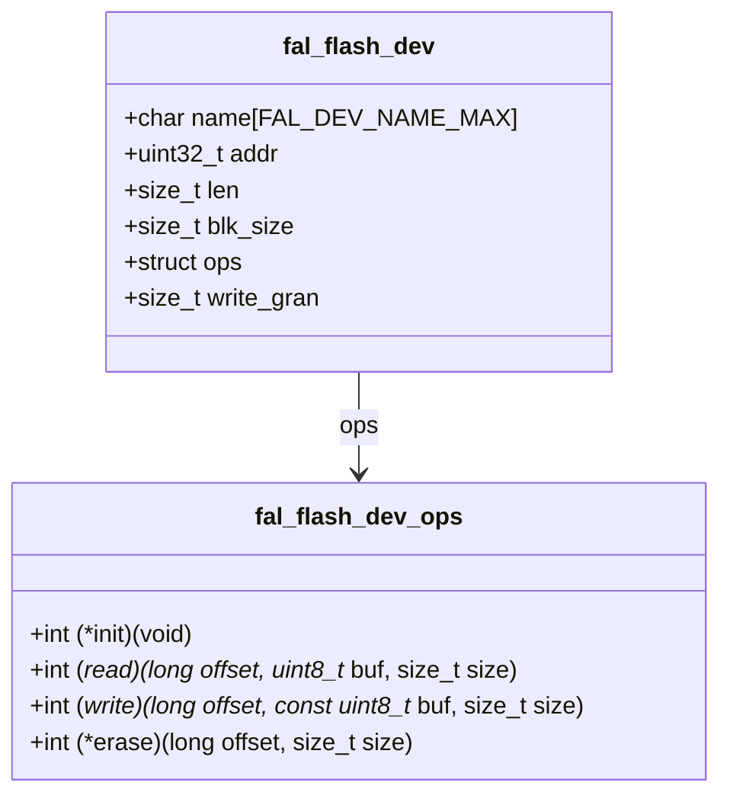

**Field Descriptions:**

| Field | Description |
|-------|-------------|
| `name` | Unique device name (max `FAL_DEV_NAME_MAX` = 24 characters) |
| `addr` | Base address of the flash device (physical start address) |
| `len` | Total size of the flash device in bytes |
| `blk_size` | Block size (minimum erase granularity) |
| `ops.init` | Optional initialization callback |
| `ops.read` | Read data from flash (offset, buffer, size) |
| `ops.write` | Write data to flash (offset, buffer, size) |
| `ops.erase` | Erase flash region (offset, size) |
| `write_gran` | Write minimum granularity in bits (1 for NOR, 8 for STM32F2/F4, 32 for STM32F1, 64 for STM32L4; 0 = not used) |

**Flash Device Table:**

Flash devices are registered via a user-defined macro `FAL_FLASH_DEV_TABLE` in `fal_cfg.h`:

```c
#define FAL_FLASH_DEV_TABLE                                          \
{                                                                    \
    &stm32f2_onchip_flash,                                           \
    &nor_flash0,                                                     \
}
```

The table is a static array of pointers to `fal_flash_dev` structures. During initialization, each device's `init` callback is invoked, and the read/write/erase operations are validated.

---

### 2. Partition Management (`fal_partition`)

The `fal_partition` structure defines a logical partition within a flash device. Partitions allow organizing flash storage into named regions.

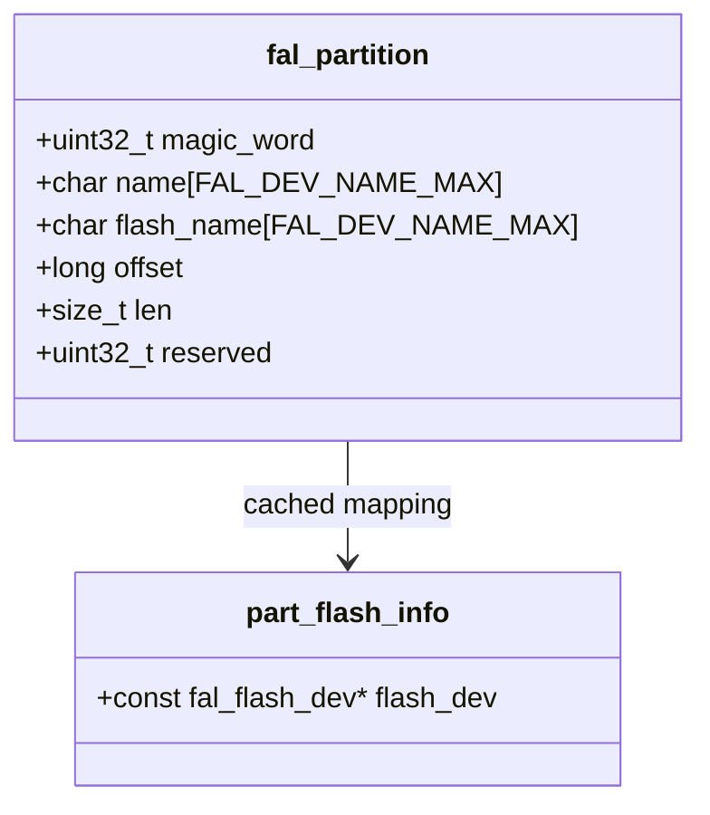

**Field Descriptions:**

| Field | Description |
|-------|-------------|
| `magic_word` | Magic word (`0x45503130`) for partition table validation |
| `name` | Partition name (max 24 characters) |
| `flash_name` | Name of the underlying flash device this partition belongs to |
| `offset` | Offset of the partition within the flash device |
| `len` | Size of the partition in bytes |
| `reserved` | Reserved for future use |

**Partition Table Configuration:**

Partitions can be defined in two ways:

#### a) Static Partition Table (`FAL_PART_HAS_TABLE_CFG` enabled)

Partitions are defined at compile time in `fal_cfg.h`:

```c
#define FAL_PART_TABLE                                                               \
{                                                                                    \
    {FAL_PART_MAGIC_WORD,        "bl",     "stm32_onchip",         0,   64*1024, 0}, \
    {FAL_PART_MAGIC_WORD,       "app",     "stm32_onchip",   64*1024,  704*1024, 0}, \
    {FAL_PART_MAGIC_WORD, "easyflash", NOR_FLASH_DEV_NAME,         0, 1024*1024, 0}, \
    {FAL_PART_MAGIC_WORD,  "download", NOR_FLASH_DEV_NAME, 1024*1024, 1024*1024, 0}, \
}
```

#### b) Dynamic Partition Table (auto-discovery)

When `FAL_PART_HAS_TABLE_CFG` is disabled, FAL scans the flash device for a partition table stored at a configurable end offset (`FAL_PART_TABLE_END_OFFSET`). It searches backward from this offset for the magic word to locate the table.

---

### 3. RT-Thread Device Integration

FAL provides three types of RT-Thread device wrappers that expose partitions through the standard RT-Thread device framework:

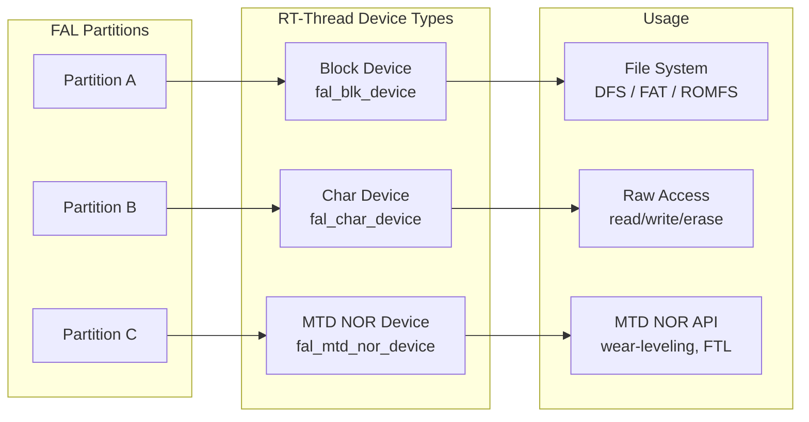

#### 3.1 Block Device (`fal_blk_device`)

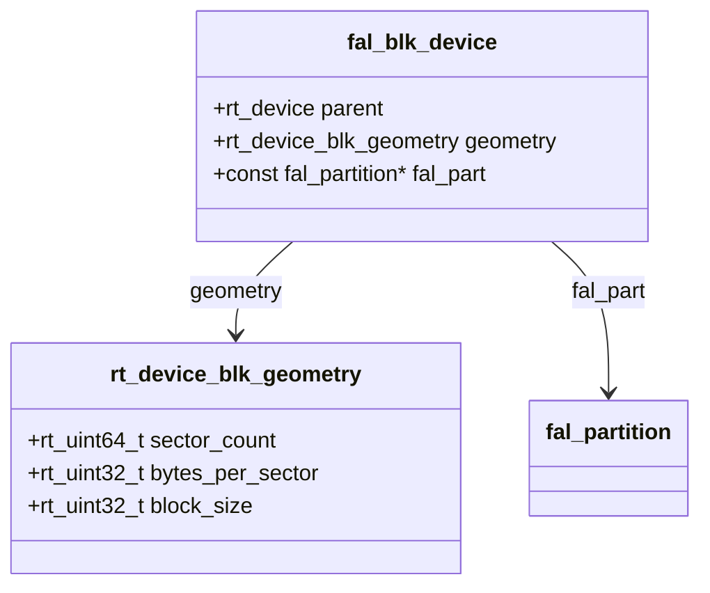

- **Purpose**: Exposes a partition as a standard RT-Thread block device, suitable for use with file systems (FAT, ROMFS, etc.)
- **Geometry**: `sector_count = partition_len / flash_blk_size`, `bytes_per_sector = flash_blk_size`, `block_size = flash_blk_size`
- **Operations**:
  - `read`: Translates block-level reads to partition reads
  - `write`: Erases then writes (erase-before-write pattern for NOR flash)
  - `control`: Supports `RT_DEVICE_CTRL_BLK_GETGEOME` (get geometry) and `RT_DEVICE_CTRL_BLK_ERASE` (erase block range)
- **Creation**: `fal_blk_device_create("partition_name")`

#### 3.2 Character Device (`fal_char_device`)

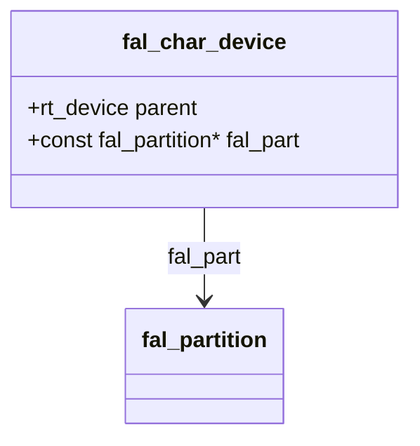

- **Purpose**: Exposes a partition as a character device for raw byte-level access
- **Operations**:
  - `read`: Reads bytes from the partition at a given offset
  - `write`: If `pos == 0`, erases the entire partition first, then writes
- **POSIX Support**: When `RT_USING_POSIX_DEVIO` is enabled, provides file operations (`open`, `read`, `write`) via `dfs_file_ops`. Opening with `O_WRONLY` or `O_RDWR` triggers a full partition erase.
- **Creation**: `fal_char_device_create("partition_name")`

#### 3.3 MTD NOR Device (`fal_mtd_nor_device`)

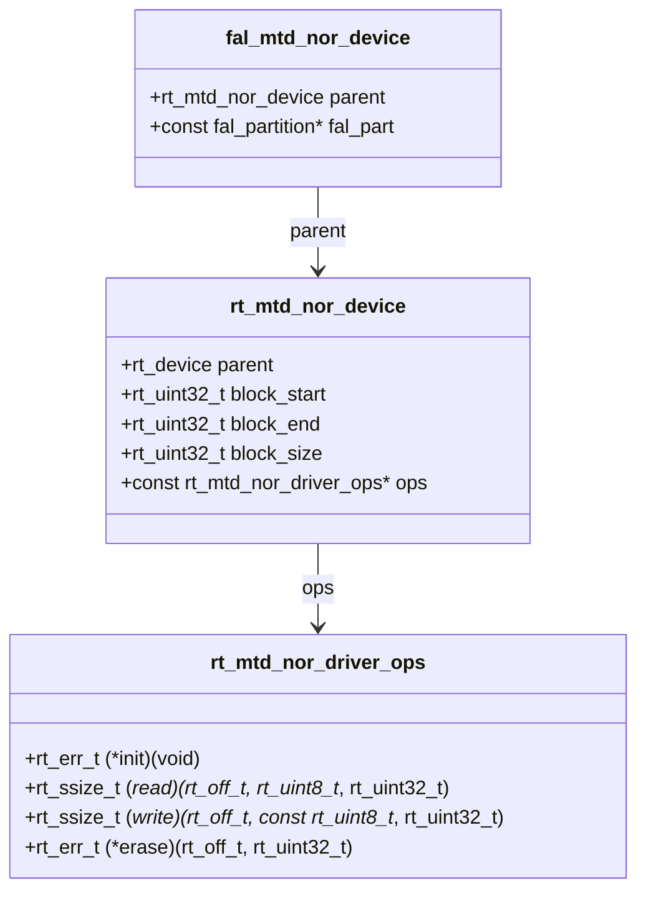

- **Purpose**: Exposes a partition as an MTD (Memory Technology Device) NOR device, enabling use with MTD-aware subsystems
- **Block Range**: `block_start = 0`, `block_end = partition_len / flash_blk_size`, `block_size = flash_blk_size`
- **Operations**: Delegates read/write/erase to the corresponding FAL partition operations
- **Creation**: `fal_mtd_nor_device_create("partition_name")` (requires `RT_USING_MTD_NOR`)

---

## Data Flow

### Read Operation Flow

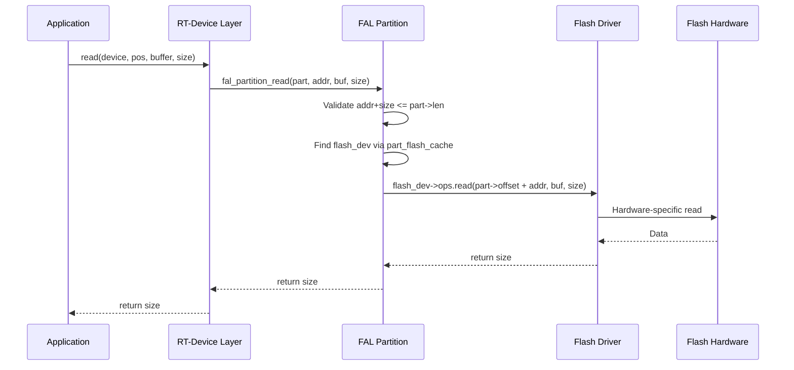

### Write Operation Flow

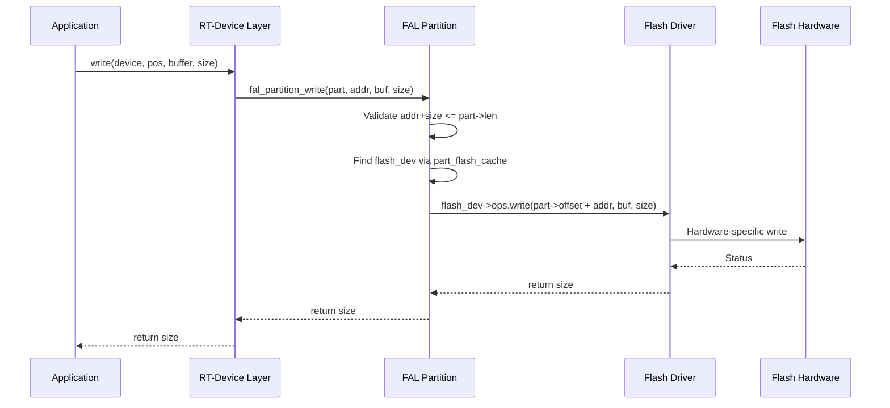

> **Note**: For block devices, the write operation first erases the target region before writing (erase-before-write pattern required by NOR flash).

### Initialization Flow

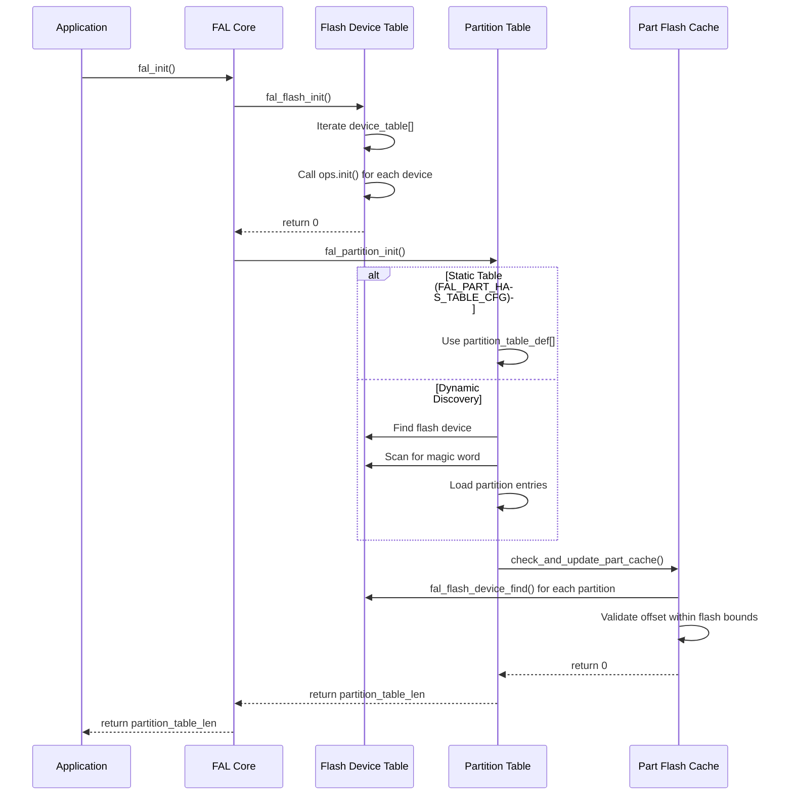

---

## Component Interaction Diagram

```mermaid
graph TB
    subgraph "User Configuration (fal_cfg.h)"
        CFG_FLASH["FAL_FLASH_DEV_TABLE"]
        CFG_PART["FAL_PART_TABLE"]
    end

    subgraph "FAL Core"
        INIT["fal_init"]
        FLASH_INIT["fal_flash_init"]
        PART_INIT["fal_partition_init"]
        FLASH_FIND["fal_flash_device_find"]
        PART_FIND["fal_partition_find"]
        PART_READ["fal_partition_read"]
        PART_WRITE["fal_partition_write"]
        PART_ERASE["fal_partition_erase"]
        PART_ERASE_ALL["fal_partition_erase_all"]
        PART_TABLE["fal_get_partition_table"]
        PART_TABLE_SET["fal_set_partition_table_temp"]
        SHOW["fal_show_part_table"]
    end

    subgraph "Device Creation"
        BLK_CREATE["fal_blk_device_create"]
        CHAR_CREATE["fal_char_device_create"]
        MTD_CREATE["fal_mtd_nor_device_create"]
    end

    subgraph "Data Structures"
        DEV_TABLE["device_table[]<br/>static const"]
        PART_TABLE_DEF["partition_table_def[]<br/>static const"]
        PART_TABLE_RUN["partition_table<br/>runtime pointer"]
        PART_CACHE["part_flash_cache[]<br/>flash device mapping"]
    end

    CFG_FLASH --> DEV_TABLE
    CFG_PART --> PART_TABLE_DEF

    INIT --> FLASH_INIT
    INIT --> PART_INIT

    FLASH_INIT --> DEV_TABLE
    FLASH_INIT --> FLASH_FIND

    PART_INIT --> PART_TABLE_DEF
    PART_INIT --> PART_TABLE_RUN
    PART_INIT --> PART_CACHE
    PART_INIT --> FLASH_FIND

    PART_FIND --> PART_TABLE_RUN
    PART_READ --> PART_CACHE
    PART_WRITE --> PART_CACHE
    PART_ERASE --> PART_CACHE
    PART_TABLE --> PART_TABLE_RUN
    PART_TABLE_SET --> PART_TABLE_RUN
    PART_TABLE_SET --> PART_CACHE

    BLK_CREATE --> PART_FIND
    BLK_CREATE --> FLASH_FIND
    CHAR_CREATE --> PART_FIND
    CHAR_CREATE --> FLASH_FIND
    MTD_CREATE --> PART_FIND
    MTD_CREATE --> FLASH_FIND
```

---

## API Reference

### Initialization

| Function | Description |
|----------|-------------|
| `fal_init()` | Initialize FAL: initialize all flash devices and partitions. Returns partition count (>= 0) on success. |
| `fal_init_check()` | Check if FAL initialization succeeded. Returns 1 if initialized, 0 otherwise. |

### Flash Device Operations

| Function | Description |
|----------|-------------|
| `fal_flash_device_find(name)` | Find a flash device by name. Returns pointer to `fal_flash_dev` or NULL. |

### Partition Operations

| Function | Description |
|----------|-------------|
| `fal_partition_find(name)` | Find a partition by name. Returns pointer to `fal_partition` or NULL. |
| `fal_get_partition_table(len)` | Get the partition table and its length. |
| `fal_set_partition_table_temp(table, len)` | Temporarily replace the partition table (lost after restart). |
| `fal_partition_read(part, addr, buf, size)` | Read data from a partition at a relative address. Returns bytes read or -1 on error. |
| `fal_partition_write(part, addr, buf, size)` | Write data to a partition at a relative address. Returns bytes written or -1 on error. |
| `fal_partition_erase(part, addr, size)` | Erase a region within a partition. Returns bytes erased or -1 on error. |
| `fal_partition_erase_all(part)` | Erase the entire partition. Returns bytes erased or -1 on error. |
| `fal_show_part_table()` | Print the partition table to the console. |

### RT-Thread Device Creation

| Function | Description |
|----------|-------------|
| `fal_blk_device_create(partition_name)` | Create an RT-Thread block device from a partition. Returns `rt_device*` or NULL. |
| `fal_char_device_create(partition_name)` | Create an RT-Thread character device from a partition. Returns `rt_device*` or NULL. |
| `fal_mtd_nor_device_create(partition_name)` | Create an RT-Thread MTD NOR device from a partition. Returns `rt_device*` or NULL. |

---

## Configuration

FAL is configured through Kconfig and the user-provided `fal_cfg.h` header file.

### Kconfig Options

| Option | Default | Description |
|--------|---------|-------------|
| `RT_USING_FAL` | n | Enable FAL component |
| `FAL_DEBUG_CONFIG` | y | Enable debug log output |
| `FAL_PART_HAS_TABLE_CFG` | y | Use static partition table defined in `fal_cfg.h` |
| `FAL_PART_TABLE_FLASH_DEV_NAME` | "onchip" | Flash device name for dynamic partition table discovery |
| `FAL_PART_TABLE_END_OFFSET` | 65536 | End offset for dynamic partition table scanning |
| `FAL_USING_SFUD_PORT` | n | Use SFUD-based SPI flash driver port |

### Required Macros in `fal_cfg.h`

| Macro | Required | Description |
|-------|----------|-------------|
| `FAL_FLASH_DEV_TABLE` | Yes | Array of pointers to `fal_flash_dev` structures |
| `FAL_PART_TABLE` | If `FAL_PART_HAS_TABLE_CFG` | Static partition table definition |
| `FAL_PART_TABLE_FLASH_DEV_NAME` | If !`FAL_PART_HAS_TABLE_CFG` | Flash device for dynamic partition discovery |
| `FAL_PART_TABLE_END_OFFSET` | If !`FAL_PART_HAS_TABLE_CFG` | End offset for partition table scanning |

---

## Porting Guide

To add a new flash device to FAL, follow these steps:

### Step 1: Define the Flash Device

Create a `fal_flash_dev` instance with the device's properties and operation callbacks:

```c
static int init(void) { /* initialize hardware */ }
static int read(long offset, uint8_t *buf, size_t size) { /* read from flash */ }
static int write(long offset, const uint8_t *buf, size_t size) { /* write to flash */ }
static int erase(long offset, size_t size) { /* erase flash region */ }

const struct fal_flash_dev my_flash =
{
    .name       = "myflash",
    .addr       = 0x00000000,
    .len        = 2 * 1024 * 1024,  // 2MB
    .blk_size   = 4096,             // 4KB erase blocks
    .ops        = {init, read, write, erase},
    .write_gran = 1                 // NOR flash: byte-writable
};
```

### Step 2: Register in the Flash Device Table

Add the device to `FAL_FLASH_DEV_TABLE` in `fal_cfg.h`:

```c
extern const struct fal_flash_dev my_flash;

#define FAL_FLASH_DEV_TABLE    \
{                              \
    &my_flash,                 \
}
```

### Step 3: Define Partitions

Add partition entries to `FAL_PART_TABLE`:

```c
#define FAL_PART_TABLE                                        \
{                                                              \
    {FAL_PART_MAGIC_WORD, "boot",   "myflash", 0,       256*1024, 0}, \
    {FAL_PART_MAGIC_WORD, "app",    "myflash", 256*1024, 512*1024, 0}, \
    {FAL_PART_MAGIC_WORD, "data",   "myflash", 768*1024, 512*1024, 0}, \
}
```

### Step 4: Create RT-Thread Devices (Optional)

```c
/* Create a block device for file system */
fal_blk_device_create("app");

/* Create a character device for raw access */
fal_char_device_create("data");
```

---

## Finsh/MSH Commands

When `RT_USING_FINSH` and `FINSH_USING_MSH` are enabled, FAL provides a `fal` command for interactive debugging:

```
Usage:
fal probe [dev_name|part_name]   - probe flash device or partition by given name
fal read addr size               - read 'size' bytes starting at 'addr'
fal write addr data1 ... dataN   - write some bytes 'data' starting at 'addr'
fal erase addr size              - erase 'size' bytes starting at 'addr'
fal bench <blk_size>             - benchmark test with per block size
```

---

## Dependencies

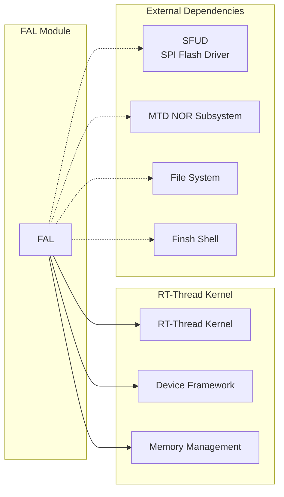

- **RT-Thread Kernel**: Uses kernel primitives (`rt_kprintf`, `rt_malloc`, `rt_free`, `rt_calloc`, `rt_realloc`, `rt_device_register`, etc.)
- **Device Framework**: Integrates with `rt_device` for block, char, and MTD device registration
- **SFUD** (optional): Provides SPI flash driver support via the SFUD port
- **MTD NOR** (optional): Used when creating MTD NOR devices
- **DFS** (optional): POSIX file operations for character devices
- **Finsh** (optional): MSH command for interactive debugging

---

## References

- [RT-Thread Kernel](RT-Thread%20Kernel.md) - Core kernel services used by FAL (memory allocation, device framework, logging)
- [File System (DFS)](File%20System%20(DFS).md) - File system layer that can mount FAL block devices
- [FDT (Flattened Device Tree)](FDT%20(Flattened%20Device%20Tree).md) - Device tree support for flash device configuration
