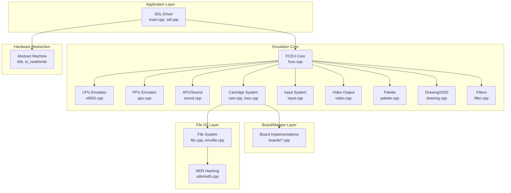
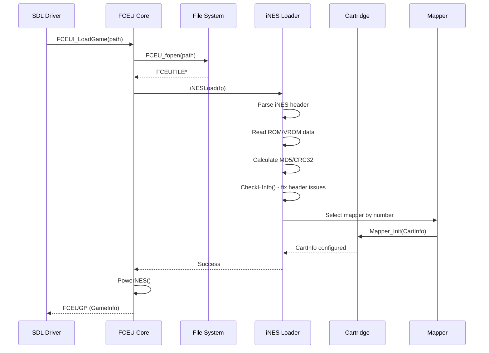
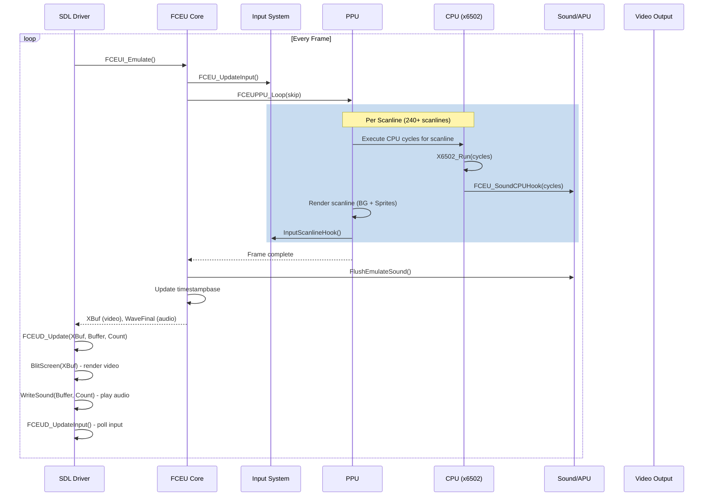
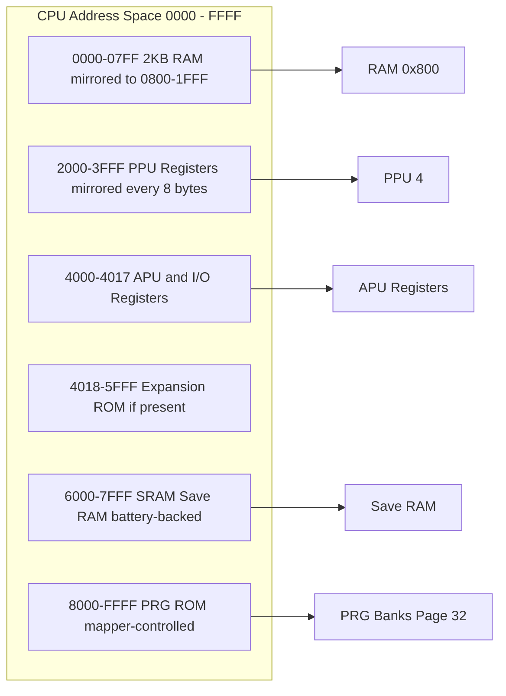
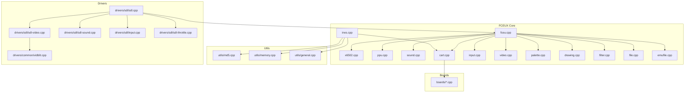
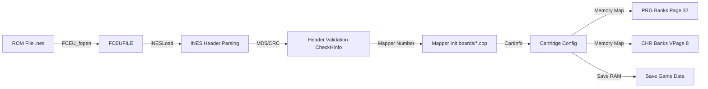
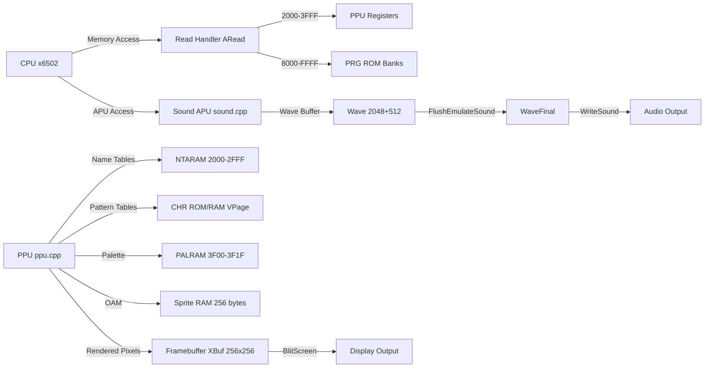

# FCEUX NES Emulator Module

## Introduction

The **FCEUX NES Emulator** module is a port of the [FCEUX](http://www.fceux.com/) emulator (specifically the FCE Ultra core) adapted for the **Abstract Machine (AM)** ecosystem within the YSYX project. It provides a complete, cycle-accurate emulation of the Nintendo Entertainment System (NES) / Famicom hardware, enabling NES ROMs to run on top of the AM hardware abstraction layer.

This module implements the full NES hardware stack: the **Ricoh 2A03 CPU** (a MOS 6502 variant), the **Picture Processing Unit (PPU)**, the **Audio Processing Unit (APU)**, **cartridge/mapper** support, and **input/output** handling. It is designed to be portable across different AM-compatible platforms (NEMU, NPC, native) through the SDL driver abstraction.

---

## Architecture Overview

The FCEUX NES Emulator follows a layered architecture:



---

## Core Components

### 1. CPU Emulator (`x6502.cpp`, `x6502.h`, `x6502struct.h`)

The CPU emulator implements the **Ricoh 2A03** processor, which is a MOS Technology 6502 with the decimal mode disabled and an integrated audio controller.

#### X6502 Structure

```c
typedef struct __X6502 {
    int32 tcount;      /* Temporary cycle counter */
    uint16 PC;         /* Program Counter */
    uint8 A, X, Y, S, P, mooPI;  /* Accumulator, X, Y, Stack, Status, Interrupt */
    uint8 jammed;      /* CPU jammed (halted) state */
    int32 count;       /* Cycle count */
    uint32 IRQlow;     /* IRQ pin state */
    uint8 DB;          /* Data bus cache */
    int preexec;       /* Pre-execution for debug breakpoints */
} X6502;
```

#### Key Functions

| Function | Description |
|----------|-------------|
| `X6502_Init()` | Initialize the CPU emulator |
| `X6502_Reset()` | Reset the CPU state |
| `X6502_Power()` | Power-on the CPU |
| `X6502_Run(cycles)` | Execute the CPU for a given number of cycles |
| `X6502_DMR(addr)` | Direct memory read (used by PPU/sound) |
| `X6502_DMW(addr, val)` | Direct memory write (used by PPU/sound) |
| `X6502_IRQBegin(w)` | Assert an IRQ line |
| `X6502_IRQEnd(w)` | De-assert an IRQ line |
| `TriggerNMI()` | Trigger a Non-Maskable Interrupt |

#### CPU Flags

```c
#define N_FLAG  0x80  // Negative
#define V_FLAG  0x40  // Overflow
#define U_FLAG  0x20  // Unused
#define B_FLAG  0x10  // Break
#define D_FLAG  0x08  // Decimal (disabled on 2A03)
#define I_FLAG  0x04  // Interrupt Disable
#define Z_FLAG  0x02  // Zero
#define C_FLAG  0x01  // Carry
```

#### Interrupt Sources

```c
#define FCEU_IQEXT      0x001  // External IRQ
#define FCEU_IQEXT2     0x002  // External IRQ 2
#define FCEU_IQRESET    0x020  // Reset
#define FCEU_IQNMI2     0x040  // Delayed NMI
#define FCEU_IQNMI      0x080  // NMI
#define FCEU_IQDPCM     0x100  // DPCM IRQ
#define FCEU_IQFCOUNT   0x200  // Frame counter IRQ
#define FCEU_IQTEMP     0x800  // Temporary
```

#### CPU Timing

- **NTSC**: ~1,789,772 Hz (1.789772 MHz)
- **PAL**: ~1,662,607 Hz (1.662607 MHz)
- **Dendy**: ~1,773,447 Hz (similar to NTSC but with PAL frame rate)

---

### 2. PPU Emulator (`ppu.cpp`, `ppu.h`)

The PPU (Picture Processing Unit) emulator handles all NES graphics rendering, including background tiles, sprites, scrolling, and color generation.

#### Key Functions

| Function | Description |
|----------|-------------|
| `FCEUPPU_Init()` | Initialize the PPU |
| `FCEUPPU_Reset()` | Reset the PPU |
| `FCEUPPU_Power()` | Power-on the PPU |
| `FCEUPPU_Loop(skip)` | Emulate one frame of PPU rendering |
| `FCEUPPU_LineUpdate()` | Update a single scanline |
| `FCEUPPU_SetVideoSystem(w)` | Set NTSC/PAL video mode |

#### PPU Registers

```c
extern uint8 PPU[4];  // PPU registers $2000-$2003 (or $2000, $2001, $2002, $2003)
```

- **PPU[0] ($2000)**: Control register (NMI enable, sprite size, pattern table addresses)
- **PPU[1] ($2001)**: Mask register (enable/disable rendering, grayscale)
- **PPU[2] ($2002)**: Status register (VBlank flag, sprite 0 hit, overflow)
- **PPU[3] ($2003)**: OAM address (sprite memory address)

#### PPU Phases

```c
enum PPUPHASE {
    PPUPHASE_VBL,  // Vertical Blanking
    PPUPHASE_BG,   // Background rendering
    PPUPHASE_OBJ   // Object (sprite) rendering
};
```

#### Memory Layout

- **NTARAM[0x800]**: Name Table RAM (2KB, supports 4 name tables)
- **vnapage[4]**: Pointers to the 4 name table pages
- **PPUNTARAM**: Flag for NTARAM configuration
- **PPUCHRRAM**: Flag for CHR RAM configuration

#### Bit Reverse Lookup Table

The `BITREVLUT` structure provides a pre-computed 8-bit bit-reversal lookup table used for efficient sprite data processing.

---

### 3. Cartridge System (`cart.cpp`, `cart.h`, `ines.cpp`, `ines.h`)

The cartridge system handles ROM loading, iNES header parsing, mapper initialization, and memory mapping.

#### CartInfo Structure

```c
typedef struct {
    void (*Power)(void);       // Power-on callback
    void (*Reset)(void);       // Reset callback
    void (*Close)(void);       // Close callback
    uint8 *SaveGame[4];        // Save RAM pointers
    uint32 SaveGameLen[4];     // Save RAM sizes
    int mirror;                // Mirroring mode
    int battery;               // Battery-backed RAM flag
    int ines2;                 // iNES 2.0 format flag
    int submapper;             // NES 2.0 submapper
    int wram_size;             // Work RAM size
    int battery_wram_size;     // Battery-backed WRAM size
    int vram_size;             // Video RAM size
    int battery_vram_size;     // Battery-backed VRAM size
    uint8 MD5[16];             // ROM MD5 hash
    uint32 CRC32;              // ROM CRC32
} CartInfo;
```

#### iNES Header Structure

```c
struct iNES_HEADER {
    char ID[4];              // "NES^Z" magic
    uint8 ROM_size;          // PRG ROM size (16KB units)
    uint8 VROM_size;         // CHR ROM size (8KB units)
    uint8 ROM_type;          // Flags (mapper low nybble, mirroring, battery)
    uint8 ROM_type2;         // Flags (mapper high nybble)
    uint8 ROM_type3;         // Additional flags
    uint8 Upper_ROM_VROM_size;  // Upper bits for ROM/VROM size
    uint8 RAM_size;          // PRG RAM size
    uint8 VRAM_size;         // VRAM size
    uint8 TV_system;         // TV system (NTSC/PAL)
    uint8 VS_hardware;       // VS System hardware
    uint8 reserved[2];       // Reserved bytes
};
```

#### Memory Mapping Functions

The cartridge system provides extensive memory mapping functions for PRG and CHR banks:

| Function | Description |
|----------|-------------|
| `setprg8(addr, bank)` | Set 8KB PRG bank |
| `setprg16(addr, bank)` | Set 16KB PRG bank |
| `setprg32(addr, bank)` | Set 32KB PRG bank |
| `setchr1(addr, bank)` | Set 1KB CHR bank |
| `setchr2(addr, bank)` | Set 2KB CHR bank |
| `setchr4(addr, bank)` | Set 4KB CHR bank |
| `setchr8(bank)` | Set 8KB CHR bank |
| `setmirror(type)` | Set mirroring mode (H, V, 0, 1) |

#### Mirroring Modes

```c
#define MI_H 0  // Horizontal mirroring
#define MI_V 1  // Vertical mirroring
#define MI_0 2  // One-screen (page 0)
#define MI_1 3  // One-screen (page 1)
```

#### Mapper Support

The emulator supports **over 200 mappers** (board types), each implemented in `boards/*.cpp`. The mapper is selected based on the iNES header mapper number and initialized via the `bmap[]` table in `ines.cpp`:

```c
BMAPPINGLocal bmap[] = {
    {"NROM",      0, NROM_Init},
    {"MMC1",      1, Mapper1_Init},
    {"UNROM",     2, UNROM_Init},
    {"CNROM",     3, CNROM_Init},
    {"MMC3",      4, Mapper4_Init},
    {"MMC5",      5, Mapper5_Init},
    // ... 200+ more mappers
};
```

#### ROM Loading Flow



---

### 4. Sound/APU System (`sound.cpp`, `sound.h`)

The sound system emulates the NES APU (Audio Processing Unit), including all five sound channels.

#### Sound Channels

| Channel | Description |
|---------|-------------|
| Square 1 | Variable duty cycle pulse wave |
| Square 2 | Variable duty cycle pulse wave |
| Triangle | Triangle wave |
| Noise | Pseudo-random noise |
| PCM/DPCM | Delta modulation channel (samples) |

#### Key Structures

```c
typedef struct {
    uint8 Speed;
    uint8 Mode;          /* Fixed volume(1), and loop(2) */
    uint8 DecCountTo1;
    uint8 decvolume;
    int reloaddec;
} ENVUNIT;  // Envelope unit used by square and noise channels
```

#### Expansion Sound Interface

```c
typedef struct {
    void (*Fill)(int Count);           /* Low quality ext sound */
    void (*NeoFill)(int32 *Wave, int Count);  /* High-level ext sound */
    void (*HiFill)(void);              /* High quality fill */
    void (*HiSync)(int32 ts);          /* High quality sync */
    void (*RChange)(void);             /* Rate change */
    void (*Kill)(void);                /* Kill sound */
} EXPSOUND;
```

#### Key Functions

| Function | Description |
|----------|-------------|
| `SetSoundVariables()` | Configure sound timing based on video mode |
| `GetSoundBuffer(Wave)` | Get the sound output buffer |
| `FlushEmulateSound()` | Flush and finalize sound for the frame |
| `FCEUSND_Power()` | Power-on the sound system |
| `FCEUSND_Reset()` | Reset the sound system |
| `FCEU_SoundCPUHook(cycles)` | Hook called by CPU for sound timing |

---

### 5. Input System (`input.cpp`, `input.h`)

The input system handles NES controller input, including standard gamepads and various expansion port devices.

#### Input Device Interfaces

**Standard Joystick Port (`INPUTC`)**:
```c
struct INPUTC {
    uint8 (*_Read)(int w);           // Read input state
    void (*_Write)(uint8 v);         // Write to device
    void (*_Strobe)(int w);          // Strobe signal
    void (*_Update)(int w, void *data, int arg);  // Update from user
    void (*_SLHook)(...);            // Scanline hook
    void (*_Draw)(int w, uint8 *buf, int arg);    // Draw overlay
};
```

**Expansion Port (`INPUTCFC`)**:
```c
struct INPUTCFC {
    uint8 (*_Read)(int w, uint8 ret);
    void (*_Write)(uint8 v);
    void (*_Strobe)();
    void (*_Update)(void *data, int arg);
    void (*_SLHook)(...);
    void (*_Draw)(uint8 *buf, int arg);
};
```

#### Supported Input Devices

**Standard Port** (`ESI` enum):
- `SI_GAMEPAD` - Standard NES controller
- `SI_ZAPPER` - Zapper light gun
- `SI_POWERPADA/B` - Power Pad
- `SI_ARKANOID` - Arkanoid paddle
- `SI_MOUSE` - Subor mouse
- `SI_SNES` - SNES controller
- `SI_SNES_MOUSE` - SNES mouse

**Expansion Port** (`ESIFC` enum):
- `SIFC_ARKANOID` - Arkanoid paddle
- `SIFC_4PLAYER` - 4-player adapter
- `SIFC_FKB` - Family Keyboard
- `SIFC_SUBORKB` - Subor keyboard
- `SIFC_MAHJONG` - Mahjong controller
- `SIFC_QUIZKING` - Quiz King buzzers
- `SIFC_FTRAINERA/B` - Family Trainer mats
- `SIFC_OEKAKIDS` - Oeka Kids tablet
- And more...

#### JoyPort and FCPort Structures

```c
extern struct JOYPORT {
    int w;           // Port number (0 or 1)
    int attrib;      // Attributes
    ESI type;        // Device type
    void* ptr;       // Device-specific data
    INPUTC* driver;  // Device driver
} joyports[2];

extern struct FCPORT {
    int attrib;
    ESIFC type;
    void* ptr;
    INPUTCFC* driver;
} portFC;
```

---

### 6. Video Output System (`video.cpp`, `video.h`)

The video system manages the framebuffer and screenshot functionality.

#### Key Buffers

```c
extern uint8 *XBuf;      // Primary framebuffer (256x256 pixels)
extern uint8 *XBackBuf;  // Backup framebuffer
extern uint8 *XDBuf;     // Double-buffer
extern uint8 *XDBackBuf; // Double-buffer backup
```

#### Key Functions

| Function | Description |
|----------|-------------|
| `FCEU_InitVirtualVideo()` | Initialize video buffers |
| `FCEU_KillVirtualVideo()` | Clean up video buffers |
| `SaveSnapshot()` | Save a screenshot |
| `GetScreenPixel(x, y)` | Get pixel color at coordinates |

---

### 7. Palette System (`palette.cpp`, `palette.h`)

Manages the NES color palette (64 colors, 8x8 grid).

```c
typedef struct {
    uint8 r, g, b;
} pal;

extern pal *palo;  // Current palette
```

| Function | Description |
|----------|-------------|
| `FCEU_ResetPalette()` | Reset to default palette |
| `FCEU_LoadGamePalette()` | Load game-specific palette |
| `FCEU_DrawNTSCControlBars()` | Draw NTSC color bars |

---

### 8. File I/O System (`file.cpp`, `file.h`, `emufile.cpp`, `emufile.h`)

Provides file abstraction for ROM loading, save states, and other I/O operations.

#### FCEUFILE Structure

```c
struct FCEUFILE {
    EMUFILE_FILE *stream;    // File stream
    int archiveCount;        // Files in archive
    int archiveIndex;        // Index within archive
    int size;                // File size
    enum { READ, WRITE, READWRITE } mode;
};
```

#### EMUFILE_FILE

Two implementations exist:
- **With file system**: Wraps standard `FILE*` operations
- **Without file system** (`__NO_FILE_SYSTEM__`): Uses in-memory buffer for embedded ROMs

#### Key Functions

| Function | Description |
|----------|-------------|
| `FCEU_fopen(path, mode)` | Open a file (supports archives) |
| `FCEU_fclose(fp)` | Close a file |
| `FCEU_fread(ptr, size, nmemb, fp)` | Read from file |
| `FCEU_fwrite(ptr, size, nmemb, fp)` | Write to file |
| `FCEU_fseek(fp, offset, whence)` | Seek in file |

---

### 9. State Save System (`state.h`)

Provides save state serialization/deserialization.

```c
struct SFORMAT {
    void *v;           // Pointer to data (or void** for indirect)
    uint32 s;          // Size + flags
    const char *desc;  // Description string
};
```

#### Flags

```c
#define FCEUSTATE_RLSB      0x80000000  // Multibyte integer (byte order)
#define FCEUSTATE_INDIRECT  0x40000000  // Indirect pointer
```

| Function | Description |
|----------|-------------|
| `ResetExState(PreSave, PostSave)` | Reset extended state callbacks |
| `AddExState(v, s, type, desc)` | Register state element for save/load |

---

### 10. Drawing/OSD System (`drawing.cpp`, `drawing.h`)

Provides on-screen display (OSD) text rendering for messages, recording status, and frame counters.

| Function | Description |
|----------|-------------|
| `DrawTextTrans(dest, width, text, fgcolor)` | Draw transparent text |
| `DrawMessage(beforeMovie)` | Draw status messages |
| `FCEU_DrawRecordingStatus(XBuf)` | Draw recording indicator |
| `FCEU_DrawNumberRow(XBuf, nstatus, cur)` | Draw save state slot numbers |

---

### 11. Filter System (`filter.cpp`, `filter.h`)

Provides audio filtering for sound output.

| Function | Description |
|----------|-------------|
| `NeoFilterSound(in, out, inlen, leftover)` | Apply sound filter |
| `MakeFilters(rate)` | Initialize filters for sample rate |
| `SexyFilter(in, out, count)` | Apply "sexy" filter |

---

### 12. MD5 Hashing (`utils/md5.cpp`, `utils/md5.h`)

Provides MD5 hash computation for ROM identification.

```c
struct md5_context {
    uint32 total[2];
    uint32 state[4];
    uint8 buffer[64];
};

typedef ValueArray<uint8,16> MD5DATA;
```

| Function | Description |
|----------|-------------|
| `md5_starts(ctx)` | Initialize MD5 context |
| `md5_update(ctx, input, length)` | Update hash with data |
| `md5_finish(ctx, digest)` | Finalize hash |
| `md5_asciistr(md5)` | Convert to ASCII string |

---

## Emulation Flow

### Frame Emulation Cycle



### Power-On Sequence

```mermaid
sequenceDiagram
    participant SDL as SDL Driver
    participant FCEU as FCEU Core
    participant CPU as CPU
    participant PPU as PPU
    participant APU as APU
    participant CART as Cartridge
    
    SDL->>FCEU: FCEUI_Initialize()
    FCEU->>FCEU: InitVirtualVideo()
    FCEU->>PPU: FCEUPPU_Init()
    FCEU->>CPU: X6502_Init()
    
    SDL->>FCEU: FCEUI_LoadGame(path)
    FCEU->>CART: iNESLoad(fp)
    CART-->>FCEU: GameInfo configured
    
    FCEU->>FCEU: PowerNES()
    FCEU->>FCEU: MemoryRand(RAM)
    FCEU->>FCEU: SetReadHandler/SetWriteHandler
    FCEU->>INPUT: InitializeInput()
    FCEU->>APU: FCEUSND_Power()
    FCEU->>PPU: FCEUPPU_Power()
    FCEU->>CART: GameInterface(GI_POWER)
    FCEU->>CPU: X6502_Power()
```



---

## Memory Map

The NES CPU address space is managed through a handler table system:



### Read/Write Handler System

The emulator uses a dispatch table for memory access:

```c
static readfunc ARead[0x10000];   // Read handler table (64KB)
static writefunc BWrite[0x10000]; // Write handler table (64KB)
```

With `SIZE_OPT` enabled, the tables are compressed using index-based indirection for memory efficiency.

---

## Configuration System

The emulator supports performance scaling through `config.h`:

```c
#define PERF_LOW    0  // Max frameskip, no sound
#define PERF_MIDDLE 1  // Some frameskip, low quality sound
#define PERF_HIGH   2  // No frameskip, high quality sound
```

Platform-specific defaults:
- **Native/QEMU**: `PERF_HIGH`
- **NEMU**: `PERF_MIDDLE`
- **Other**: `PERF_LOW`

---

## Dependencies and Relationships

### Internal Dependencies



### External Dependencies

| Dependency | Module | Description |
|------------|--------|-------------|
| [Abstract Machine (AM)](Abstract%20Machine%20(AM).md) | `klib.h`, `io_read/write` | Hardware abstraction layer for I/O, timers, and system calls |
| [AM Kernels](AM%20Kernels.md) | Shared types | Some shared NES types (CPU_STATE, PPU_STATE, ines_header) |
| [Nanos-lite](Nanos-lite.md) | `Finfo` | File information structure (shared) |

---

## Key Data Flow

### ROM Loading Data Flow



### Frame Rendering Data Flow



---

## Error Handling and ROM Validation

The emulator includes extensive ROM validation logic in `CheckHInfo()`:

1. **Bad ROM Detection**: Checks against a database of known bad dumps (`ines-bad.h`)
2. **Header Correction**: Automatically fixes incorrect iNES header information:
   - Wrong mapper number
   - Incorrect mirroring
   - Missing battery-backed bit
   - Incorrect CHR ROM size
3. **Master ROM Info**: Special parameters for specific ROMs (e.g., bus conflict emulation)
4. **Input Auto-Detection**: Maps CRC32 to expected input devices for proper configuration

---

## Performance Considerations

The emulator includes several performance optimization features:

1. **Size Optimization** (`SIZE_OPT`): Compresses the 64KB read/write handler tables using index-based indirection
2. **Frame Skipping**: Configurable frame skip to maintain performance on slower platforms
3. **Sound Quality Levels**: Low/High quality sound modes
4. **Function Index Optimization** (`FUNC_IDX_MAX16`/`FUNC_IDX_MAX256`): Further handler table compression

---

## References

- [Abstract Machine (AM)](Abstract%20Machine%20(AM).md) - Hardware abstraction layer used by the SDL driver
- [AM Kernels](AM%20Kernels.md) - Shared NES types and structures
- [Nanos-lite](Nanos-lite.md) - File information structure
- [NEMU Emulator](NEMU%20Emulator.md) - One of the target platforms for this emulator
- [NPC Simulator](NPC%20Simulator.md) - Another target platform
- [NVBoard](NVBoard.md) - Video board for hardware-accelerated rendering
