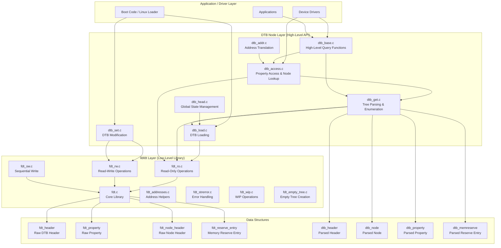
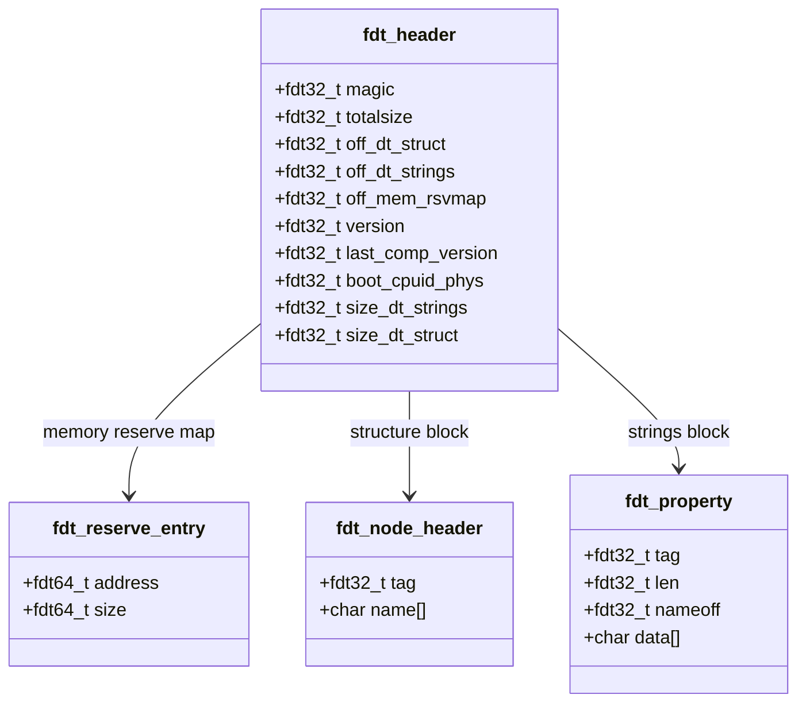
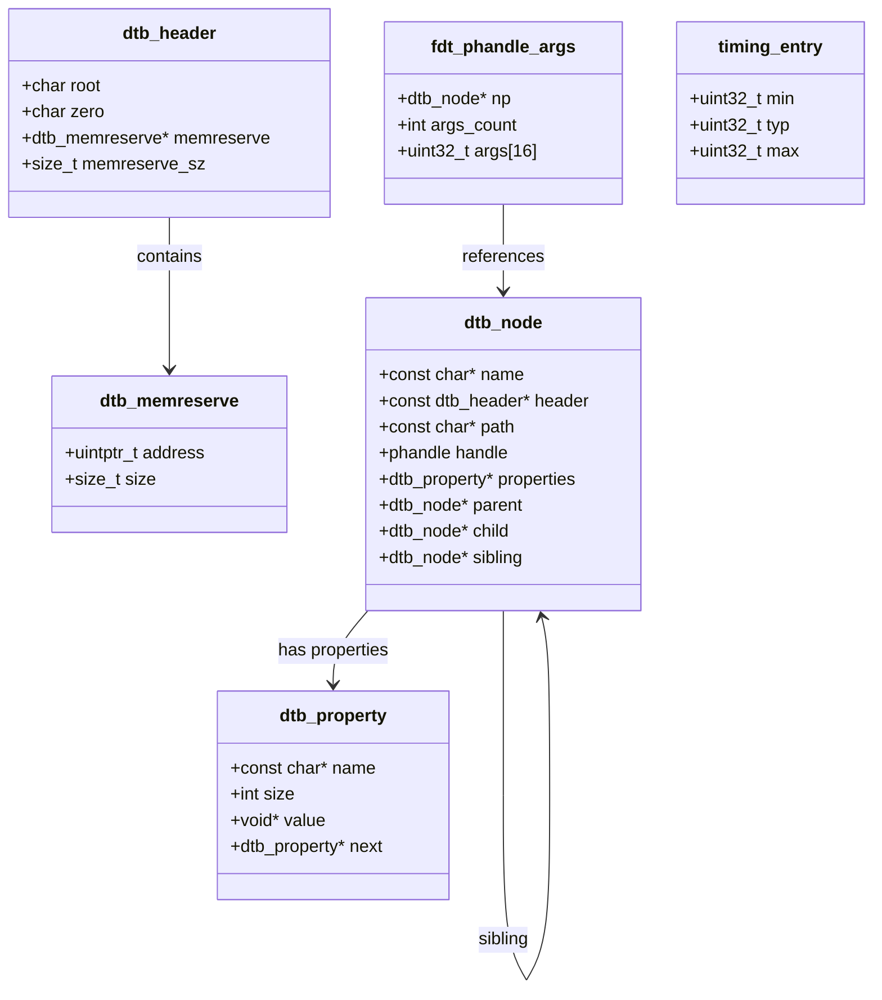
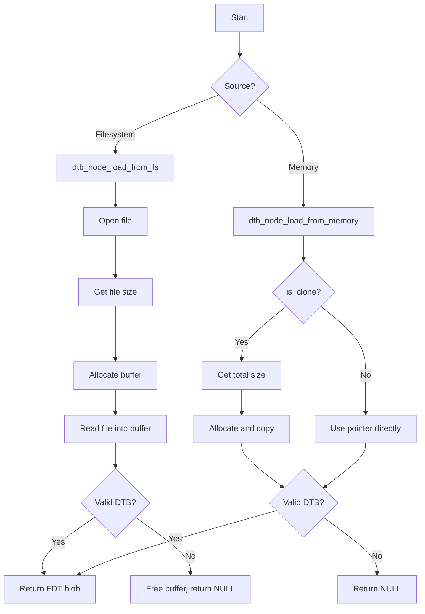
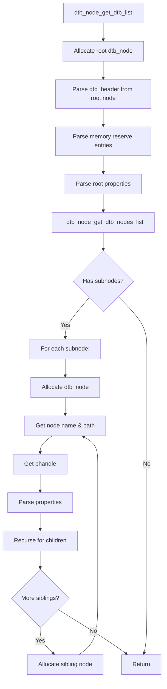
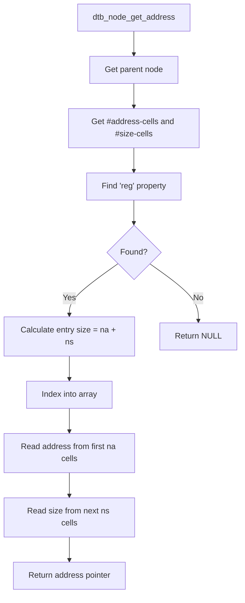
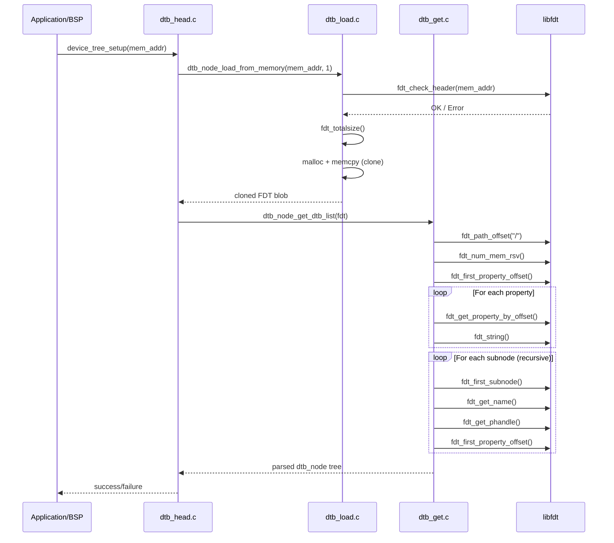
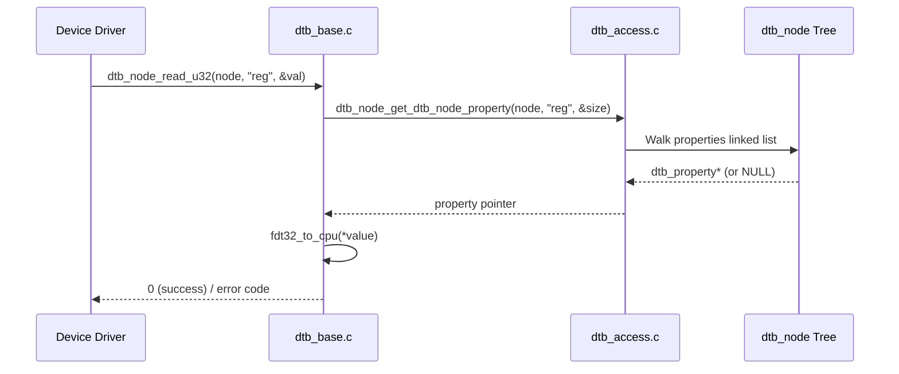
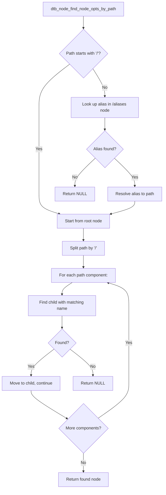
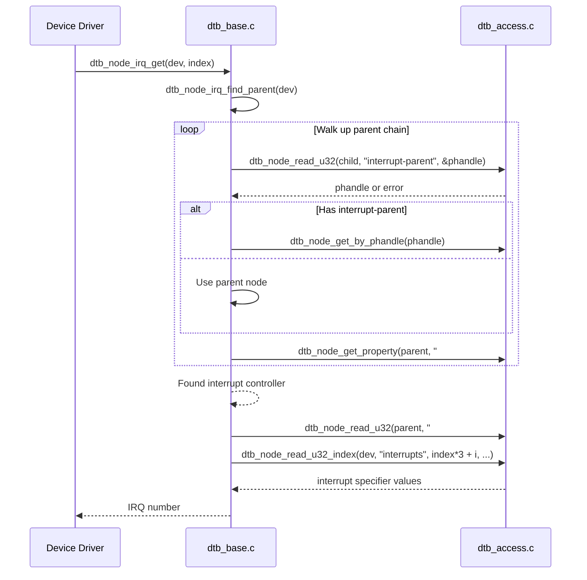

# FDT (Flattened Device Tree) Module

## Introduction

The **Flattened Device Tree (FDT)** module provides a comprehensive framework for parsing, manipulating, and querying **Device Tree Blob (DTB)** files within the RT-Thread operating system. Device Tree is a data structure for describing hardware resources, originally developed for the Open Firmware specification and widely adopted by the Linux kernel for ARM, RISC-V, and other architectures.

This module enables RT-Thread to:

- **Load DTB files** from filesystem or memory
- **Parse** the binary DTB format into an in-memory tree structure
- **Query** hardware configuration (registers, interrupts, clocks, etc.)
- **Modify** device tree properties at runtime
- **Generate DTS output** for debugging and inspection
- **Support Linux boot** by setting kernel command line and initrd parameters

The module is built on top of the **libfdt** library (a flattened device tree manipulation library) and provides a higher-level API with an in-memory tree representation (`dtb_node`) that simplifies device tree traversal and property access.

---

## Architecture Overview

The FDT module follows a **two-layer architecture**:

1. **libfdt Layer**: Low-level library for reading/writing raw FDT/DTB binary blobs
2. **DTB Node Layer**: High-level API that parses the binary blob into a linked tree of `dtb_node` structures for easy traversal and property access



---

## Core Data Structures

### 1. Raw FDT Structures (libfdt)

These structures represent the on-disk binary format of a Flattened Device Tree.



**Binary Format Layout:**

```
+-------------------+  <-- fdt_header.magic = 0xD00DFEED
|   fdt_header      |
+-------------------+
| Memory Reserve    |  <-- fdt_reserve_entry[] (array of address/size pairs)
| Map Entries       |
+-------------------+
| Structure Block   |  <-- fdt_node_header + fdt_property (tagged format)
| (nodes & props)   |
+-------------------+
| Strings Block     |  <-- Property names stored as null-terminated strings
+-------------------+
```

**Tag Values:**
| Tag | Value | Description |
|-----|-------|-------------|
| `FDT_BEGIN_NODE` | 0x00000001 | Start of a node, followed by node name |
| `FDT_END_NODE` | 0x00000002 | End of a node |
| `FDT_PROP` | 0x00000003 | Property definition |
| `FDT_NOP` | 0x00000004 | No-op (padding) |
| `FDT_END` | 0x00000009 | End of structure block |

### 2. Parsed DTB Structures (High-Level API)

These structures represent the in-memory parsed tree, providing a more convenient interface for traversal and property access.



**Tree Structure:**

The `dtb_node` structure forms a **multi-way tree** using three pointers:
- **`child`**: Points to the first child node
- **`sibling`**: Points to the next sibling node at the same level
- **`parent`**: Points back to the parent node

```
Root Node ("/")
├── child: node1
│   ├── properties: ...
│   ├── child: node1_child
│   └── sibling: node2
│       ├── properties: ...
│       ├── child: node2_child
│       └── sibling: node3
│           └── ...
└── (no sibling for root)
```

---

## Module Components

### 1. Global State Management (`dtb_head.c`)

Manages the global DTB blob pointer and the parsed node tree head.

**Key Functions:**

| Function | Description |
|----------|-------------|
| `get_fdt_blob()` | Returns the raw FDT blob pointer |
| `get_dtb_node_head()` | Returns the root of the parsed `dtb_node` tree |
| `dtb_node_active()` | Checks if a DTB has been loaded and parsed |
| `device_tree_setup()` | Initializes the device tree from a memory address (loads and parses) |

**Global State:**
```c
static void *dtb_root = NULL;          // Raw FDT blob
static struct dtb_node *dtb_node_list = NULL;  // Parsed tree root
```

### 2. DTB Loading (`dtb_load.c`)

Provides functions to load DTB data from different sources.

**Key Functions:**

| Function | Description |
|----------|-------------|
| `dtb_node_check()` | Validates a DTB blob using `fdt_check_header()` |
| `dtb_node_load_from_fs()` | Loads a DTB file from the filesystem |
| `dtb_node_load_from_memory()` | Loads a DTB from memory, optionally cloning it |

**Loading Flow:**



### 3. Tree Parsing & Enumeration (`dtb_get.c`)

Parses the raw FDT blob into the in-memory `dtb_node` tree structure and provides enumeration utilities.

**Key Functions:**

| Function | Description |
|----------|-------------|
| `dtb_node_get_dtb_list()` | Parses the entire FDT blob into a `dtb_node` tree |
| `dtb_node_free_dtb_list()` | Frees the entire parsed tree |
| `dtb_node_get_dts_dump()` | Prints the device tree in DTS format |
| `dtb_node_get_enum_dtb_node()` | Enumerates all nodes with a callback |
| `dtb_node_get_dtb_node_by_name_DFS()` | Finds a node by name using Depth-First Search |
| `dtb_node_get_dtb_node_by_name_BFS()` | Finds a node by name using Breadth-First Search |
| `dtb_node_get_dtb_node_by_path()` | Finds a node by its full path |
| `dtb_node_get_dtb_node_by_phandle_DFS()` | Finds a node by phandle using DFS |
| `dtb_node_get_dtb_node_by_phandle_BFS()` | Finds a node by phandle using BFS |
| `dtb_node_get_dtb_node_cells()` | Gets #address-cells and #size-cells for a node |
| `dtb_node_get_dtb_memreserve()` | Gets the memory reserve map |
| `dtb_node_get_dtb_node_status()` | Checks if a node's status is "okay" |
| `dtb_node_get_dtb_node_compatible_match()` | Checks if a node matches a compatible string |

**Parsing Flow:**



### 4. Property Access & Node Lookup (`dtb_access.c`)

Provides functions for reading property values and looking up nodes by various criteria.

**Key Functions:**

| Function | Description |
|----------|-------------|
| `dtb_node_read_u32()` | Reads a 32-bit integer property |
| `dtb_node_read_u32_default()` | Reads a u32 with default value |
| `dtb_node_read_u32_array()` | Reads an array of 32-bit integers |
| `dtb_node_read_u32_index()` | Reads a specific index from a u32 array |
| `dtb_node_read_u64()` | Reads a 64-bit integer property |
| `dtb_node_read_s32_default()` | Reads a signed 32-bit with default |
| `dtb_node_n_addr_cells()` | Gets #address-cells for a node (walks up to parent) |
| `dtb_node_n_size_cells()` | Gets #size-cells for a node (walks up to parent) |
| `dtb_node_get_dtb_node_property()` | Finds a property by name |
| `dtb_node_get_dtb_node_property_value()` | Gets the value pointer of a property |
| `dtb_node_find_node_opts_by_path()` | Finds a node by path with alias support |
| `dtb_node_find_compatible_node()` | Finds a node by compatible string |
| `dtb_node_find_all_nodes()` | Iterator for traversing all nodes |
| `dtb_node_find_node_by_phandle()` | Finds a node by its phandle |
| `dtb_node_find_node_by_prop_value()` | Finds a node by property value |
| `dtb_node_device_is_available()` | Checks if a device is available (status == "okay") |
| `dtb_node_get_parent()` | Gets the parent of a node |
| `dtb_node_property_match_string()` | Finds a string in a string list property |
| `dtb_node_property_read_string_helper()` | Reads strings from a string list property |
| `dtb_node_parse_phandle()` | Parses a phandle reference |
| `dtb_node_parse_phandle_with_args()` | Parses a phandle with arguments |
| `dtb_node_count_phandle_with_args()` | Counts phandle entries |

### 5. High-Level Query Functions (`dtb_base.c`)

Provides convenience functions for common device tree queries, including interrupt handling and address translation.

**Key Functions:**

| Function | Description |
|----------|-------------|
| `dtb_node_read_bool()` | Reads a boolean property (exists = true) |
| `dtb_node_read_prop()` | Reads a property value with size |
| `dtb_node_read_string()` | Reads a string property |
| `dtb_node_find_subnode()` | Finds a direct child subnode by name |
| `dtb_node_first_subnode()` | Gets the first child of a node |
| `dtb_node_next_subnode()` | Gets the next sibling of a node |
| `dtb_node_get_name()` | Gets the node name (last component of path) |
| `dtb_node_get_by_phandle()` | Gets a node by phandle |
| `dtb_node_read_size()` | Gets the size of a property value |
| `dtb_node_get_addr_and_size_by_index()` | Gets address and size from "reg" property |
| `dtb_node_get_addr_index()` | Gets address at index from "reg" |
| `dtb_node_get_addr()` | Gets the first address from "reg" |
| `dtb_node_get_chosen_prop()` | Gets a property from the /chosen node |
| `dtb_node_get_chosen_node()` | Gets a node referenced by /chosen |
| `dtb_node_is_available()` | Checks if a device is available |
| `dtb_node_get_addr_size()` | Gets address and size from a named property |
| `dtb_node_find_all_compatible_node()` | Finds all nodes matching a compatible string |
| `dtb_node_write_prop()` | Writes a property value |
| `dtb_node_write_string()` | Writes a string property |
| `dtb_node_set_enabled()` | Sets a node's status to "okay" or "disable" |
| `dtb_node_irq_get()` | Gets an interrupt number by index |
| `dtb_node_irq_get_byname()` | Gets an interrupt number by name |
| `dtb_node_irq_count()` | Counts interrupts for a device |

### 6. Address Translation (`dtb_addr.c`)

Handles address translation from device tree "reg" properties.

**Key Functions:**

| Function | Description |
|----------|-------------|
| `dtb_node_get_address()` | Gets address, size, and flags from "reg" or "assigned-addresses" |

**Address Translation Logic:**



### 7. DTB Modification (`dtb_set.c`)

Provides functions for modifying DTB blobs, primarily used for Linux boot preparation.

**Key Functions:**

| Function | Description |
|----------|-------------|
| `dtb_node_set_linux_cmdline()` | Sets the "bootargs" property in /chosen |
| `dtb_node_set_linux_initrd()` | Sets initrd start/end in /chosen and adds memory reserve |
| `dtb_node_set_dtb_property()` | Sets a property on a node by path |
| `dtb_node_add_dtb_memreserve()` | Adds a memory reserve entry |
| `dtb_node_del_dtb_memreserve()` | Deletes a memory reserve entry by address |

---

## Data Flow

### 1. Device Tree Initialization Flow



### 2. Property Read Flow



### 3. Node Lookup Flow (by path)



### 4. Interrupt Resolution Flow



---

## Convenience Macros

The module provides several macros for convenient iteration over device tree elements:

| Macro | Description |
|-------|-------------|
| `for_each_property_string(node, propname, str, size)` | Iterates over strings in a string list property |
| `for_each_property_cell(node, propname, value, list, size)` | Iterates over 32-bit cells in a property |
| `for_each_property_byte(node, propname, value, list, size)` | Iterates over bytes in a property |
| `for_each_node_child(node_ptr)` | Iterates over all children of a node |
| `for_each_node_sibling(node_ptr)` | Iterates over all siblings of a node |
| `for_each_of_allnodes(dn)` | Iterates over all nodes in the tree |
| `for_each_of_allnodes_from(from, dn)` | Iterates over all nodes starting from a given node |
| `dtb_node_for_each_subnode(node, parent)` | Iterates over subnodes of a parent |

---

## Error Handling

The module uses a combination of return codes and a global execution status variable:

**Global Status Variable:**
```c
int fdt_exec_status;
```

**Status Values:**
| Constant | Value | Description |
|----------|-------|-------------|
| `FDT_RET_GET_OK` | 0 | Operation successful |
| `FDT_RET_GET_EMPTY` | -1 | No data found (empty property, no subnodes, etc.) |
| `FDT_RET_NO_LOADED` | 1 | No DTB has been loaded |
| `FDT_RET_NO_MEMORY` | 2 | Memory allocation failure |

**libfdt Error Codes:**
| Constant | Value | Description |
|----------|-------|-------------|
| `FDT_ERR_NOTFOUND` | 1 | Node or property not found |
| `FDT_ERR_EXISTS` | 2 | Attempted to create existing node/property |
| `FDT_ERR_NOSPACE` | 3 | Insufficient buffer space |
| `FDT_ERR_BADOFFSET` | 4 | Invalid structure block offset |
| `FDT_ERR_BADPATH` | 5 | Badly formatted path |
| `FDT_ERR_BADPHANDLE` | 6 | Invalid phandle |
| `FDT_ERR_BADMAGIC` | 9 | Not a valid device tree (bad magic number) |
| `FDT_ERR_BADVERSION` | 10 | Unsupported version |

---

## Dependencies

### Internal Dependencies

| Component | Depends On | Description |
|-----------|------------|-------------|
| `dtb_head.c` | `dtb_node.h`, `libfdt.h` | Global state management |
| `dtb_load.c` | `libfdt.h`, `dtb_node.h` | DTB loading uses libfdt validation |
| `dtb_get.c` | `libfdt.h`, `dtb_node.h` | Tree parsing uses libfdt traversal |
| `dtb_access.c` | `libfdt.h`, `dtb_node.h` | Property access uses libfdt endian conversion |
| `dtb_base.c` | `libfdt.h`, `libfdt_env.h`, `dtb_node.h` | High-level queries |
| `dtb_addr.c` | `libfdt.h`, `dtb_node.h` | Address translation |
| `dtb_set.c` | `libfdt.h`, `dtb_node.h` | DTB modification uses libfdt RW API |

### External Dependencies

| Module | Relationship |
|--------|--------------|
| [RT-Thread Kernel](RT-Thread%20Kernel.md) | Uses kernel memory allocation (`malloc`/`free`), string functions, and `rt_kprintf` for debug output |
| [File System (DFS)](File%20System%20(DFS).md) | `dtb_node_load_from_fs()` uses file I/O (`open`, `read`, `lseek`, `close`) to load DTB files |
| [Memory Management](Memory%20Management.md) | Dynamic memory allocation for parsed tree structures |

---

## Configuration Options

The FDT module is configured via Kconfig options:

| Option | Description | Default |
|--------|-------------|---------|
| `RT_USING_FDT` | Enable FDT/DTB support | N |
| `RT_DTB_DEBUG` | Enable debug output | N |
| `FDT_DTB_ALL_NODES_PATH_SIZE` | Buffer size for storing all node paths during parsing | 32768 (32KB) |
| `FDT_DTB_PAD_SIZE` | Padding size for DTB expansion operations | 1024 |

---

## Usage Examples

### Loading and Parsing a DTB

```c
// Load from memory (e.g., from bootloader)
void *dtb_ptr = (void *)0x80000000;  // DTB location
if (device_tree_setup(dtb_ptr) == 0) {
    // DTB loaded and parsed successfully
}

// Load from filesystem
void *fdt = dtb_node_load_from_fs("/dtb/board.dtb");
if (fdt) {
    struct dtb_node *root = dtb_node_get_dtb_list(fdt);
    // Use the tree...
    dtb_node_free_dtb_list(root);
    free(fdt);
}
```

### Querying Device Properties

```c
struct dtb_node *uart_node = dtb_node_find_node_by_path("/soc/uart@10000000");
if (uart_node) {
    uint32_t reg_addr;
    if (dtb_node_read_u32(uart_node, "reg", &reg_addr) == 0) {
        // reg_addr contains the register base address
    }
    
    const char *status = dtb_node_read_string(uart_node, "status");
    if (status && strcmp(status, "okay") == 0) {
        // Device is enabled
    }
    
    // Check compatible string
    if (dtb_node_get_dtb_node_compatible_match(uart_node, "ns16550")) {
        // This is an NS16550 compatible UART
    }
}
```

### Iterating Over Nodes

```c
// Iterate over all nodes
struct dtb_node *dn;
for_each_of_allnodes(dn) {
    rt_kprintf("Node: %s\n", dn->path);
}

// Iterate over children of a specific node
struct dtb_node *child;
dtb_node_for_each_subnode(child, parent_node) {
    rt_kprintf("Child: %s\n", dtb_node_get_name(child));
}

// Iterate over string list property
char *str;
int size;
for_each_property_string(node, "compatible", str, size) {
    rt_kprintf("Compatible: %s\n", str);
}
```

### Modifying DTB for Linux Boot

```c
void *fdt = get_fdt_blob();
if (fdt) {
    // Set kernel command line
    dtb_node_set_linux_cmdline(fdt, "console=ttyS0,115200 root=/dev/mmcblk0p1");
    
    // Set initrd
    dtb_node_set_linux_initrd(fdt, 0x81000000, 0x100000);
    
    // Add custom property
    uint32_t cells[] = {cpu_to_fdt32(0x10000000), cpu_to_fdt32(0x1000)};
    dtb_node_set_dtb_property(fdt, "/soc/uart@10000000", "reg", cells, sizeof(cells));
}
```

### DTS Dump

```c
struct dtb_node *root = get_dtb_node_head();
if (root) {
    dtb_node_get_dts_dump(root);
    // Output:
    // /dts-v1/;
    // / {
    //     model = "...";
    //     compatible = "...";
    //     ...
    // };
}
```

---

## Summary

The FDT (Flattened Device Tree) module provides RT-Thread with a complete device tree infrastructure, enabling:

- **Hardware Description**: Parse and query hardware configuration from Device Tree blobs
- **Driver Support**: Enable device drivers to discover and configure hardware dynamically
- **Linux Boot Support**: Prepare device tree for Linux kernel boot (command line, initrd)
- **Debugging**: Dump device tree in human-readable DTS format
- **Runtime Modification**: Add, modify, or delete device tree properties at runtime

The two-layer architecture (libfdt + DTB Node API) provides both low-level access to the raw binary format and a high-level, easy-to-use tree-based API for common device tree operations.
