# File System (DFS)

## Introduction

The Device File System (DFS) module is the virtual file system (VFS) layer of the RT-Thread operating system. It provides a **POSIX-compliant** file system abstraction that allows applications to interact with various underlying file systems and storage devices through a unified API. DFS acts as an intermediary between user applications and the actual file system implementations, enabling multiple file system types to coexist under a single mount hierarchy.

DFS supports two versions:
- **DFS v1**: The legacy version (located in `components/dfs/dfs_v1/`)
- **DFS v2**: The current, actively maintained version (located in `components/dfs/dfs_v2/`)

This documentation covers **DFS v2**, which is the recommended version for new designs.

---

## Architecture Overview

DFS follows a layered architecture with clear separation of concerns:

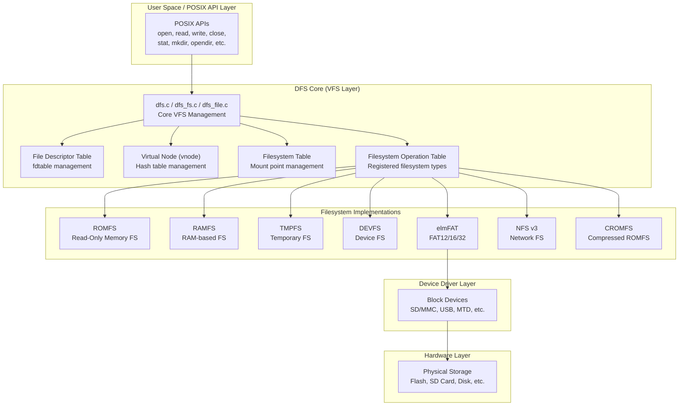

---

## Core Data Structures

### 1. File Descriptor Table (`dfs_fdtable`)

The file descriptor table manages all open file descriptors for a process. In RT-Thread's Smart mode (with LWP support), each process has its own fdtable; otherwise, a global fdtable is used.

```c
struct dfs_fdtable
{
    uint32_t maxfd;           /* Maximum number of file descriptors */
    struct dfs_file **fds;    /* Array of file descriptor pointers */
};
```

### 2. Virtual Node (`dfs_vnode`)

The vnode (virtual node) is the core abstraction representing an open file or directory within the VFS layer. Vnodes are cached in a hash table for efficient lookup.

```c
struct dfs_vnode
{
    uint16_t type;                      /* Type: FT_REGULAR, FT_DIRECTORY, FT_DEVICE, etc. */
    char *path;                         /* Path below mount point */
    char *fullpath;                     /* Full absolute path (hash key) */
    int ref_count;                      /* Reference count */
    rt_list_t list;                     /* Hash table linked list node */
    struct dfs_filesystem *fs;          /* Pointer to mounted filesystem */
    const struct dfs_file_ops *fops;    /* File operations for this vnode */
    uint32_t flags;                     /* Self flags */
    size_t size;                        /* File size in bytes */
    void *data;                         /* Filesystem-specific private data */
};
```

### 3. File Descriptor (`dfs_file`)

Represents an open file instance, holding the current state (position, flags) and a reference to its vnode.

```c
struct dfs_file
{
    uint16_t magic;              /* Magic number (DFS_FD_MAGIC = 0xfdfd) */
    uint32_t flags;              /* Descriptor flags (open, directory, EOF, error) */
    int ref_count;               /* Reference count */
    off_t pos;                   /* Current file position */
    struct dfs_vnode *vnode;     /* Associated vnode */
    void *data;                  /* FD-specific private data */
};
```

### 4. File Operations (`dfs_file_ops`)

The file operations structure defines the interface that each filesystem must implement for file-level operations.

```c
struct dfs_file_ops
{
    int (*open)     (struct dfs_file *fd);
    int (*close)    (struct dfs_file *fd);
    int (*ioctl)    (struct dfs_file *fd, int cmd, void *args);
    int (*read)     (struct dfs_file *fd, void *buf, size_t count);
    int (*write)    (struct dfs_file *fd, const void *buf, size_t count);
    int (*flush)    (struct dfs_file *fd);
    int (*lseek)    (struct dfs_file *fd, off_t offset);
    int (*getdents) (struct dfs_file *fd, struct dirent *dirp, uint32_t count);
    int (*poll)     (struct dfs_file *fd, struct rt_pollreq *req);
};
```

### 5. Filesystem Operations (`dfs_filesystem_ops`)

Defines the interface for registering, mounting, and managing a filesystem type.

```c
struct dfs_filesystem_ops
{
    char *name;                          /* Filesystem name (e.g., "elm", "rom", "devfs") */
    uint32_t flags;                      /* Flags (e.g., DFS_FS_FLAG_FULLPATH) */
    const struct dfs_file_ops *fops;     /* File operations for this filesystem */

    int (*mount)    (struct dfs_filesystem *fs, unsigned long rwflag, const void *data);
    int (*unmount)  (struct dfs_filesystem *fs);
    int (*mkfs)     (rt_device_t dev_id, const char *fs_name);
    int (*statfs)   (struct dfs_filesystem *fs, struct statfs *buf);
    int (*unlink)   (struct dfs_filesystem *fs, const char *pathname);
    int (*stat)     (struct dfs_filesystem *fs, const char *filename, struct stat *buf);
    int (*rename)   (struct dfs_filesystem *fs, const char *oldpath, const char *newpath);
};
```

### 6. Mounted Filesystem (`dfs_filesystem`)

Represents a mounted filesystem instance, binding a device to a mount point.

```c
struct dfs_filesystem
{
    rt_device_t dev_id;                         /* Attached block device */
    char *path;                                 /* Mount point path */
    const struct dfs_filesystem_ops *ops;       /* Filesystem operations */
    void *data;                                 /* Filesystem-specific data */
};
```

### 7. Partition Table (`dfs_partition`)

Used for parsing MBR partition tables on block devices.

```c
struct dfs_partition
{
    uint8_t type;        /* Partition type */
    off_t  offset;       /* Partition start offset (in sectors) */
    size_t size;         /* Partition size (in sectors) */
    rt_sem_t lock;
};
```

### 8. Mount Table (`dfs_mount_tbl`)

Used for automatic mounting of filesystems during system initialization.

```c
struct dfs_mount_tbl
{
    const char   *device_name;
    const char   *path;
    const char   *filesystemtype;
    unsigned long rwflag;
    const void   *data;
};
```

### 9. Memory-Mapped I/O Arguments (`dfs_mmap2_args`)

```c
struct dfs_mmap2_args
{
    void *addr;
    size_t length;
    int prot;
    int flags;
    off_t pgoffset;
    void *ret;
};
```

---

## Class Diagram

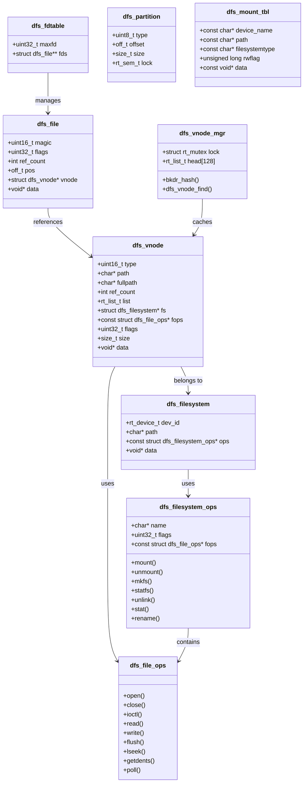

---

## Data Flow

### File Open Flow

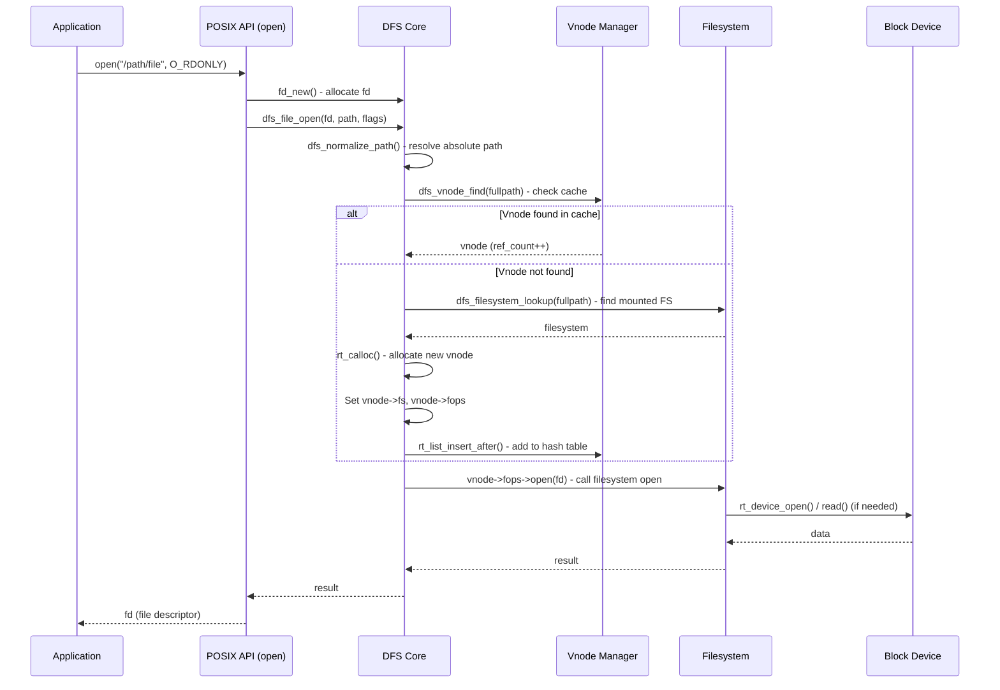

### File Read Flow

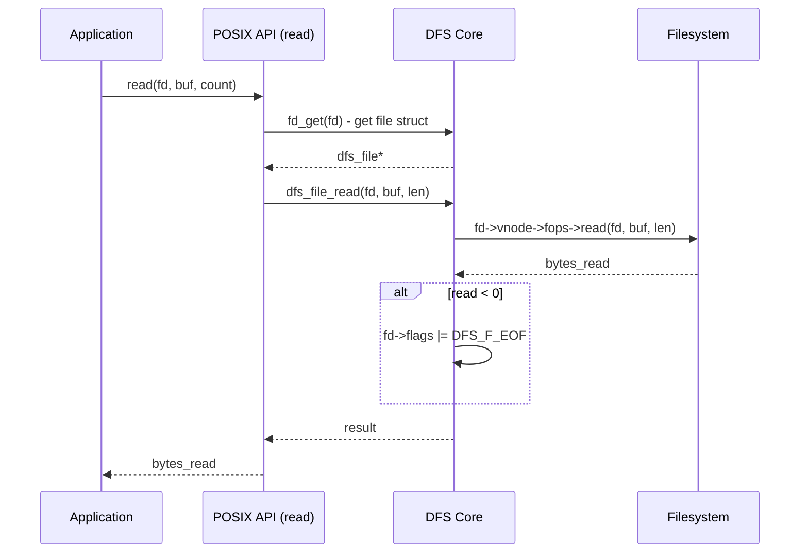

### File Write Flow

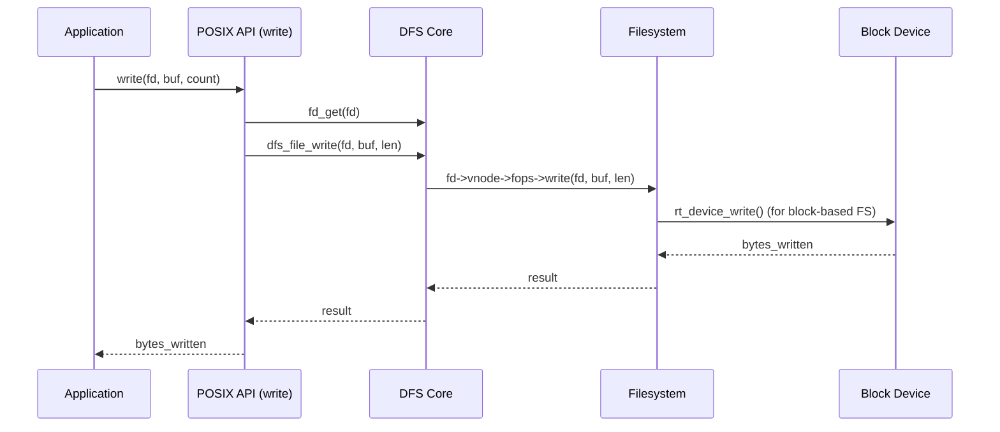

### Mount Flow

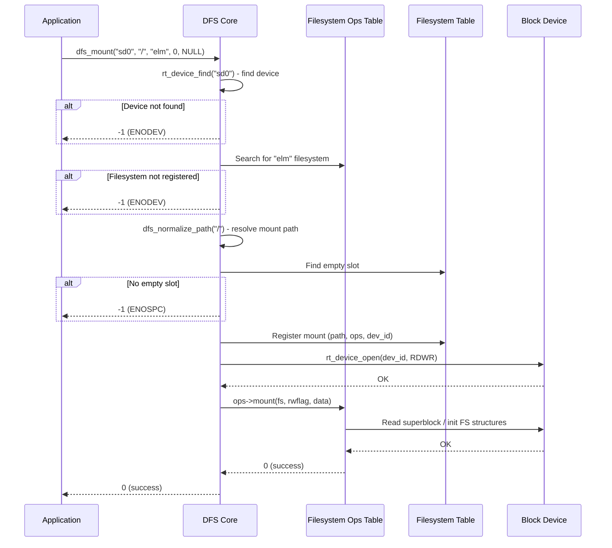

---

## Component Interaction

### Vnode Manager (Hash Table)

The vnode manager maintains a hash table of all open vnodes, keyed by their full path. This allows efficient lookup and prevents duplicate opens of the same file.

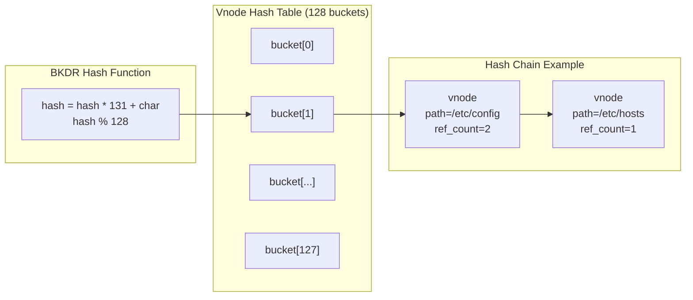

### Filesystem Registration and Mount Table

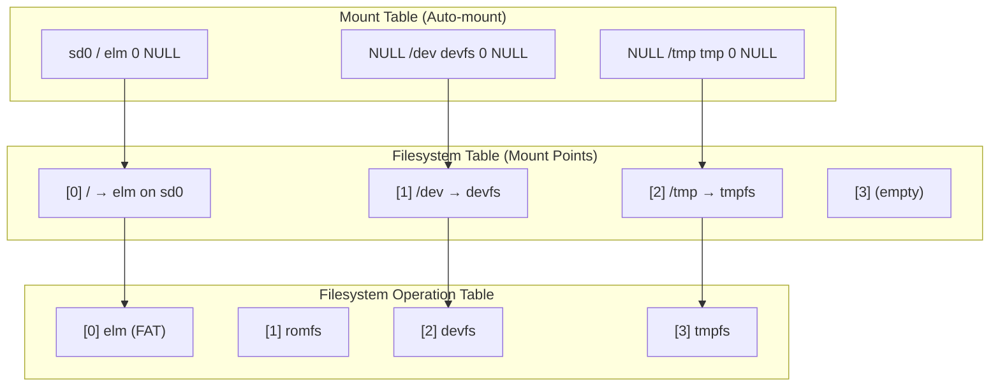

---

## Supported Filesystems

DFS v2 supports the following filesystem implementations:

| Filesystem | Name String | Type | Description |
|---|---|---|---|
| **elmFAT** | `elm` | Block-based | FAT12/16/32 filesystem (based on Chan's FAT FS) |
| **ROMFS** | `rom` | Memory-based | Read-only filesystem stored in ROM/flash |
| **RAMFS** | `ram` | Memory-based | RAM-based volatile filesystem |
| **TMPFS** | `tmp` | Memory-based | Temporary filesystem (similar to tmpfs) |
| **DEVFS** | `devfs` | Virtual | Device filesystem (exposes devices as files) |
| **NFS v3** | `nfs` | Network | Network File System v3 client |
| **CROMFS** | `cromfs` | Memory-based | Compressed ROM filesystem |

### Filesystem Characteristics

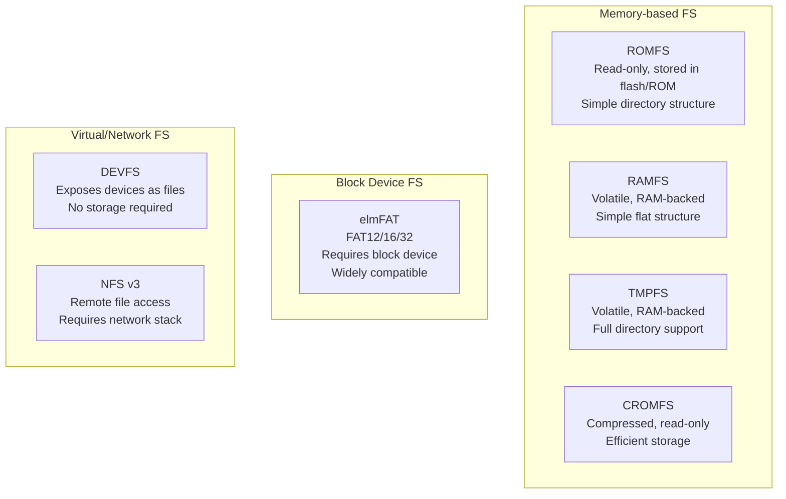

---

## Key APIs

### Initialization and Configuration

| API | Description |
|---|---|
| `dfs_init()` | Initialize the DFS subsystem (vnode manager, locks, mount tables) |
| `dfs_register()` | Register a filesystem type in the operation table |
| `dfs_mount_table()` | Auto-mount all entries in the mount table (called at boot) |

### Filesystem Management

| API | Description |
|---|---|
| `dfs_mount()` | Mount a filesystem on a path |
| `dfs_unmount()` | Unmount a filesystem |
| `dfs_mkfs()` | Format a device with a filesystem |
| `dfs_statfs()` | Get filesystem statistics |
| `dfs_filesystem_lookup()` | Find the filesystem mounted at a path |
| `dfs_filesystem_get_partition()` | Parse MBR partition table |

### File Operations

| API | Description |
|---|---|
| `dfs_file_open()` | Open a file |
| `dfs_file_close()` | Close a file |
| `dfs_file_read()` | Read from a file |
| `dfs_file_write()` | Write to a file |
| `dfs_file_lseek()` | Seek to a position |
| `dfs_file_ioctl()` | I/O control operations |
| `dfs_file_flush()` | Flush file buffers |
| `dfs_file_getdents()` | Get directory entries |
| `dfs_file_stat()` | Get file status |
| `dfs_file_rename()` | Rename a file |
| `dfs_file_unlink()` | Delete a file |
| `dfs_file_ftruncate()` | Truncate a file |
| `dfs_file_mmap2()` | Memory-map a file |

### POSIX-Compatible APIs

| API | Description |
|---|---|
| `open()` / `creat()` | Open/create a file |
| `close()` | Close a file descriptor |
| `read()` / `write()` | Read/write from/to a file |
| `lseek()` | Reposition file offset |
| `stat()` / `fstat()` | Get file status |
| `unlink()` / `remove()` | Delete a file |
| `rename()` | Rename a file |
| `mkdir()` / `rmdir()` | Create/remove a directory |
| `opendir()` / `readdir()` / `closedir()` | Directory operations |
| `fcntl()` / `ioctl()` | File control operations |
| `ftruncate()` | Truncate a file |
| `fsync()` | Synchronize file data |
| `statfs()` / `fstatfs()` | Get filesystem statistics |
| `dup()` / `dup2()` | Duplicate file descriptors |

---

## Configuration Options

DFS behavior is configured through Kconfig options (see `components/dfs/Kconfig` and `components/dfs/dfs_v2/Kconfig`):

| Option | Default | Description |
|---|---|---|
| `RT_USING_DFS` | y | Enable DFS module |
| `DFS_FILESYSTEMS_MAX` | 4 | Maximum number of mounted filesystems |
| `DFS_FD_MAX` | 16 | Maximum number of open file descriptors |
| `DFS_PATH_MAX` | 256 | Maximum path length |
| `DFS_USING_WORKDIR` | y | Enable working directory support |
| `DFS_USING_POSIX` | y | Enable POSIX API wrappers |
| `RT_USING_DFS_ELMFAT` | n | Enable elmFAT filesystem |
| `RT_USING_DFS_ROMFS` | n | Enable ROMFS filesystem |
| `RT_USING_DFS_RAMFS` | n | Enable RAMFS filesystem |
| `RT_USING_DFS_TMPFS` | n | Enable TMPFS filesystem |
| `RT_USING_DFS_DEVFS` | n | Enable DEVFS filesystem |
| `RT_USING_DFS_NFS` | n | Enable NFS v3 client |
| `RT_USING_DFS_CROMFS` | n | Enable CROMFS filesystem |
| `RT_USING_DFS_MNTTABLE` | n | Enable auto-mount table support |

---

## Dependencies

DFS depends on the following RT-Thread kernel and driver components:

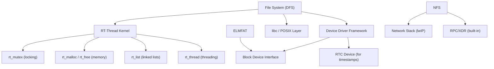

### Key Dependencies

- **[RT-Thread Kernel](RT-Thread%20Kernel.md)**: Core kernel services including:
  - `rt_mutex` for filesystem and fd table locking
  - `rt_malloc`/`rt_free`/`rt_calloc`/`rt_realloc` for dynamic memory allocation
  - `rt_list` for linked list management (vnode hash table)
  - `rt_device` for block device I/O
  - `rt_thread` for per-process fdtable (Smart mode)
  
- **Device Driver Framework**: Block device interface for filesystems that require persistent storage (elmFAT)

- **libc/POSIX Layer**: Provides the POSIX API wrappers and standard type definitions (`struct stat`, `struct statfs`, `struct dirent`, etc.)

---

## Internal Locking Mechanism

DFS uses three mutexes for thread-safe operation:

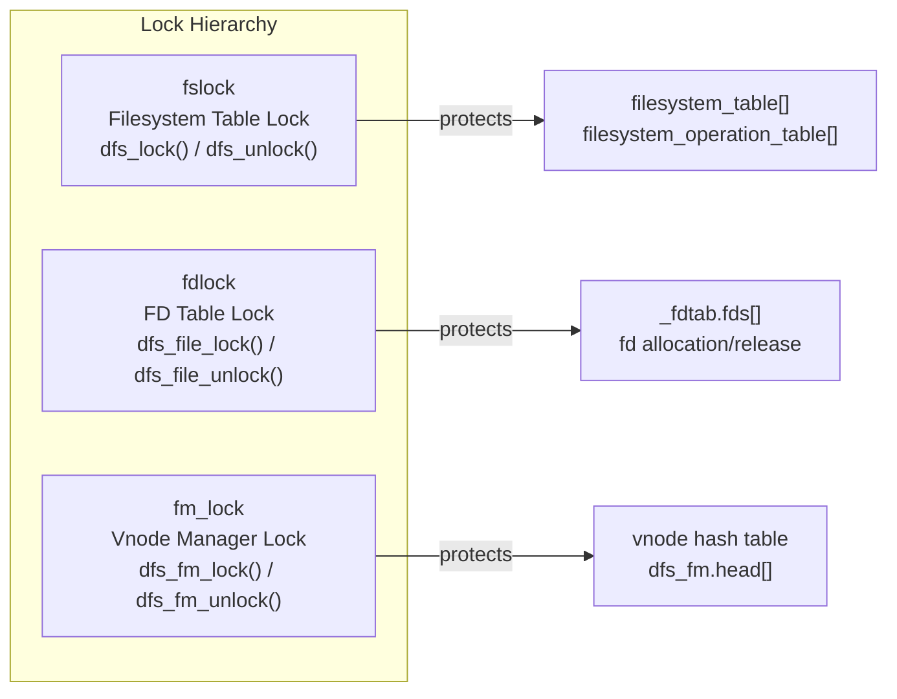

---

## Error Handling

DFS uses negative errno values internally and converts them to POSIX errno for user-space APIs. Common error codes:

| Error | Description |
|---|---|
| `-ENOMEM` | Out of memory |
| `-ENOENT` | File or path not found |
| `-ENODEV` | Device or filesystem not found |
| `-ENOSYS` | Operation not supported |
| `-ENOSPC` | No space left (table full) |
| `-EBUSY` | Resource busy (file already open) |
| `-EINVAL` | Invalid argument |
| `-EXDEV` | Cross-device link (rename across filesystems) |
| `-EBADF` | Bad file descriptor |
| `-ENOTDIR` | Not a directory |

---

## Source File Structure

```
components/dfs/
├── Kconfig                          # Top-level DFS configuration
├── SConscript                       # Build script
├── dfs_v1/                          # Legacy DFS v1 (deprecated)
│   ├── include/
│   ├── src/
│   └── filesystems/
└── dfs_v2/                          # Current DFS v2
    ├── Kconfig                      # DFS v2 configuration
    ├── SConscript                   # Build script
    ├── include/
    │   ├── dfs.h                    # Core DFS definitions and APIs
    │   ├── dfs_file.h               # File and vnode structures
    │   ├── dfs_fs.h                 # Filesystem structures and mount APIs
    │   └── dfs_private.h            # Internal declarations
    ├── src/
    │   ├── dfs.c                    # Core VFS: init, fdtable, path normalization
    │   ├── dfs_file.c               # File operations: open, close, read, write, etc.
    │   ├── dfs_fs.c                 # Filesystem operations: register, mount, unmount, mkfs
    │   └── dfs_posix.c              # POSIX API wrappers: open, read, write, stat, etc.
    └── filesystems/
        ├── romfs/                   # Read-Only Memory Filesystem
        ├── ramfs/                   # RAM-based Filesystem
        ├── tmpfs/                   # Temporary Filesystem
        ├── devfs/                   # Device Filesystem
        ├── elmfat/                  # FAT12/16/32 (Chan's FAT FS)
        ├── nfs/                     # Network File System v3
        ├── cromfs/                  # Compressed ROM Filesystem
        └── skeleton/                # Template for new filesystem implementations
```

---

## How to Add a New Filesystem

DFS provides a skeleton template (`filesystems/skeleton/`) for implementing new filesystems. The steps are:

1. **Define `dfs_file_ops`**: Implement the file-level operations (open, close, read, write, etc.)
2. **Define `dfs_filesystem_ops`**: Implement the filesystem-level operations (mount, unmount, mkfs, statfs, etc.)
3. **Register the filesystem**: Call `dfs_register()` with the operations structure during initialization
4. **Mount the filesystem**: Use `dfs_mount()` to mount the filesystem on a path

```c
/* Example: Registering a new filesystem */
static const struct dfs_filesystem_ops myfs_ops =
{
    .name   = "myfs",
    .fops   = &myfs_file_ops,    /* Your file operations */
    .mount  = myfs_mount,
    .unmount = myfs_unmount,
    .mkfs   = myfs_mkfs,
    .statfs = myfs_statfs,
    .unlink = myfs_unlink,
    .stat   = myfs_stat,
    .rename = myfs_rename,
};

int myfs_init(void)
{
    dfs_register(&myfs_ops);
    return 0;
}
INIT_COMPONENT_EXPORT(myfs_init);
```

---

## References

- [RT-Thread Kernel](RT-Thread%20Kernel.md) - Core kernel services used by DFS
- [Device Drivers Framework](../Device%20Drivers%20Framework.md) - Block device interface for storage
- [LWP (Light Weight Process)](../LWP%20(Light%20Weight%20Process).md) - Per-process fdtable support in Smart mode
- [FAL (Flash Abstraction Layer)](../FAL%20(Flash%20Abstraction%20Layer).md) - Flash abstraction for block device layer
- [Finsh Shell](../Finsh%20Shell.md) - Shell commands for filesystem operations (ls, mkdir, etc.)
