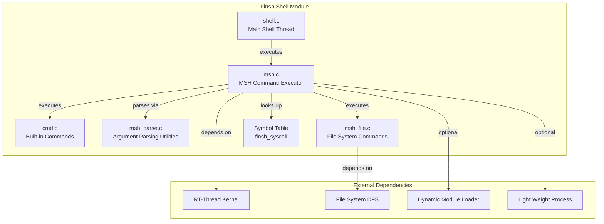
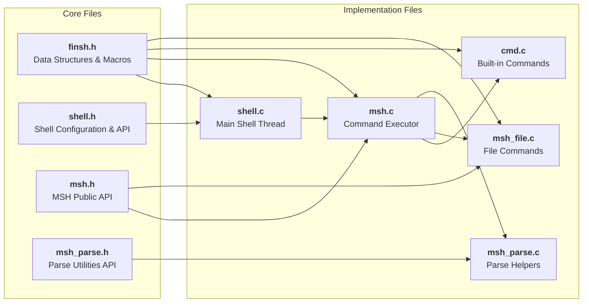
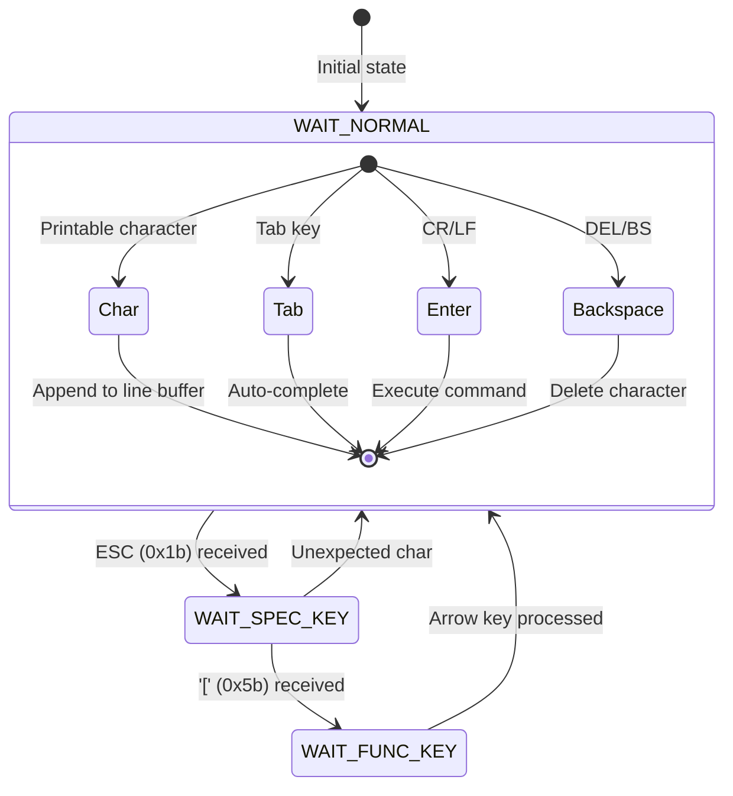
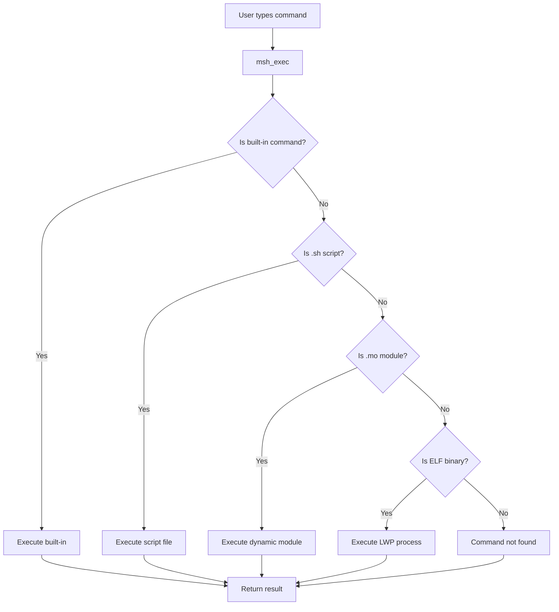
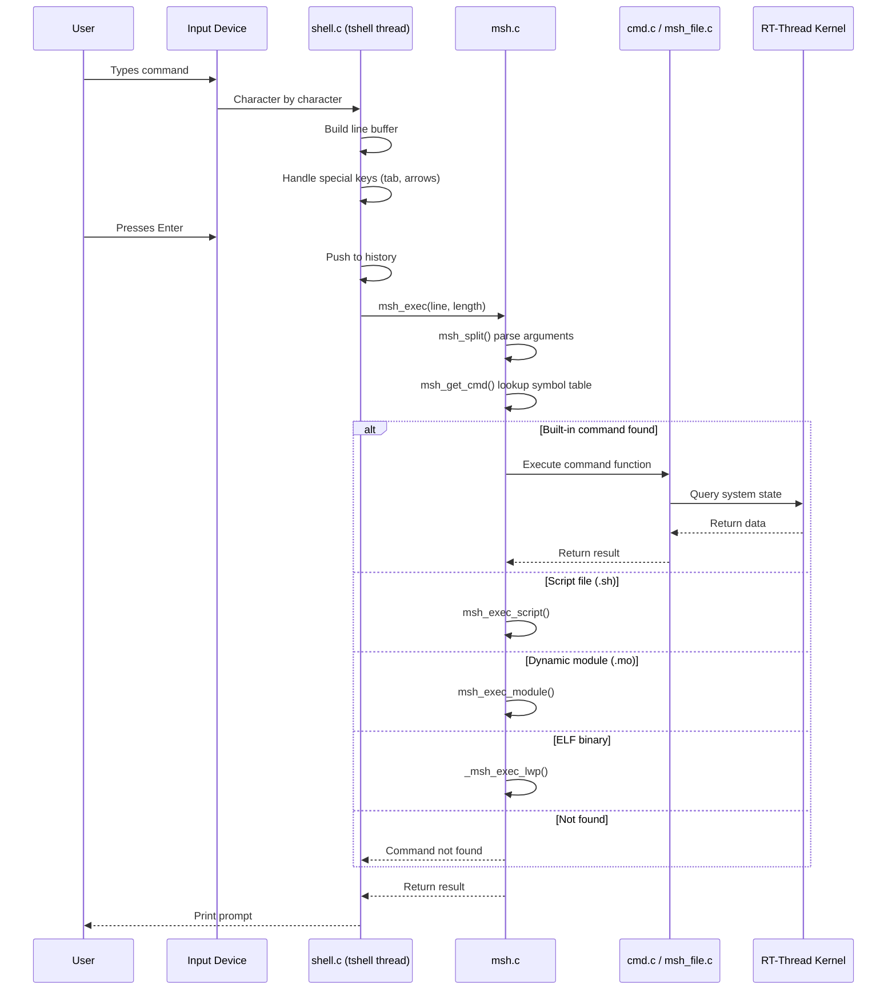
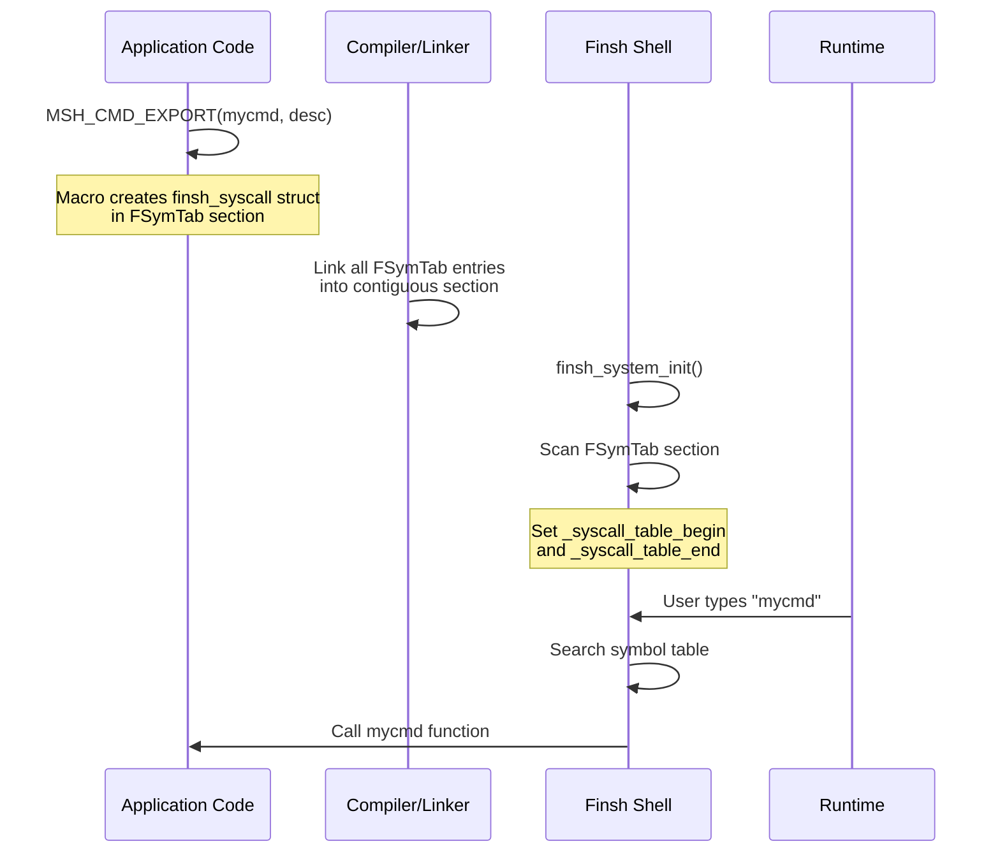

# Finsh Shell Module

## Introduction

The **Finsh Shell** (FinSH) is the command-line interface (CLI) component of the RT-Thread operating system. It provides an interactive shell environment that allows developers to debug, inspect, and control the system at runtime through text commands. FinSH supports two operational modes:

1. **MSH (Module Shell) Mode** — A traditional shell mode (similar to bash/dos) where commands are separated by spaces and arguments are passed as strings.
2. **C-Style Interpreter Mode** — A C-like expression evaluator that can call functions and access global variables directly.

The module is designed to be lightweight, portable, and extensible. It enables developers to export custom commands via simple macros, making it a powerful debugging and development tool for embedded systems.

---

## Architecture Overview

The Finsh Shell module is organized into several key components that work together to provide a complete shell experience:



### Component Dependency Diagram



---

## Core Data Structures

### `struct finsh_syscall` — System Call Entry

Defined in `finsh.h`, this structure represents a single command entry in the symbol table:

```c
struct finsh_syscall
{
    const char     *name;       /* the name of system call */
#if defined(FINSH_USING_DESCRIPTION) && defined(FINSH_USING_SYMTAB)
    const char     *desc;       /* description of system call */
#endif
    syscall_func func;          /* the function address of system call */
};
```

- **name**: The command name used in the shell (e.g., `"help"`, `"ps"`).
- **desc**: Optional description string shown in help output.
- **func**: Pointer to the command function (cast to `syscall_func` which is `long (*)(void)`).

### `struct finsh_syscall_item` — Linked List Node

```c
struct finsh_syscall_item
{
    struct finsh_syscall_item *next;    /* next item */
    struct finsh_syscall syscall;       /* syscall */
};
```

This structure allows dynamic registration of commands at runtime via a linked list. The head of this list is the global variable `global_syscall_list`.

### `struct finsh_shell` — Shell State

Defined in `shell.h`, this structure holds the complete runtime state of the shell:

```c
struct finsh_shell
{
    struct rt_semaphore rx_sem;         /* semaphore for RX notification */
    enum input_stat stat;               /* input state machine */
    rt_uint8_t echo_mode: 1;            /* echo mode flag */
    rt_uint8_t prompt_mode: 1;          /* prompt display flag */
#ifdef FINSH_USING_HISTORY
    rt_uint16_t current_history;        /* current history position */
    rt_uint16_t history_count;          /* number of history entries */
    char cmd_history[FINSH_HISTORY_LINES][FINSH_CMD_SIZE]; /* history buffer */
#endif
    char line[FINSH_CMD_SIZE + 1];      /* current input line */
    rt_uint16_t line_position;          /* total length of current line */
    rt_uint16_t line_curpos;            /* cursor position in line */
#if !defined(RT_USING_POSIX_STDIO) && defined(RT_USING_DEVICE)
    rt_device_t device;                 /* input/output device */
#endif
#ifdef FINSH_USING_AUTH
    char password[FINSH_PASSWORD_MAX];  /* authentication password */
#endif
};
```

### `list_get_next_t` — Iterator Helper

Defined in `cmd.c`, this structure is used for safe iteration over kernel object lists:

```c
typedef struct
{
    rt_list_t *list;
    rt_list_t **array;
    rt_uint8_t type;
    int nr;             /* input: max nr, can't be 0 */
    int nr_out;         /* out: got nr */
} list_get_next_t;
```

---

## Key Macros for Command Export

The module provides several macros to export functions as shell commands. These macros place entries into a special linker section (`FSymTab`) that is scanned at runtime.

### `MSH_CMD_EXPORT(command, desc)`

Exports a function as an msh command with the same name as the function.

```c
MSH_CMD_EXPORT(clear, clear the terminal screen);
```

### `MSH_CMD_EXPORT_ALIAS(command, alias, desc)`

Exports a function with an alias name.

```c
MSH_CMD_EXPORT_ALIAS(cmd_ps, ps, List threads in the system.);
```

### `FINSH_FUNCTION_EXPORT(name, desc)`

Exports a function for use in C-Style mode (with parentheses).

### `FINSH_FUNCTION_EXPORT_ALIAS(name, alias, desc)`

Exports a function with an alias for C-Style mode.

---

## Module Components

### 1. `shell.c` — Main Shell Thread

This is the entry point of the Finsh Shell. It implements:

- **`finsh_system_init()`**: Initializes the shell, creates the `tshell` thread, sets up the symbol table by scanning the `FSymTab` section, and starts the shell thread.
- **`finsh_thread_entry()`**: The main shell thread loop that:
  - Reads characters from the input device (serial, console, etc.)
  - Handles special keys (up/down for history, left/right for cursor movement, tab for auto-completion, backspace)
  - Builds the command line buffer
  - On Enter, pushes the command to history and calls `msh_exec()` to execute it
- **`finsh_getchar()`**: Reads a single character from the input device (supports POSIX STDIO, RT-Device, or hardware console).
- **`finsh_set_device()`**: Switches the shell's input/output device at runtime.
- **Authentication**: When `FINSH_USING_AUTH` is enabled, prompts for a password before allowing shell access.

#### Input State Machine



### 2. `msh.c` — MSH Command Executor

This is the core command execution engine. It implements:

- **`msh_exec()`**: The main command dispatcher. It:
  1. Strips leading whitespace
  2. Tries to execute as a built-in command via `_msh_exec_cmd()`
  3. If not found, tries to execute as a script file via `msh_exec_script()` (if DFS enabled)
  4. If not found, tries to execute as a dynamic module via `msh_exec_module()` (if module loading enabled)
  5. If not found, tries to execute as a user-space process via `_msh_exec_lwp()` (if SMART enabled)
  6. Reports "command not found" if all attempts fail

- **`msh_split()`**: Parses a command string into an `argv`-style array, handling quoted strings and escape characters.
- **`msh_get_cmd()`**: Searches the symbol table for a command by name.
- **`msh_auto_complete()`**: Implements tab-completion for both commands and file paths.
- **`msh_help()`**: Lists all registered commands with their descriptions.

#### Command Execution Flow



### 3. `cmd.c` — Built-in Commands

This file implements the standard diagnostic and management commands:

| Command | Function | Description |
|---------|----------|-------------|
| `clear` | `clear()` | Clears the terminal screen |
| `version` | `version()` | Shows RT-Thread version information |
| `help` | `msh_help()` | Lists all available commands |
| `ps` | `cmd_ps()` | Lists threads (with `-m` for modules) |
| `free` | `cmd_free()` | Shows memory usage information |
| `list_thread` | `list_thread()` | Detailed thread listing |
| `list_sem` | `list_sem()` | Lists semaphores |
| `list_event` | `list_event()` | Lists events |
| `list_mutex` | `list_mutex()` | Lists mutexes |
| `list_mailbox` | `list_mailbox()` | Lists mailboxes |
| `list_msgqueue` | `list_msgqueue()` | Lists message queues |
| `list_mempool` | `list_mempool()` | Lists memory pools |
| `list_timer` | `list_timer()` | Lists timers |
| `list_device` | `list_device()` | Lists devices |
| `list_module` | `list_module()` | Lists loaded modules |

The `list_get_next_t` structure and `list_get_next()` function provide a safe, interrupt-aware mechanism for iterating over kernel object lists without holding interrupts disabled for too long.

### 4. `msh_parse.c` — Argument Parsing Utilities

Provides helper functions for parsing command arguments:

- **`msh_isint()`**: Checks if a string represents a valid integer (with optional `+`/`-` sign).
- **`msh_ishex()`**: Checks if a string represents a valid hexadecimal number (starts with `0x`).
- **`msh_strtohex()`**: Converts a hexadecimal string to an integer value.

### 5. `msh_file.c` — File System Commands

Provides file system management commands (available when `DFS_USING_POSIX` is enabled):

| Command | Function | Description |
|---------|----------|-------------|
| `ls` | `cmd_ls()` | Lists directory contents |
| `cp` | `cmd_cp()` | Copies files |
| `mv` | `cmd_mv()` | Moves/renames files |
| `cat` | `cmd_cat()` | Concatenates and displays files |
| `rm` | `cmd_rm()` | Removes files (supports `-rfv` options) |
| `cd` | `cmd_cd()` | Changes working directory |
| `pwd` | `cmd_pwd()` | Prints working directory |
| `mkdir` | `cmd_mkdir()` | Creates directories |
| `mkfs` | `cmd_mkfs()` | Formats a device with a file system |
| `mount` | `cmd_mount()` | Mounts a file system |
| `umount` | `cmd_umount()` | Unmounts a file system |
| `df` | `cmd_df()` | Shows disk free space |
| `echo` | `cmd_echo()` | Echoes string to console or file |
| `tail` | `cmd_tail()` | Displays last lines of a file |

Additionally, `msh_exec_script()` enables executing `.sh` script files line by line.

---

## Configuration Options

The module is configured via Kconfig (`components/finsh/Kconfig`):

| Option | Default | Description |
|--------|---------|-------------|
| `RT_USING_MSH` | y | Master switch for MSH shell |
| `FINSH_THREAD_NAME` | "tshell" | Name of the shell thread |
| `FINSH_THREAD_PRIORITY` | 20 | Priority of the shell thread |
| `FINSH_THREAD_STACK_SIZE` | 4096 | Stack size for the shell thread |
| `FINSH_USING_HISTORY` | y | Enable command history |
| `FINSH_HISTORY_LINES` | 5 | Number of history entries |
| `FINSH_USING_SYMTAB` | y | Use symbol table for commands |
| `FINSH_CMD_SIZE` | 80 | Maximum command line length |
| `MSH_USING_BUILT_IN_COMMANDS` | y | Enable built-in commands |
| `FINSH_USING_DESCRIPTION` | y | Keep descriptions in symbol table |
| `FINSH_ECHO_DISABLE_DEFAULT` | n | Disable echo by default |
| `FINSH_USING_AUTH` | n | Enable password authentication |
| `FINSH_DEFAULT_PASSWORD` | "rtthread" | Default authentication password |
| `FINSH_ARG_MAX` | 10 | Maximum number of command arguments |

---

## Data Flow

### Command Input and Execution Flow



### Symbol Table Registration Flow



---

## Dependencies and Integration

### Internal Dependencies

| Component | Depends On | Purpose |
|-----------|-----------|---------|
| `shell.c` | `rtdef.h`, `rthw.h`, `shell.h`, `msh.h` | Core shell thread and I/O |
| `msh.c` | `msh.h`, `shell.h`, `dfs_file.h` (optional), `dlmodule.h` (optional) | Command execution |
| `cmd.c` | `finsh.h`, `rthw.h`, `rtthread.h` | Built-in diagnostic commands |
| `msh_parse.c` | `rtdef.h`, `ctype.h` | String parsing utilities |
| `msh_file.c` | `finsh.h`, `msh.h`, `dfs_file.h`, `unistd.h` | File system commands |

### External Module Dependencies

- **[RT-Thread Kernel](RT-Thread%20Kernel.md)**: Provides threads, semaphores, timers, memory management, and object system.
- **[File System (DFS)](File%20System%20(DFS).md)**: Required for file system commands (`ls`, `cp`, `mv`, etc.) and script execution.
- **[LWP (Light Weight Process)](LWP%20(Light%20Weight%20Process).md)**: Required for executing ELF binaries as user-space processes (SMART mode).
- **Dynamic Module Loader** (`dlmodule`): Required for executing `.mo` dynamic modules.

### Build Integration

From `SConscript`:
```python
src = Split('''
shell.c
msh.c
msh_parse.c
''')

if GetDepend('MSH_USING_BUILT_IN_COMMANDS'):
    src += ['cmd.c']

if GetDepend('DFS_USING_POSIX'):
    src += ['msh_file.c']
```

The module is conditionally compiled based on the `RT_USING_FINSH` configuration option.

---

## Key Design Patterns

### 1. Symbol Table Pattern

Commands are registered at compile time using linker sections. The `MSH_CMD_EXPORT` macro places `finsh_syscall` structures into the `FSymTab` section. At initialization, the shell scans this section to build the command lookup table. This approach:
- Eliminates runtime registration overhead
- Allows commands to be easily added by any component
- Supports both static and dynamic (linked list) registration

### 2. Safe Object Iteration

The `list_get_next_t` pattern in `cmd.c` provides a safe way to iterate over kernel object lists:
- Interrupts are disabled only for short periods
- Objects are copied to a temporary buffer before processing
- The iteration is batched (default 8 objects per batch)
- This prevents priority inversion and long interrupt disable times

### 3. Layered Command Execution

The `msh_exec()` function implements a chain-of-responsibility pattern:
1. Built-in commands (fastest)
2. Script files (.sh)
3. Dynamic modules (.mo)
4. ELF binaries (LWP)
5. Error reporting

This allows the system to be extended with new execution backends without modifying the core shell logic.

---

## API Reference

### Initialization and Configuration

| Function | Description |
|----------|-------------|
| `finsh_system_init()` | Initialize the Finsh shell and start the shell thread |
| `finsh_set_device(const char *name)` | Set the input/output device for the shell |
| `finsh_get_device()` | Get the current shell device name |
| `finsh_set_echo(rt_uint32_t echo)` | Enable/disable echo mode |
| `finsh_get_echo()` | Get current echo mode |
| `finsh_set_prompt(const char *prompt)` | Set a custom prompt string |
| `finsh_get_prompt()` | Get the current prompt string |
| `finsh_set_prompt_mode(rt_uint32_t mode)` | Enable/disable prompt display |
| `finsh_get_prompt_mode()` | Get current prompt mode |

### Authentication

| Function | Description |
|----------|-------------|
| `finsh_set_password(const char *password)` | Set the authentication password |
| `finsh_get_password()` | Get the current password |

### Command Execution

| Function | Description |
|----------|-------------|
| `msh_exec(char *cmd, rt_size_t length)` | Execute a command string |
| `msh_exec_module(const char *cmd_line, int size)` | Execute a dynamic module |
| `msh_exec_script(const char *cmd_line, int size)` | Execute a shell script |
| `msh_auto_complete(char *prefix)` | Auto-complete a command or path prefix |

### Symbol Table

| Function | Description |
|----------|-------------|
| `finsh_syscall_lookup(const char *name)` | Look up a system call by name |
| `finsh_system_function_init(const void *begin, const void *end)` | Initialize the symbol table range |

### Argument Parsing

| Function | Description |
|----------|-------------|
| `msh_isint(char *strvalue)` | Check if string is a valid integer |
| `msh_ishex(char *strvalue)` | Check if string is a valid hex number |
| `msh_strtohex(char *strvalue)` | Convert hex string to integer |

---

## Usage Examples

### Exporting a Custom Command

```c
#include <rtthread.h>
#include <finsh.h>

static int my_command(int argc, char **argv)
{
    if (argc == 2)
    {
        rt_kprintf("Hello, %s!\n", argv[1]);
    }
    else
    {
        rt_kprintf("Usage: hello <name>\n");
    }
    return 0;
}
MSH_CMD_EXPORT(my_command, Say hello to someone);
```

After building and running, the command is available:
```
msh />hello RT-Thread
Hello, RT-Thread!
msh />
```

### Switching Input Device

```c
/* Switch shell input to UART1 */
finsh_set_device("uart1");
```

### Setting a Custom Prompt

```c
/* Set a custom prompt */
finsh_set_prompt("mydevice");
/* Result: mydevice> */
```
