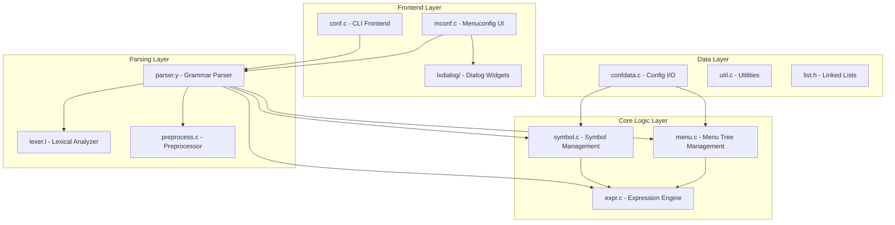
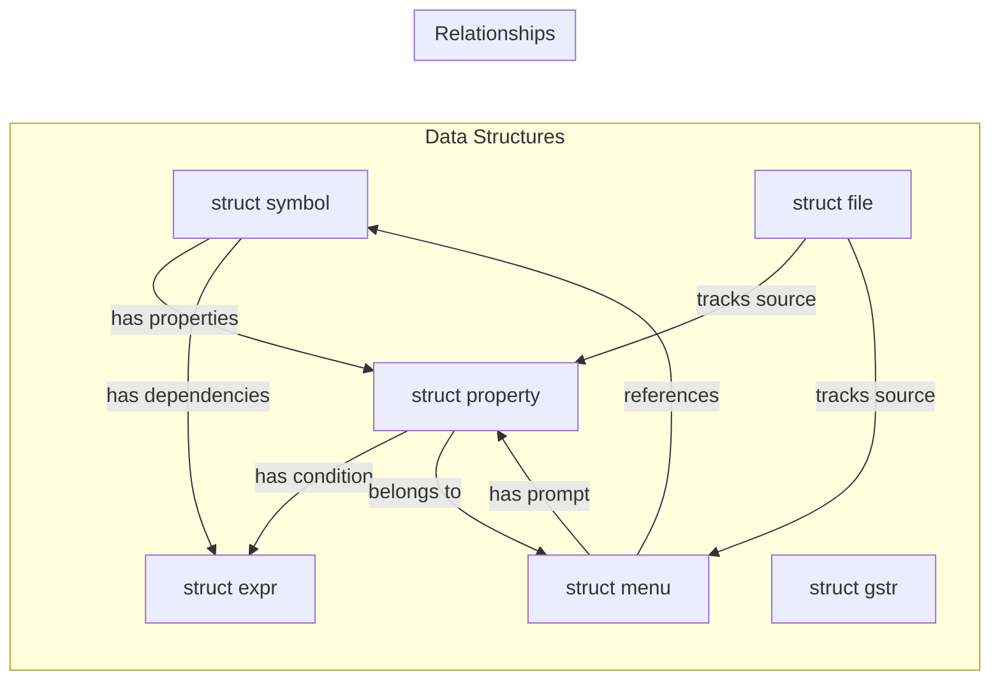
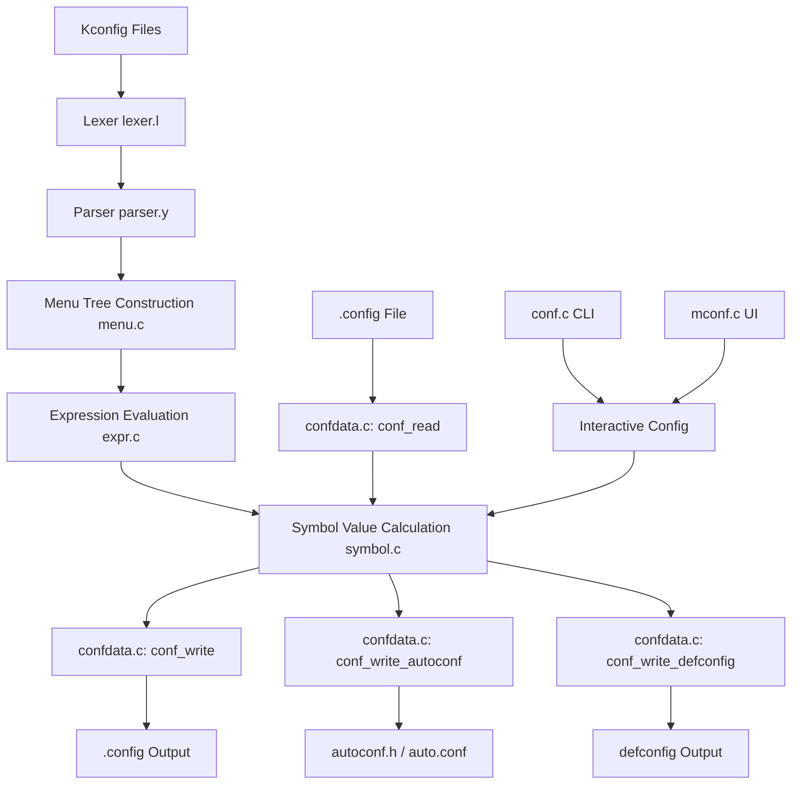
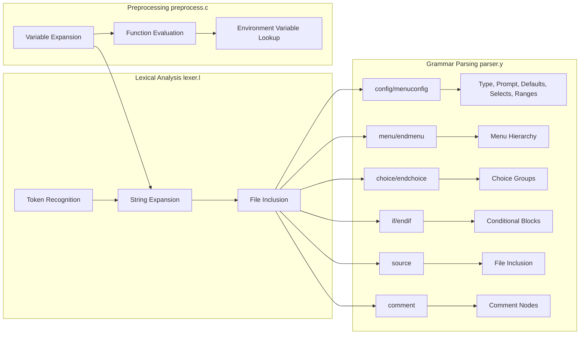
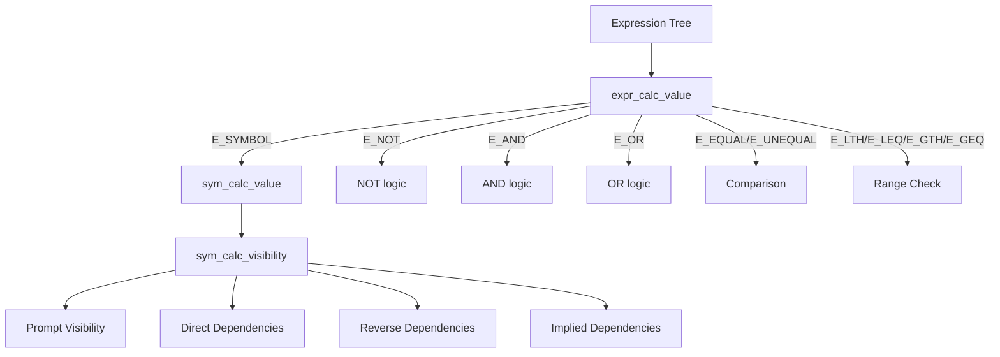
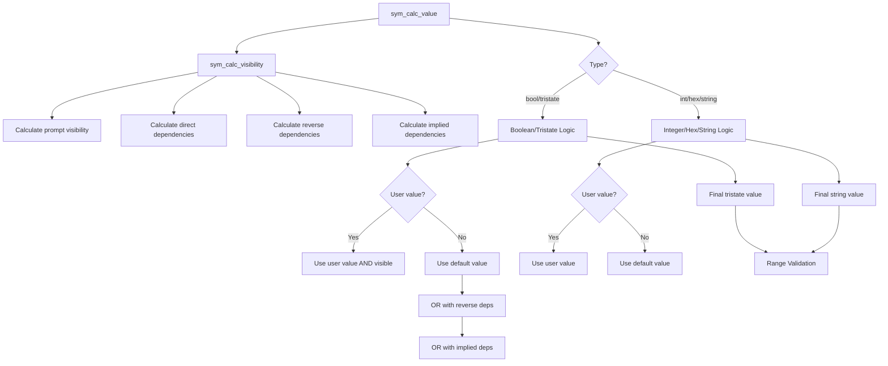
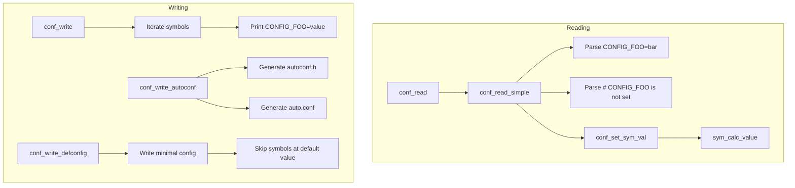
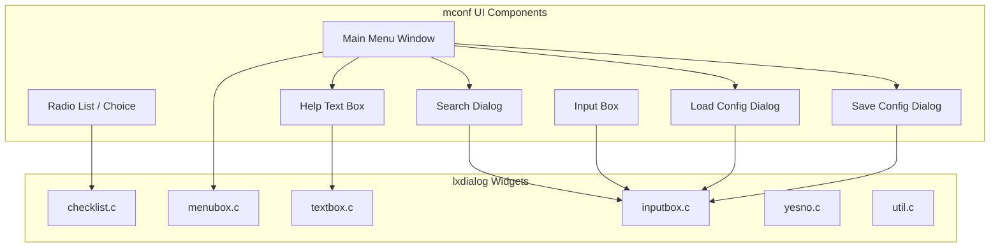
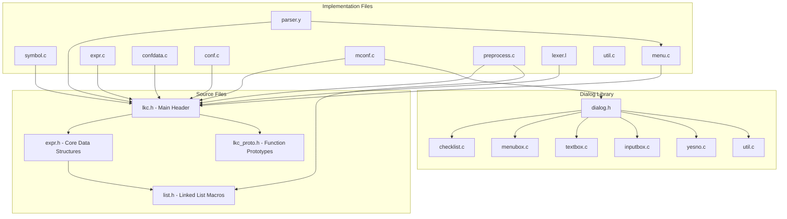

# Kconfig System

## Introduction

The Kconfig System is a configuration management tool adapted from the Linux kernel's Kconfig infrastructure. It provides a powerful, dependency-aware mechanism for configuring build-time options in the NEMU emulator and related projects. The system parses Kconfig definition files, manages configuration symbols with complex dependency relationships, and generates configuration outputs in multiple formats (`.config`, `autoconf.h`, etc.).

This module is located at `nemu/tools/kconfig/` and serves as the backbone for all build configuration decisions in the NEMU ecosystem.

---

## Architecture Overview

The Kconfig System is organized into several interconnected layers that work together to parse, evaluate, and output configuration data.



---

## Component Relationships



---

## Core Data Structures

### `struct symbol` (expr.h)

The central data structure representing a configuration option. Each symbol has a name, type, calculated value, user-defined values, visibility, and dependency information.

| Field | Type | Description |
|-------|------|-------------|
| `name` | `char *` | Symbol name (e.g., "FOO" for `config FOO`) |
| `type` | `enum symbol_type` | `S_BOOLEAN`, `S_TRISTATE`, `S_INT`, `S_HEX`, `S_STRING`, `S_UNKNOWN` |
| `curr` | `struct symbol_value` | The calculated (current) value |
| `def[S_DEF_COUNT]` | `struct symbol_value` | User values from different sources (`.config`, auto.conf, etc.) |
| `visible` | `tristate` | Upper bound on the tristate value the user can set |
| `flags` | `int` | `SYMBOL_*` flags (CONST, CHOICE, OPTIONAL, WRITE, etc.) |
| `prop` | `struct property *` | Linked list of properties |
| `dir_dep` | `struct expr_value` | Dependencies from enclosing menus, choices, and ifs |
| `rev_dep` | `struct expr_value` | Reverse dependencies (from `select` statements) |
| `implied` | `struct expr_value` | "Weak" reverse dependencies (from `imply` statements) |

### `struct menu` (expr.h)

Represents a node in the menu tree, as seen in menuconfig. Each symbol, menu, comment, or if-block gets a node.

| Field | Type | Description |
|-------|------|-------------|
| `next` | `struct menu *` | Next sibling at the same level |
| `parent` | `struct menu *` | Parent menu node |
| `list` | `struct menu *` | First child menu node |
| `sym` | `struct symbol *` | Associated symbol (NULL for menus, comments, ifs) |
| `prompt` | `struct property *` | The prompt text and type |
| `visibility` | `struct expr *` | `visible if` dependencies |
| `dep` | `struct expr *` | `depends on` and `if` dependencies |
| `flags` | `unsigned int` | `MENU_*` flags |
| `help` | `char *` | Help text |
| `file` | `struct file *` | Source file location |
| `lineno` | `int` | Line number in source file |

### `struct property` (expr.h)

Represents config options associated with a symbol (prompts, defaults, selects, ranges, etc.).

| Field | Type | Description |
|-------|------|-------------|
| `next` | `struct property *` | Next property in linked list |
| `type` | `enum prop_type` | `P_PROMPT`, `P_DEFAULT`, `P_SELECT`, `P_IMPLY`, `P_RANGE`, `P_CHOICE`, `P_COMMENT`, `P_MENU`, `P_SYMBOL` |
| `text` | `const char *` | Prompt text |
| `visible` | `struct expr_value` | Visibility condition |
| `expr` | `struct expr *` | The optional conditional part |
| `menu` | `struct menu *` | Associated menu node |
| `file` | `struct file *` | Source file |
| `lineno` | `int` | Line number |

### `struct expr` (expr.h)

Represents a logical or comparison expression used for dependencies and conditions.

| Field | Type | Description |
|-------|------|-------------|
| `type` | `enum expr_type` | `E_OR`, `E_AND`, `E_NOT`, `E_EQUAL`, `E_UNEQUAL`, `E_LTH`, `E_LEQ`, `E_GTH`, `E_GEQ`, `E_LIST`, `E_SYMBOL`, `E_RANGE` |
| `left` | `union expr_data` | Left operand (expr or symbol) |
| `right` | `union expr_data` | Right operand (expr or symbol) |

### `struct file` (expr.h)

Tracks source file information for error reporting and recursive inclusion detection.

| Field | Type | Description |
|-------|------|-------------|
| `next` | `struct file *` | Next file in global list |
| `parent` | `struct file *` | Parent file (for `source` inclusion) |
| `name` | `const char *` | File name |
| `lineno` | `int` | Current line number |

### `struct gstr` (lkc.h)

A growable string utility used for building help text, search results, and configuration output.

| Field | Type | Description |
|-------|------|-------------|
| `len` | `size_t` | Current allocated length |
| `s` | `char *` | The string content |
| `max_width` | `int` | Maximum line width (0 = no wrapping) |

---

## Data Flow



---

## Processing Pipeline

### 1. Parsing Phase

The parsing phase converts Kconfig definition files into an in-memory menu tree.



**Key parsing functions:**
- `conf_parse()` (parser.y:487): Entry point, initializes scanner, runs parser, finalizes menu tree
- `zconf_initscan()` (lexer.l:389): Initializes the flex scanner
- `zconf_nextfile()` (lexer.l:404): Handles `source` statements by pushing a new file buffer
- `menu_add_entry()` (menu.c:47): Creates a new menu node for a symbol
- `menu_add_prompt()` (menu.c:156): Adds a prompt property to the current entry
- `menu_add_dep()` (menu.c:107): Adds a dependency to the current entry
- `menu_finalize()` (menu.c:306): Propagates dependencies, creates automatic submenus, validates properties

### 2. Expression Evaluation

Expressions are evaluated to determine symbol visibility and values.



**Key expression functions:**
- `expr_alloc_symbol()` (expr.c:18): Creates a leaf expression node for a symbol
- `expr_alloc_and()` (expr.c:52): Creates an AND expression
- `expr_alloc_or()` (expr.c:59): Creates an OR expression
- `expr_calc_value()` (expr.c): Recursively evaluates an expression to a tristate value
- `expr_eliminate_dups()` (expr.c): Simplifies expressions by removing duplicate operands
- `expr_transform()` (expr.c): Transforms expressions for evaluation
- `expr_eliminate_eq()` (expr.c:221): Eliminates common operands between two expressions

### 3. Symbol Value Calculation

The symbol value calculation determines the final value of each configuration symbol.



**Key symbol functions:**
- `sym_calc_value()` (symbol.c:325): Main entry point for calculating a symbol's value
- `sym_calc_visibility()` (symbol.c:177): Calculates prompt visibility, direct/rev/implied dependencies
- `sym_choice_default()` (symbol.c:246): Finds the default symbol for a choice
- `sym_set_tristate_value()` (symbol.c:499): Sets a tristate value for a symbol
- `sym_set_string_value()` (symbol.c:643): Sets a string value for a symbol
- `sym_tristate_within_range()` (symbol.c:480): Checks if a tristate value is within valid range
- `sym_string_within_range()` (symbol.c:601): Checks if a string value is within valid range
- `sym_clear_all_valid()` (symbol.c:469): Invalidates all symbol values, triggering recalculation

### 4. Configuration I/O

Reading and writing configuration files.



**Key I/O functions:**
- `conf_read()` (confdata.c:513): Reads `.config` file and calculates all symbol values
- `conf_read_simple()` (confdata.c:350): Low-level config file reader
- `conf_write()` (confdata.c): Writes the full `.config` file
- `conf_write_autoconf()` (confdata.c): Generates `include/config/auto.conf` and `include/generated/autoconf.h`
- `conf_write_defconfig()` (confdata.c:751): Writes a minimal defconfig (only non-default values)
- `conf_set_sym_val()` (confdata.c:234): Sets a symbol value from a parsed config line

### 5. Frontend Modes

The `conf.c` frontend supports multiple configuration modes:

| Mode | Description |
|------|-------------|
| `oldaskconfig` | Interactive line-oriented configuration |
| `oldconfig` | Update existing config, ask only for new symbols |
| `syncconfig` | Silent update during build, generates auto.conf |
| `defconfig` | Load defaults from a defconfig file |
| `savedefconfig` | Save minimal config (only non-default values) |
| `allnoconfig` | Set all symbols to 'n' |
| `allyesconfig` | Set all symbols to 'y' |
| `allmodconfig` | Set all symbols to 'm' |
| `alldefconfig` | Set all symbols to their default values |
| `randconfig` | Randomize all symbol values |
| `listnewconfig` | List new symbols without prompting |
| `helpnewconfig` | List new symbols with help text |
| `olddefconfig` | Update config, set new symbols to defaults |
| `yes2modconfig` | Convert 'y' to 'm' where possible |
| `mod2yesconfig` | Convert 'm' to 'y' where possible |

---

## Preprocessing System

The preprocessor (`preprocess.c`) handles variable expansion and built-in function evaluation in Kconfig files.

### Variable Types

| Flavor | Syntax | Description |
|--------|--------|-------------|
| `VAR_RECURSIVE` | `=` | Recursively expanded (like make) |
| `VAR_SIMPLE` | `:=` | Simply expanded (expanded at definition time) |
| `VAR_APPEND` | `+=` | Append to existing variable |

### Built-in Functions

| Function | Arguments | Description |
|----------|-----------|-------------|
| `error-if` | 2 | Prints error and exits if first arg is 'y' |
| `filename` | 0 | Returns current file name |
| `info` | 1 | Prints message to stdout |
| `lineno` | 0 | Returns current line number |
| `shell` | 1 | Executes shell command and returns output |
| `warning-if` | 2 | Prints warning if first arg is 'y' |

### Environment Variables

The preprocessor also supports referencing environment variables via `$(VAR_NAME)`. All referenced environment variables are tracked and written to `auto.conf.cmd` for dependency tracking.

---

## Dialog UI System (mconf)

The `mconf.c` frontend provides a full-screen menu-driven configuration interface using the ncurses-based `lxdialog` library.



**Key mconf features:**
- Single menu mode (via `MENUCONFIG_MODE=single_menu`)
- Search functionality with regex support and jump-to-location
- Color themes (mono, blackbg, classic, bluetitle)
- Jump keys for quick navigation
- Help text display
- Load/save alternate configuration files

---

## Dependency Graph



---

## Key Algorithms

### Expression Simplification

The expression engine performs aggressive simplification to reduce complex dependency expressions:

1. **Identity elimination** (`expr_eliminate_yn`): Removes `y` and `n` operands (e.g., `expr && y` → `expr`, `expr || n` → `expr`)
2. **Common operand elimination** (`expr_eliminate_eq`): Removes operands common to two expressions being compared
3. **Duplicate elimination** (`expr_eliminate_dups`): Removes duplicate operands within a single expression
4. **Boolean transformation** (`expr_trans_bool`): Converts `FOO != n` to `FOO` for boolean symbols
5. **Join optimization** (`expr_join_or`, `expr_join_and`): Combines related comparisons (e.g., `(a='y') || (a='m')` → `(a!='n')`)

### Dependency Propagation

During `menu_finalize()`, dependencies are propagated from parent menus to child items:

1. Parent dependencies are ANDed with child dependencies
2. `select` statements add reverse dependencies to the selected symbol
3. `imply` statements add "weak" reverse dependencies
4. Choice values get special handling for tristate choices
5. Automatic submenus are created for symbols that depend on a preceding symbol

### Value Calculation Order

Symbol values are calculated in dependency order:

1. `modules_sym` is calculated first (if it exists)
2. Choice symbols are calculated before their choice values
3. Symbols referenced in defaults are calculated before the dependent symbol
4. The `SYMBOL_VALID` flag prevents infinite recursion

---

## Configuration Output Formats

### `.config` Format
```
#
# Automatically generated file; DO NOT EDIT.
# Main menu
#
CONFIG_FOO=y
CONFIG_BAR=42
# CONFIG_BAZ is not set
```

### `autoconf.h` Format
```c
/*
 * Automatically generated file; DO NOT EDIT.
 * Main menu
 */
#define CONFIG_FOO 1
#define CONFIG_BAR 42
```

### `auto.conf` Format (Make include)
```
CONFIG_FOO=y
CONFIG_BAR=42
```

### Defconfig Format (minimal)
```
CONFIG_FOO=y
CONFIG_BAR=42
```
(Only symbols with non-default values are included)

---

## References

- This module is used by the [NEMU Emulator](NEMU%20Emulator.md) for build configuration
- The Kconfig files processed by this system define options used across the [RT-Thread Kernel](RT-Thread%20Kernel.md) and [Device Drivers Framework](Device%20Drivers%20Framework.md)
- The configuration outputs influence the build of [Navy Apps](Navy%20Apps.md) and [AM Kernels](AM%20Kernels.md)
- The `lxdialog` library provides the terminal UI widgets for `mconf`
