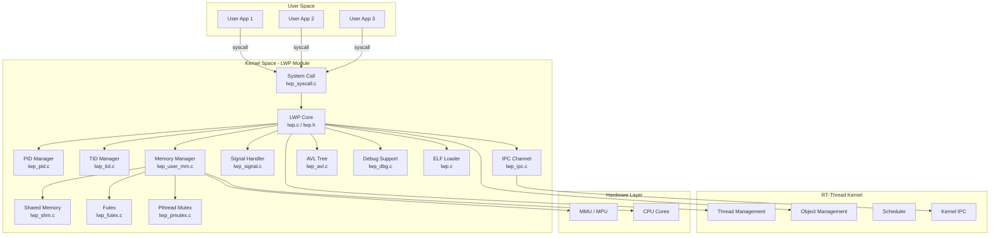
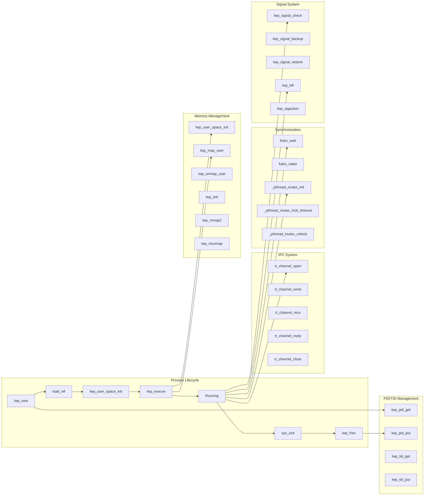
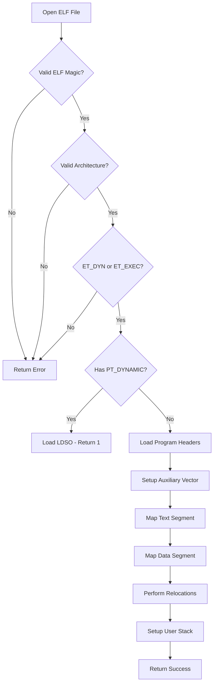
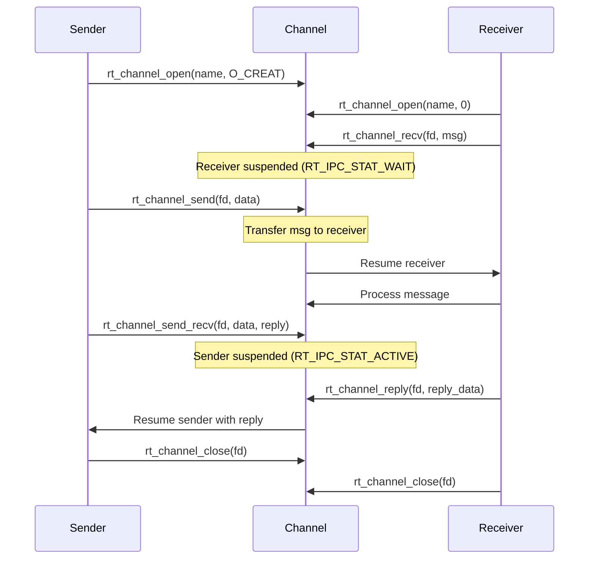
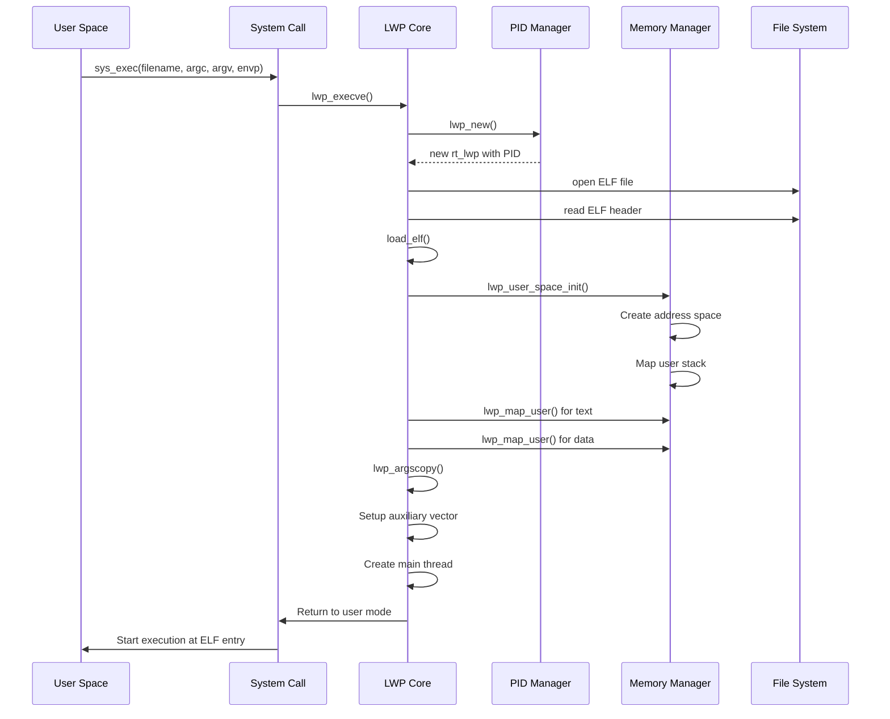
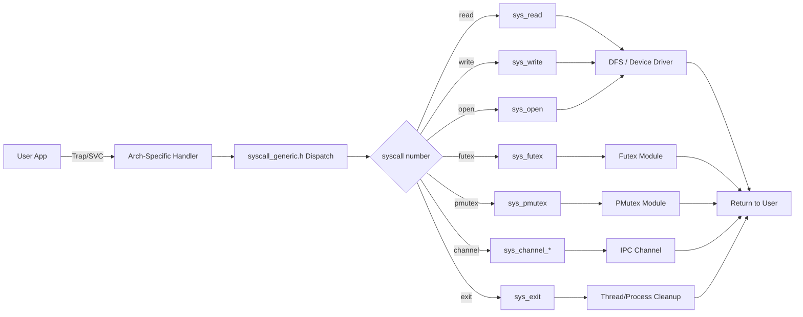

# LWP (Light Weight Process) Module

## Introduction

The **Light Weight Process (LWP)** module is a core component of the RT-Thread Smart operating system that provides process-level isolation and user-mode execution capabilities. It enables the system to run multiple independent user-space processes, each with its own virtual address space (when MMU is available), file descriptor table, signal handlers, and process identity (PID). The LWP module bridges the gap between RT-Thread's traditional real-time thread model and a full Unix-like process model, supporting features such as ELF binary loading, inter-process communication (IPC), shared memory, futex synchronization, signals, and system calls.

The LWP module is designed to work in two modes:
- **MMU mode**: Full virtual memory isolation between processes (RT-Smart)
- **MPU mode**: Memory protection unit-based isolation for systems without MMU

---

## Architecture Overview



---

## Core Data Structures

### `struct rt_lwp` - The Process Control Block

The central data structure representing a light-weight process. Each LWP has a unique PID, its own address space, file descriptors, signal handlers, and thread group.

```c
struct rt_lwp
{
    /* Memory management */
    size_t end_heap;                    // End of heap (MMU mode)
    rt_aspace_t aspace;                 // Address space (MMU mode)
    struct rt_lwp_objs *lwp_obj;        // Memory objects (MMU mode)
    struct rt_mpu_info mpu_info;        // MPU info (MPU mode)

    /* SMP support */
    int bind_cpu;                       // CPU affinity

    /* Process type */
    uint8_t lwp_type;                   // LWP_TYPE_FIX_ADDR or LWP_TYPE_DYN_ADDR

    /* Process hierarchy */
    struct rt_lwp *parent;              // Parent process
    struct rt_lwp *first_child;         // First child process
    struct rt_lwp *sibling;             // Sibling in process tree

    /* Process state */
    rt_list_t wait_list;                // Waiting threads (for waitpid)
    int32_t finish;                     // Process finished flag
    int lwp_ret;                        // Process return value

    /* Binary sections */
    void *text_entry;                   // Text section entry
    uint32_t text_size;                 // Text section size
    void *data_entry;                   // Data section entry
    uint32_t data_size;                 // Data section size

    /* Process identity */
    int ref;                            // Reference count
    void *args;                         // Process arguments
    uint32_t args_length;               // Arguments length
    pid_t pid;                          // Process ID
    pid_t __pgrp;                       // Process group
    pid_t tty_old_pgrp;                 // Old TTY process group
    pid_t session;                      // Session ID
    rt_list_t t_grp;                    // Thread group list

    /* Session and file system */
    int leader;                         // Session group leader flag
    struct dfs_fdtable fdt;             // File descriptor table
    char cmd[RT_NAME_MAX];              // Command name

    /* Signal handling */
    int sa_flags;
    lwp_sigset_t signal;                // Pending signals
    lwp_sigset_t signal_mask;           // Signal mask
    int signal_mask_bak;                // Backup signal mask
    rt_uint32_t signal_in_process;      // Signal being processed
    lwp_sighandler_t signal_handler[_LWP_NSIG]; // Signal handlers

    /* Object management */
    struct lwp_avl_struct *object_root; // User object AVL tree
    struct rt_mutex object_mutex;       // Object mutex
    struct rt_user_context user_ctx;    // User context

    /* TTY and wait queue */
    struct rt_wqueue wait_queue;        // Wait queue for console
    struct tty_struct *tty;             // Associated TTY

    /* Address search and working directory */
    struct lwp_avl_struct *address_search_head; // Addressed object search
    char working_directory[DFS_PATH_MAX];       // Working directory

    /* Debug */
    int debug;
    int background;
    uint32_t bak_first_ins;             // Backup first instruction

    /* ASID support */
    uint64_t generation;
    unsigned int asid;
};
```

### Supporting Data Structures

| Structure | File | Description |
|-----------|------|-------------|
| `struct lwp_avl_struct` | `lwp_avl.h` | AVL tree node for balanced binary search trees |
| `struct rt_channel_msg` | `lwp_ipc.h` | IPC channel message with sender, type, and payload union |
| `struct rt_ipc_msg` | `lwp_ipc.c` | Internal IPC message with reply tracking |
| `struct rt_channel` | `lwp_ipc_internal.h` | IPC channel object with suspend lists and state |
| `struct rt_futex` | `lwp_futex.c` | Fast userspace mutex with waiting thread list |
| `struct rt_pmutex` | `lwp_pmutex.c` | POSIX mutex wrapper (normal/recursive/errorcheck) |
| `struct rt_umutex` | `lwp_pmutex.c` | Userspace mutex definition (musl compatible) |
| `struct lwp_shm_struct` | `lwp_shm.c` | Shared memory segment descriptor |
| `struct process_aux` | `lwp.h` | Auxiliary vector for ELF process startup |
| `struct lwp_args_info` | `lwp.h` | Process arguments information |
| `struct dbg_ops_t` | `lwp.h` | Debug operations interface |
| `struct map_range` | `lwp.c` | Memory range tracking for ELF loading |
| `struct rt_lwp_objs` | `lwp.h` | Memory object container for LWP |

---

## Component Relationships



---

## Detailed Component Analysis

### 1. Process Lifecycle Management (`lwp.c`, `lwp.h`)

The core process lifecycle is managed through:

- **`lwp_new()`**: Allocates a new `struct rt_lwp`, assigns a PID, initializes process lists, object mutex, and wait queue.
- **`lwp_free()`**: Releases all process resources including file descriptors, user objects, data/text sections, child processes, and TTY association.
- **`lwp_execve()`**: Loads and executes an ELF binary, creating the user-space process.
- **`lwp_terminate()`**: Marks a process as finished and cleans up.
- **`lwp_self()`**: Returns the current thread's associated LWP.

#### ELF Loading Process

The `load_elf()` function in `lwp.c` handles:
1. Validating ELF magic and header
2. Checking architecture (32/64-bit)
3. Detecting dynamic executables (PT_DYNAMIC) for LDSO loading
4. Loading program headers
5. Setting up auxiliary vector (AT_PAGESZ, AT_RANDOM, AT_PHDR, AT_PHNUM, AT_PHENT, AT_EXECFN)
6. Mapping text and data segments into user space
7. Performing ELF relocations



### 2. PID Management (`lwp_pid.c`, `lwp_pid.h`)

Manages process IDs using an AVL tree for efficient lookup:

- **`lwp_pid_get()`**: Allocates a new PID (1-9999), reusing freed IDs.
- **`lwp_pid_put()`**: Releases a PID back to the free pool.
- **`lwp_from_pid()`**: Looks up an LWP by PID.
- **`lwp_to_pid()`**: Returns the PID of an LWP.
- **`lwp_name2pid()`**: Finds a process by name.
- **`waitpid()`**: Implements the POSIX `waitpid()` system call.
- **`list_process()`**: Lists all running processes (Finsh command).

### 3. Thread ID Management (`lwp_tid.c`)

Manages thread IDs (TIDs) for user-space threads:

- **`lwp_tid_get()`**: Allocates a new TID.
- **`lwp_tid_put()`**: Releases a TID.
- **`lwp_tid_get_thread()`**: Gets the thread associated with a TID.
- **`lwp_tid_set_thread()`**: Associates a thread with a TID.

### 4. IPC Channel System (`lwp_ipc.c`, `lwp_ipc.h`, `lwp_ipc_internal.h`)

Provides inter-process communication through named channels:

**Channel Types:**
- `RT_CHANNEL_RAW`: Raw data transfer
- `RT_CHANNEL_BUFFER`: Buffer-based transfer
- `RT_CHANNEL_FD`: File descriptor transfer

**Channel States:**
- `RT_IPC_STAT_IDLE`: No suspended threads
- `RT_IPC_STAT_WAIT`: Suspended receivers exist
- `RT_IPC_STAT_ACTIVE`: Suspended senders exist

**Key Operations:**
- `rt_channel_open()` / `rt_raw_channel_open()`: Create or open a named channel
- `rt_channel_send()` / `rt_raw_channel_send()`: Send a message (no reply)
- `rt_channel_send_recv()` / `rt_raw_channel_send_recv()`: Send and wait for reply
- `rt_channel_recv()` / `rt_raw_channel_recv()`: Receive a message
- `rt_channel_reply()` / `rt_raw_channel_reply()`: Reply to a sender
- `rt_channel_close()` / `rt_raw_channel_close()`: Close a channel



### 5. Signal System (`lwp_signal.c`, `lwp_signal.h`)

Implements POSIX-like signal handling for user processes:

**Signal Operations:**
- **`lwp_signal_check()`**: Checks if there are pending signals for the current thread/process.
- **`lwp_signal_backup()`**: Backs up user context and prepares signal delivery.
- **`lwp_signal_restore()`**: Restores user context after signal handling.
- **`lwp_sighandler_get()`**: Gets the handler for a specific signal.
- **`lwp_sighandler_set()`**: Sets the handler for a specific signal.
- **`lwp_sigprocmask()`**: Manipulates the signal mask (SIG_BLOCK, SIG_UNBLOCK, SIG_SETMASK).
- **`lwp_sigaction()`**: Examines or changes signal action.
- **`lwp_kill()`**: Sends a signal to a process by PID.
- **`lwp_thread_kill()`**: Sends a signal to a specific thread.

**Signal Suspend Check:**
The `lwp_suspend_sigcheck()` function determines if a thread can be suspended based on:
- `RT_INTERRUPTIBLE`: Can be interrupted by any signal
- `RT_KILLABLE`: Can only be interrupted by SIGKILL
- `RT_UNINTERRUPTIBLE`: Cannot be interrupted

### 6. System Call Interface (`lwp_syscall.c`, `lwp_syscall.h`)

Provides the system call interface between user space and kernel:

**File Operations:**
- `sys_read()`, `sys_write()`, `sys_open()`, `sys_close()`, `sys_lseek()`, `sys_ioctl()`, `sys_fstat()`, `sys_poll()`

**Process Operations:**
- `sys_exit()`, `sys_exec()`, `sys_kill()`, `sys_getpid()`, `sys_getpriority()`, `sys_setpriority()`

**IPC Operations:**
- `sys_channel_open()`, `sys_channel_close()`, `sys_channel_send()`, `sys_channel_send_recv()`, `sys_channel_reply()`, `sys_channel_recv()`

**Synchronization:**
- `sys_sem_create/delete/take/release()`
- `sys_mutex_create/delete/take/release()`
- `sys_event_create/delete/send/recv()`
- `sys_mb_create/delete/send/recv()` (mailbox)
- `sys_mq_create/delete/send/urgent/recv()` (message queue)

**Thread Operations:**
- `sys_thread_create()`, `sys_thread_delete()`, `sys_thread_startup()`, `sys_thread_self()`

**Memory Operations (MMU mode):**
- `sys_futex()`, `sys_pmutex()`, `sys_cacheflush()`

**Socket Operations (when SAL enabled):**
- Socket option conversion between musl interface and kernel implementation

### 7. Memory Management (`lwp_user_mm.c`, `lwp_user_mm.h`)

Manages user-space virtual memory (MMU mode):

**Key Functions:**
- **`lwp_user_space_init()`**: Initializes the user address space, maps the user stack.
- **`lwp_unmap_user_space()`**: Frees the user address space.
- **`lwp_map_user()`**: Maps memory into user space with page alignment.
- **`lwp_unmap_user()`**: Unmaps memory from user space.
- **`lwp_map_user_phy()`**: Maps physical memory into user space.
- **`lwp_brk()`**: Implements the `brk()` system call for heap management.
- **`lwp_mmap2()`**: Implements the `mmap2()` system call.
- **`lwp_munmap()`**: Implements the `munmap()` system call.
- **`lwp_get_from_user()`**: Safely copies data from user space to kernel.
- **`lwp_put_to_user()`**: Safely copies data from kernel to user space.
- **`lwp_user_accessable()`**: Checks if a user-space address range is accessible.
- **`lwp_aspace_switch()`**: Switches the active address space during context switch.

**Page Fault Handling:**
The `_user_do_page_fault()` function handles page faults for user-space mappings:
- For text segments: Shares pages from the source address space (copy-on-write)
- For data segments: Allocates new pages and copies data from source
- For anonymous mappings: Uses the dummy mapper for zero-filled pages

### 8. Shared Memory (`lwp_shm.c`, `lwp_shm.h`)

Implements System V-style shared memory:

**Key Functions:**
- **`lwp_shmget()`**: Creates or opens a shared memory segment by key.
- **`lwp_shmrm()`**: Removes a shared memory segment.
- **`lwp_shmat()`**: Attaches a shared memory segment to the process address space.
- **`lwp_shmdt()`**: Detaches a shared memory segment.
- **`lwp_shminfo()`**: Gets information about a shared memory segment.
- **`lwp_shm_ref_inc/dec()`**: Increments/decrements the reference count.

Shared memory segments are managed using:
- A static array of `struct lwp_shm_struct`
- Two AVL trees for lookup by key and by physical address
- A free list for efficient allocation/deallocation

### 9. Futex (`lwp_futex.c`)

Implements fast userspace mutex for efficient synchronization:

- **`futex_create()`**: Creates a futex associated with a userspace address.
- **`futex_wait()`**: Blocks the thread until the futex value changes.
- **`futex_wake()`**: Wakes up waiting threads.
- **`sys_futex()`**: System call entry point for futex operations (FUTEX_WAIT, FUTEX_WAKE).

Futexes are stored in an AVL tree keyed by the userspace address, allowing fast lookup.

### 10. POSIX Mutex (`lwp_pmutex.c`)

Implements pthread mutex support bridging userspace and kernel:

**Mutex Types:**
- `PMUTEX_NORMAL`: Non-recursive (uses semaphore internally)
- `PMUTEX_RECURSIVE`: Recursive (uses kernel mutex)
- `PMUTEX_ERRORCHECK`: Error-checking (detects deadlock)

**Operations:**
- `sys_pmutex()`: System call dispatcher (PMUTEX_INIT, PMUTEX_LOCK, PMUTEX_UNLOCK, PMUTEX_DESTROY)
- `_pthread_mutex_init()`: Initializes a userspace mutex
- `_pthread_mutex_lock_timeout()`: Locks with optional timeout
- `_pthread_mutex_unlock()`: Unlocks
- `_pthread_mutex_destroy()`: Destroys

### 11. AVL Tree (`lwp_avl.c`, `lwp_avl.h`)

Provides balanced binary search tree implementation used throughout the LWP module:

- **`lwp_avl_insert()`**: Inserts a node into the AVL tree.
- **`lwp_avl_remove()`**: Removes a node from the AVL tree.
- **`lwp_avl_find()`**: Finds a node by key.
- **`lwp_avl_traversal()`**: Traverses the tree with a callback.
- **`lwp_map_find_first()`**: Finds the first (smallest key) node.

Used for: PID lookup, TID lookup, user object tracking, shared memory lookup, futex lookup, pmutex lookup.

### 12. Debug Support (`lwp_dbg.c`)

Provides debugging infrastructure for user-space processes:

- **`dbg_register()`**: Registers architecture-specific debug operations.
- **`dbg_get_ins()`**: Gets the current instruction for single-stepping.
- **`dbg_activate/deactivate_step()`**: Controls single-step mode.
- **`dbg_check_event()`**: Checks for debug events.
- **`gdb_server_channel()`**: Gets the GDB server IPC channel.
- **`dbg_attach_req()`**: Handles debug attach requests.

### 13. Session Management (`lwp_setsid.c`)

Implements the `setsid()` system call for creating new sessions:

- Creates a new session with the calling thread as session leader
- Sets the process group ID
- Detaches from the controlling TTY

---

## Data Flow Diagrams

### Process Creation Flow



### System Call Data Flow



---

## Configuration Options

The LWP module is configured through Kconfig (`components/lwp/Kconfig`):

| Option | Default | Description |
|--------|---------|-------------|
| `RT_USING_LWP` | y (if SMART) | Enable LWP module |
| `RT_LWP_MAX_NR` | 30 | Maximum number of processes |
| `LWP_TASK_STACK_SIZE` | 16384 | Kernel stack size for LWP threads |
| `RT_CH_MSG_MAX_NR` | 1024 | Maximum number of channel messages |
| `LWP_CONSOLE_INPUT_BUFFER_SIZE` | 1024 | Console input buffer size |
| `LWP_TID_MAX_NR` | 64 | Maximum number of thread IDs |
| `LWP_ENABLE_ASID` | y (Cortex-A) | Enable ASID feature |
| `RT_LWP_SHM_MAX_NR` | 64 | Maximum shared memory segments (MMU) |
| `RT_LWP_MPU_MAX_NR` | 2 | Maximum MPU regions (MPU) |
| `RT_LWP_USING_SHM` | y | Enable shared memory (MPU) |
| `LWP_UNIX98_PTY` | n | Enable Unix98 PTY support |

---

## Dependencies and Integration

### Internal Dependencies

| Component | Depends On | Purpose |
|-----------|------------|---------|
| LWP Core | RT-Thread Kernel | Thread, scheduler, object, timer, IPC primitives |
| LWP Core | DFS (File System) | File operations, ELF loading |
| LWP Core | MM (Memory Management) | Address space, page management |
| LWP Core | libc (musl/newlib) | C library for user space |
| LWP IPC | RT-Thread Kernel IPC | Semaphore, mutex for synchronization |
| LWP Signal | RT-Thread Signal | Kernel signal infrastructure |
| LWP MMU | MMU Driver | Hardware MMU operations |
| LWP MPU | MPU Driver | Hardware MPU operations |

### External Module References

- [RT-Thread Kernel](RT-Thread%20Kernel.md) - Core kernel services (threads, scheduler, IPC)
- [File System (DFS)](File%20System%20%28DFS%29.md) - File system interface for ELF loading and file operations
- [Memory Management](Memory%20Management.md) - Address space and page management
- [Device Drivers Framework](Device%20Drivers%20Framework.md) - TTY and console device support

---

## Architecture-Specific Implementations

The LWP module supports multiple architectures through the `arch/` directory:

| Architecture | Directory | Features |
|-------------|-----------|----------|
| ARM (Cortex-A) | `arch/arm/cortex-a/` | MMU, ASID, user space init |
| ARM (Cortex-M) | `arch/arm/cortex-m3/4/7/` | MPU support |
| ARM (ARM926) | `arch/arm/arm926/` | MMU support |
| AArch64 | `arch/aarch64/cortex-a/` | 64-bit MMU support |
| RISC-V (RV64) | `arch/risc-v/rv64/` | 64-bit MMU support |
| x86 (i386) | `arch/x86/i386/` | MMU support |

Common architecture operations defined in `lwp_arch_comm.h`:
- `arch_elf_reloc()`: Architecture-specific ELF relocation
- `arch_crt_start_umode()`: Enter user mode for the first time
- `arch_set_thread_context()`: Set up thread context for user mode
- `arch_user_space_init/free()`: Initialize/free user address space
- `arch_expand_user_stack()`: Expand user stack on page fault
- `arch_set_thread_area()`: Set thread-local storage register

---

## Error Handling

The LWP module uses standard RT-Thread error codes and POSIX errno values:

| Error Code | Description |
|-----------|-------------|
| `RT_EOK` | Success |
| `-RT_ERROR` | General error |
| `-RT_ENOMEM` | Out of memory |
| `-RT_EIO` | I/O error |
| `-RT_EINVAL` | Invalid argument |
| `-RT_ETIMEOUT` | Operation timed out |
| `-RT_EINTR` | Interrupted by signal |
| `-EFAULT` | Bad user-space address |
| `-EPERM` | Permission denied |
| `-ESRCH` | No such process |
| `-EAGAIN` | Resource temporarily unavailable |
| `-EBUSY` | Device or resource busy |
| `-ENOSYS` | Function not implemented |

---

## Debugging and Monitoring

The LWP module provides several debugging capabilities:

1. **Finsh Commands:**
   - `list_process()`: Lists all running processes
   - `list_shm()`: Lists shared memory segments
   - `dbg`: Debug command interface

2. **Debug Operations (`dbg_ops_t`):**
   - Single-step execution
   - Breakpoint management
   - GDB server integration via IPC channels
   - Debug event checking

3. **Logging:**
   - Uses ulog framework with tag "LWP", "LWP_PID", "SYSCALL", "LwP"
   - Configurable log levels (default: WARNING)

---

## Summary

The LWP module is a comprehensive process management subsystem for RT-Thread Smart that provides:

- **Process isolation** through MMU/MPU hardware
- **POSIX-compatible API** via system calls
- **Inter-process communication** through named channels
- **Synchronization primitives** including futex and pthread mutex
- **Shared memory** for efficient data sharing
- **Signal handling** for asynchronous event notification
- **ELF binary loading** for executing user-space applications
- **Debug infrastructure** for development and troubleshooting

It transforms RT-Thread from a pure RTOS into a capable multi-process operating system while maintaining real-time characteristics for kernel threads.
