# Memory Management Module

## Introduction

The Memory Management (MM) module is a core subsystem of the RT-Thread operating system that provides comprehensive memory management services across multiple layers of abstraction. It encompasses both **kernel-level memory allocators** (small memory, slab, memheap, mempool) for dynamic memory allocation within the kernel, and **virtual memory management** (address spaces, page allocator, MMU management) for systems with Memory Management Units (MMU) — primarily used in RT-Thread Smart for process isolation.

The module is designed to be highly configurable and scalable, supporting:
- **MCU-based systems**: Simple heap allocators (small memory, memheap) and fixed-size memory pools
- **MPU-based systems**: Slab allocator for efficient object caching
- **MMU-based systems (RT-Thread Smart)**: Full virtual address space management with page-based allocation, demand paging, copy-on-write (COW), and memory-mapped files

---

## Architecture Overview

The Memory Management module is organized into three distinct layers, each building upon the services of the layer below.

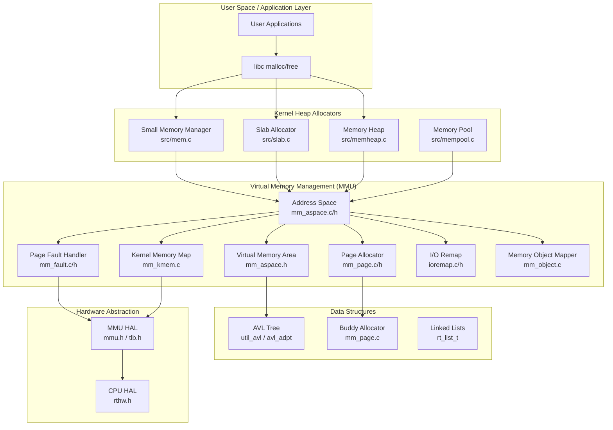

### Component Relationships

| Component | File(s) | Role |
|-----------|---------|------|
| **Small Memory** | `src/mem.c` | dlmalloc-like best-fit heap allocator for small systems |
| **Slab Allocator** | `src/slab.c` | Object-caching allocator for frequent same-size allocations |
| **Memory Heap** | `src/memheap.c` | Multiple independent heap regions with mutex protection |
| **Memory Pool** | `src/mempool.c` | Fixed-size block allocator with thread suspension |
| **Address Space** | `components/mm/mm_aspace.c/h` | Virtual address space management (MMU mode) |
| **Virtual Memory Area** | `components/mm/mm_aspace.h` | Contiguous virtual memory region descriptor |
| **Page Allocator** | `components/mm/mm_page.c/h` | Buddy system physical page allocator |
| **Page Fault Handler** | `components/mm/mm_fault.c/h` | MMU page fault resolution |
| **Kernel Memory Map** | `components/mm/mm_kmem.c` | Kernel virtual-to-physical mapping |
| **Memory Object** | `components/mm/mm_object.c` | Default page fault handler (dummy mapper) |
| **I/O Remap** | `components/mm/ioremap.c/h` | I/O memory remapping |
| **AVL Adapter** | `components/mm/avl_adpt.c/h` | AVL tree wrapper for varea management |
| **MM Flags** | `components/mm/mm_flag.h` | Memory mapping flag definitions |

---

## 1. Kernel Heap Allocators

RT-Thread provides four distinct heap allocation algorithms, selectable at compile time via Kconfig options. The system heap (`rt_malloc`/`rt_free`) is backed by one of these algorithms.

### 1.1 Small Memory Manager (`RT_USING_SMALL_MEM`)

The small memory manager is a dlmalloc-derived best-fit allocator, suitable for resource-constrained MCU systems.

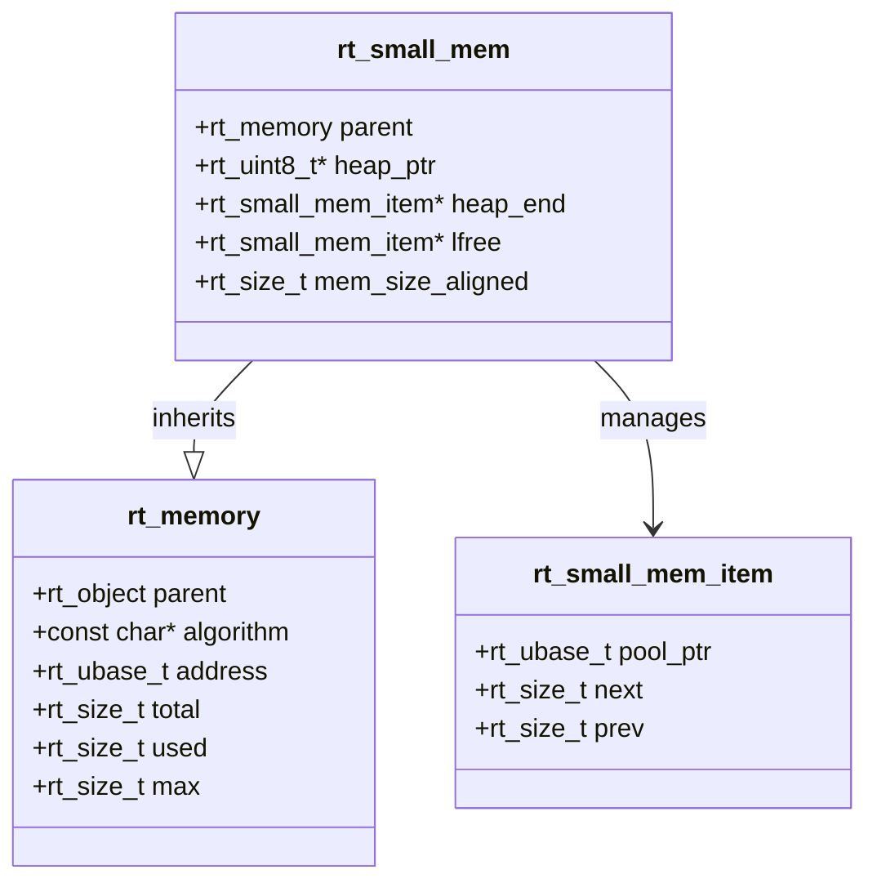

**Key Characteristics:**
- **Algorithm**: Best-fit with immediate coalescing on free (`plug_holes()`)
- **Minimum block size**: 12 bytes (32-bit) / 24 bytes (64-bit)
- **Overhead**: One `rt_small_mem_item` header per allocated block (2 pointers + 1 flag)
- **Magic number**: `0x1ea0` for integrity checking
- **Memory tracing**: Optional thread name tracking per allocation (`RT_USING_MEMTRACE`)

**Key APIs:**
- `rt_smem_init()` / `rt_smem_detach()`: Initialize/detach a small memory heap
- `rt_smem_alloc()`: Allocate a block (best-fit search from `lfree`)
- `rt_smem_free()`: Free a block with coalescing
- `rt_smem_realloc()`: Resize an allocated block

**Allocation Flow:**
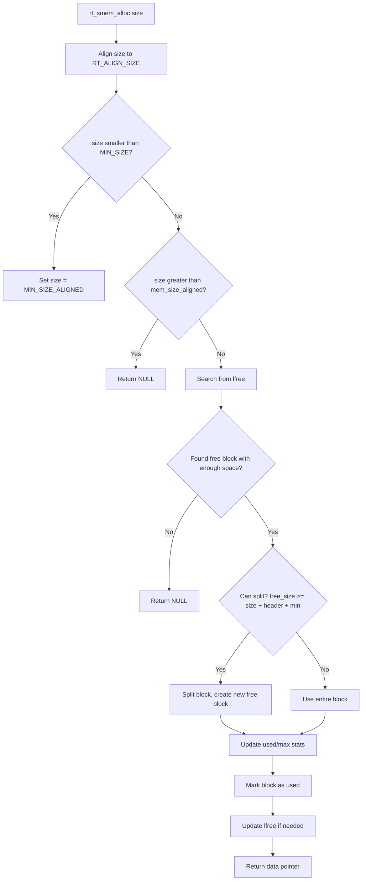

### 1.2 Slab Allocator (`RT_USING_SLAB`)

The slab allocator is derived from the DragonFly BSD kernel and is optimized for frequent allocation and deallocation of objects of similar sizes. It reduces fragmentation by grouping objects into zones.

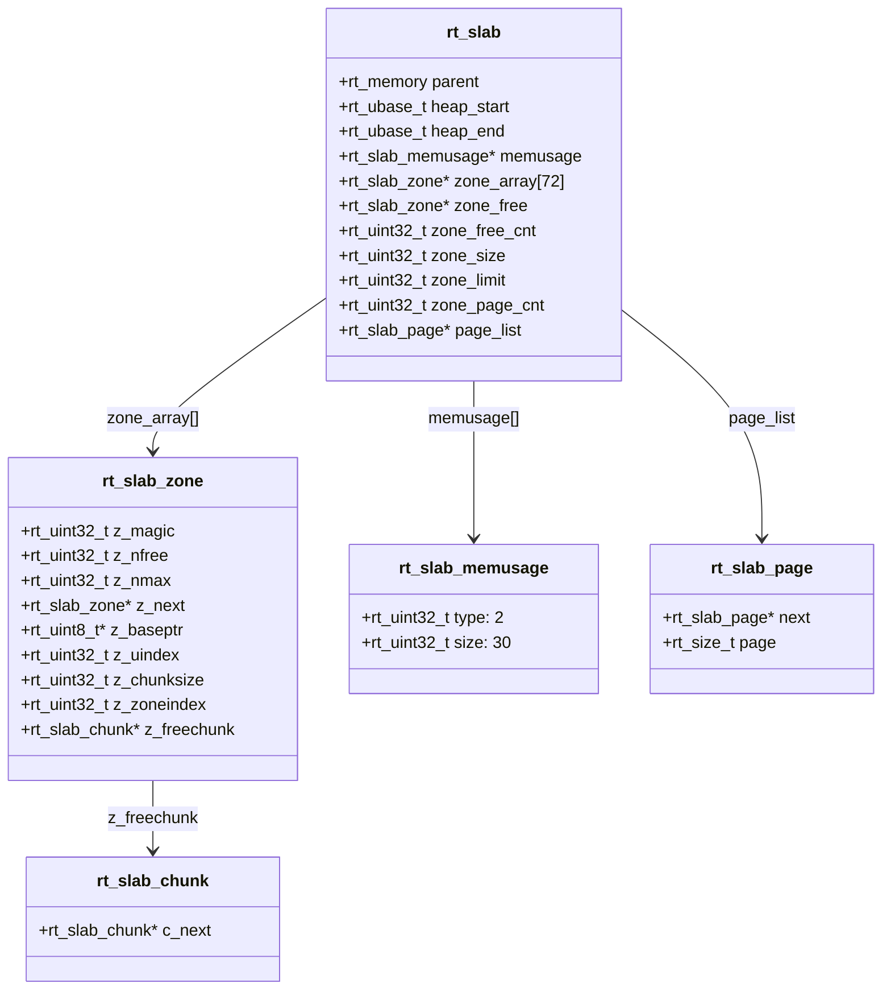

**Zone Size Classes (72 zones total):**

| Size Range | Chunk Size | Number of Zones |
|------------|------------|-----------------|
| 0–127 | 8 | 16 |
| 128–255 | 16 | 8 |
| 256–511 | 32 | 8 |
| 512–1023 | 64 | 8 |
| 1024–2047 | 128 | 8 |
| 2048–4095 | 256 | 8 |
| 4096–8191 | 512 | 8 |
| 8192–16383 | 1024 | 8 |

**Key Characteristics:**
- **Zone size**: Auto-tuned between 32KB and 128KB based on heap size
- **Zone limit**: Allocations >= zone_limit (max 16KB) go directly to page allocator
- **Page types**: `PAGE_TYPE_FREE` (0x00), `PAGE_TYPE_SMALL` (0x01), `PAGE_TYPE_LARGE` (0x02)
- **Per-page metadata**: `rt_slab_memusage` array tracks page type and allocation size
- **Page allocator**: Embedded buddy-like allocator for slab pages

**Key APIs:**
- `rt_slab_init()` / `rt_slab_detach()`: Initialize/detach a slab heap
- `rt_slab_alloc()`: Allocate from slab (zone-based for small, page-based for large)
- `rt_slab_free()`: Free memory back to slab
- `rt_slab_realloc()`: Resize an allocation
- `rt_slab_page_alloc()` / `rt_slab_page_free()`: Low-level page allocation

### 1.3 Memory Heap (`RT_USING_MEMHEAP`)

The memory heap manager supports multiple independent heap regions, each protected by a semaphore for thread safety.

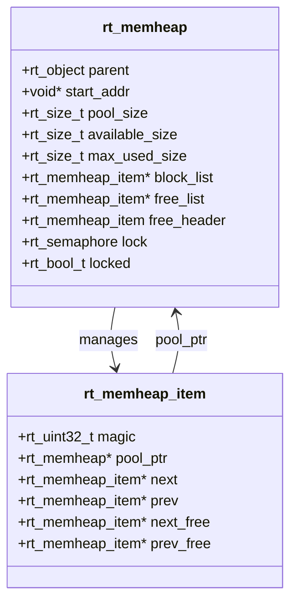

**Key Characteristics:**
- **Magic number**: `0x1ea01ea0` for integrity checking
- **Free list**: Doubly linked list of free blocks with header sentinel
- **Block list**: Doubly linked list of all blocks (used + free)
- **Splitting**: Blocks are split when remaining space >= header + minimum allocation
- **Coalescing**: Adjacent free blocks are merged during free
- **Thread safety**: Semaphore-based locking with external lock support

**Key APIs:**
- `rt_memheap_init()` / `rt_memheap_detach()`: Initialize/detach a memheap
- `rt_memheap_alloc()`: Allocate from a specific heap
- `rt_memheap_free()`: Free to a specific heap
- `rt_memheap_realloc()`: Resize an allocation (can expand into adjacent free space)

### 1.4 Memory Pool (`RT_USING_MEMPOOL`)

The memory pool provides fixed-size block allocation with thread suspension support.

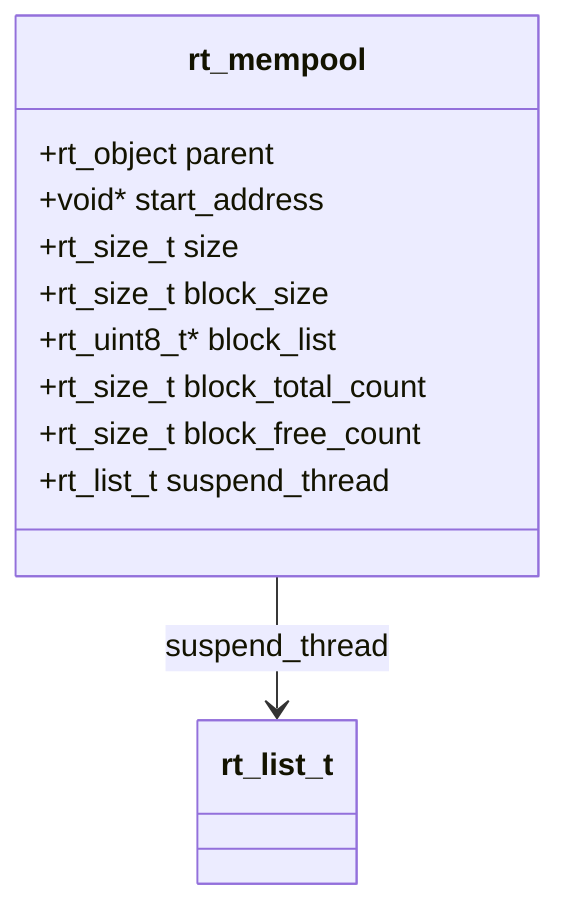

**Key Characteristics:**
- **Fixed block size**: All blocks are identical size (aligned to `RT_ALIGN_SIZE`)
- **Free list**: Singly linked list embedded in free blocks (each free block stores pointer to next)
- **Thread suspension**: Threads waiting for a block are suspended on `suspend_thread` list
- **Timeout support**: Configurable wait time via `rt_mp_alloc(time)`
- **Static/Dynamic**: Can be statically initialized (`rt_mp_init`) or dynamically created (`rt_mp_create`)

**Key APIs:**
- `rt_mp_init()` / `rt_mp_detach()`: Static initialization/detachment
- `rt_mp_create()` / `rt_mp_delete()`: Dynamic creation/deletion (heap-backed)
- `rt_mp_alloc()`: Allocate a block (with timeout)
- `rt_mp_free()`: Return a block to the pool

---

## 2. Virtual Memory Management (MMU Mode)

The virtual memory management subsystem is used in RT-Thread Smart to provide process isolation through MMU-based virtual addressing. It manages address spaces, virtual memory areas (vareas), physical page frames, and page faults.

### 2.1 Address Space (`rt_aspace`)

An address space represents a virtual address range with an associated page table. The kernel has its own address space (`rt_kernel_space`), and each user process has its own.

```c
struct rt_aspace
{
    void *start;                    // Start of virtual address range
    rt_size_t size;                 // Size of virtual address range
    void *page_table;               // MMU page table pointer
    mm_spinlock pgtbl_lock;         // Page table lock
    struct _aspace_tree tree;       // AVL tree of vareas
    struct rt_mutex bst_lock;       // BST (AVL tree) lock
    rt_uint64_t asid;               // Address Space ID
};
```

**Key APIs:**
- `rt_aspace_create()` / `rt_aspace_init()`: Create/initialize an address space
- `rt_aspace_delete()` / `rt_aspace_detach()`: Delete/detach an address space
- `rt_aspace_map()`: Map a memory object into the address space
- `rt_aspace_map_phy()`: Map physical memory into the address space
- `rt_aspace_unmap()`: Remove mappings in a range
- `rt_aspace_control()`: Change MMU attributes of a mapping
- `rt_aspace_load_page()` / `rt_aspace_offload_page()`: Load/offload pages
- `rt_aspace_traversal()`: Traverse all vareas in an address space

### 2.2 Virtual Memory Area (`rt_varea`)

A varea represents a contiguous virtual memory region within an address space. It is the fundamental unit of memory mapping.

```c
struct rt_varea
{
    void *start;                    // Start virtual address
    rt_size_t size;                 // Size of the region
    rt_size_t offset;               // Offset within backing store (in pages)
    rt_size_t attr;                 // MMU attributes (cache, read/write, etc.)
    rt_size_t flag;                 // Mapping flags (MMF_*)
    struct rt_aspace *aspace;       // Parent address space
    struct rt_mem_obj *mem_obj;     // Backing memory object
    struct _aspace_node node;       // AVL tree node (embedded)
    struct rt_page *frames;         // Allocated page frames
    void *data;                     // Private data
};
```

**Varea Flags (`mm_flag.h`):**

| Flag | Description |
|------|-------------|
| `MMF_MAP_PRIVATE` | Private mapping (COW potential) |
| `MMF_COW` | Copy-on-Write mapping |
| `MMF_MAP_FIXED` | Fixed address mapping (POSIX MAP_FIXED) |
| `MMF_PREFETCH` | Pre-allocate and map pages immediately |
| `MMF_HUGEPAGE` | Use huge pages if available |
| `MMF_TEXT` | Text (code) segment mapping |
| `MMF_STATIC_ALLOC` | Statically allocated varea (no free on uninstall) |
| `MMF_NONLOCKED` | Pages can be swapped out (reserved for future) |
| `MMF_REQUEST_ALIGN` | Request specific alignment for the mapping |

### 2.3 Memory Object (`rt_mem_obj`)

A memory object defines the behavior of a varea through callback functions. It acts as a backing store interface.

```c
struct rt_mem_obj
{
    void (*hint_free)(rt_mm_va_hint_t hint);           // Modify mapping hint
    void (*on_page_fault)(struct rt_varea *varea,      // Handle page fault
                          struct rt_aspace_fault_msg *msg);
    void (*on_varea_open)(struct rt_varea *varea);     // Varea opened
    void (*on_varea_close)(struct rt_varea *varea);    // Varea closed
    void (*on_page_offload)(struct rt_varea *varea,    // Offload pages
                            void *vaddr, rt_size_t size);
    const char *(*get_name)(rt_varea_t varea);         // Get varea name
};
```

**Built-in Memory Objects:**

| Object | Description |
|--------|-------------|
| `rt_mm_dummy_mapper` | Default mapper: allocates pages on fault, frees on close |
| `mm_page_mapper` | Master Page Record mapper: handles MPR page faults |

### 2.4 Page Allocator (Buddy System)

The page allocator uses a **buddy system** algorithm to manage physical page frames. It maintains two sets of free lists: one for low memory (below 4GB) and one for high memory (above 4GB).

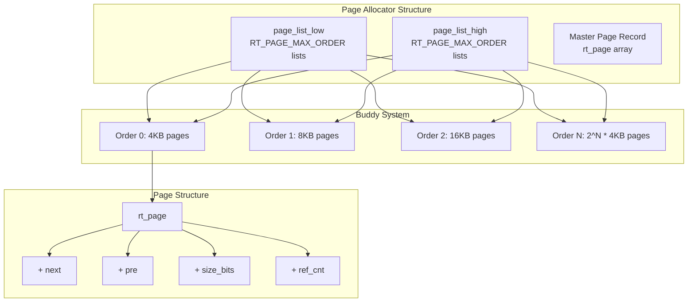

**Key Characteristics:**
- **Page size**: 4KB (`ARCH_PAGE_SIZE`)
- **Maximum order**: `RT_PAGE_MAX_ORDER` (typically 11, supporting up to 8MB contiguous allocation)
- **Master Page Record (MPR)**: A contiguous array of `rt_page` structures, one per physical page frame
- **Dual lists**: Separate free lists for low (≤4GB) and high (>4GB) physical memory
- **Reference counting**: Each page group has a reference count for shared mappings
- **Page leak tracing**: Optional debug feature to track unfreed pages

**Key APIs:**
- `rt_page_init()`: Initialize the page allocator with a memory region
- `rt_page_install()`: Install additional page frames at runtime
- `rt_pages_alloc()` / `rt_pages_alloc_ext()`: Allocate contiguous pages
- `rt_pages_free()`: Free pages (decrements ref count, returns to buddy on zero)
- `rt_page_ref_inc()` / `rt_page_ref_get()`: Increment/get page reference count
- `rt_page_addr2page()` / `rt_page_page2addr()`: Convert between page struct and address
- `rt_page_bits()`: Calculate order bits for a given size

**Allocation Flow:**
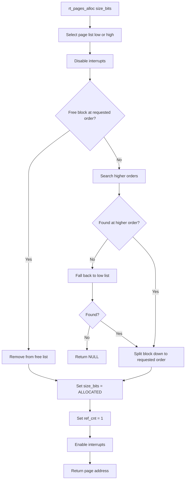

### 2.5 Page Fault Handling

The page fault handler resolves MMU page faults by delegating to the varea's memory object.

```c
struct rt_aspace_fault_msg
{
    enum rt_mm_fault_op fault_op;       // READ, WRITE, or EXECUTE
    enum rt_mm_fault_type fault_type;   // ACCESS_FAULT, PAGE_FAULT, BUS_ERROR
    rt_size_t off;                      // Offset within backing store
    void *fault_vaddr;                  // Faulting virtual address
    struct rt_mm_fault_res response;    // Response from handler
};

struct rt_mm_fault_res
{
    void *vaddr;                        // Physical/virtual address of resolved page
    rt_size_t size;                     // Size of resolved region
    int status;                         // MM_FAULT_STATUS_OK, OK_MAPPED, or UNRECOVERABLE
};
```

**Fault Resolution Flow:**
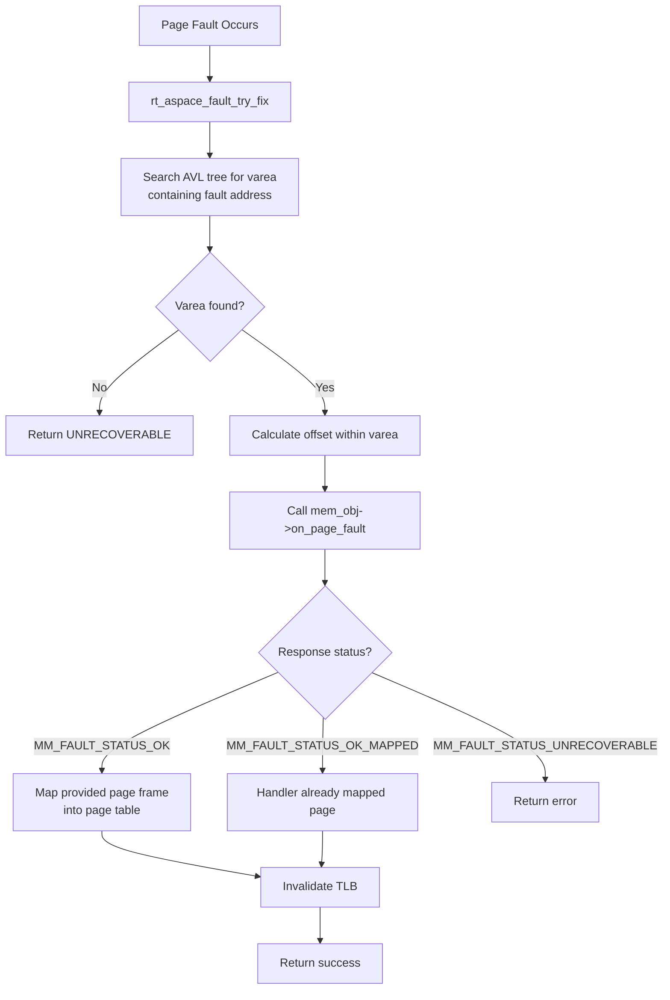

### 2.6 Kernel Memory Mapping

The kernel memory mapping subsystem manages the kernel's virtual address space (`rt_kernel_space`).

**Key APIs:**
- `rt_kmem_pvoff()` / `rt_kmem_pvoff_set()`: Get/set the physical-to-virtual offset
- `rt_kmem_map_phy()`: Map physical memory into kernel space
- `rt_kmem_v2p()`: Convert kernel virtual address to physical address
- `rt_kmem_list()`: List all vareas in kernel space (Finsh command: `list_kmem`)

---

## 3. Data Flow and Usage Patterns

### 3.1 Kernel Heap Allocation Flow

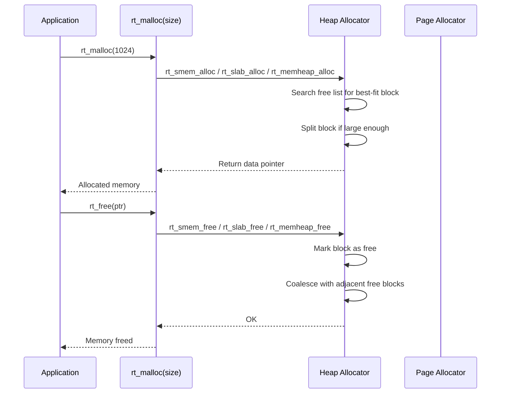

### 3.2 Virtual Memory Mapping Flow

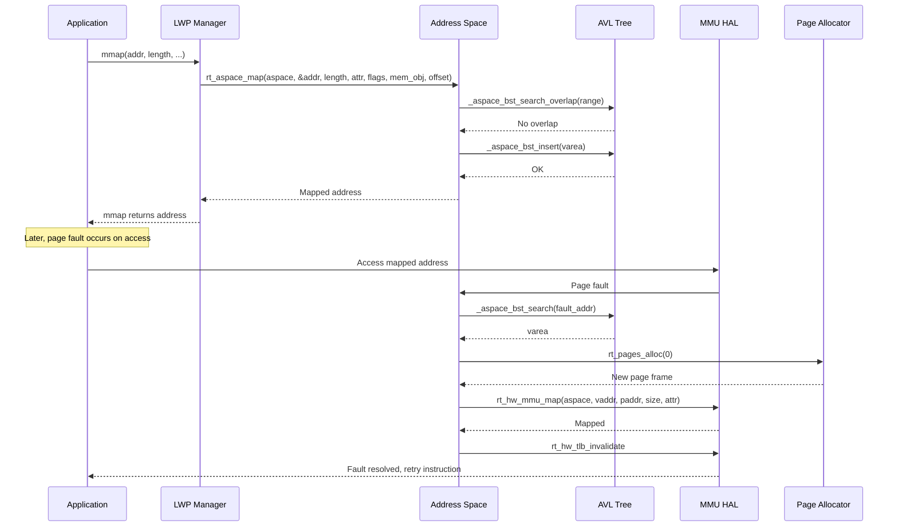

### 3.3 Page Fault Resolution Flow

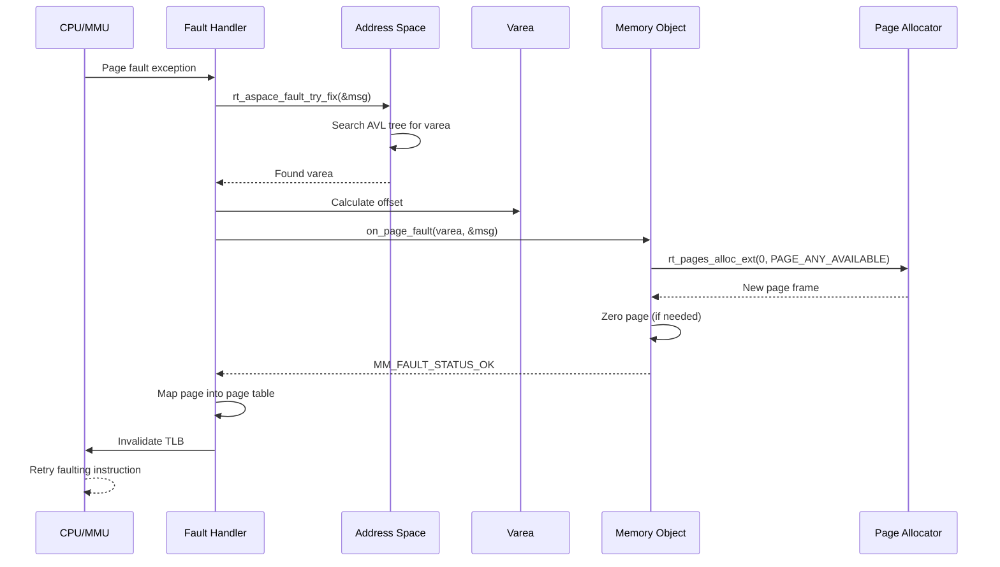

---

## 4. Integration with Other Modules

### 4.1 LWP (Light Weight Process)

The LWP module is the primary consumer of the virtual memory management subsystem. Each user process has its own address space (`lwp->aspace`) and uses the MM APIs for:
- **Process creation**: `lwp_user_space_init()` creates and initializes the address space
- **ELF loading**: `load_elf()` maps text and data segments using `rt_aspace_map()`
- **Heap management**: `lwp_brk()` extends the process heap
- **Memory mapping**: `lwp_mmap2()` / `lwp_munmap()` implement POSIX mmap/munmap
- **Shared memory**: `lwp_shm.c` uses the page allocator for shared memory segments
- **Copy-on-Write**: Page faults on private mappings trigger COW handling

For more details, see [LWP (Light Weight Process)](LWP%20%28Light%20Weight%20Process%29.md).

### 4.2 AVL Tree

The AVL tree (`util_avl`) is the core data structure for organizing vareas within an address space. The `avl_adpt.c/h` adapter provides BST operations (search, insert, remove) specifically tailored for address space management.

For more details, see [AVL Tree](AVL%20Tree.md).

### 4.3 VMM (Virtual Machine Manager)

The VMM module uses the MM subsystem for managing guest physical memory and I/O mappings.

For more details, see [VMM (Virtual Machine Manager)](VMM%20%28Virtual%20Machine%20Manager%29.md).

### 4.4 Device Drivers

Device drivers use the kernel heap allocators (`rt_malloc`/`rt_free`) for dynamic memory allocation, and the I/O remap functions (`ioremap.h`) for mapping device memory into the kernel address space.

---

## 5. Configuration Options

The memory management subsystem is highly configurable via Kconfig:

| Option | Description | Default |
|--------|-------------|---------|
| `RT_USING_HEAP` | Enable heap allocators | Enabled |
| `RT_USING_SMALL_MEM` | Small memory manager | Enabled (if no SLAB) |
| `RT_USING_SLAB` | Slab allocator | Disabled |
| `RT_USING_MEMHEAP` | Multiple memory heaps | Disabled |
| `RT_USING_MEMPOOL` | Memory pool support | Disabled |
| `RT_USING_MEMTRACE` | Memory allocation tracing | Disabled |
| `RT_MM_PAGE_SIZE` | Page size (4096) | 4096 |
| `RT_PAGE_MAX_ORDER` | Maximum buddy order | 11 |
| `RT_KERNEL_MALLOC` | Custom kernel malloc macro | `rt_malloc` |
| `RT_KERNEL_FREE` | Custom kernel free macro | `rt_free` |

---

## 6. Performance Considerations

### Heap Allocator Comparison

| Allocator | Best For | Fragmentation | Speed | Overhead |
|-----------|----------|---------------|-------|----------|
| **Small Memory** | General purpose, small systems | Medium (best-fit) | Medium | Low (12-24 bytes/block) |
| **Slab** | Frequent same-size allocations | Low (zone-based) | Fast | Medium (zone headers) |
| **MemHeap** | Multiple independent heaps | Medium | Medium | Low (header per block) |
| **MemPool** | Fixed-size blocks, real-time | None | Very fast | Low (1 pointer/block) |

### Virtual Memory Performance Tips

1. **Use `MMF_PREFETCH`** for performance-critical mappings to avoid page fault latency
2. **Use huge pages** (`MMF_HUGEPAGE`) for large contiguous mappings to reduce TLB pressure
3. **Minimize TLB invalidations** by batching operations when possible
4. **Use `rt_aspace_map_static()`** when the varea is pre-allocated to avoid malloc overhead
5. **The buddy allocator** provides O(log n) allocation and O(1) free for power-of-2 sizes

---

## 7. Debugging and Diagnostics

### Finsh Commands

| Command | Description |
|---------|-------------|
| `list_mem` | List memory usage statistics |
| `list_memheap` | List all memheap objects |
| `list_page` | List free page frames by order |
| `list_kmem` | List kernel virtual memory areas |
| `rt_page_leak_trace_start` | Start page leak tracing |
| `rt_page_leak_trace_stop` | Stop page leak tracing and report leaks |

### Memory Statistics

The `rt_memory` base structure tracks:
- `total`: Total managed memory size
- `used`: Currently allocated memory
- `max`: Peak memory usage (high watermark)

---

## 8. Related Documentation

- [RT-Thread Kernel](RT-Thread%20Kernel.md) — Core kernel types and infrastructure
- [LWP (Light Weight Process)](LWP%20%28Light%20Weight%20Process%29.md) — Process-level memory management
- [AVL Tree](AVL%20Tree.md) — Data structure for varea organization
- [VMM (Virtual Machine Manager)](VMM%20%28Virtual%20Machine%20Manager%29.md) — Virtual machine memory management
- [FAL (Flash Abstraction Layer)](FAL%20%28Flash%20Abstraction%20Layer%29.md) — Flash memory abstraction
