# NEMU Emulator

## Introduction

NEMU (NJU Emulator) is a **full-system instruction-level emulator** designed for educational purposes, developed at Nanjing University. It serves as the core simulation platform in the "Yan Shi Yuan Xi" (一生一芯) project, capable of emulating multiple instruction set architectures (ISAs) including **x86, MIPS32, RISC-V (32/64-bit), and LoongArch32r**.

NEMU operates as an **interpreted emulator** — it fetches, decodes, and executes guest instructions one by one using a software interpreter engine. It provides a complete virtual hardware platform including CPU, memory management unit (MMU), and various peripheral devices (serial, timer, VGA, keyboard, audio, disk, SD card). The emulator is equipped with a powerful **Simple Debugger (SDB)** for interactive debugging, **differential testing (DiffTest)** for verification against reference designs (QEMU, Spike, KVM), and multiple tracing facilities for instruction-level, memory-level, function-level, and device-level debugging.

---

## Architecture Overview

NEMU follows a layered architecture that separates ISA-specific logic from the common emulation infrastructure:

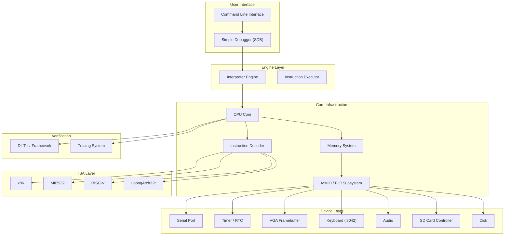

---

## Component Breakdown

### 1. Main Entry Point (`nemu-main.c`)

The entry point initializes the monitor and starts the execution engine:

```c
int main(int argc, char *argv[]) {
#ifdef CONFIG_TARGET_AM
    am_init_monitor();
#else
    init_monitor(argc, argv);
#endif
    engine_start();
    return is_exit_status_bad();
}
```

Two initialization paths exist:
- **Native mode** (`CONFIG_TARGET_NATIVE_ELF`): Full initialization with argument parsing, SDB, and DiffTest support
- **AM mode** (`CONFIG_TARGET_AM`): Simplified initialization for running as an Abstract Machine application

### 2. Monitor (`src/monitor/monitor.c`)

The monitor orchestrates the initialization sequence:

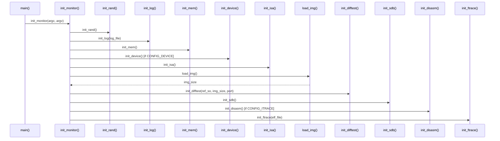

### 3. CPU Core (`src/cpu/cpu-exec.c`)

The CPU execution loop is the heart of the emulator:

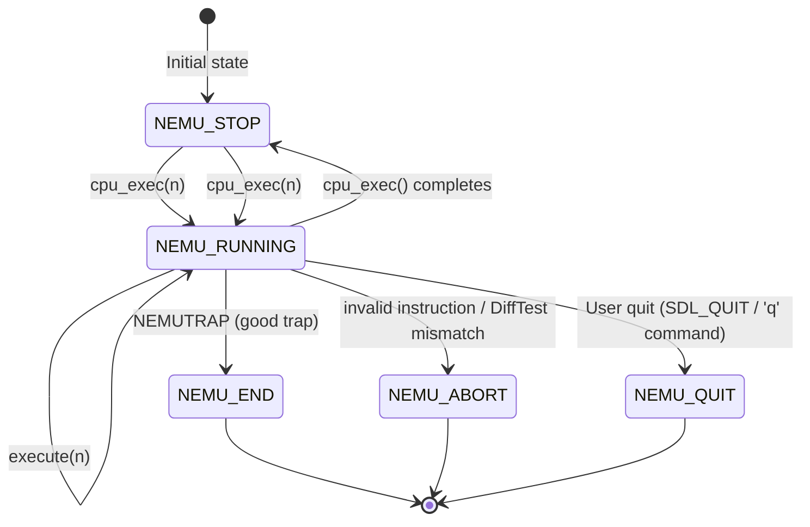

The `exec_once()` function performs a single instruction execution cycle:

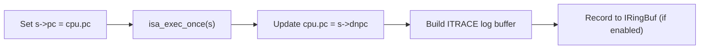

The `execute(n)` loop runs `n` instructions, calling `trace_and_difftest()` after each instruction to log traces and perform differential testing.

### 4. Instruction Decode (`include/cpu/decode.h`)

The `Decode` structure carries instruction execution context:

```c
typedef struct Decode {
    vaddr_t pc;       // current PC
    vaddr_t snpc;     // static next PC (sequential)
    vaddr_t dnpc;     // dynamic next PC (branch target)
    ISADecodeInfo isa; // ISA-specific decode info
    char logbuf[128];  // ITRACE log buffer
} Decode;
```

The **pattern matching mechanism** (`INSTPAT` macro) provides a declarative way to decode instructions using bit-pattern matching:

```c
#define INSTPAT(pattern, ...) do {
    uint64_t key, mask, shift;
    pattern_decode(pattern, STRLEN(pattern), &key, &mask, &shift);
    if ((((uint64_t)INSTPAT_INST(s) >> shift) & mask) == key) {
        INSTPAT_MATCH(s, ##__VA_ARGS__);
        goto *(__instpat_end);
    }
} while (0)
```

### 5. ISA Abstraction Layer (`include/isa.h`)

The ISA layer provides a uniform interface for all supported architectures:

| Interface | Description |
|-----------|-------------|
| `init_isa()` | ISA-specific initialization |
| `isa_exec_once(Decode *s)` | Execute one instruction |
| `isa_mmu_check(vaddr, len, type)` | Check if MMU translation is needed |
| `isa_mmu_translate(vaddr, len, type)` | Perform address translation |
| `isa_raise_intr(NO, epc)` | Raise an interrupt/exception |
| `isa_query_intr()` | Query pending interrupts |
| `isa_reg_display()` | Display register state |
| `isa_reg_str2val(name, success)` | Convert register name to value |
| `isa_difftest_checkregs(ref_r, pc)` | Compare registers for DiffTest |

**Supported ISAs:**

| ISA | CPU State | Decode Info | Features |
|-----|-----------|-------------|----------|
| **x86** | `x86_CPU_state` (8 GPRs + PC) | `x86_ISADecodeInfo` (variable-length inst) | 32-bit, AT&T syntax disassembly |
| **MIPS32** | `mips32_CPU_state` (32 GPRs + PC) | `mips32_ISADecodeInfo` (fixed 32-bit inst) | 32 registers |
| **RISC-V 32/64** | `riscv32/64_CPU_state` (16/32 GPRs + CSR + PC) | `riscv32/64_ISADecodeInfo` (fixed 32-bit inst) | RV32E/RV32I, CSR support |
| **LoongArch32r** | `loongarch32r_CPU_state` (32 GPRs + PC) | `loongarch32r_ISADecodeInfo` (fixed 32-bit inst) | 32 registers |

### 6. Memory System

#### Physical Memory (`src/memory/paddr.c`)

The physical memory is a contiguous array (`pmem`) mapped from `CONFIG_MBASE` to `CONFIG_MBASE + CONFIG_MSIZE - 1`:

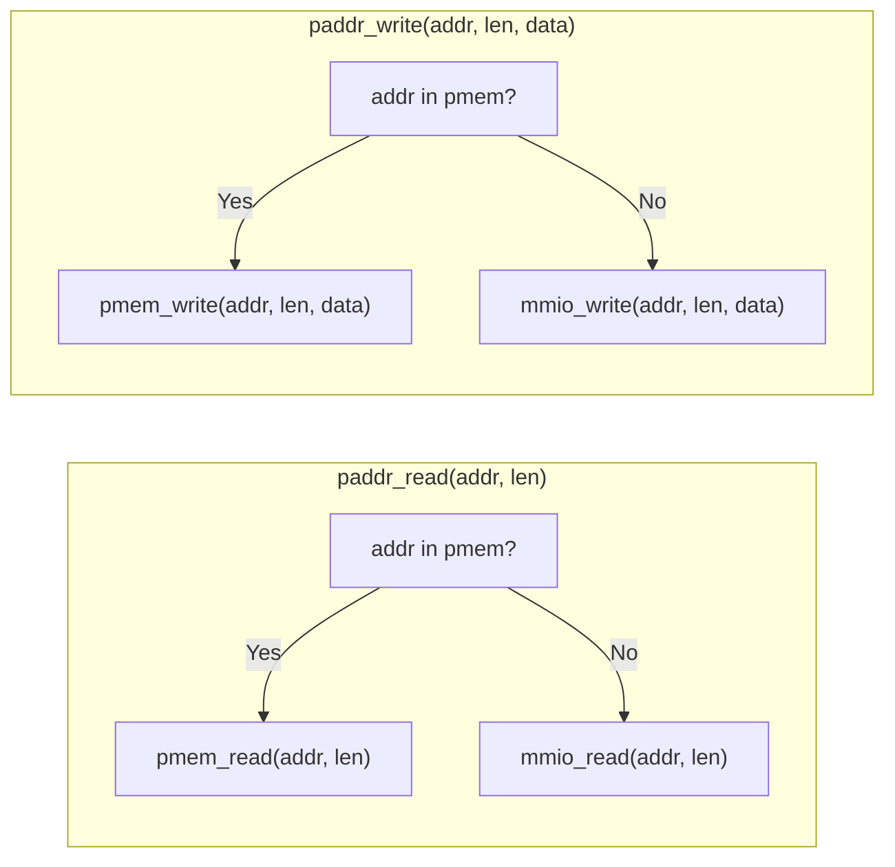

Key functions:
- `guest_to_host(paddr)` / `host_to_guest(haddr)`: Convert between guest physical addresses and host virtual addresses
- `in_pmem(addr)`: Check if address falls within physical memory range
- `paddr_read/write`: Route to either physical memory or MMIO based on address

#### Virtual Memory (`src/memory/vaddr.c`)

Currently, virtual memory is a pass-through to physical memory (direct mapping):

```c
word_t vaddr_ifetch(vaddr_t addr, int len) { return paddr_read(addr, len); }
word_t vaddr_read(vaddr_t addr, int len)   { return paddr_read(addr, len); }
void vaddr_write(vaddr_t addr, int len, word_t data) { paddr_write(addr, len, data); }
```

The `isa_mmu_check` macro is defined as `MMU_DIRECT` for all current ISAs, meaning no address translation is performed.

### 7. Device Subsystem

#### I/O Mapping Framework (`src/device/io/`)

NEMU supports two types of I/O:

| Type | Description | Address Space | Map Registration |
|------|-------------|---------------|------------------|
| **MMIO** (Memory-Mapped I/O) | Devices mapped into physical address space | Physical address range | `add_mmio_map()` |
| **Port I/O** (PIO) | x86-style port I/O | 16-bit port address space | `add_pio_map()` |

The `IOMap` structure defines a device region:

```c
typedef struct {
    const char *name;
    paddr_t low;
    paddr_t high;
    void *space;           // backing storage
    io_callback_t callback; // read/write side-effect handler
} IOMap;
```

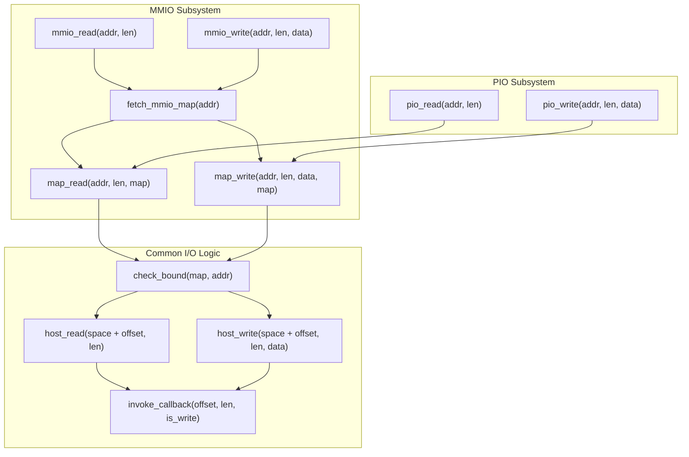

#### Device List

| Device | File | Registers | Description |
|--------|------|-----------|-------------|
| **Serial** | `serial.c` | 1 byte (data) | 16550-compatible UART, outputs to stderr |
| **Timer/RTC** | `timer.c` | 2 x 32-bit (RTC value) | Real-time clock, returns microseconds since boot |
| **VGA** | `vga.c` | 2 x 32-bit (control) + framebuffer | VGA framebuffer, SDL2 display |
| **Keyboard** | `keyboard.c` | 1 x 32-bit (data) | i8042 PS/2 keyboard controller |
| **Audio** | `audio.c` | 6 x 32-bit (control) + sound buffer | Audio playback via SDL2 |
| **SD Card** | `sdcard.c` | 21 x 32-bit (SDHCI registers) | MMC/SD card controller with file backend |
| **Disk** | `disk.c` | - | Placeholder for IDE disk |
| **Interrupt** | `intr.c` | - | Device interrupt controller (placeholder) |

#### Device Update Cycle

The `device_update()` function is called after each instruction execution:

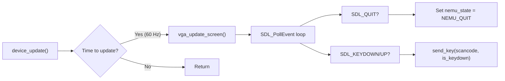

### 8. Simple Debugger (SDB)

The SDB provides an interactive command-line interface for debugging:

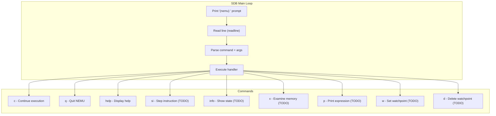

#### Expression Evaluation (`expr.c`)

The expression evaluator uses POSIX regex for tokenization:

```c
typedef struct token {
    int type;
    char str[32];
} Token;

static struct rule {
    const char *regex;
    int token_type;
} rules[] = {
    {" +", TK_NOTYPE},    // spaces
    {"\\+", '+'},         // plus
    {"==", TK_EQ},        // equal
    // ... more rules
};
```

#### Watchpoints (`watchpoint.c`)

A pool-based watchpoint system with linked list management:

```c
#define NR_WP 32
typedef struct watchpoint {
    int NO;
    struct watchpoint *next;
    // TODO: Add expression/value members
} WP;

static WP wp_pool[NR_WP] = {};
static WP *head = NULL, *free_ = NULL;
```

### 9. Differential Testing (DiffTest)

DiffTest compares NEMU's execution against a reference design (QEMU, Spike, or KVM) after each instruction:

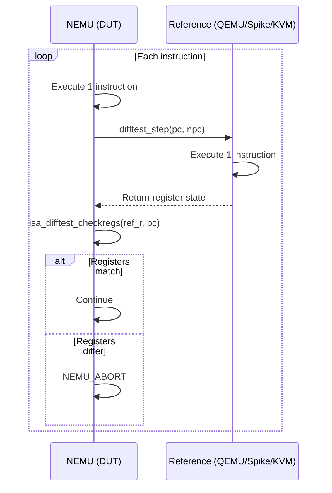

Key interfaces loaded dynamically from the reference shared object:

| Function | Purpose |
|----------|---------|
| `difftest_memcpy(addr, buf, n, dir)` | Synchronize memory between DUT and REF |
| `difftest_regcpy(dut, dir)` | Synchronize register state |
| `difftest_exec(n)` | Execute n instructions in REF |
| `difftest_raise_intr(NO)` | Raise interrupt in REF |
| `difftest_init(port)` | Initialize reference design |

### 10. Tracing System

NEMU provides multiple tracing facilities for debugging:

| Trace | Config | Output | Description |
|-------|--------|--------|-------------|
| **ITRACE** | `CONFIG_ITRACE` | `nemu-trace.txt` | Instruction trace with disassembly |
| **MTRACE** | `CONFIG_MTRACE` | `nemu-trace.txt` | Memory access trace |
| **FTRACE** | `CONFIG_FTRACE` | `nemu-trace.txt` | Function call/return trace |
| **DTRACE** | `CONFIG_DTRACE` | `nemu-trace.txt` | Device I/O access trace |
| **ETRACE** | `CONFIG_ETRACE` | `nemu-trace.txt` | Exception/trap trace |
| **IRingBuf** | `CONFIG_IRINGBUF` | On crash dump | Ring buffer of recent instructions |

The **Instruction Ring Buffer** (`IRingBuf`) records the last 128 executed instructions and dumps them on crash:

```c
#define IRB_N 128
typedef struct {
    vaddr_t pc;
    uint32_t inst;
    char disasm[128];
} IRBEntry;
```

### 11. Function Trace (Ftrace)

Ftrace parses ELF symbol tables to provide function-level call tracing:

```c
typedef struct {
    char name[64];
    paddr_t addr;
    uint32_t size;
} FuncSymbol;
```

It reads `.symtab` and `.strtab` sections from the ELF file, extracts `STT_FUNC` symbols, and logs function calls (`log_ftrace_call`) and returns (`log_ftrace_ret`) with proper indentation.

### 12. Disassembler (`src/utils/disasm.c`)

NEMU uses the **Capstone** disassembly framework (loaded dynamically via `dlopen`) for instruction disassembly:

| ISA | Capstone Architecture | Capstone Mode |
|-----|----------------------|---------------|
| x86 | `CS_ARCH_X86` | `CS_MODE_32` (AT&T syntax) |
| MIPS32 | `CS_ARCH_MIPS` | `CS_MODE_MIPS32` |
| RISC-V | `CS_ARCH_RISCV` | `CS_MODE_RISCV32/64` + `CS_MODE_RISCVC` |
| LoongArch32r | `CS_ARCH_LOONGARCH` | `CS_MODE_LOONGARCH32` |

---

## Data Flow

### Instruction Execution Flow

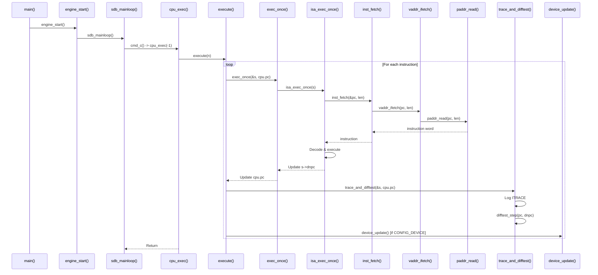

### Memory Access Flow

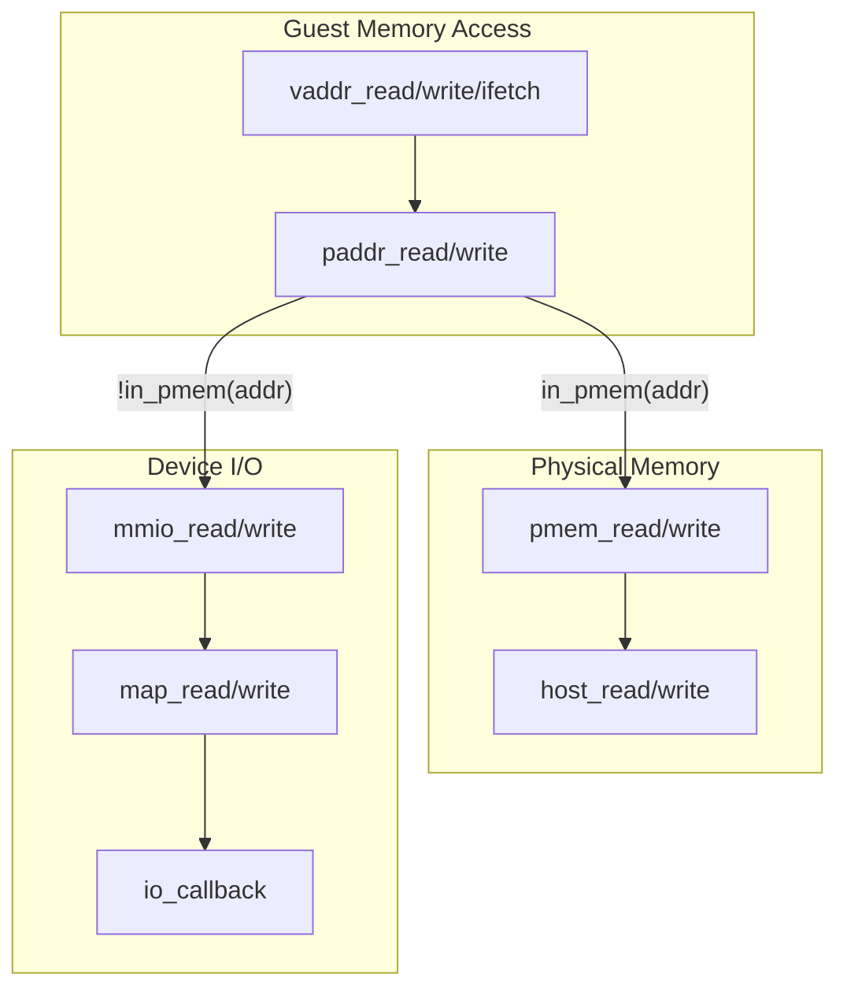

---

## Configuration System

NEMU uses **Kconfig** for build configuration. Key configuration options:

| Category | Options | Description |
|----------|---------|-------------|
| **Base ISA** | `x86`, `mips32`, `riscv`, `loongarch32r` | Target instruction set |
| **Engine** | `interpreter` | Execution engine type |
| **Mode** | `system` | Full-system mode |
| **Target** | `native-elf`, `share`, `am` | Build target type |
| **Tracing** | `ITRACE`, `MTRACE`, `FTRACE`, `DTRACE`, `ETRACE`, `IRingBuf` | Debug tracing features |
| **Testing** | `DIFFTEST` | Differential testing |
| **Devices** | `HAS_SERIAL`, `HAS_TIMER`, `HAS_VGA`, `HAS_KEYBOARD`, `HAS_AUDIO`, `HAS_DISK`, `HAS_SDCARD` | Peripheral devices |
| **Memory** | `PMEM_MALLOC`, `PMEM_GARRAY`, `MEM_RANDOM` | Physical memory configuration |

---

## Dependencies

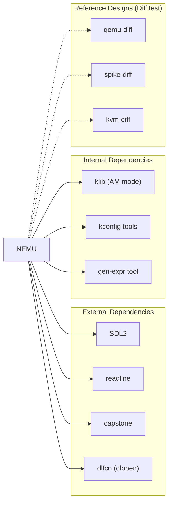

---

## Related Modules

- [Abstract Machine (AM)](Abstract Machine (AM).md) — NEMU can run as an AM application (`CONFIG_TARGET_AM`)
- [NPC Simulator](NPC Simulator.md) — Shares the `IOMap`, `DiffContext` concepts with NEMU
- [NVBoard](NVBoard.md) — Provides VGA display and pin-level simulation for NEMU
- [Kconfig System](Kconfig System.md) — Used for NEMU's build configuration
- [FCEUX NES Emulator](FCEUX NES Emulator.md) — Another emulator in the ecosystem, shares DiffTest concepts
- [Rocket Chip SoC](Rocket Chip SoC.md) — Hardware SoC design that NEMU can emulate

---

## Build and Usage

### Building NEMU

```bash
cd nemu
make menuconfig    # Configure build options
make               # Build NEMU
```

### Running NEMU

```bash
# Run with a guest program image
./build/nemu [OPTIONS...] IMAGE

# Options:
#   -b, --batch       Run in batch mode (no interactive SDB)
#   -l, --log=FILE    Output log to FILE
#   -d, --diff=REF_SO Run DiffTest with reference shared object
#   -p, --port=PORT   DiffTest communication port (default: 1234)
#   -e, --elf=FILE    ELF file for ftrace symbol resolution
```

### Interactive Debugging

Once NEMU starts, the SDB prompt `(nemu)` appears:

```
(nemu) help
c - Continue the execution of the program
q - Exit NEMU
help - Display information about all supported commands
(nemu) c    # Start/continue execution
```

---

## Key Design Patterns

1. **ISA Polymorphism**: The `isa.h` header provides a uniform interface, while each ISA implementation resides in `src/isa/<isa_name>/`. The build system selects the appropriate ISA via `CONFIG_ISA_*` macros.

2. **Pattern Matching Decoding**: The `INSTPAT` macro family provides a declarative, table-driven approach to instruction decoding using bit-pattern matching, making it easy to add new instructions.

3. **I/O Map Abstraction**: Both MMIO and PIO use the same `IOMap` structure and `map_read/map_write` functions, with only the address space and registration differing.

4. **Dynamic Loading**: Capstone disassembly library and DiffTest reference designs are loaded dynamically via `dlopen`, allowing flexible runtime configuration.

5. **Conditional Compilation**: Extensive use of `IFDEF`/`IFNDEF` macros and Kconfig allows fine-grained feature selection without runtime overhead.
