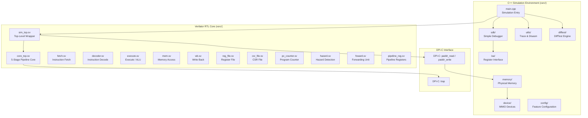
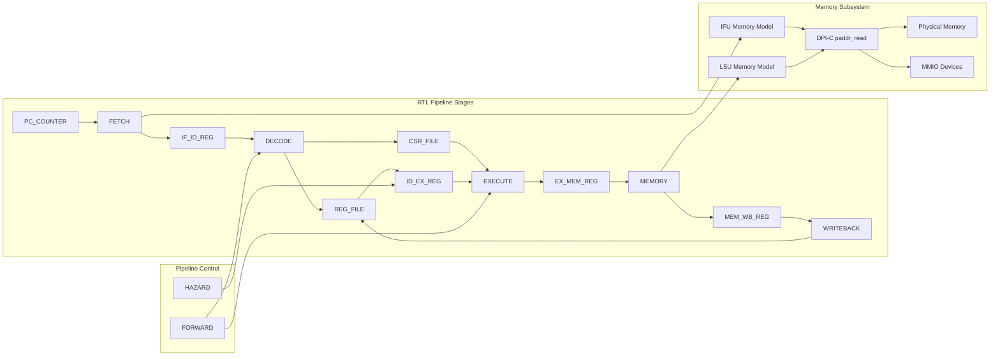
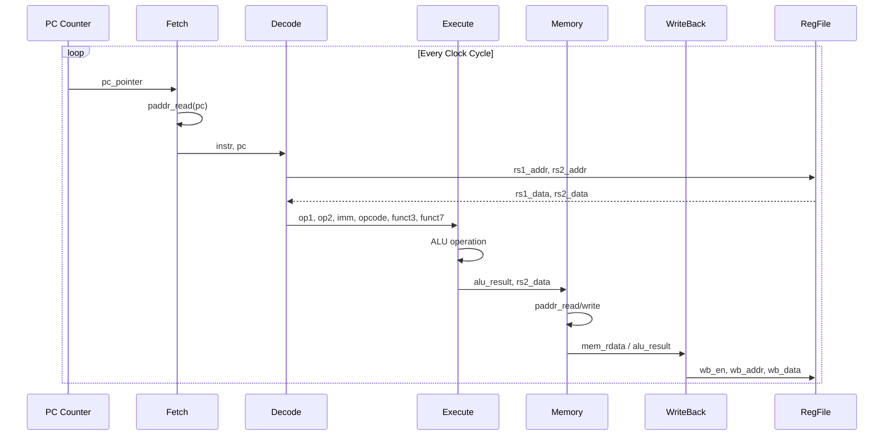
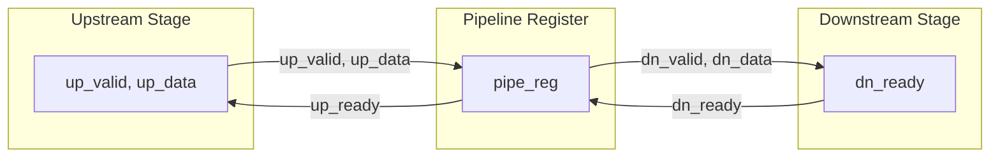
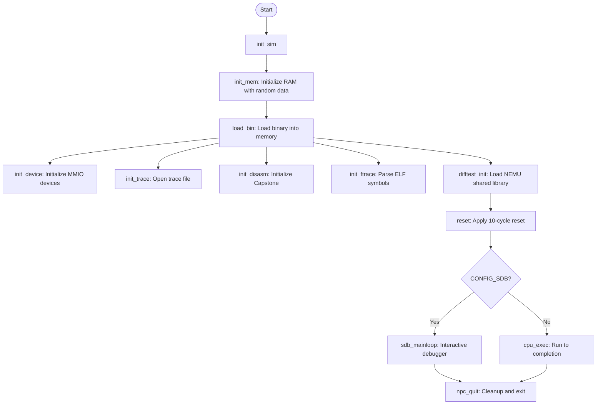
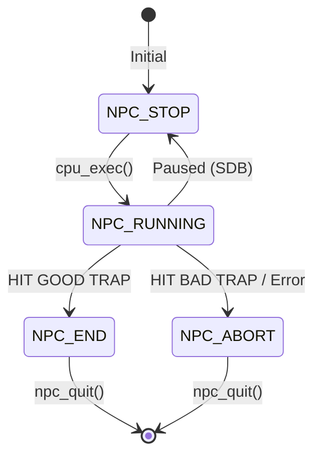
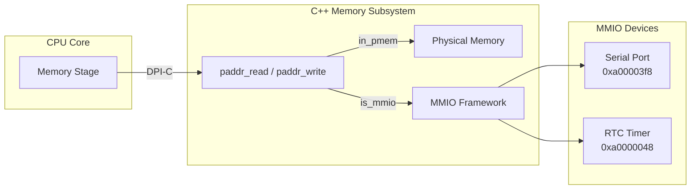
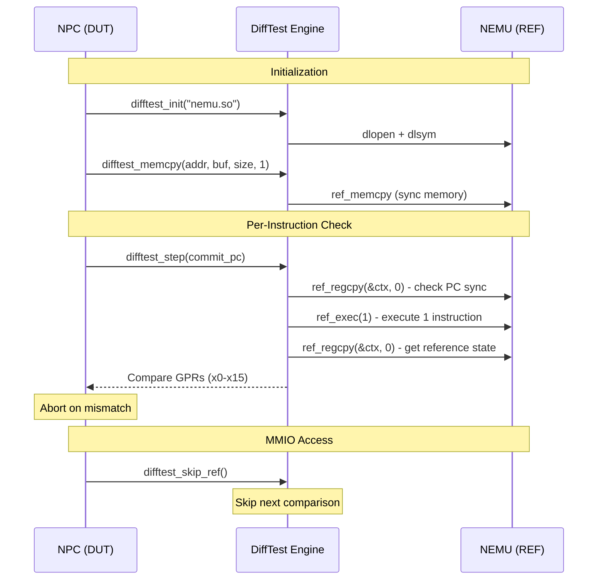
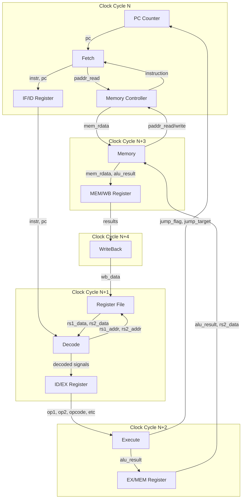
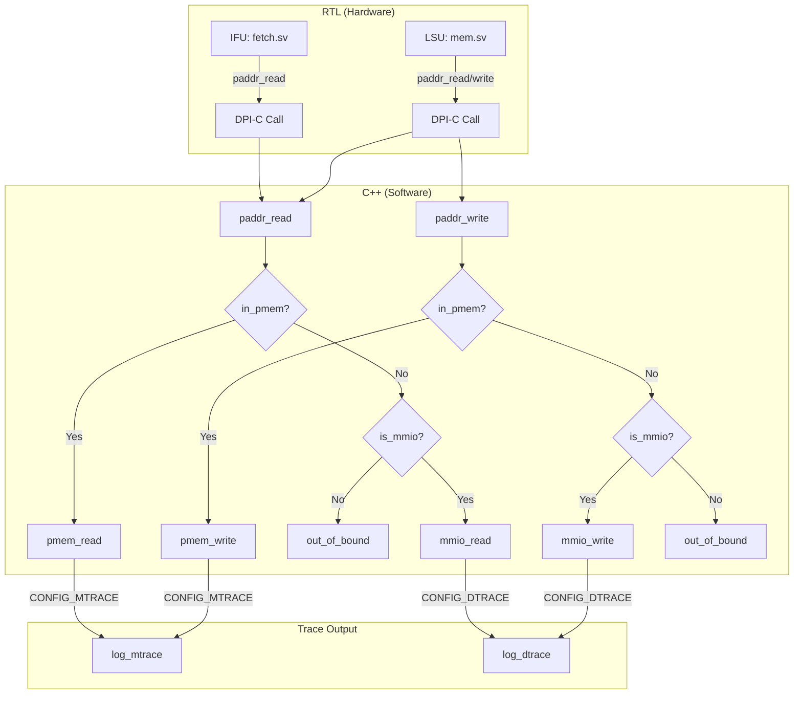

# NPC Simulator (NEMU Processor Core Simulator)

## Introduction

The **NPC Simulator** (NEMU Processor Core) is a RISC-V 32-bit processor simulation platform that combines a **Verilator-based RTL simulation** of a 5-stage pipelined CPU core with a **C++ simulation environment** providing memory, device emulation, debugging, and differential testing capabilities. It serves as the core simulation engine for the YSYX ("一生一芯") educational processor design project.

The NPC Simulator bridges hardware RTL design (SystemVerilog) with software simulation infrastructure (C++), enabling:
- RTL-level simulation of a custom RISC-V CPU core
- Interactive debugging via a Simple Debugger (SDB)
- Instruction tracing (ITrace), memory tracing (MTrace), device tracing (DTrace), and function tracing (FTrace)
- Differential testing (DiffTest) against a reference NEMU emulator
- MMIO-based device emulation (serial console, RTC timer)

---

## Architecture Overview

The NPC Simulator consists of two major subsystems:



### Key Design Principle

The NPC uses a **dual-world** architecture:
- **Hardware World (SystemVerilog)**: The actual RISC-V CPU pipeline, synthesized by Verilator into C++.
- **Software World (C++)**: The simulation harness providing memory, devices, debugging, and verification infrastructure.

Communication between the two worlds happens through **DPI-C (Direct Programming Interface)** function calls, where the RTL code calls C++ functions for memory access (`paddr_read`, `paddr_write`) and trap handling (`trap`).

---

## Component Dependencies



---

## Detailed Component Description

### 1. RTL Core (vsrc/) — 5-Stage Pipelined RISC-V Processor

The processor implements a classic 5-stage RISC-V (RV32I) pipeline with hazard detection and forwarding.

#### 1.1 Pipeline Stages



| Stage | Module | File | Function |
|-------|--------|------|----------|
| **IF** (Instruction Fetch) | `pc_counter` + `fetch` | `pc_counter.sv`, `fetch.sv` | PC generation, instruction memory request via DPI-C |
| **ID** (Instruction Decode) | `decode` + `reg_file` + `csr_file` | `decoder.sv`, `reg_file.sv`, `csr_file.sv` | Instruction decoding, register read, immediate generation |
| **EX** (Execute) | `execute` | `execute.sv` | ALU operations, branch/jump evaluation, CSR access |
| **MEM** (Memory Access) | `memory` | `mem.sv` | Load/Store memory access via DPI-C |
| **WB** (Write Back) | `writeback` | `wb.sv` | Result selection and register write-back |

#### 1.2 Pipeline Control Modules

| Module | File | Function |
|--------|------|----------|
| `pipe_reg` | `pipeline_reg.sv` | Generic pipeline register with flush/stall/valid/ready handshake |
| `hazard_unit` | `hazard.sv` | Load-Use hazard detection (stalls pipeline on load followed by use) |
| `forward_unit` | `foward.sv` | Data forwarding from EX/MEM/WB stages to resolve RAW hazards |

#### 1.3 Pipeline Register Interface

The pipeline registers use a **valid-ready handshake protocol**:



- **flush**: Clears the register (inserts bubble)
- **stall**: Freezes the register (holds current value)
- **up_ready** = `~stall & (dn_ready | ~valid_q)` — accepts new data when not stalled and downstream is ready or register is empty

#### 1.4 CSR File (Control and Status Registers)

The `csr_file` module implements the following RISC-V CSR registers:

| Address | Name | Description |
|---------|------|-------------|
| `0x300` | `mstatus` | Machine status register |
| `0x305` | `mtvec` | Machine trap handler base address |
| `0x341` | `mepc` | Machine exception program counter |
| `0x342` | `mcause` | Machine exception cause |
| `0xB00` | `mcycle` | Cycle counter (low 32 bits) |
| `0xB80` | `mcycleh` | Cycle counter (high 32 bits) |
| `0xF11` | `mvendorid` | Vendor ID ("ysyx" ASCII) |
| `0xF12` | `marchid` | Architecture ID (student ID) |

#### 1.5 Memory Model (sim_top.sv)

The `sim_top` module implements **random-latency memory models** for both IFU (instruction fetch) and LSU (load/store unit) using LFSR-based random delay generation:

- **IFU**: Always accepts new requests (`reqReady = 1`), handles flush by overwriting in-flight requests
- **LSU**: Accepts requests only when idle (`reqReady = !busy`), supports byte/halfword/word write masks

Both models call DPI-C functions (`paddr_read`, `paddr_write`) to access the C++ memory backend.

---

### 2. C++ Simulation Environment (csrc/)

#### 2.1 Main Simulation Loop (`main.cpp`)

The simulation entry point follows this flow:



**NPC State Machine:**



#### 2.2 Physical Memory (`memory/paddr.cpp`)

The physical memory subsystem provides:

- **128MB RAM** at base address `0x80000000` (configurable via `CONFIG_MSIZE` and `CONFIG_MBASE`)
- **Random initialization** on startup (seeded with `srand(time(NULL))`)
- **MMIO address space** detection (addresses `0xa0000000` - `0xa1ffffff`)
- **Byte/Halfword/Word** access support
- **Memory tracing** (MTrace) for load/store operations
- **Bound checking** with graceful error reporting

**Memory Map:**

| Address Range | Region | Description |
|--------------|--------|-------------|
| `0x80000000` - `0x8fffffff` | PMEM | Physical memory (128MB) |
| `0xa0000000` - `0xa1ffffff` | MMIO | Memory-mapped I/O space |
| `0xa00003f8` - `0xa00003ff` | Serial | UART serial port (8 bytes) |
| `0xa0000048` - `0xa000004f` | RTC | Real-time clock (8 bytes) |

#### 2.3 MMIO Device Framework (`device/mmio.cpp`)

A generic MMIO mapping framework that:

- Maintains a **map table** of up to 16 devices
- Each device has: `name`, `address range`, `local storage space`, and `callback function`
- **Read operation**: Calls callback first (for state updates), then reads from local space
- **Write operation**: Writes to local space first, then calls callback (for side effects)



#### 2.4 Device Implementations

**Serial Port (`device/serial.cpp`):**
- Base address: `0xa00003f8`
- 8 bytes of local storage
- On write to offset 0: outputs character to stderr (host terminal)
- Used for `putchar()` system calls from the guest program

**RTC Timer (`device/timer.cpp`):**
- Base address: `0xa0000048`
- 8 bytes of local storage (two 32-bit words)
- On read of offset 0: updates both words with current host time in microseconds
- Provides `gettimeofday()` functionality to the guest

#### 2.5 Simple Debugger (SDB) (`sdb/`)

An interactive command-line debugger with readline support:

| Command | Description |
|---------|-------------|
| `c` | Continue execution (run to completion) |
| `q` | Quit the simulator |
| `si [N]` | Step N instructions (default: 1) |
| `info r` | Display all registers |
| `x N ADDR` | Examine N words of memory at ADDR |
| `help [cmd]` | Display help information |

The SDB uses the GNU Readline library for line editing and history support.

#### 2.6 Register Interface (`isa/reg.cpp`)

Provides RISC-V register name-to-value mapping for the SDB:

- 16 general-purpose registers: `$0`, `ra`, `sp`, `gp`, `tp`, `t0`-`t2`, `s0`-`s1`, `a0`-`a5`
- Special register: `pc`
- Values read directly from the Verilator `top->regs[]` and `top->pc` signals

#### 2.7 Tracing System (`utils/trace.cpp`)

The NPC supports four types of execution traces, all written to `npc-trace.txt`:

| Trace | Config | Description |
|-------|--------|-------------|
| **ITrace** | `CONFIG_ITRACE` | Instruction trace: PC, instruction bytes, disassembly |
| **MTrace** | `CONFIG_MTRACE` | Memory trace: load/store operations with addresses and values |
| **DTRace** | `CONFIG_DTRACE` | Device trace: MMIO read/write operations |
| **FTrace** | `CONFIG_FTRACE` | Function trace: call/ret tracking with call depth indentation |

**FTrace** parses the ELF symbol table to extract function names and addresses, then tracks function calls and returns by analyzing `jal`/`jalr` instructions with RISC-V calling convention heuristics:
- `jal`/`jalr` with `rd=x1` (ra) → function call
- `jalr` with `rs1=x1` (ra), `rd=x0` → function return

#### 2.8 Disassembler (`utils/disasm.cpp`)

Uses the **Capstone** disassembly framework (`capstone/capstone.h`) to disassemble RISC-V 32-bit instructions:

- Initialized with `cs_open(CS_ARCH_RISCV, CS_MODE_RISCV32, ...)`
- Formats output as `"mnemonic operands"` string
- Returns `"???"` for illegal instructions

#### 2.9 Differential Testing (`difftest/difftest.c`)

DiffTest compares NPC execution against a reference NEMU emulator loaded as a shared library:



Key functions:
- `difftest_init()`: Loads NEMU shared library and resolves function symbols
- `difftest_memcpy()`: Synchronizes memory between NPC and NEMU
- `difftest_regcpy()`: Synchronizes register state (direction: 1 = NPC→NEMU, 0 = NEMU→NPC)
- `difftest_step()`: Executes one instruction in NEMU and compares GPRs
- `difftest_skip_ref()`: Skips comparison for MMIO accesses (where NEMU behavior differs)

---

## Data Flow

### Instruction Execution Flow



### Memory Access Flow



---

## Configuration System

The NPC's features are controlled by compile-time macros defined in `config/config.h`:

| Macro | Default | Description |
|-------|---------|-------------|
| `CONFIG_WAVE` | Disabled | Enable VCD waveform dump |
| `CONFIG_SDB` | **Enabled** | Enable Simple Debugger |
| `CONFIG_DIFFTEST` | Disabled | Enable differential testing |
| `CONFIG_ITRACE` | **Enabled** | Enable instruction tracing |
| `CONFIG_MTRACE` | **Enabled** | Enable memory tracing |
| `CONFIG_DTRACE` | Disabled | Enable device tracing |
| `CONFIG_ETRACE` | Disabled | Enable event tracing |
| `CONFIG_FTRACE` | **Enabled** | Enable function tracing |
| `CONFIG_DEVICE` | **Enabled** | Enable MMIO device emulation |

---

## Build and Usage

### Build Process

The NPC is built using Verilator to compile SystemVerilog RTL into C++, then linked with the C++ simulation harness:

```bash
# Typical build flow
verilator --cc --exe --build \
    -j $(nproc) \
    --top-module top \
    sim_top.v core_top.v ... \
    csrc/main.cpp csrc/memory/paddr.cpp ... \
    -CFLAGS "-Icsrc/include -Icsrc/config"
```

### Running

```bash
# Run with SDB (interactive)
./build/npc path/to/program.bin

# Run without SDB (batch mode)
# Disable CONFIG_SDB in config.h, then rebuild and run
```

### Example SDB Session

```
(npc) info r
General Purpose Registers:
$0 : 0x00000000  ra : 0x80000000  sp : 0x00000000  gp : 0x00000000  
tp : 0x00000000  t0 : 0x00000000  t1 : 0x00000000  t2 : 0x00000000  
s0 : 0x00000000  s1 : 0x00000000  a0 : 0x00000000  a1 : 0x00000000  
a2 : 0x00000000  a3 : 0x00000000  a4 : 0x00000000  a5 : 0x00000000  
pc  : 0x80000000

(npc) si 5
pc: 0x80000014 inst: 0x00000013

(npc) x 4 0x80000000
0x80000000: 0x00000533 0x00000013 0x00000013 0x00000013 

(npc) c
HIT GOOD TRAP at pc = 0x80000044
Simulation Ended: HIT GOOD TRAP
```

---

## Related Modules

| Module | Relationship |
|--------|-------------|
| [NEMU Emulator](NEMU%20Emulator.md) | Reference emulator used for differential testing (DiffTest) |
| [Abstract Machine (AM)](Abstract%20Machine%20(AM).md) | Provides the runtime environment and hardware abstraction for programs running on NPC |
| [NVBoard](NVBoard.md) | Virtual board for peripheral simulation (VGA, keyboard, etc.) |
| [Navy Apps](Navy%20Apps.md) | Application library including games and utilities that run on NPC |
| [AM Kernels](AM%20Kernels.md) | Benchmark and demo kernels (CoreMark, microbench, etc.) |
| [FCEUX NES Emulator](FCEUX%20NES%20Emulator.md) | NES emulator port that can run on the NPC platform |

---

## Key Design Decisions

1. **Verilator-based simulation**: The RTL is compiled to C++ via Verilator, providing fast simulation speeds compared to event-driven simulators.

2. **DPI-C for cross-boundary communication**: SystemVerilog DPI-C allows the RTL to directly call C++ functions for memory access and trap handling, avoiding complex bus protocol modeling.

3. **Random-latency memory model**: The `sim_top` module introduces random delays for memory accesses (using LFSR-based random numbers), making the design more realistic and helping uncover pipeline control bugs.

4. **Dual memory paths**: The IFU (instruction fetch) and LSU (load/store unit) have independent memory interfaces with different latency characteristics, reflecting real processor designs.

5. **DiffTest for verification**: By comparing against a golden reference (NEMU) at every instruction commit, the NPC can quickly identify functional bugs without writing extensive test cases.

6. **Modular trace system**: Each trace type (I/M/D/F) can be independently enabled, allowing developers to focus on specific aspects of processor behavior during debugging.
