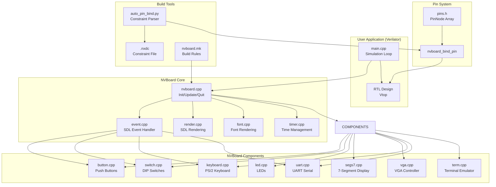
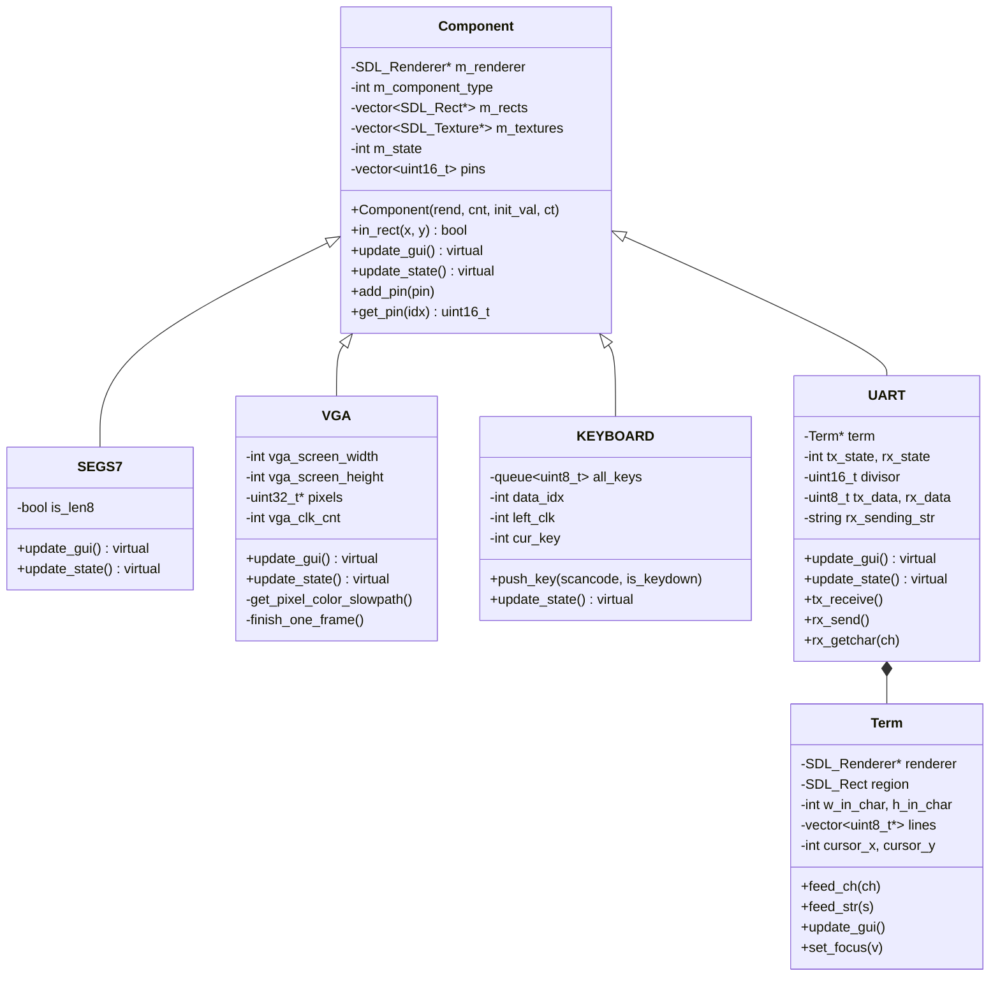
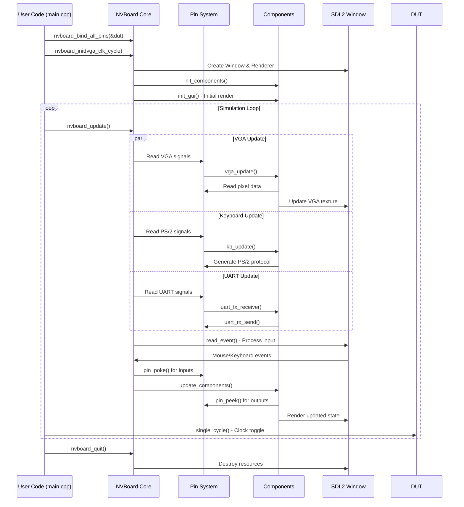
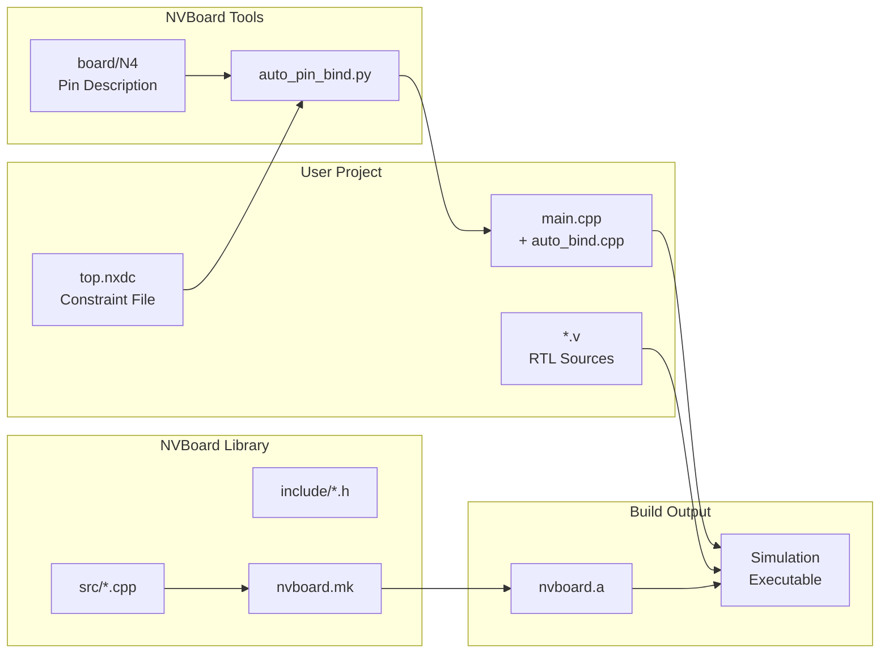

# NVBoard (NJU Virtual Board)

## Introduction

NVBoard (NJU Virtual Board) is an SDL2-based virtual FPGA development board simulator. It provides a graphical simulation environment for Verilator-based RTL simulations, allowing developers to interact with their hardware designs through a virtual board interface without requiring physical FPGA hardware. NVBoard simulates common FPGA peripherals including LEDs, 7-segment displays, DIP switches, push buttons, UART serial communication, PS/2 keyboard input, and VGA video output.

The module is designed to work with Verilator-based simulation flows, where RTL designs compiled by Verilator can be connected to NVBoard's virtual pins, enabling visual interaction and debugging of hardware designs.

## Architecture Overview

NVBoard follows a component-based architecture built on top of SDL2. The system is organized into three main layers:

1. **Core Framework Layer**: Manages the SDL window, rendering, event handling, and the main simulation loop
2. **Component Layer**: Implements individual virtual hardware components (LEDs, switches, buttons, etc.)
3. **Pin Binding Layer**: Provides the mechanism to connect RTL signals to virtual board pins



## Component Hierarchy



## Pin System

The pin system is the core mechanism that connects RTL signals to NVBoard's virtual components. It uses a global `PinNode` array indexed by pin enum values.

### PinNode Structure

```c
typedef struct PinNode {
  void *ptr;          // Pointer to the signal data
  uint8_t data;       // Default data storage (used when ptr is NULL)
  uint8_t vector_len; // Length of the signal vector (1 for single bit, 8 for byte, etc.)
  uint8_t bit_offset; // Bit position within the signal (for multi-bit signals)
} PinNode;
```

### Pin Operations

- **`pin_peek(pin)`**: Reads a single bit from a pin
- **`pin_peek8(pin)`**: Reads an 8-bit value from a pin
- **`pin_poke(pin, v)`**: Writes a value to a pin

### Pin Enumeration

The pin enum defines all available pins on the virtual board, organized by component type:

| Pin Group | Direction | Count | Description |
|-----------|-----------|-------|-------------|
| `BTNC, BTNU, BTND, BTNL, BTNR` | Input | 5 | Push buttons (Center, Up, Down, Left, Right) |
| `SW0 - SW15` | Input | 16 | DIP switches |
| `PS2_CLK, PS2_DAT` | Input | 2 | PS/2 keyboard clock and data |
| `UART_RX` | Input | 1 | UART receive |
| `LD0 - LD15` | Output | 16 | Naive LEDs |
| `R16, G16, B16, R17, G17, B17` | Output | 6 | RGB LEDs |
| `SEG0A-G - SEG7A-G, DEC0P - DEC7P` | Output | 64 | 7-segment displays (8 digits × 8 segments) |
| `VGA_VSYNC, VGA_HSYNC, VGA_BLANK_N` | Output | 3 | VGA sync signals |
| `VGA_R0-R7, VGA_G0-G7, VGA_B0-B7` | Output | 24 | VGA color channels (8 bits each) |
| `UART_TX` | Output | 1 | UART transmit |

### Pin Binding

The `nvboard_bind_pin()` function connects RTL signals to virtual pins:

```c
void nvboard_bind_pin(void *signal, int len, ...);
```

- `signal`: Pointer to the RTL signal (e.g., `&top->ledr`)
- `len`: Bit-width of the signal (1 for single bit, >1 for vectors)
- `...`: Variable argument list of pin enum values (MSB to LSB order for vectors)

## Data Flow



## Component Details

### 1. Push Buttons (button.cpp)

Five push buttons (C, U, D, L, R) are simulated. They are **input** components that write to the pin array when clicked:

- **Mouse Down**: Sets the corresponding pin to 1
- **Mouse Up**: Sets the corresponding pin to 0
- **Visual**: Uses PNG textures (`vbtn_on.png`, `vbtn_off.png`) for pressed/released states

### 2. DIP Switches (switch.cpp)

Sixteen DIP switches are simulated. They are **input** components that toggle their state on click:

- **Mouse Click**: Toggles the switch state (0 ↔ 1)
- **Visual**: Uses PNG textures (`vsw_on.png`, `vsw_off.png`) for on/off states

### 3. LEDs (led.cpp)

Sixteen naive LEDs are simulated. They are **output** components that read from the pin array:

- **update_state()**: Reads the pin value and updates the visual state
- **Visual**: Green when on (1), gray when off (0)
- RGB LED support is defined in the pin header but currently disabled in code

### 4. 7-Segment Display (segs7.cpp)

Eight 7-segment display digits are simulated. Each digit has 8 segments (A-G + decimal point):

- **update_state()**: Reads either an 8-bit vector or 8 individual pins
- **update_gui()**: Renders each segment individually (on = red, off = dark gray)
- Supports both 8-bit vector binding and individual pin binding

### 5. VGA Controller (vga.cpp)

The VGA component simulates a 640×480 VGA output:

- **Resolution**: 640×480 pixels
- **Color Depth**: 24-bit RGB (8 bits per channel)
- **Timing**: Standard VGA timing with configurable clock cycle
- **update_state()**: Reads pixel data from pins and writes to a pixel buffer
- **update_gui()**: Updates the SDL texture with the pixel buffer
- **Optimization**: Fast path when all color channels are 8-bit vectors; slow path for individual bit reads
- **Blank Detection**: Uses `VGA_BLANK_N` signal to determine when to update

### 6. PS/2 Keyboard (keyboard.cpp)

The keyboard component simulates a PS/2 keyboard interface:

- **Input**: Captures SDL keyboard events and converts to PS/2 scan codes
- **Output**: Generates PS/2 protocol signals (clock and data) on the virtual pins
- **Scan Code Mapping**: Maps SDL scan codes to AT keyboard scan codes (with make/break codes)
- **Visual**: Renders a visual keyboard layout showing pressed keys

### 7. UART Serial (uart.cpp)

The UART component simulates a serial communication interface:

- **TX (Transmit)**: Reads the UART_TX pin and decodes serial data (start bit, 8 data bits, stop bit)
- **RX (Receive)**: Generates serial data on UART_RX pin from keyboard input
- **Terminal**: Includes a terminal emulator (`Term` class) for displaying received characters
- **Baud Rate**: Configurable divisor for baud rate simulation
- **Focus**: Click on the UART terminal area to enable text input

### 8. Terminal Emulator (term.cpp)

The terminal emulator provides a text display area for UART output:

- **Character Size**: 10×16 pixels per character
- **Scrolling**: Supports vertical scrolling when output exceeds visible area
- **Dirty Tracking**: Optimized rendering using dirty line/character tracking
- **Cursor**: Visual cursor with focus indication

## Build System

### Build Flow



### Build Rules (nvboard.mk)

The `nvboard.mk` makefile fragment provides:

- **Source Collection**: Automatically finds all `.cpp` files in `src/`
- **Compilation**: Compiles with SDL2 flags (`sdl2-config --cflags`)
- **Archiving**: Creates `nvboard.a` static library
- **Linking**: Provides `LDFLAGS` for SDL2 libraries (`-lSDL2 -lSDL2_image -lSDL2_ttf`)

### Auto Pin Binding Script

The `auto_pin_bind.py` script automates pin binding code generation:

1. **BoardDescParser**: Parses the board pin description file (`board/N4`) to validate pin names
2. **NxdcParser**: Parses the user's constraint file (`.nxdc`) to extract signal-to-pin mappings
3. **AutoBindWriter**: Generates C++ code with `nvboard_bind_pin()` calls
4. **IndentWriter**: Formats the generated code with proper indentation

#### Constraint File Format (.nxdc)

```
top=top_name

# Line comment
signal_name pin_name
signal_name (pin1, pin2, ..., pinK)
```

- Line 1: Specifies the top-level module name
- Single pin binding: `signal pin` - binds a signal to one pin
- Vector binding: `signal (pin1, ..., pinK)` - binds signal bits MSB to LSB to pins

## API Reference

### User-Facing API (usr/include/nvboard.h)

| Function | Description |
|----------|-------------|
| `nvboard_init(vga_clk_cycle)` | Initialize NVBoard with optional VGA clock cycle parameter |
| `nvboard_quit()` | Clean up NVBoard resources and quit |
| `nvboard_bind_pin(signal, len, ...)` | Bind an RTL signal to virtual pins |
| `nvboard_update()` | Update all component states and process events |

### Internal API (include/nvboard.h)

| Function | Description |
|----------|-------------|
| `set_redraw()` | Mark the screen as needing a redraw |
| `nvboard_get_time()` | Get elapsed time in microseconds since initialization |
| `init_render(renderer)` | Initialize the renderer with background and logo |
| `load_pic_texture(renderer, path)` | Load a PNG texture from the resources directory |
| `new_texture(renderer, w, h, r, g, b)` | Create a solid-color texture |

### Component API (include/component.h)

| Function | Description |
|----------|-------------|
| `init_components(renderer)` | Initialize all component types |
| `init_gui(renderer)` | Render initial GUI for all components |
| `add_component(c)` | Register a component for updates |
| `update_components(renderer)` | Update state of all components |
| `delete_components()` | Clean up all component resources |

### Pin API (include/pins.h)

| Function | Description |
|----------|-------------|
| `pin_peek(pin)` | Read a single bit from a pin |
| `pin_peek8(pin)` | Read an 8-bit value from a pin |
| `pin_poke(pin, v)` | Write a value to a pin |

### Render API (include/render.h)

| Function | Description |
|----------|-------------|
| `draw_thicker_line(renderer, points, n)` | Draw a thicker line (2 pixels wide) |
| `draw_surrounding_line(renderer, rect, gap)` | Draw a decorative surrounding line |
| `draw_str(renderer, str, x, y, fg)` | Draw text with foreground color |
| `draw_str(renderer, str, x, y, fg, bg)` | Draw text with foreground and background colors |

### Font API (include/font.h)

| Function | Description |
|----------|-------------|
| `str2surface(str, fg)` | Render string to SDL surface |
| `str2surface(str, fg, bg)` | Render string to SDL surface with background |
| `str2texture(renderer, str, fg)` | Render string to SDL texture |
| `ch2texture(renderer, ch, fg)` | Render character to SDL texture |
| `ch2texture_term(ch)` | Get pre-rendered terminal character texture |

## Configuration

The `configs.h` file provides compile-time configuration options:

| Option | Default | Description |
|--------|---------|-------------|
| `VBTN_ON_PATH` | `"vbtn_on.png"` | Button pressed texture |
| `VBTN_OFF_PATH` | `"vbtn_off.png"` | Button released texture |
| `VSW_ON_PATH` | `"vsw_on.png"` | Switch on texture |
| `VSW_OFF_PATH` | `"vsw_off.png"` | Switch off texture |
| `VGA_ENA` | Defined | Enable VGA component |
| `HARDWARE_ACC` | Undefined | Enable SDL hardware acceleration |
| `VSYNC` | Undefined | Enable VSYNC |
| `WINDOW_WIDTH` | 1280 | Window width (640 × 2) |
| `WINDOW_HEIGHT` | 960 | Window height (480 × 2) |

## Dependencies

NVBoard depends on the following external libraries:

- **SDL2** (libsdl2-dev): Core windowing, rendering, and event handling
- **SDL2_image** (libsdl2-image-dev): PNG image loading for component textures
- **SDL2_ttf** (libsdl2-ttf-dev): TrueType font rendering for text display

## Integration with Other Modules

NVBoard is typically used in conjunction with:

- **[NEMU Emulator](NEMU%20Emulator.md)**: NVBoard can serve as the peripheral visualization layer for NEMU's simulated hardware
- **[NPC Simulator](NPC%20Simulator.md)**: NVBoard provides the virtual FPGA board interface for NPC-based RTL simulations
- **Verilator**: NVBoard is designed to work with Verilator-compiled RTL designs, connecting via the pin binding mechanism

## Example Usage

### Basic Simulation Loop

```cpp
#include <nvboard.h>
#include <Vtop.h>

static TOP_NAME dut;

void nvboard_bind_all_pins(TOP_NAME* top);

static void single_cycle() {
  dut.clk = 0; dut.eval();
  dut.clk = 1; dut.eval();
}

static void reset(int n) {
  dut.rst = 1;
  while (n -- > 0) single_cycle();
  dut.rst = 0;
}

int main() {
  nvboard_bind_all_pins(&dut);
  nvboard_init();

  reset(10);

  while(1) {
    nvboard_update();
    single_cycle();
  }
}
```

### Constraint File Example

```
top=top

# VGA signal binding
VGA_VSYNC VGA_VSYNC
VGA_HSYNC VGA_HSYNC
VGA_BLANK_N VGA_BLANK_N
VGA_R (VGA_R7, VGA_R6, VGA_R5, VGA_R4, VGA_R3, VGA_R2, VGA_R1, VGA_R0)
VGA_G (VGA_G7, VGA_G6, VGA_G5, VGA_G4, VGA_G3, VGA_G2, VGA_G1, VGA_G0)
VGA_B (VGA_B7, VGA_B6, VGA_B5, VGA_B4, VGA_B3, VGA_B2, VGA_B1, VGA_B0)

# LED and switch binding
ledr (LD15, LD14, LD13, LD12, LD11, LD10, LD9, LD8, LD7, LD6, LD5, LD4, LD3, LD2, LD1, LD0)
sw (SW7, SW6, SW5, SW4, SW3, SW2, SW1, SW0)
btn (BTNL, BTNU, BTNC, BTND, BTNR)

# 7-segment display binding
seg0 (SEG0A, SEG0B, SEG0C, SEG0D, SEG0E, SEG0F, SEG0G, DEC0P)
# ... (seg1 through seg7)

# PS/2 keyboard binding
ps2_clk PS2_CLK
ps2_data PS2_DAT

# UART binding
uart_tx UART_TX
uart_rx UART_RX
```

## Key Design Decisions

1. **Component-Based Architecture**: Each virtual peripheral is implemented as a separate C++ class, making it easy to add new components or modify existing ones.

2. **Pin Abstraction Layer**: The `PinNode` array provides a uniform interface for connecting RTL signals to virtual components, supporting both single-bit and vector signals.

3. **Dirty Tracking**: The terminal emulator uses dirty line/character tracking to optimize rendering performance, only redrawing changed areas.

4. **Clock Cycle Management**: The VGA controller uses a configurable clock cycle counter to simulate different pixel clock frequencies.

5. **Separation of Concerns**: The user-facing API (`usr/include/`) is kept minimal and separate from the internal implementation headers (`include/`), providing a clean interface for integration.
