# Nanos-lite

## Introduction

**Nanos-lite** is a simplified, educational operating system kernel designed for the [YSYX ("一生一芯")](https://ysyx.oscc.cc/) project. It is a lightweight port of the [Nanos](http://cslab.nju.edu.cn/opsystem) teaching OS, adapted to run on top of the [Abstract Machine (AM)](Abstract%20Machine%20(AM).md) hardware abstraction layer.

Nanos-lite is a minimal two-tasking operating system that demonstrates core OS concepts including:

- **Ramdisk device driver** — block-level I/O on a memory-backed disk
- **ELF program loader** — loading and executing ELF-format user programs
- **Memory management with paging** — virtual memory support via the AM's VME
- **Simple file system** — fixed number/size of files, no directories, device files
- **9 system calls** — `open`, `read`, `write`, `lseek`, `close`, `gettimeofday`, `brk`, `exit`, `execve`
- **Scheduler with two tasks** — cooperative multitasking between two processes

The kernel is designed to be simple enough for students to implement and extend as part of the YSYX curriculum, while still demonstrating realistic OS internals.

---

## Architecture Overview

Nanos-lite sits between the Abstract Machine (AM) hardware abstraction layer and user-space applications (Navy Apps). It uses the AM's five abstract machine models (TRM, IOE, CTE, VME, MPE) to provide OS services.

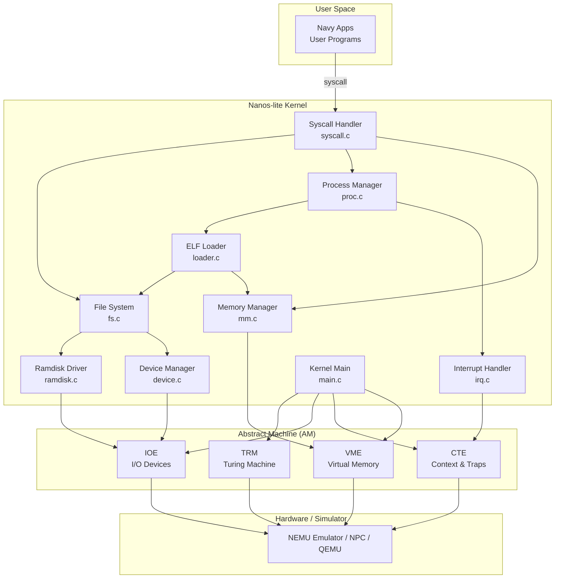

### Kernel Initialization Flow

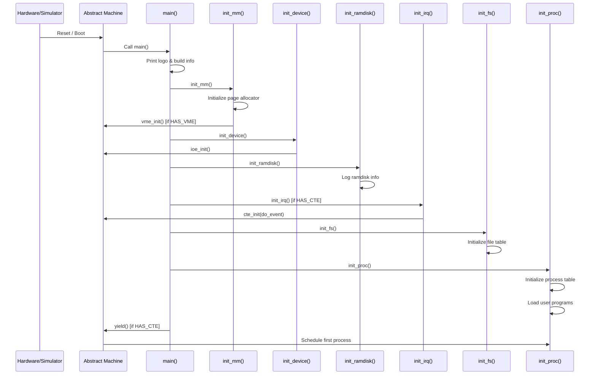

---

## Core Components

### 1. Kernel Entry Point (`main.c`)

The kernel entry point orchestrates the initialization of all subsystems in a specific order:

```c
int main() {
  extern const char logo[];
  printf("%s", logo);
  Log("'Hello World!' from Nanos-lite");
  Log("Build time: %s, %s", __TIME__, __DATE__);

  init_mm();       // 1. Initialize memory management
  init_device();   // 2. Initialize I/O devices
  init_ramdisk();  // 3. Initialize ramdisk
  init_irq();      // 4. Initialize interrupt handling (if HAS_CTE)
  init_fs();       // 5. Initialize file system
  init_proc();     // 6. Initialize processes & load programs

  Log("Finish initialization");

  yield();         // Yield to first process (if HAS_CTE)
  panic("Should not reach here");
}
```

The initialization order is critical: memory must be available before devices, devices before the ramdisk, the ramdisk before the file system, and the file system before process loading.

### 2. Memory Management (`mm.c`)

The memory manager provides physical page allocation and the `brk()` system call handler.

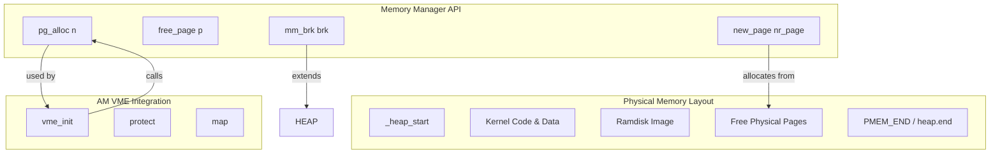

**Key Components:**

| Function | Description |
|----------|-------------|
| `new_page(size_t nr_page)` | Allocates `nr_page` contiguous physical pages. Returns pointer to the first page. |
| `free_page(void *p)` | Frees a previously allocated page (not implemented in the stub). |
| `mm_brk(uintptr_t brk)` | Handles the `brk()` system call for heap expansion/contraction. |
| `pg_alloc(int n)` | Internal allocator used by the AM's VME module for page table allocation. |

**Initialization:**
```c
void init_mm() {
  pf = (void *)ROUNDUP(heap.start, PGSIZE);
  Log("free physical pages starting from %p", pf);

#ifdef HAS_VME
  vme_init(pg_alloc, free_page);
#endif
}
```

The free page pointer `pf` starts at the beginning of the heap area (rounded up to page boundary). When `HAS_VME` is defined, the AM's virtual memory extension is initialized with the kernel's page allocator.

### 3. Device Management (`device.c`)

The device manager provides file-like access to hardware devices through the AM's IOE interface.

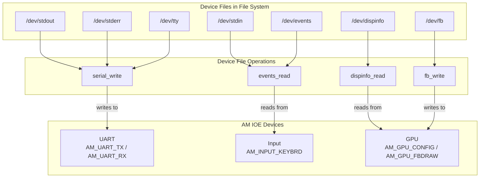

**Device File Operations:**

| Function | Purpose | Associated Device File |
|----------|---------|----------------------|
| `serial_write(buf, offset, len)` | Writes to serial port (UART) | `/dev/stdout`, `/dev/stderr`, `/dev/tty` |
| `events_read(buf, offset, len)` | Reads keyboard events | `/dev/events`, `/dev/stdin` |
| `dispinfo_read(buf, offset, len)` | Reads display information (width, height) | `/dev/dispinfo` |
| `fb_write(buf, offset, len)` | Writes to framebuffer (GPU) | `/dev/fb` |

**Initialization:**
```c
void init_device() {
  Log("Initializing devices...");
  ioe_init();
}
```

The device manager initializes the AM's IOE subsystem, which probes and initializes all hardware devices (UART, timer, keyboard, GPU, audio, disk).

### 4. Ramdisk Driver (`ramdisk.c`)

The ramdisk driver provides block-level read/write access to a memory-resident disk image.

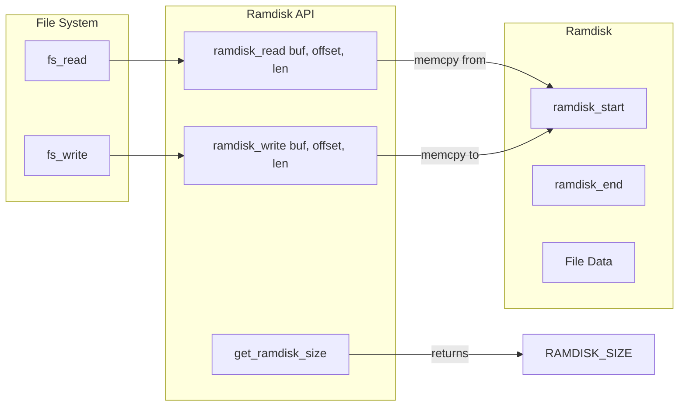

**Key Components:**

| Function | Description |
|----------|-------------|
| `ramdisk_read(buf, offset, len)` | Copies `len` bytes from ramdisk offset `offset` into `buf` |
| `ramdisk_write(buf, offset, len)` | Copies `len` bytes from `buf` into ramdisk at offset `offset` |
| `get_ramdisk_size()` | Returns total size of the ramdisk in bytes |

**Implementation:**
```c
extern uint8_t ramdisk_start;
extern uint8_t ramdisk_end;
#define RAMDISK_SIZE ((&ramdisk_end) - (&ramdisk_start))

size_t ramdisk_read(void *buf, size_t offset, size_t len) {
  assert(offset + len <= RAMDISK_SIZE);
  memcpy(buf, &ramdisk_start + offset, len);
  return len;
}
```

The ramdisk is embedded directly into the kernel binary via the linker. The `resources.S` assembly file uses `.incbin` to include the raw ramdisk image:

```asm
.section .data
.global ramdisk_start, ramdisk_end
ramdisk_start:
.incbin "build/ramdisk.img"
ramdisk_end:
```

The ramdisk image (`build/ramdisk.img`) is typically generated from the Navy Apps build system, containing the user-space programs and their data files.

### 5. File System (`fs.c`)

The file system provides a simple, flat file abstraction over the ramdisk and device files.

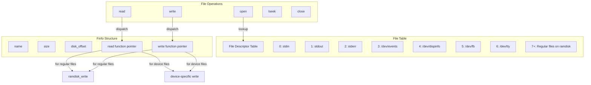

**The `Finfo` Structure:**
```c
typedef struct {
  char *name;          // File name
  size_t size;         // File size
  size_t disk_offset;  // Offset in ramdisk
  ReadFn read;         // Read function pointer
  WriteFn write;       // Write function pointer
} Finfo;
```

Each file in the system is represented by a `Finfo` entry. The `read` and `write` function pointers allow polymorphic I/O — regular files use `ramdisk_read`/`ramdisk_write`, while device files use device-specific handlers.

**File Table:**
```c
static Finfo file_table[] = {
  [FD_STDIN]  = {"stdin", 0, 0, invalid_read, invalid_write},
  [FD_STDOUT] = {"stdout", 0, 0, invalid_read, invalid_write},
  [FD_STDERR] = {"stderr", 0, 0, invalid_read, invalid_write},
  // ... additional files included from "files.h"
};
```

The file table is populated at compile time. The `files.h` header (generated by the Navy Apps build system) contains the entries for all files on the ramdisk.

**Standard File Descriptors:**

| FD | Name | Type | Read Function | Write Function |
|----|------|------|---------------|----------------|
| 0 | `stdin` | Device | `events_read` | `invalid_write` |
| 1 | `stdout` | Device | `invalid_read` | `serial_write` |
| 2 | `stderr` | Device | `invalid_read` | `serial_write` |
| 3 | `/dev/events` | Device | `events_read` | `invalid_write` |
| 4 | `/dev/dispinfo` | Device | `dispinfo_read` | `invalid_write` |
| 5 | `/dev/fb` | Device | `invalid_read` | `fb_write` |
| 6 | `/dev/tty` | Device | `events_read` | `serial_write` |
| 7+ | Regular files | Ramdisk | `ramdisk_read` | `ramdisk_write` |

### 6. ELF Program Loader (`loader.c`)

The loader reads ELF-format executables from the file system and loads them into memory.

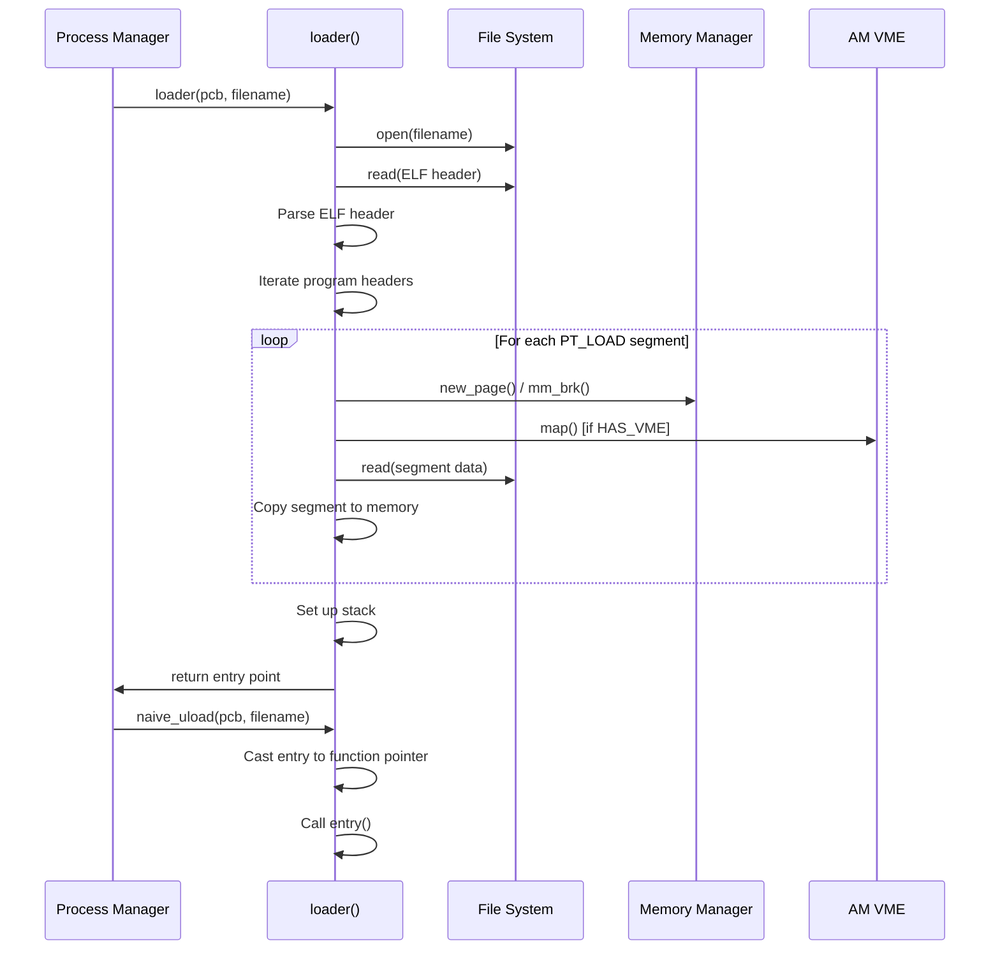

**Key Components:**

| Function | Description |
|----------|-------------|
| `loader(PCB *pcb, const char *filename)` | Loads an ELF executable from the file system into the process's address space |
| `naive_uload(PCB *pcb, const char *filename)` | Calls `loader()` and jumps to the program's entry point |

The loader handles both 32-bit and 64-bit ELF formats:
```c
#ifdef __LP64__
# define Elf_Ehdr Elf64_Ehdr
# define Elf_Phdr Elf64_Phdr
#else
# define Elf_Ehdr Elf32_Ehdr
# define Elf_Phdr Elf32_Phdr
#endif
```

### 7. Process Manager (`proc.c`)

The process manager maintains the Process Control Block (PCB) array and implements the scheduler.

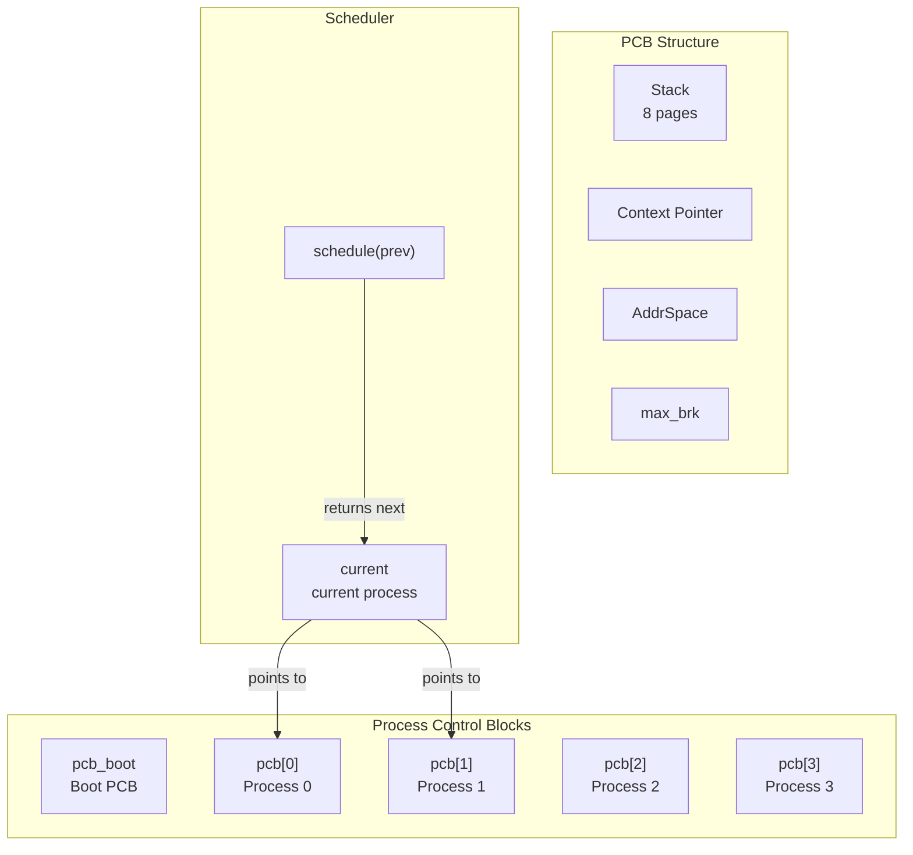

**PCB Structure:**
```c
typedef union {
  uint8_t stack[STACK_SIZE] PG_ALIGN;  // 8-page kernel stack
  struct {
    Context *cp;       // Saved context pointer
    AddrSpace as;      // Address space (for VME)
    uintptr_t max_brk; // Maximum brk value (for heap tracking)
  };
} PCB;
```

The PCB uses a union to overlay the kernel stack with the process metadata. This means the kernel stack and the process control data share the same memory region — the stack grows downward from the top, while the metadata is at the bottom.

**Key Components:**

| Function | Description |
|----------|-------------|
| `switch_boot_pcb()` | Sets `current` to point to the boot PCB |
| `init_proc()` | Initializes process table and loads user programs |
| `schedule(Context *prev)` | Saves the previous context and returns the next context to run |

**Scheduler:**
```c
Context* schedule(Context *prev) {
  // Save previous context
  // Select next process (round-robin)
  // Switch address space if needed
  // Return next context
  return NULL;
}
```

The scheduler is called from the interrupt handler (via CTE) whenever a context switch is needed (e.g., on `yield()` or timer interrupt).

### 8. Interrupt Handler (`irq.c`)

The interrupt handler dispatches hardware events and exceptions to the appropriate kernel handlers.

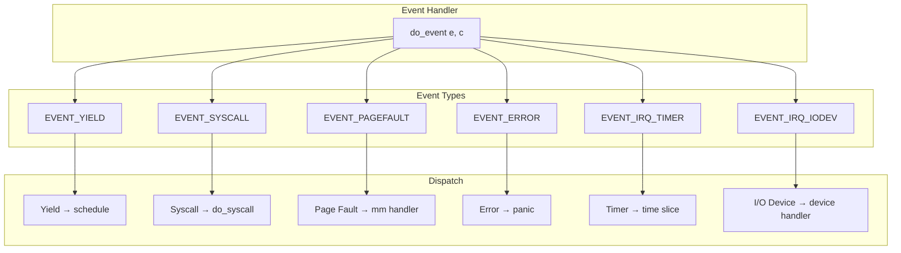

**Implementation:**
```c
static Context* do_event(Event e, Context* c) {
  switch (e.event) {
    case EVENT_YIELD:
      return schedule(c);
    case EVENT_SYSCALL:
      do_syscall(c);
      return c;
    case EVENT_PAGEFAULT:
      // Handle page fault
      break;
    default:
      panic("Unhandled event ID = %d", e.event);
  }
  return c;
}

void init_irq(void) {
  Log("Initializing interrupt/exception handler...");
  cte_init(do_event);
}
```

### 9. System Call Handler (`syscall.c`)

The system call handler dispatches user-space system calls to the appropriate kernel services.

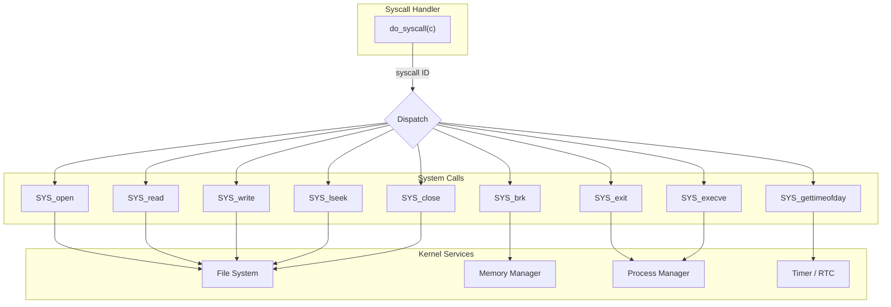

**System Call Interface:**

| Syscall ID | Function | Arguments | Description |
|------------|----------|-----------|-------------|
| `SYS_open` | `open(path, flags, mode)` | `path`, `flags`, `mode` | Opens a file |
| `SYS_read` | `read(fd, buf, count)` | `fd`, `buf`, `count` | Reads from a file descriptor |
| `SYS_write` | `write(fd, buf, count)` | `fd`, `buf`, `count` | Writes to a file descriptor |
| `SYS_lseek` | `lseek(fd, offset, whence)` | `fd`, `offset`, `whence` | Repositions file offset |
| `SYS_close` | `close(fd)` | `fd` | Closes a file descriptor |
| `SYS_gettimeofday` | `gettimeofday(tv, tz)` | `tv`, `tz` | Gets current time |
| `SYS_brk` | `brk(addr)` | `addr` | Changes data segment size |
| `SYS_exit` | `exit(status)` | `status` | Terminates the current process |
| `SYS_execve` | `execve(path, argv, envp)` | `path`, `argv`, `envp` | Replaces current process with a new program |

The syscall handler reads the syscall number from the context's GPR1 register and dispatches accordingly:
```c
void do_syscall(Context *c) {
  uintptr_t a[4];
  a[0] = c->GPR1;  // Syscall number

  switch (a[0]) {
    // ... handle each syscall
    default: panic("Unhandled syscall ID = %d", a[0]);
  }
}
```

---

## Configuration and Build

### Feature Flags

Nanos-lite uses compile-time configuration flags defined in `common.h` to enable optional features:

| Flag | Purpose | Dependencies |
|------|---------|--------------|
| `HAS_CTE` | Enables interrupt handling and context switching | AM CTE model |
| `HAS_VME` | Enables virtual memory and paging | AM VME model |
| `MULTIPROGRAM` | Enables multi-programming support | `HAS_CTE` |
| `TIME_SHARING` | Enables preemptive time-sharing scheduler | `HAS_CTE`, `MULTIPROGRAM` |

### Build System

The Makefile integrates with the AM build system:

```makefile
NAME = nanos-lite
SRCS = $(shell find -L ./src/ -name "*.c" -o -name "*.cpp" -o -name "*.S")
include $(AM_HOME)/Makefile
```

When `HAS_NAVY` is defined, the build system links with Navy Apps to generate the ramdisk image containing user programs.

### Build Artifacts

| File | Description |
|------|-------------|
| `build/ramdisk.img` | Raw disk image containing user programs and data |
| `src/files.h` | Auto-generated file table entries (from Navy Apps) |
| `src/syscall.h` | Auto-generated syscall definitions (from Navy Apps libos) |
| `src/resources.S` | Assembly file embedding ramdisk and logo |

---

## Data Flow Examples

### File Read Operation

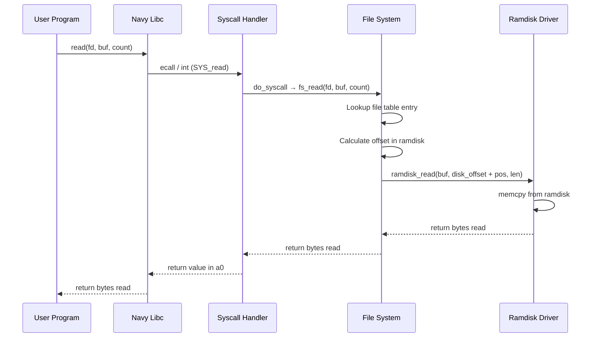

### Process Creation and Execution

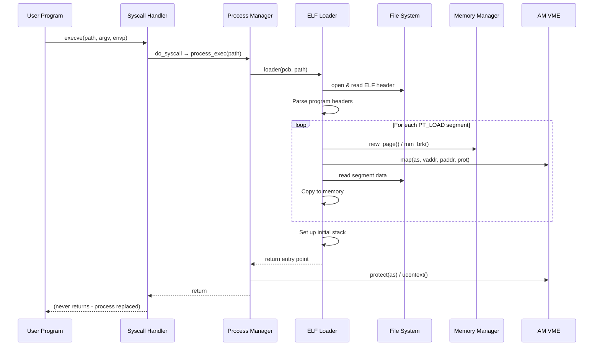

---

## Dependencies

### Direct Dependencies

| Module | Relationship | Description |
|--------|-------------|-------------|
| [Abstract Machine (AM)](Abstract%20Machine%20(AM).md) | **Required** | Hardware abstraction layer providing TRM, IOE, CTE, VME models |
| [Navy Apps](Navy%20Apps.md) | **Optional** | User-space programs and libraries; provides ramdisk content and syscall definitions |

### AM Models Used

| AM Model | Usage in Nanos-lite |
|----------|---------------------|
| **TRM** | `heap` area for memory allocation, `putch()` for serial output, `halt()` for panic |
| **IOE** | Device access: UART (serial), INPUT (keyboard), GPU (framebuffer), TIMER (RTC/uptime), DISK (ramdisk) |
| **CTE** | Interrupt handling, context switching, `yield()`, `kcontext()` for kernel threads |
| **VME** | Address space management, page table manipulation, `protect()`, `map()`, `ucontext()` |

---

## References

- [Abstract Machine (AM) Documentation](Abstract%20Machine%20(AM).md) — Hardware abstraction layer API
- [Navy Apps Documentation](Navy%20Apps.md) — User-space programs and libraries
- [NEMU Emulator Documentation](NEMU%20Emulator.md) — Reference simulator platform
- [NPC Simulator Documentation](NPC%20Simulator.md) — Alternative simulator platform
- [RT-Thread Kernel Documentation](RT-Thread%20Kernel.md) — Full-featured RTOS for comparison
- [File System (DFS) Documentation](File%20System%20(DFS).md) — Full file system implementation for comparison
