# Navy Application Framework (Navy Apps)

## Introduction

Navy Application Framework (Navy Apps) is a comprehensive application runtime environment and middleware stack designed for the **Nanos-lite** operating system and the **Abstract Machine (AM)** ecosystem. It provides a complete set of libraries, applications, and build infrastructure that enables complex multimedia applications (games, interpreters, media players, etc.) to run on minimal operating systems and emulated hardware platforms.

Navy Apps bridges the gap between bare-metal/OS-less environments and rich application requirements by providing:

- **POSIX-like system call interface** via `libos`
- **Multimedia abstraction layer** via `libndl` (NJU DirectMedia Layer)
- **SDL-compatible API** via `libminiSDL` and its extension libraries
- **Application runtime** including Lua interpreter, NES emulator, GUI applications, and more
- **Cross-ISA build system** supporting x86, MIPS32, RISC-V, LoongArch, and native execution

---

## Architecture Overview

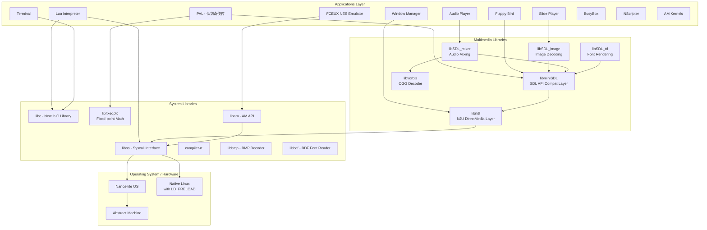

---

## Component Architecture

### Layered Architecture

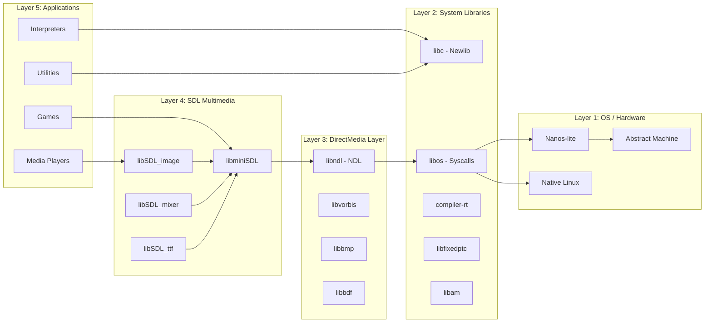

---

## Core Libraries

### 1. libos - System Call Interface

**Purpose**: Provides the bridge between Navy applications and the underlying operating system through a minimal POSIX system call interface.

**Key Components**:
- `syscall.h` - Defines system call numbers (`SYS_exit`, `SYS_open`, `SYS_read`, `SYS_write`, etc.)
- `syscall.c` - Implements ISA-dependent syscall dispatch using inline assembly
- `native.cpp` - Native Linux simulation layer using `LD_PRELOAD`

**System Call Architecture**:

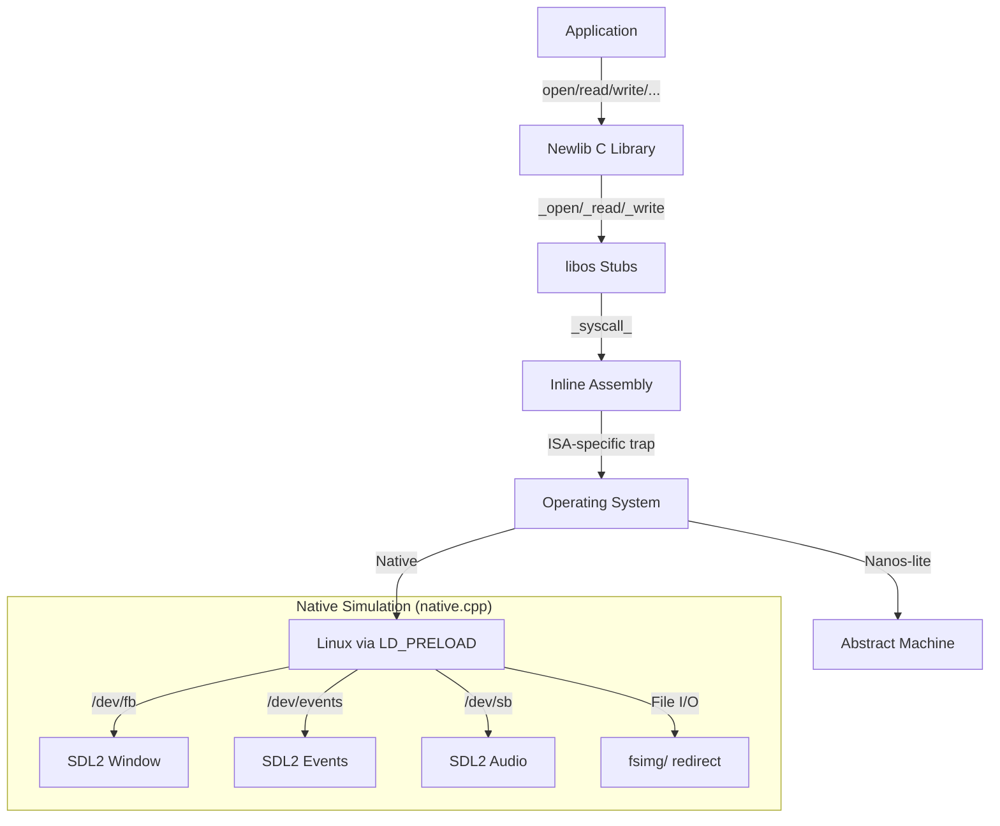

**Supported ISAs**:
| ISA | Syscall Instruction | Syscall Number Register | Argument Registers |
|-----|-------------------|----------------------|-------------------|
| x86 | `int $0x80` | `eax` | `ebx`, `ecx`, `edx` |
| MIPS32 | `syscall` | `v0` | `a0`, `a1`, `a2` |
| RISC-V | `ecall` | `a7` | `a0`, `a1`, `a2` |
| RISC-V E | `ecall` | `a5` | `a0`, `a1`, `a2` |
| AM Native | `call *0x100000` | `rdi` | `rsi`, `rdx`, `rcx` |
| x86-64 | `int $0x80` | `rdi` | `rsi`, `rdx`, `rcx` |
| LoongArch32r | `syscall 0` | `a7` | `a0`, `a1`, `a2` |

**Native Simulation** (`native.cpp`):
When running with `ISA=native`, the `libos` library is compiled as a shared object (`.so`) and loaded via `LD_PRELOAD`. It intercepts POSIX calls and simulates Navy's special device files:

- `/dev/fb` → SDL2 window surface (framebuffer)
- `/dev/events` → SDL2 keyboard events
- `/dev/sb` → SDL2 audio playback via pipe
- `/dev/sbctl` → Audio configuration
- `/proc/dispinfo` → Display dimensions
- File paths → Redirected to `fsimg/` directory

### 2. libndl - NJU DirectMedia Layer

**Purpose**: Low-level multimedia abstraction providing hardware-independent access to display, input, and audio.

**API Surface**:
```c
int NDL_Init(uint32_t flags);
void NDL_Quit();
uint32_t NDL_GetTicks();
void NDL_OpenCanvas(int *w, int *h);
int NDL_PollEvent(char *buf, int len);
void NDL_DrawRect(uint32_t *pixels, int x, int y, int w, int h);
void NDL_OpenAudio(int freq, int channels, int samples);
void NDL_CloseAudio();
int NDL_PlayAudio(void *buf, int len);
int NDL_QueryAudio();
```

**Device File Mapping**:
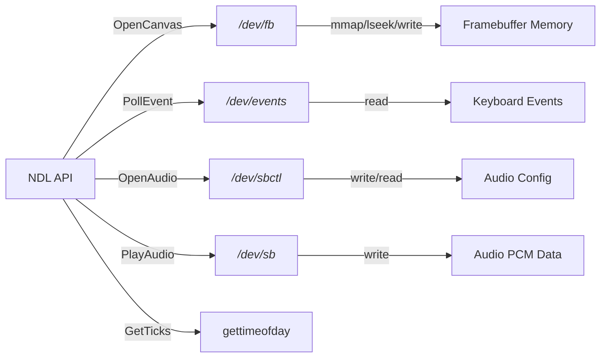

**NWM Integration**:
When running under NWM (NJU Window Manager), NDL uses file descriptors 3, 4, 5 for event pipe, control pipe, and shared framebuffer respectively, instead of the standard device files.

### 3. libminiSDL - SDL 1.2 Compatible Layer

**Purpose**: Provides a subset of the SDL 1.2 API, implemented on top of NDL, enabling porting of SDL-based applications.

**Implemented Modules**:
| Module | Header | Source | Description |
|--------|--------|--------|-------------|
| Video | `sdl-video.h` | `video.c` | Surface creation, blitting, pixel format conversion |
| Event | `sdl-event.h` | `event.c` | Event polling, keyboard state |
| Timer | `sdl-timer.h` | `timer.c` | Timer callbacks, delay |
| Audio | `sdl-audio.h` | `audio.c` | Audio playback, mixing |
| File | `sdl-file.h` | `file.c` | RWops abstraction |
| General | `sdl-general.h` | `general.c` | Init, quit, error handling |

**Key Data Structures**:
```c
typedef struct {
    uint32_t flags;
    SDL_PixelFormat *format;
    int w, h;
    uint16_t pitch;
    uint8_t *pixels;
} SDL_Surface;

typedef struct {
    SDL_Palette *palette;
    uint8_t BitsPerPixel, BytesPerPixel;
    uint8_t Rloss, Gloss, Bloss, Aloss;
    uint8_t Rshift, Gshift, Bshift, Ashift;
    uint32_t Rmask, Gmask, Bmask, Amask;
} SDL_PixelFormat;
```

### 4. libSDL_image - Image Decoding

**Purpose**: Image format support (JPG, PNG, BMP, GIF) using the [stb_image](https://github.com/nothings/stb) library.

**API**:
```c
SDL_Surface* IMG_Load(const char *filename);
SDL_Surface* IMG_Load_RW(SDL_RWops *src, int freesrc);
SDL_Surface* IMG_LoadJPG_RW(SDL_RWops *src);
int IMG_isPNG(SDL_RWops *src);
```

### 5. libSDL_mixer - Audio Mixing

**Purpose**: Multi-channel audio mixing with OGG format support via [stb_vorbis](https://github.com/nothings/stb).

**API**:
```c
int Mix_OpenAudio(int frequency, Uint16 format, int channels, int chunksize);
Mix_Chunk* Mix_LoadWAV_RW(SDL_RWops *src, int freesrc);
Mix_Music* Mix_LoadMUS(const char *file);
int Mix_PlayChannel(int channel, Mix_Chunk *chunk, int loops);
int Mix_PlayMusic(Mix_Music *music, int loops);
```

### 6. libSDL_ttf - Font Rendering

**Purpose**: TrueType font rasterization using [stb_truetype](https://github.com/nothings/stb).

**API**:
```c
TTF_Font* TTF_OpenFont(const char *file, int ptsize);
SDL_Surface* TTF_RenderText_Solid(TTF_Font *font, const char *text, SDL_Color fg);
void TTF_CloseFont(TTF_Font *font);
```

### 7. libvorbis - OGG Audio Decoder

**Purpose**: OGG Vorbis audio decoding, outputting signed 16-bit little-endian PCM.

**Key Types**: `stb_vorbis`, `stb_vorbis_info`, `vorb`, `Codebook`, `Floor0`, `Floor1`, `Residue`, `Mapping`, `Mode`

### 8. libam - Abstract Machine API Bridge

**Purpose**: Implements the [Abstract Machine (AM)](Abstract%20Machine%20(AM).md) API on top of Navy's runtime environment, enabling AM programs to run within Navy.

**Implemented Modules**:
- **TRM** (Turing Machine): `trm.cpp` - `putch()`, `halt()`
- **IOE** (I/O Extension): `ioe.c` - Timer, keyboard, screen, audio via NDL

### 9. libfixedptc - Fixed-Point Math

**Purpose**: Provides fixed-point arithmetic including trigonometric functions (`sin`, `cos`), logarithms, power, and other elementary functions, serving as a lightweight alternative to floating-point.

### 10. libbmp - BMP Image Decoder

**Purpose**: Reads 32-bit BMP format files.

### 11. libbdf - BDF Font Reader

**Purpose**: Reads BDF (Glyph Bitmap Distribution Format) font files.

---

## Applications

### Application List

| Application | Description | Dependencies | Type |
|------------|-------------|-------------|------|
| **nslider** | Slide presentation player (4:3 format) | libminiSDL | Multimedia |
| **menu** | Application launcher menu | libminiSDL | System |
| **nterm** | Terminal emulator with built-in shell | libc | System |
| **bird** | Flappy Bird game (SDL port) | libminiSDL | Game |
| **pal** | 仙剑奇侠传 (Chinese Paladin) | libminiSDL, libfixedptc | Game |
| **am-kernels** | AM benchmark suite (CoreMark, Dhrystone) | libam | Benchmark |
| **fceux** | NES/Famicom emulator | libam | Emulator |
| **oslab0** | Student game collection | libam | Game |
| **nplayer** | Audio player with visualization | libSDL_mixer | Multimedia |
| **lua** | Lua 5.4 script interpreter | libc | Interpreter |
| **busybox** | BusyBox 1.32.0 utility suite | libc | System |
| **onscripter** | NScripter visual novel engine | libminiSDL | Game |
| **nwm** | Window manager (native only) | libndl | System |

### Application Architecture

```mermaid
flowchart TD
    subgraph "SDL-based Apps"
        PAL[PAL - 仙剑奇侠传]
        BIRD[Flappy Bird]
        NSLIDER[Slide Player]
        NPLAYER[Audio Player]
        ONSCRIPTER[NScripter]
    end
    
    subgraph "AM-based Apps"
        FCEUX[NES Emulator]
        AMKERNELS[CoreMark/Dhrystone]
        OSLAB0[Student Games]
    end
    
    subgraph "Terminal Apps"
        NTERM[Terminal]
        LUA[Lua Interpreter]
        BUSYBOX[BusyBox]
        MENU[Launcher Menu]
    end
    
    subgraph "Native-only"
        NWM[Window Manager]
    end
    
    PAL --> MINISDL
    BIRD --> MINISDL
    NSLIDER --> MINISDL
    NPLAYER --> SDLMIXER
    ONSCRIPTER --> MINISDL
    
    FCEUX --> LIBAM
    AMKERNELS --> LIBAM
    OSLAB0 --> LIBAM
    
    NTERM --> LIBC
    LUA --> LIBC
    BUSYBOX --> LIBC
    MENU --> MINISDL
    
    NWM --> NDL
```

### Key Application Details

#### Lua Interpreter
- **Source**: Modified Lua 5.4 with integer-only number support (`LUA_INTONLY_NUMBERS`)
- **Key Types**: `lua_State`, `CallInfo`, `global_State`, `TValue`, `Table`, `Proto`, `Closure`, `TString`
- **Features**: Full Lua runtime with standard libraries (io, os, math, string, table, etc.)

#### PAL (仙剑奇侠传)
- **Source**: Port of SDLPAL to Navy
- **Dependencies**: libminiSDL, libfixedptc
- **Data**: Game data stored in `fsimg/share/games/pal/`

#### FCEUX (NES Emulator)
- **Source**: Modified FCEUX NES emulator running on AM
- **Key Types**: `X6502` (CPU), `PPU_STATE`, `ines_header`, `CartInfo`
- **ROMs**: NES ROMs stored in `fsimg/share/games/nes/`

#### NWM (Window Manager)
- **Purpose**: Multi-window management for Navy applications
- **Protocol**: Uses file descriptors 3 (events), 4 (control), 5 (shared framebuffer)
- **Limitation**: Only runs on native due to mmap requirements

---

## Build System

### Build Flow

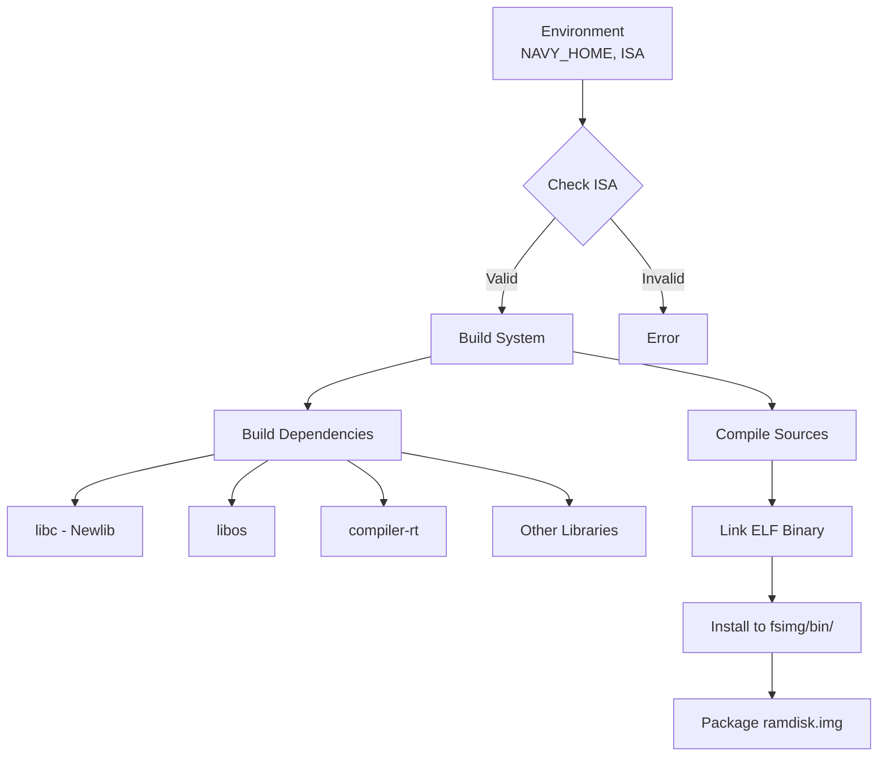

### Makefile Targets

| Target | Description |
|--------|-------------|
| `app` | Build application ELF binary |
| `archive` | Build library archive (`.a`) |
| `install` | Build and copy to `fsimg/bin/` |
| `clean` | Remove build artifacts |
| `clean-all` | Clean all sub-projects |
| `fsimg` | Build and install all specified apps |
| `ramdisk` | Package `fsimg/` into `ramdisk.img` + `ramdisk.h` |

### ISA-Specific Configurations

Scripts in `scripts/` directory provide ISA-specific compiler/linker flags:

| Script | Target | Link Address | Notes |
|--------|--------|-------------|-------|
| `x86.mk` | x86 32-bit | `0x03000000` (or `0x40000000` with VME) | `-m32`, `-march=i386` |
| `mips32.mk` | MIPS32 | - | MIPS cross-compilation |
| `riscv32.mk` | RISC-V 32-bit | - | RV32I |
| `riscv32e.mk` | RISC-V 32-bit E | - | RV32E (16 registers) |
| `riscv64.mk` | RISC-V 64-bit | - | RV64I |
| `loongarch32r.mk` | LoongArch 32-bit | - | LA32R |
| `native.mk` | Native Linux | - | Uses host compiler, `LD_PRELOAD` |
| `am_native.mk` | AM Native | - | Runs on AM's native platform |

### Library Dependency Resolution

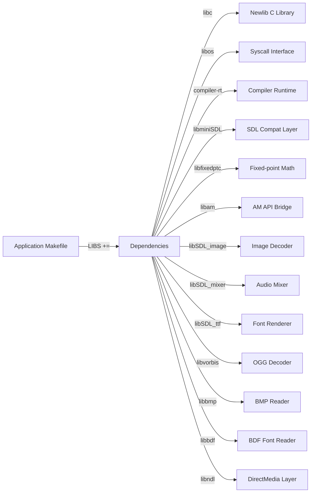

---

## Runtime Environment

### Device File Interface

Navy applications interact with the OS through special device files:

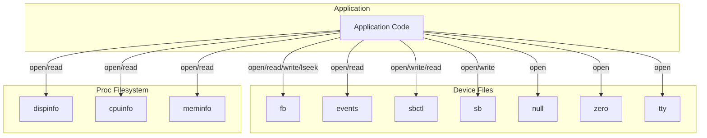

**Device File Specifications**:

| Device | Type | Description |
|--------|------|-------------|
| `/dev/fb` | Write-only | Framebuffer: W×H×4 byte array, 32-bit pixels (00rrggbb), supports lseek |
| `/dev/events` | Read-only | Keyboard events: `kd KEYNAME\n` or `ku KEYNAME\n` |
| `/dev/sbctl` | Read/Write | Audio control: write 3 ints (freq, channels, samples), read free buffer bytes |
| `/dev/sb` | Write-only | PCM audio data stream, no lseek, blocking writes |
| `/dev/null` | Read/Write | Discards all written data, returns empty on read |
| `/dev/zero` | Read/Write | Returns zero-filled data on read |
| `/dev/tty` | Read/Write | Debug console |

**Proc Filesystem Format**:
```
WIDTH : 640
HEIGHT: 480
```

### Event Protocol

Keyboard events use SDL scancode names in uppercase:
- Press: `kd RETURN`
- Release: `ku A`
- Supported keys: All standard keyboard keys (A-Z, 0-9, F1-F12, arrows, modifiers, etc.)

### NWM Window Manager Protocol

For applications running under NWM:
- **FD 3**: Event pipe (same format as `/dev/events`)
- **FD 4**: Graphics control pipe (write window dimensions, read `mmap ok`)
- **FD 5**: Shared memory framebuffer canvas

---

## File System Image

### Structure

```
fsimg/
├── bin/           -- Application binaries (created by `make install`)
├── share/
│   ├── files/     -- Test files for file operations
│   ├── fonts/     -- Font files (BDF, TTF)
│   ├── music/     -- Sample OGG music files
│   ├── pictures/  -- Sample images
│   └── games/
│       ├── nes/   -- NES ROM files
│       └── pal/   -- PAL game data
```

### Ramdisk Packaging

The `ramdisk` target creates:
- `build/ramdisk.img` - Concatenated filesystem image (512-byte aligned)
- `build/ramdisk.h` - File metadata header (path, size, offset)

```c
// Example ramdisk.h entry
{"share/pictures/sample.bmp", 12345, 0},
{"bin/hello", 7890, 12345},
```

---

## Dependencies with Other Modules

### [Abstract Machine (AM)](Abstract%20Machine%20(AM).md)
- Navy Apps provides `libam` which implements AM API on top of Navy's runtime
- AM programs (CoreMark, Dhrystone, NES emulator) run via this bridge
- The `am_native` ISA target runs Navy on AM's native platform

### [Nanos-lite](Nanos-lite.md)
- Primary target OS for Navy applications
- Provides the device file interface (`/dev/fb`, `/dev/events`, etc.)
- Implements the syscall handlers that Navy's `libos` calls into

### [NEMU Emulator](NEMU%20Emulator.md) / [NPC Simulator](NPC%20Simulator.md)
- Navy applications can run on these emulated platforms
- The build system supports multiple ISAs that match NEMU/NPC targets

### [FCEUX NES Emulator](FCEUX%20NES%20Emulator.md)
- The FCEUX app within Navy is a port of the standalone FCEUX emulator
- Runs via `libam` on top of Navy's runtime

### [File System (DFS)](File%20System%20(DFS).md)
- Navy's ramdisk format is consumed by Nanos-lite's simple filesystem
- The `ramdisk.h` metadata format aligns with Nanos-lite's file system expectations

---

## Data Flow Examples

### Graphics Pipeline

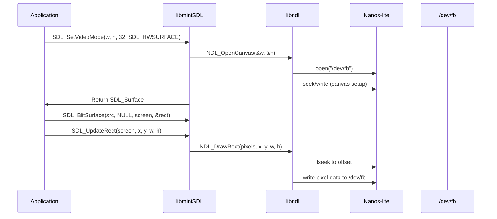

### Audio Pipeline

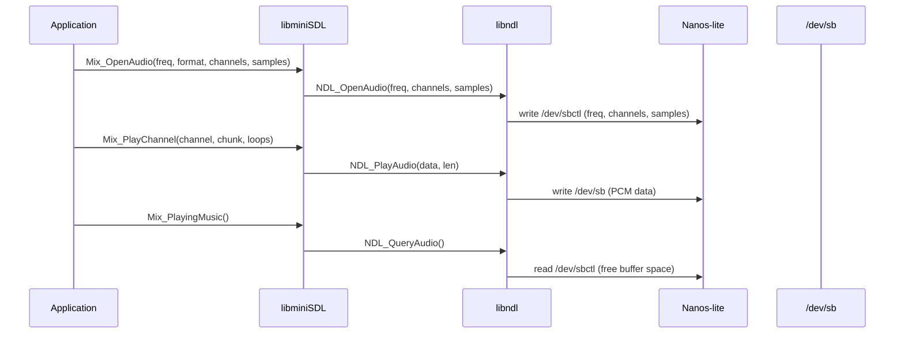

### Event Handling Pipeline

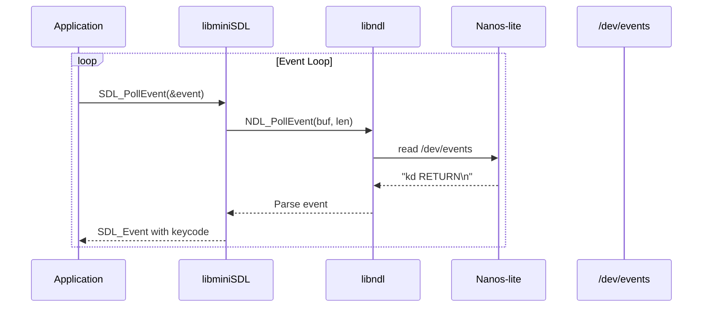

---

## Build and Run Instructions

### Building an Application

```bash
# Set environment
export NAVY_HOME=/path/to/navy-apps

# Build for specific ISA
cd apps/hello
make ISA=x86          # Build
make ISA=x86 install  # Build and install to fsimg

# Build all apps and create ramdisk
cd $NAVY_HOME
make ISA=x86 fsimg    # Build and install specified apps
make ISA=x86 ramdisk  # Package ramdisk.img
```

### Running on Native

```bash
# Build native library
make ISA=native -C libs/libos

# Run application with LD_PRELOAD
cd apps/hello
make ISA=native run mainargs="arg1 arg2"
```

### Running on Nanos-lite

```bash
# Build ramdisk
make ISA=x86 ramdisk

# Copy ramdisk.img to Nanos-lite build directory
cp build/ramdisk.img /path/to/nanos-lite/build/

# Run with NEMU
nemu -b -u /path/to/nanos-lite/build/nanos-lite-x86
```

---

## Summary

Navy Apps is a sophisticated application framework that enables rich multimedia applications to run on minimal operating systems. Its layered architecture—from low-level syscall interface through multimedia abstraction to high-level SDL compatibility—provides a complete runtime environment supporting games, interpreters, media players, and system utilities across multiple ISAs and hardware platforms.
