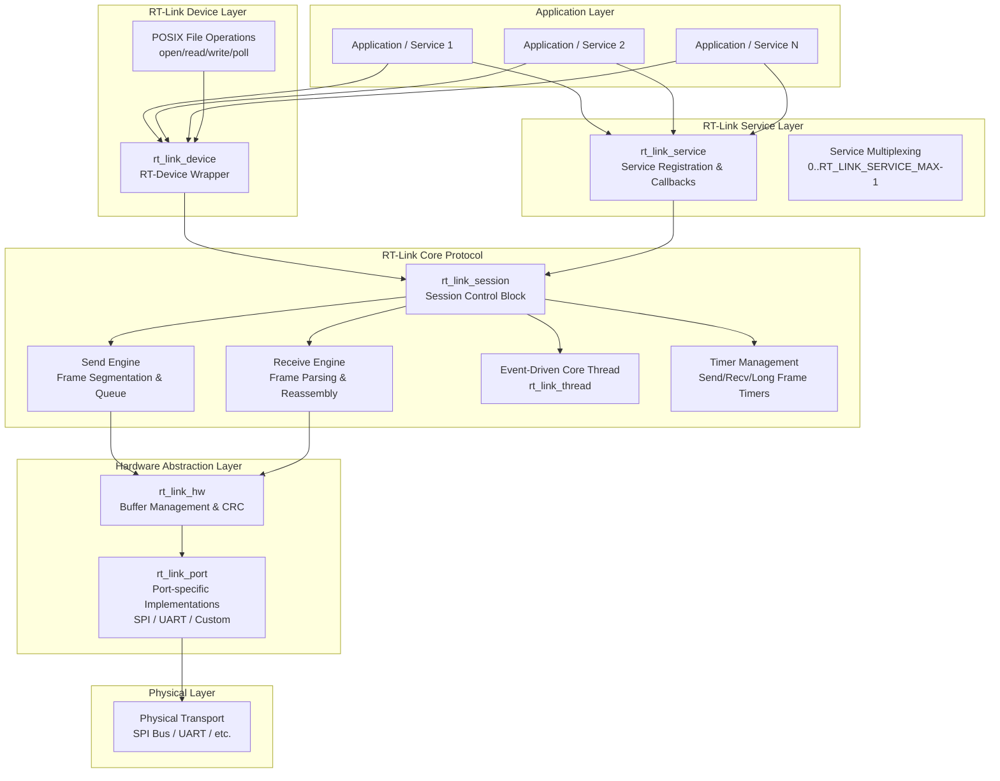
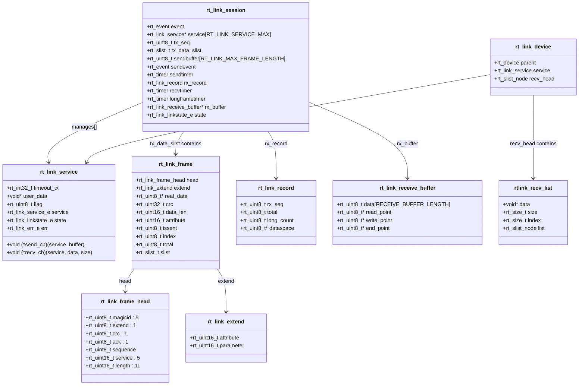
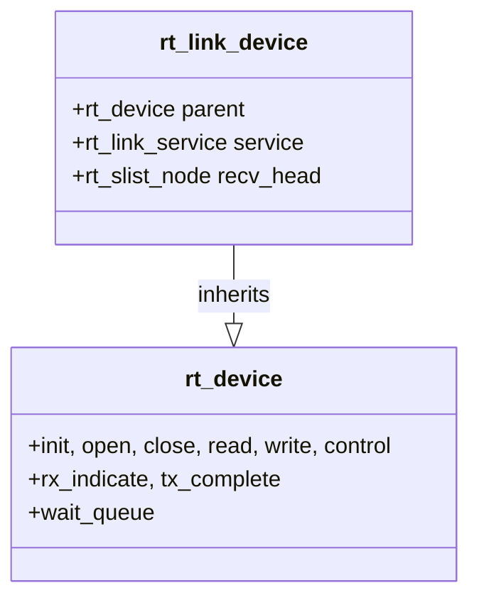
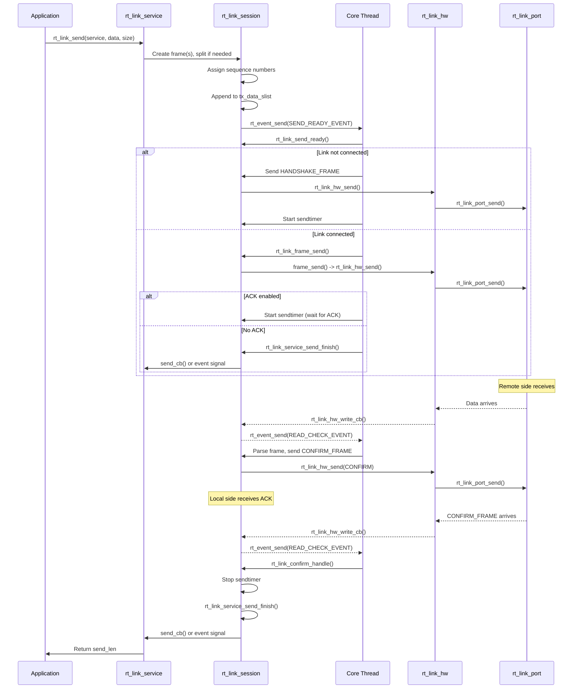
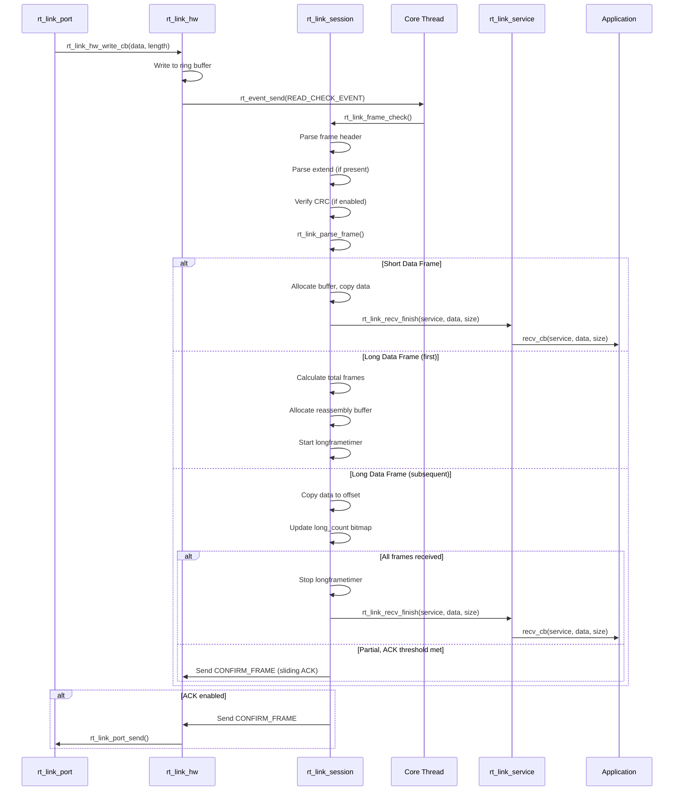
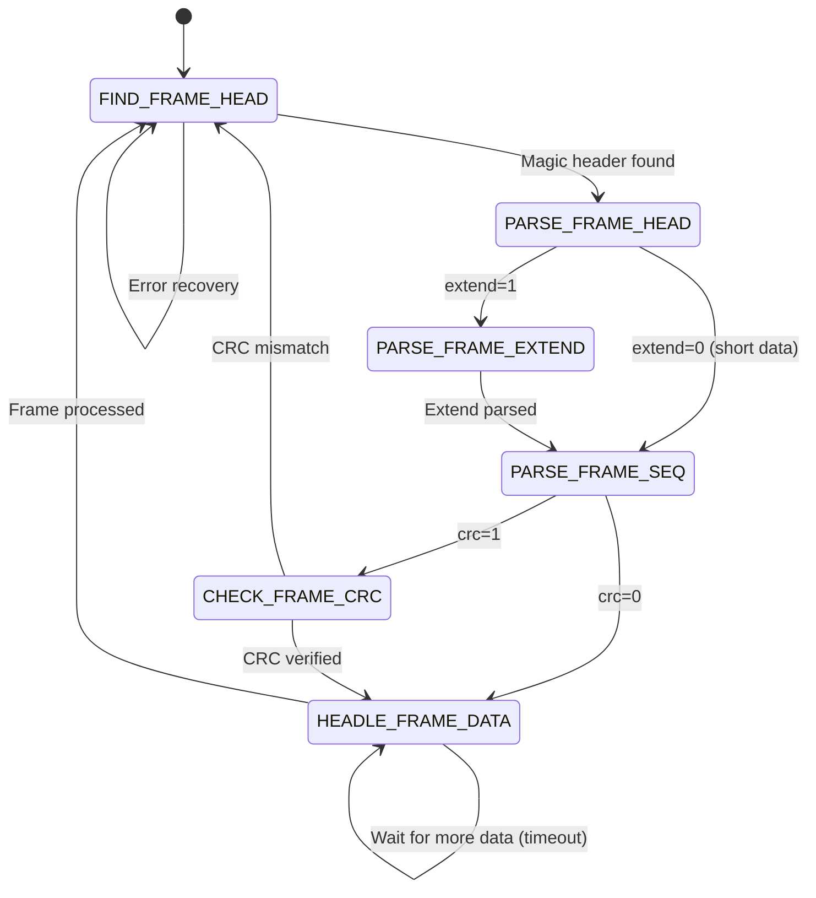
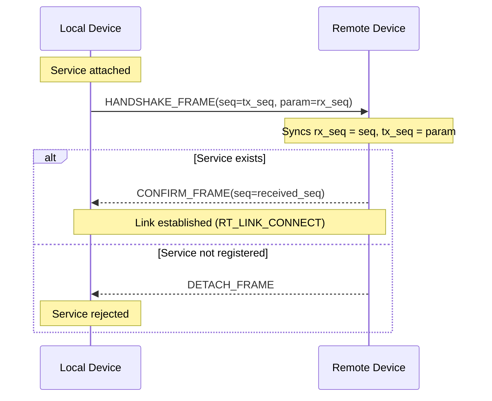
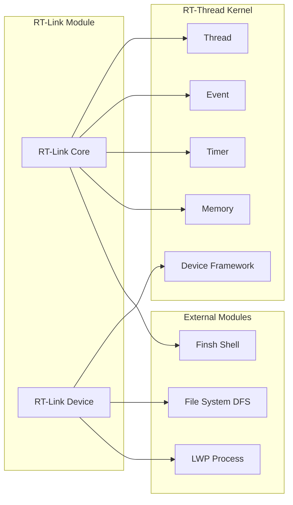

# RT-Link

## Introduction

RT-Link is a lightweight, reliable communication protocol framework within the RT-Thread ecosystem. It provides a **session-oriented**, **service-multiplexed** data link layer that enables efficient and reliable data exchange between two devices (e.g., MCU-to-MCU or MCU-to-module) over various physical transports such as SPI, UART, or other custom hardware interfaces.

The module implements a **frame-based** protocol with support for:
- **Service multiplexing** — up to 31 distinct logical services over a single physical link
- **Reliable transmission** — ACK/NACK with configurable retransmission
- **Data integrity** — CRC32 checksum (software or hardware)
- **Long frame segmentation** — automatic splitting and reassembly of large payloads
- **Flow control** — sliding window ACK for efficient bulk data transfer
- **Session management** — handshake, detach, and timeout handling

RT-Link is designed for resource-constrained embedded systems and is part of the RT-Thread `components/utilities/rt-link` package.

---

## Architecture Overview

RT-Link follows a **layered architecture** with clear separation between the protocol core, hardware abstraction, and device interface layers.



### Component Relationships



---

## Core Components

### 1. Session Control Block (`rt_link_session`)

The `rt_link_session` is the central management structure for the entire RT-Link protocol. There is a **single global instance** (`rt_link_scb`) allocated during initialization.

**Key Fields:**
| Field | Description |
|-------|-------------|
| `event` | Main event object for signaling the core thread (data ready, send ready, timeouts) |
| `service[]` | Array of registered service pointers (up to `RT_LINK_SERVICE_MAX` = 31) |
| `tx_seq` | Transmit sequence number, incremented for each new data frame |
| `tx_data_slist` | Singly-linked list of frames pending transmission |
| `sendbuffer` | Pre-allocated buffer for assembling outgoing frames |
| `sendevent` | Event for blocking send synchronization |
| `sendtimer` | Timer for send timeout/retransmission |
| `rx_record` | Receive state tracking (sequence, long frame reassembly) |
| `recvtimer` | Timer for frame receive timeout |
| `longframetimer` | Timer for long frame reassembly timeout |
| `rx_buffer` | Pointer to the ring buffer for incoming data |
| `calculate_crc` | Function pointer for CRC32 calculation (HW or SW) |
| `state` | Link state: `RT_LINK_INIT`, `RT_LINK_DISCONN`, `RT_LINK_CONNECT` |

### 2. Service Layer (`rt_link_service`)

Services are the **application-facing interface** to RT-Link. Each service represents a logical communication channel multiplexed over the same physical link.

**Service Types (enum `rt_link_service_e`):**
```c
RT_LINK_SERVICE_RTLINK   = 0  // Internal RT-Link management
RT_LINK_SERVICE_SOCKET   = 1  // Socket-like communication
RT_LINK_SERVICE_WIFI     = 2  // WiFi management
RT_LINK_SERVICE_MNGT     = 3  // Management
RT_LINK_SERVICE_MSHTOOLS = 4  // MSH tools
// Expandable to a maximum of 31
```

**Service Configuration:**
| Field | Description |
|-------|-------------|
| `timeout_tx` | Send timeout (`RT_WAITING_FOREVER` for blocking, `RT_WAITING_NO` for non-blocking) |
| `send_cb` | Callback when send completes (non-blocking mode) |
| `recv_cb` | Callback when data is received |
| `user_data` | User-defined context pointer |
| `flag` | Protocol flags: `RT_LINK_FLAG_ACK` (enable ACK), `RT_LINK_FLAG_CRC` (enable CRC) |
| `service` | Service identifier (0-30) |
| `state` | Connection state for this service |
| `err` | Last error code |

### 3. Frame Structure (`rt_link_frame`)

RT-Link uses a compact frame format for efficient data transfer.

**Frame Header (`rt_link_frame_head`):** 4 bytes
```
Bit:  7   6   5   4   3   2   1   0
     +---+---+---+---+---+---+---+---+
  0  |  magicid (5 bits) |ext|CRC|ACK|
     +---+---+---+---+---+---+---+---+
  1  |        sequence (8 bits)       |
     +---+---+---+---+---+---+---+---+
  2  |  service (5)  |   length high  |
     +---+---+---+---+---+---+---+---+
  3  |      length low (8 bits)       |
     +---+---+---+---+---+---+---+---+
```

**Frame Extend (`rt_link_extend`):** 4 bytes (optional, when `extend=1`)
```
  0-1  |  attribute (16 bits) - frame type
  2-3  |  parameter (16 bits) - e.g., total data length for long frames
```

**Frame Types (enum `rt_link_frame_attr_e`):**
| Type | Value | Description |
|------|-------|-------------|
| `RT_LINK_RESEND_FRAME` | 0 | Request retransmission of a specific sequence |
| `RT_LINK_CONFIRM_FRAME` | 1 | Acknowledgment of received data |
| `RT_LINK_HANDSHAKE_FRAME` | 2 | Connection handshake |
| `RT_LINK_DETACH_FRAME` | 3 | Service detachment notification |
| `RT_LINK_SESSION_END` | 4 | Session termination |
| `RT_LINK_LONG_DATA_FRAME` | 5 | Data frame (part of multi-frame message) |
| `RT_LINK_SHORT_DATA_FRAME` | 6 | Data frame (single-frame message) |
| `RT_LINK_RESERVE_FRAME` | 7 | Reserved |

### 4. Receive Buffer (`rt_link_receive_buffer`)

A **ring buffer** that stores raw incoming data from the hardware layer before frame parsing.

- **Size**: `RT_LINK_RECEIVE_BUFFER_LENGTH` = `RT_LINK_MAX_FRAME_LENGTH * RT_LINK_FRAMES_MAX + HEAD + EXTEND`
- **Operations**: Circular read/write with wrap-around handling
- **Key functions**: `rt_link_hw_buffer_write()`, `rt_link_hw_copy()`, `rt_link_hw_buffer_point_shift()`

### 5. Device Wrapper (`rt_link_device`)

The `rt_link_device` wraps RT-Link services as standard RT-Thread devices, enabling use of the familiar `rt_device_open/read/write/close` API and POSIX file operations.



---

## Data Flow

### Send Path



### Receive Path



### Frame Parsing State Machine



---

## Protocol Details

### Frame Size Limits

| Parameter | Value | Description |
|-----------|-------|-------------|
| `RT_LINK_MAX_FRAME_LENGTH` | 1024 bytes | Maximum total frame size |
| `RT_LINK_MAX_DATA_LENGTH` | 1012 bytes | Maximum payload per frame (1024 - 4 header - 4 extend - 4 CRC) |
| `RT_LINK_FRAMES_MAX` | 3 | Maximum number of split frames for a long packet |
| `RT_LINK_ACK_MAX` | 7 | Maximum ACK window size |

### Long Frame Segmentation

When data exceeds `RT_LINK_MAX_DATA_LENGTH` (1012 bytes), it is automatically split into multiple frames:

- **Maximum total payload**: `RT_LINK_MAX_DATA_LENGTH * RT_LINK_FRAMES_MAX` = 1012 × 3 = 3036 bytes
- Each fragment is sent as `RT_LINK_LONG_DATA_FRAME` type
- The `extend.parameter` field carries the **total original data length**
- The receiver uses a bitmap (`long_count`) to track received fragments
- Sliding window ACK: every `RT_LINK_ACK_MAX` (7) fragments, a cumulative ACK is sent

### Handshake Protocol



### Retransmission & Timeout

- **Send timeout**: 100ms (configurable via `RT_LINK_SENT_FRAME_TIMEOUT`)
- **Max retries**: 5 attempts
- **Long frame timeout**: 100ms (50ms for SPI)
- **Max long frame retries**: 5 attempts
- On timeout, a new HANDSHAKE is attempted before retransmission

---

## Error Handling

**Error Codes (enum `rt_link_err_e`):**
| Code | Value | Description |
|------|-------|-------------|
| `RT_LINK_EOK` | 0 | Success |
| `RT_LINK_ERR` | 1 | General error |
| `RT_LINK_ETIMEOUT` | 2 | Timeout |
| `RT_LINK_EFULL` | 3 | Buffer full |
| `RT_LINK_EEMPTY` | 4 | Buffer empty |
| `RT_LINK_ENOMEM` | 5 | Out of memory |
| `RT_LINK_EIO` | 6 | I/O error |
| `RT_LINK_ESESSION` | 7 | Session error |
| `RT_LINK_ESERVICE` | 8 | Service error |

**Error Recovery Flow:**
1. **CRC mismatch**: Frame is discarded, receiver waits for next valid header
2. **Send timeout**: After 5 retries, `RT_LINK_ETIMEOUT` is reported via callback/event
3. **Long frame timeout**: Missing fragments are requested via `RT_LINK_RESEND_FRAME`
4. **Hardware send failure**: `rt_link_port_reconnect()` is called, then retry
5. **Sequence error**: Out-of-order or duplicate frames are silently discarded

---

## API Reference

### Core API

| Function | Description |
|----------|-------------|
| `rt_link_init()` | Initialize RT-Link session, create core thread, timers, and events |
| `rt_link_deinit()` | Deinitialize RT-Link, free resources |
| `rt_link_send(service, data, size)` | Send data through a registered service |
| `rt_link_service_attach(service)` | Register and attach a service to the link |
| `rt_link_service_detach(service)` | Detach and unregister a service |
| `rt_link_get_scb()` | Get pointer to the global session control block |

### Hardware Abstraction API

| Function | Description |
|----------|-------------|
| `rt_link_hw_init()` | Initialize hardware layer (buffer, CRC, port) |
| `rt_link_hw_deinit()` | Deinitialize hardware layer |
| `rt_link_hw_send(data, length)` | Send data through the hardware port |
| `rt_link_hw_write_cb(data, length)` | Callback for hardware to push received data |
| `rt_link_hw_recv_len(buffer)` | Get available data length in receive buffer |
| `rt_link_hw_copy(dst, src, count)` | Copy data from ring buffer (handles wrap) |
| `rt_link_hw_buffer_point_shift(ptr, len)` | Advance a pointer in the ring buffer |

### Port Interface (must be implemented by platform)

| Function | Description |
|----------|-------------|
| `rt_link_port_init()` | Initialize the physical transport |
| `rt_link_port_deinit()` | Deinitialize the physical transport |
| `rt_link_port_reconnect()` | Reconnect the physical transport after error |
| `rt_link_port_send(data, length)` | Send raw bytes over the physical transport |

### Device API

| Function | Description |
|----------|-------------|
| `rt_link_dev_register(rtlink, name, flag, data)` | Register an RT-Link device with the RT-Thread device framework |

### Utility API

| Function | Description |
|----------|-------------|
| `rt_link_utils_num1(n)` | Count number of '1' bits in a 32-bit value |
| `rt_link_sf_crc32_reset()` | Reset software CRC32 context |
| `rt_link_sf_crc32(data, len)` | Calculate software CRC32 |

---

## Configuration (Kconfig)

```
RT_USING_RT_LINK          - Enable RT-Link support
RT_LINK_USING_SF_CRC      - Use software CRC32 table (default)
RT_LINK_USING_HW_CRC      - Use hardware CRC32 device
USING_RT_LINK_DEBUG       - Enable RT-Link core debug output
USING_RT_LINK_HW_DEBUG    - Enable RT-Link hardware debug output
```

---

## Dependencies & Integration

### Internal Dependencies

RT-Link depends on the following RT-Thread kernel components:

| Component | Usage | Reference |
|-----------|-------|-----------|
| **Thread Management** | Core processing thread (`rt_link_thread`) | [RT-Thread Kernel](RT-Thread%20Kernel.md) |
| **Event (IPC)** | Event-driven signaling between components | [RT-Thread Kernel](RT-Thread%20Kernel.md) |
| **Timer Management** | Send/receive/long-frame timeout timers | [RT-Thread Kernel](RT-Thread%20Kernel.md) |
| **Memory Management** | Dynamic allocation of frames and buffers | [RT-Thread Kernel](RT-Thread%20Kernel.md) |
| **Singly Linked List** | Frame queues and receive lists | [RT-Thread Kernel](RT-Thread%20Kernel.md) |
| **Device Framework** | `rt_link_device` wraps as standard device | [RT-Thread Kernel](RT-Thread%20Kernel.md) |
| **CRC (optional HW)** | Hardware CRC acceleration | [Device Drivers Framework](Device%20Drivers%20Framework.md) |

### Integration with Other Modules



- **File System (DFS)**: RT-Link devices support POSIX file operations (`open/read/write/poll`) when `RT_USING_POSIX_DEVIO` is enabled, allowing standard file I/O over the RT-Link protocol.
- **Finsh Shell**: The `rtlink_status` MSH command provides runtime diagnostics of the RT-Link session state.
- **LWP (Light Weight Process)**: RT-Link devices can be used within user-space processes for inter-process communication over the link.

---

## Usage Examples

### Basic Service Registration and Send

```c
#include <rtlink.h>

/* Define service */
static struct rt_link_service my_service;

/* Callback when data is received */
static void recv_cb(struct rt_link_service *service, void *data, rt_size_t size)
{
    /* Process received data */
    rt_kprintf("Received %d bytes from service %d\n", size, service->service);
    rt_free(data);  /* Must free the data buffer */
}

/* Callback when send completes (non-blocking mode) */
static void send_cb(struct rt_link_service *service, void *buffer)
{
    rt_kprintf("Send complete for service %d\n", service->service);
}

int my_app_init(void)
{
    /* Configure service */
    my_service.service = RT_LINK_SERVICE_SOCKET;
    my_service.timeout_tx = RT_WAITING_FOREVER;  /* Blocking send */
    my_service.flag = RT_LINK_FLAG_ACK | RT_LINK_FLAG_CRC;
    my_service.recv_cb = recv_cb;
    my_service.send_cb = send_cb;

    /* Attach service to RT-Link */
    rt_link_service_attach(&my_service);

    return RT_EOK;
}

void my_app_send(void)
{
    const char *msg = "Hello RT-Link!";
    rt_size_t sent = rt_link_send(&my_service, msg, strlen(msg));
    rt_kprintf("Sent %d bytes\n", sent);
}
```

### Device Mode Usage

```c
#include <rtlink_dev.h>

static struct rt_link_device rtlink_dev;

int my_device_init(void)
{
    /* Register as a character device */
    rt_link_dev_register(&rtlink_dev, "rtlink0",
                         RT_DEVICE_FLAG_RDWR, RT_NULL);

    return RT_EOK;
}

void my_device_io(void)
{
    rt_device_t dev;
    char buf[128];
    rt_size_t len;

    /* Open device */
    dev = rt_device_find("rtlink0");
    rt_device_open(dev, RT_DEVICE_OFLAG_RDWR);

    /* Write data */
    rt_device_write(dev, 0, "Hello from device!", 18);

    /* Read data (blocking) */
    len = rt_device_read(dev, 0, buf, sizeof(buf));

    /* Close */
    rt_device_close(dev);
}
```

### Speed Test (from examples)

```c
/* Start a speed test via MSH command */
MSH_CMD_EXPORT(rtlink_exinit, "Initialize RT-Link example services");
MSH_CMD_EXPORT(rtlink_exsend, "Send test data: rtlink_exsend [-l length] [-s type]");
```

---

## Debugging & Diagnostics

The `rtlink_status` MSH command provides real-time diagnostics:

```
msh> rtlink_status
rtlink(v0.2.0) status:
    link status=2           # 0=INIT, 1=DISCONN, 2=CONNECT
    rx seq=10
    tx seq=25
    recv len=0
    long timer state=0
    send timer state=0
    event set=0x00000000
    send data list: NULL
    services [4](0x00000000)
    services [3](0x00000000)
    services [2](0x00000000)
    services [1](0x20001FA0)
    services [0](0x20001F80)
```

---

## References

- [RT-Thread Kernel](RT-Thread%20Kernel.md) — Thread, Event, Timer, Memory, Device Framework
- [Device Drivers Framework](Device%20Drivers%20Framework.md) — Hardware CRC, SPI, UART drivers
- [File System (DFS)](File%20System%20(DFS).md) — POSIX file operations for RT-Link devices
- [Finsh Shell](Finsh%20Shell.md) — MSH command integration
- [LWP (Light Weight Process)](LWP%20(Light%20Weight%20Process).md) — User-space process integration
