# RT-Thread Kernel

## Introduction

The RT-Thread Kernel is the core component of the RT-Thread Real-Time Operating System (RTOS). It provides fundamental OS services including thread management, inter-thread communication (IPC), timer management, memory management, device driver framework, interrupt handling, and scheduler services. The kernel is designed to be highly configurable, scalable from resource-constrained embedded systems (MCU-based) to more complex application processors (MPU-based with MMU support).

This document covers the architecture, core components, and interactions within the RT-Thread Kernel module.

---

## Architecture Overview

The RT-Thread Kernel follows a layered architecture where each subsystem builds upon the foundational services provided by lower layers.

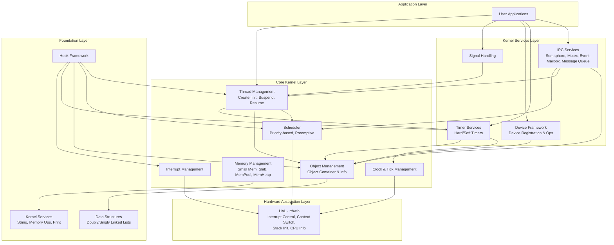
```mermaid
graph TB
    subgraph "Application Layer"
        APP[User Applications]
    end

    subgraph "Kernel Services Layer"
        IPC[IPC Services<br/>Semaphore, Mutex, Event,<br/>Mailbox, Message Queue]
        TIM[Timer Services<br/>Hard/Soft Timers]
        DEV[Device Framework<br/>Device Registration & Ops]
        SIG[Signal Handling]
    end

    subgraph "Core Kernel Layer"
        THR[Thread Management<br/>Create, Init, Suspend, Resume]
        SCH[Scheduler<br/>Priority-based, Preemptive]
        OBJ[Object Management<br/>Object Container & Info]
        MEM[Memory Management<br/>Small Mem, Slab, MemPool, MemHeap]
        CLK[Clock & Tick Management]
        INT[Interrupt Management]
    end

    subgraph "Foundation Layer"
        LIST[Data Structures<br/>Doubly/Singly Linked Lists]
        KSERV[Kernel Services<br/>String, Memory Ops, Print]
        HOOK[Hook Framework]
    end

    subgraph "Hardware Abstraction Layer"
        HAL[HAL - rthw.h<br/>Interrupt Control, Context Switch,<br/>Stack Init, CPU Info]
    end

    APP --> IPC
    APP --> TIM
    APP --> DEV
    APP --> SIG
    APP --> THR

    IPC --> OBJ
    IPC --> THR
    IPC --> SCH
    TIM --> CLK
    TIM --> OBJ
    DEV --> OBJ
    SIG --> THR

    THR --> SCH
    THR --> OBJ
    THR --> TIM
    SCH --> HAL
    OBJ --> LIST
    MEM --> KSERV
    CLK --> HAL
    INT --> HAL
    HOOK --> THR
    HOOK --> SCH
    HOOK --> OBJ
    HOOK --> TIM
    HOOK --> INT
```

---

## Core Components

### 1. Object Management System

The object management system is the foundation of the RT-Thread kernel. Every kernel entity (thread, timer, semaphore, mutex, etc.) is an **rt_object** that is managed within a container system.

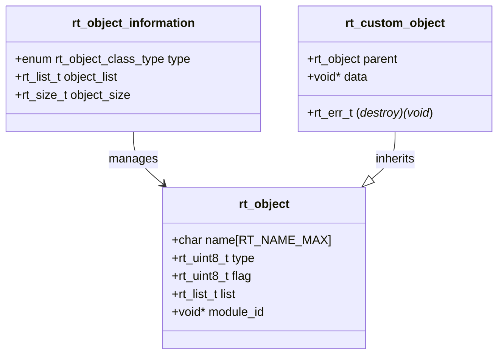
```mermaid
classDiagram
    class rt_object {
        +char name[RT_NAME_MAX]
        +rt_uint8_t type
        +rt_uint8_t flag
        +rt_list_t list
        +void* module_id
    }

    class rt_object_information {
        +enum rt_object_class_type type
        +rt_list_t object_list
        +rt_size_t object_size
    }

    class rt_custom_object {
        +rt_object parent
        +rt_err_t (*destroy)(void*)
        +void* data
    }

    rt_object_information --> rt_object : manages
    rt_custom_object --|> rt_object : inherits
```

**Key Concepts:**
- **Object Types**: Thread, Semaphore, Mutex, Event, MailBox, MessageQueue, MemHeap, MemPool, Device, Timer, Module, Memory, Channel, Custom
- **Object Container**: A static array `_object_container[]` holds information for each object type, including the type, linked list head, and object size
- **Static vs Dynamic**: Objects can be statically initialized (`rt_object_init`) or dynamically allocated (`rt_object_allocate`)
- **Object Lookup**: Objects can be found by name using `rt_object_find()`

**Object Class Type Enum:**
```c
enum rt_object_class_type {
    RT_Object_Class_Thread = 0,
    RT_Object_Class_Semaphore,
    RT_Object_Class_Mutex,
    RT_Object_Class_Event,
    RT_Object_Class_MailBox,
    RT_Object_Class_MessageQueue,
    RT_Object_Class_MemHeap,
    RT_Object_Class_MemPool,
    RT_Object_Class_Device,
    RT_Object_Class_Timer,
    RT_Object_Class_Module,
    RT_Object_Class_Memory,
    RT_Object_Class_Channel,
    RT_Object_Class_Custom,
    RT_Object_Class_Unknown,
};
```

---

### 2. Thread Management

Threads are the fundamental unit of execution in RT-Thread. Each thread has its own stack, priority, time slice, and execution context.

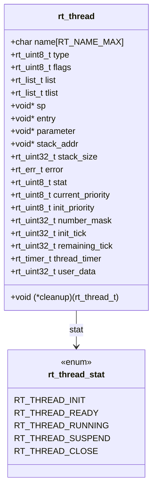
```mermaid
classDiagram
    class rt_thread {
        +char name[RT_NAME_MAX]
        +rt_uint8_t type
        +rt_uint8_t flags
        +rt_list_t list
        +rt_list_t tlist
        +void* sp
        +void* entry
        +void* parameter
        +void* stack_addr
        +rt_uint32_t stack_size
        +rt_err_t error
        +rt_uint8_t stat
        +rt_uint8_t current_priority
        +rt_uint8_t init_priority
        +rt_uint32_t number_mask
        +rt_uint32_t init_tick
        +rt_uint32_t remaining_tick
        +rt_timer_t thread_timer
        +void (*cleanup)(rt_thread_t)
        +rt_uint32_t user_data
    }

    class rt_thread_stat {
        <<enum>>
        RT_THREAD_INIT
        RT_THREAD_READY
        RT_THREAD_RUNNING
        RT_THREAD_SUSPEND
        RT_THREAD_CLOSE
    }

    rt_thread --> rt_thread_stat : stat
```

**Thread States:**
- **RT_THREAD_INIT**: Initial state after creation/initialization
- **RT_THREAD_READY**: Ready to run, in the ready queue
- **RT_THREAD_RUNNING**: Currently executing
- **RT_THREAD_SUSPEND**: Suspended, waiting for a resource or event
- **RT_THREAD_CLOSE**: About to be destroyed

**Thread Lifecycle:**

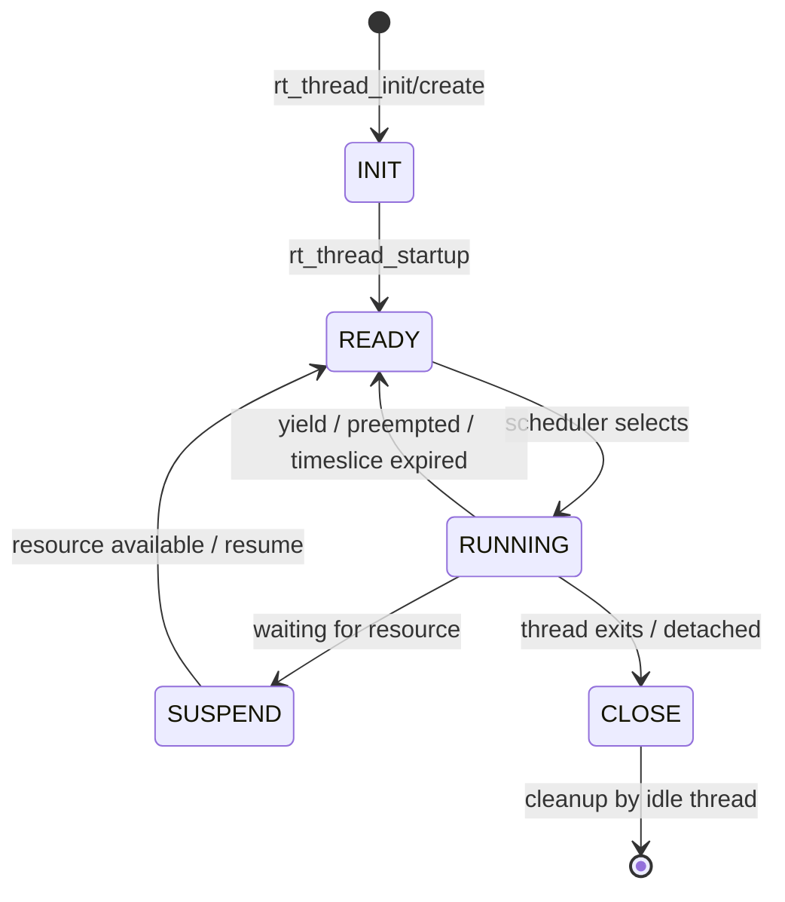
```mermaid
stateDiagram-v2
    [*] --> INIT : rt_thread_init/create
    INIT --> READY : rt_thread_startup
    READY --> RUNNING : scheduler selects
    RUNNING --> READY : yield / preempted / timeslice expired
    RUNNING --> SUSPEND : waiting for resource
    SUSPEND --> READY : resource available / resume
    RUNNING --> CLOSE : thread exits / detached
    CLOSE --> [*] : cleanup by idle thread
```

**Key APIs:**
- `rt_thread_init()` / `rt_thread_create()`: Initialize or create a thread
- `rt_thread_startup()`: Put thread into ready queue
- `rt_thread_suspend()` / `rt_thread_resume()`: Suspend/resume a thread
- `rt_thread_delay()` / `rt_thread_mdelay()`: Delay current thread
- `rt_thread_yield()`: Yield CPU to other threads
- `rt_thread_self()`: Get current running thread
- `rt_thread_detach()` / `rt_thread_delete()`: Remove a thread

**Thread Priority & Scheduling:**
- Supports up to 256 priority levels (configurable via `RT_THREAD_PRIORITY_MAX`)
- Priority 0 is the highest, `RT_THREAD_PRIORITY_MAX - 1` is the lowest (idle thread)
- Bitmap-based ready queue for O(1) scheduling
- Round-robin scheduling among threads of the same priority using time slices

---

### 3. Scheduler

The scheduler implements a **preemptive, priority-based** scheduling algorithm with round-robin for equal-priority threads.

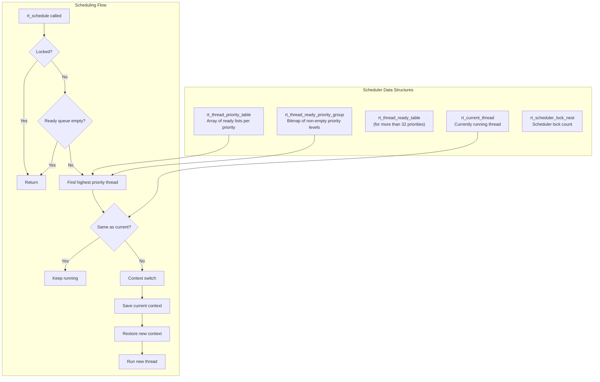
```mermaid
graph TD
    subgraph "Scheduler Data Structures"
        PT["rt_thread_priority_table<br/>Array of ready lists per priority"]
        RG["rt_thread_ready_priority_group<br/>Bitmap of non-empty priority levels"]
        RT["rt_thread_ready_table<br/>(for more than 32 priorities)"]
        CT["rt_current_thread<br/>Currently running thread"]
        SL["rt_scheduler_lock_nest<br/>Scheduler lock count"]
    end

    subgraph "Scheduling Flow"
        A[rt_schedule called] --> B{Locked?}
        B -->|Yes| C[Return]
        B -->|No| D{Ready queue empty?}
        D -->|Yes| C
        D -->|No| E[Find highest priority thread]
        E --> F{Same as current?}
        F -->|Yes| G[Keep running]
        F -->|No| H[Context switch]
        H --> I[Save current context]
        I --> J[Restore new context]
        J --> K[Run new thread]
    end

    PT --> E
    RG --> E
    CT --> F
```

**Scheduler Features:**
- **O(1) Scheduling**: Uses bitmap-based priority lookup for constant-time scheduling
- **Preemptive**: Higher priority threads preempt lower priority ones
- **Time Slicing**: Round-robin among same-priority threads
- **SMP Support**: Separate scheduler for multi-core (see `scheduler_mp.c`)
- **Critical Sections**: `rt_enter_critical()` / `rt_exit_critical()` to lock scheduler
- **Interrupt Context**: Scheduling can occur in interrupt context via `rt_hw_context_switch_interrupt()`

**Key APIs:**
- `rt_system_scheduler_init()`: Initialize scheduler data structures
- `rt_system_scheduler_start()`: Start the scheduler (first thread switch)
- `rt_schedule()`: Trigger a scheduling decision
- `rt_schedule_insert_thread()`: Add thread to ready queue
- `rt_schedule_remove_thread()`: Remove thread from ready queue
- `rt_enter_critical()` / `rt_exit_critical()`: Lock/unlock scheduler

---

### 4. Timer Management

RT-Thread provides both **hard timers** (executed in interrupt context) and **soft timers** (executed in a dedicated timer thread).

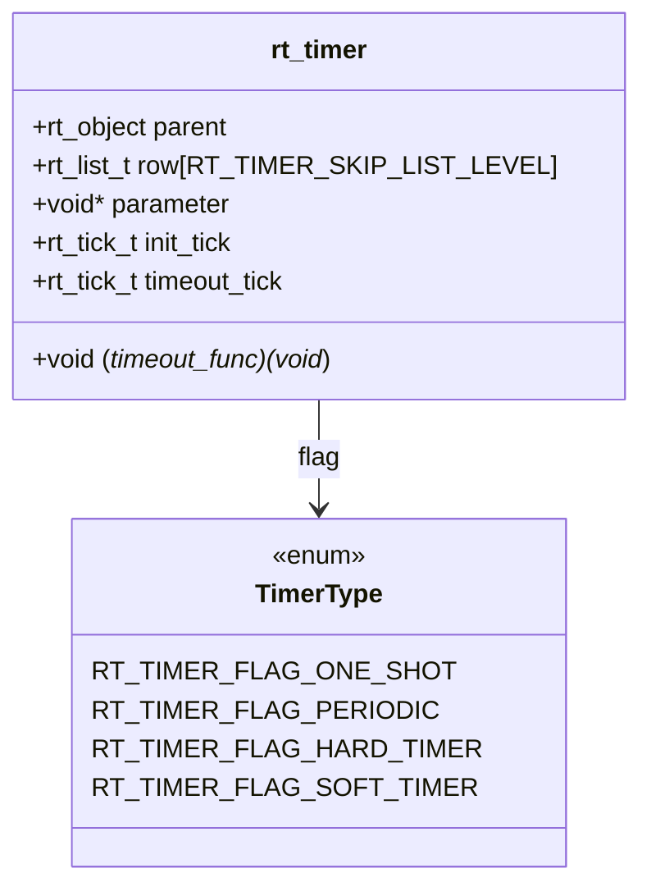
```mermaid
classDiagram
    class rt_timer {
        +rt_object parent
        +rt_list_t row[RT_TIMER_SKIP_LIST_LEVEL]
        +void (*timeout_func)(void*)
        +void* parameter
        +rt_tick_t init_tick
        +rt_tick_t timeout_tick
    }

    class TimerType {
        <<enum>>
        RT_TIMER_FLAG_ONE_SHOT
        RT_TIMER_FLAG_PERIODIC
        RT_TIMER_FLAG_HARD_TIMER
        RT_TIMER_FLAG_SOFT_TIMER
    }

    rt_timer --> TimerType : flag
```

**Timer Implementation:**
- Uses a **skip list** data structure for efficient timer management
- Multiple skip list levels (`RT_TIMER_SKIP_LIST_LEVEL`) for O(log n) insertion
- Hard timers are checked in `rt_timer_check()` called from `rt_tick_increase()`
- Soft timers are managed by a dedicated `_timer_thread`

**Timer Lifecycle:**

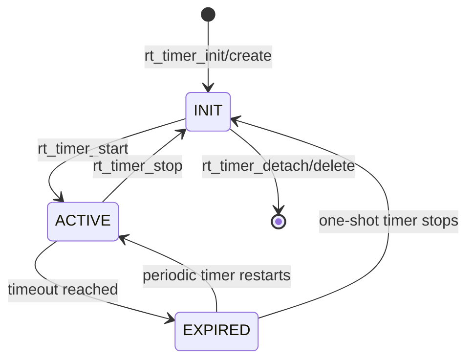
```mermaid
stateDiagram-v2
    [*] --> INIT : rt_timer_init/create
    INIT --> ACTIVE : rt_timer_start
    ACTIVE --> EXPIRED : timeout reached
    EXPIRED --> ACTIVE : periodic timer restarts
    EXPIRED --> INIT : one-shot timer stops
    ACTIVE --> INIT : rt_timer_stop
    INIT --> [*] : rt_timer_detach/delete
```

**Key APIs:**
- `rt_timer_init()` / `rt_timer_create()`: Initialize or create a timer
- `rt_timer_start()` / `rt_timer_stop()`: Start/stop a timer
- `rt_timer_control()`: Get/set timer parameters
- `rt_timer_detach()` / `rt_timer_delete()`: Remove a timer
- `rt_timer_check()`: Check and process expired timers (called from tick ISR)

---

### 5. Inter-Process Communication (IPC)

RT-Thread provides five IPC mechanisms for thread synchronization and communication.

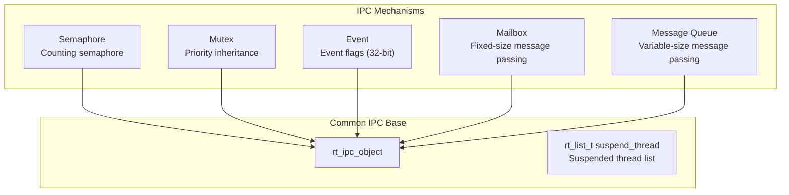
```mermaid
graph TB
    subgraph "IPC Mechanisms"
        SEM["Semaphore<br/>Counting semaphore"]
        MUT["Mutex<br/>Priority inheritance"]
        EVT["Event<br/>Event flags (32-bit)"]
        MB["Mailbox<br/>Fixed-size message passing"]
        MQ["Message Queue<br/>Variable-size message passing"]
    end

    subgraph "Common IPC Base"
        IPC[rt_ipc_object]
        SL[rt_list_t suspend_thread<br/>Suspended thread list]
    end

    SEM --> IPC
    MUT --> IPC
    EVT --> IPC
    MB --> IPC
    MQ --> IPC
```

#### 5.1 Semaphore

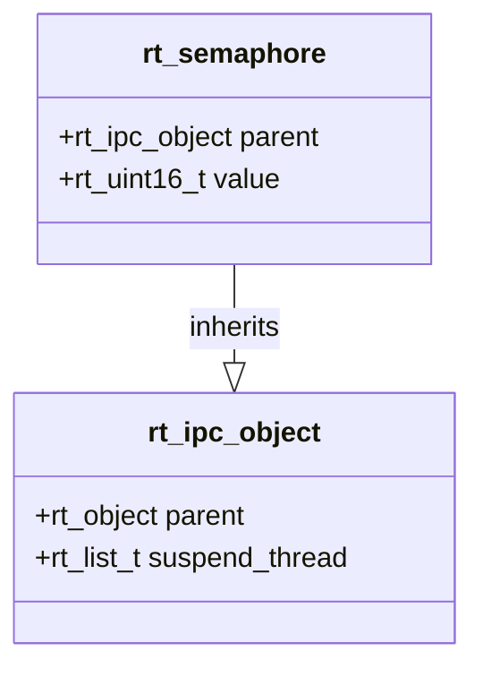
```mermaid
classDiagram
    class rt_semaphore {
        +rt_ipc_object parent
        +rt_uint16_t value
    }

    class rt_ipc_object {
        +rt_object parent
        +rt_list_t suspend_thread
    }

    rt_semaphore --|> rt_ipc_object : inherits
```

- Counting semaphore for resource management and event signaling
- Maximum value: `RT_SEM_VALUE_MAX` (65535)
- Supports FIFO and priority-based waiting queues

**Key APIs:** `rt_sem_init/create`, `rt_sem_take`, `rt_sem_release`, `rt_sem_control`

#### 5.2 Mutex

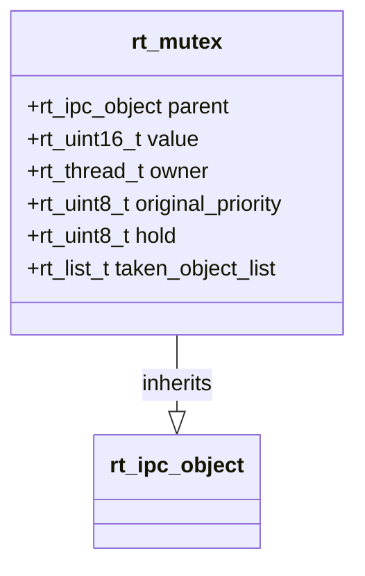
```mermaid
classDiagram
    class rt_mutex {
        +rt_ipc_object parent
        +rt_uint16_t value
        +rt_thread_t owner
        +rt_uint8_t original_priority
        +rt_uint8_t hold
        +rt_list_t taken_object_list
    }

    rt_mutex --|> rt_ipc_object : inherits
```

- Binary semaphore with **priority inheritance** to prevent priority inversion
- Supports **nested locking** (same thread can take mutex multiple times)
- **Priority ceiling** protocol support
- Maximum hold count: `RT_MUTEX_HOLD_MAX` (255)

**Key APIs:** `rt_mutex_init/create`, `rt_mutex_take`, `rt_mutex_release`, `rt_mutex_control`

#### 5.3 Event

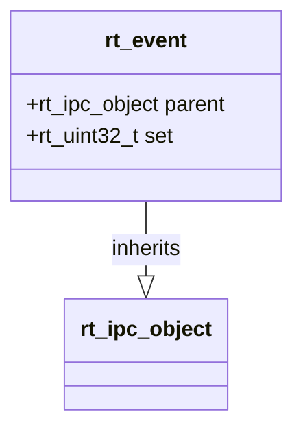
```mermaid
classDiagram
    class rt_event {
        +rt_ipc_object parent
        +rt_uint32_t set
    }

    rt_event --|> rt_ipc_object : inherits
```

- 32-bit event flags for synchronization
- Supports AND/OR/CLEAR logic for event matching
- Threads can wait for any combination of event bits

**Key APIs:** `rt_event_init/create`, `rt_event_send`, `rt_event_recv`, `rt_event_control`

#### 5.4 Mailbox

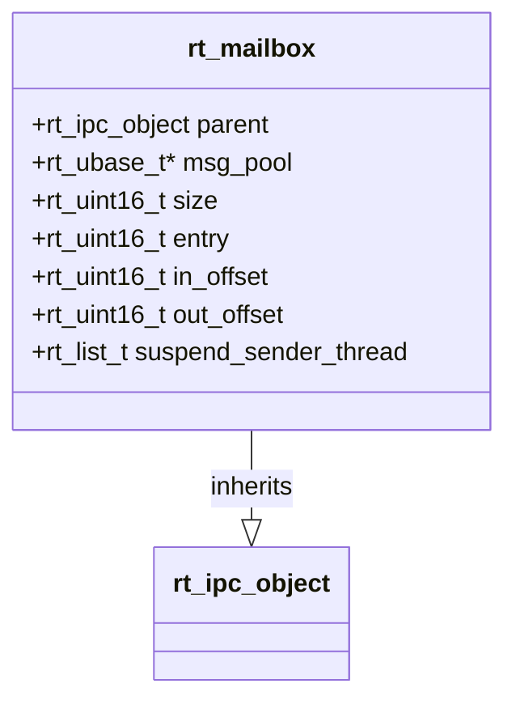
```mermaid
classDiagram
    class rt_mailbox {
        +rt_ipc_object parent
        +rt_ubase_t* msg_pool
        +rt_uint16_t size
        +rt_uint16_t entry
        +rt_uint16_t in_offset
        +rt_uint16_t out_offset
        +rt_list_t suspend_sender_thread
    }

    rt_mailbox --|> rt_ipc_object : inherits
```

- Fixed-size message passing (each message is `rt_ubase_t` - typically a pointer)
- Supports urgent messages (`rt_mb_urgent`)
- Sender can optionally wait when mailbox is full

**Key APIs:** `rt_mb_init/create`, `rt_mb_send`, `rt_mb_send_wait`, `rt_mb_urgent`, `rt_mb_recv`

#### 5.5 Message Queue

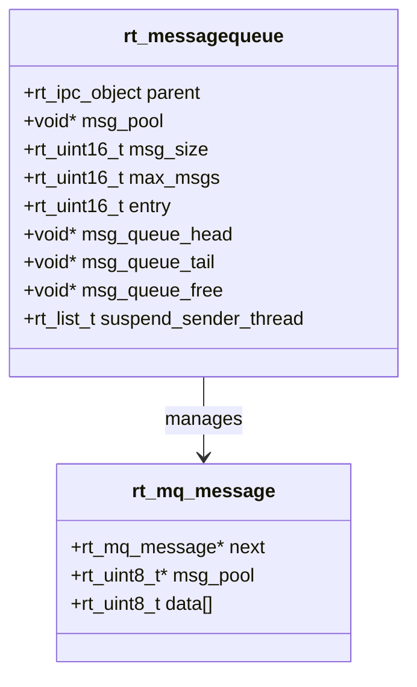
```mermaid
classDiagram
    class rt_messagequeue {
        +rt_ipc_object parent
        +void* msg_pool
        +rt_uint16_t msg_size
        +rt_uint16_t max_msgs
        +rt_uint16_t entry
        +void* msg_queue_head
        +void* msg_queue_tail
        +void* msg_queue_free
        +rt_list_t suspend_sender_thread
    }

    class rt_mq_message {
        +rt_mq_message* next
        +rt_uint8_t* msg_pool
        +rt_uint8_t data[]
    }

    rt_messagequeue --> rt_mq_message : manages
```

- Variable-size message passing
- Messages are copied into/from the queue
- Supports urgent messages and sender waiting

**Key APIs:** `rt_mq_init/create`, `rt_mq_send`, `rt_mq_send_wait`, `rt_mq_urgent`, `rt_mq_recv`

---

### 6. Memory Management

RT-Thread provides multiple memory management algorithms to suit different requirements.

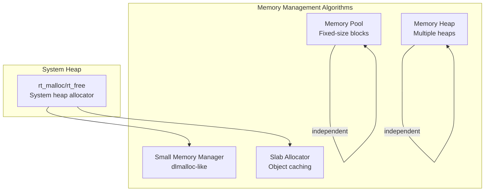
```mermaid
graph TB
    subgraph "Memory Management Algorithms"
        SM[Small Memory Manager<br/>dlmalloc-like]
        SL[Slab Allocator<br/>Object caching]
        MP[Memory Pool<br/>Fixed-size blocks]
        MH[Memory Heap<br/>Multiple heaps]
    end

    subgraph "System Heap"
        SH[rt_malloc/rt_free<br/>System heap allocator]
    end

    SH --> SM
    SH --> SL
    MP -->|independent| MP
    MH -->|independent| MH
```

#### 6.1 Small Memory Manager (`RT_USING_SMALL_MEM`)

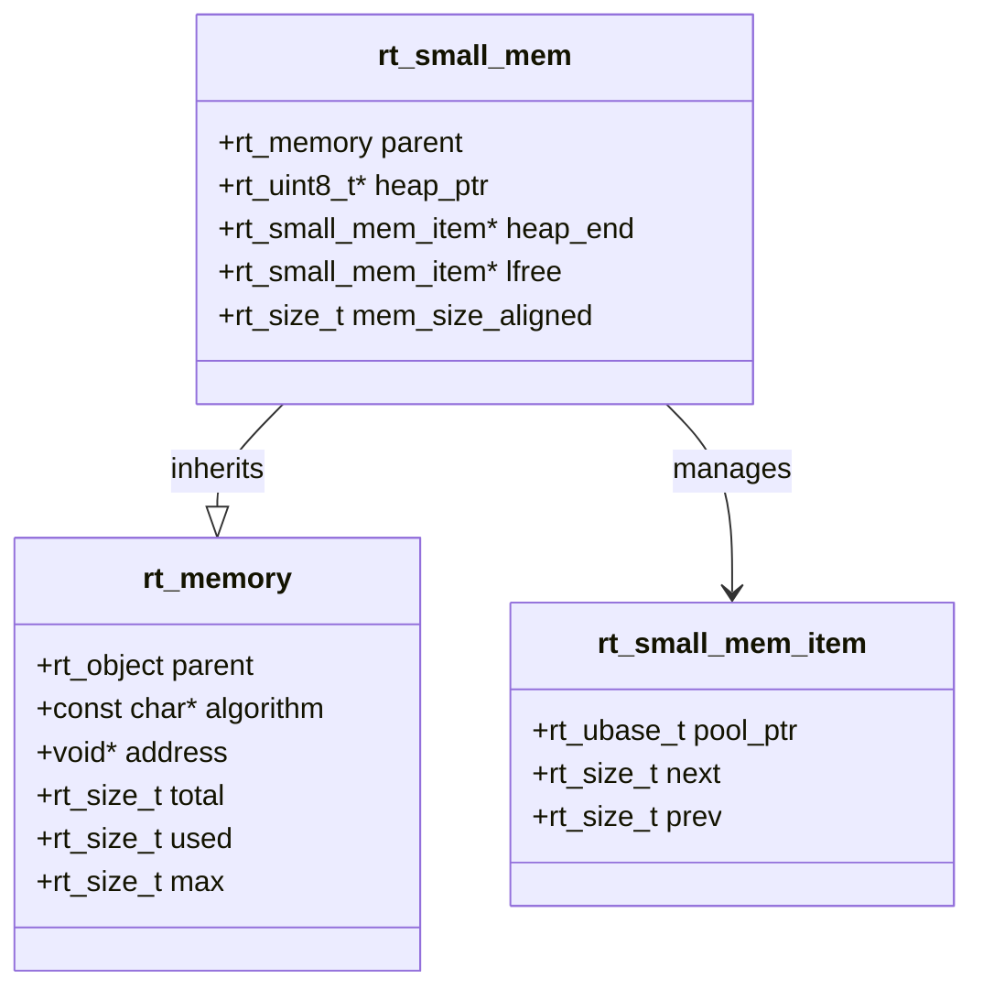
```mermaid
classDiagram
    class rt_small_mem {
        +rt_memory parent
        +rt_uint8_t* heap_ptr
        +rt_small_mem_item* heap_end
        +rt_small_mem_item* lfree
        +rt_size_t mem_size_aligned
    }

    class rt_small_mem_item {
        +rt_ubase_t pool_ptr
        +rt_size_t next
        +rt_size_t prev
    }

    class rt_memory {
        +rt_object parent
        +const char* algorithm
        +void* address
        +rt_size_t total
        +rt_size_t used
        +rt_size_t max
    }

    rt_small_mem --|> rt_memory : inherits
    rt_small_mem --> rt_small_mem_item : manages
```

- Based on the dlmalloc algorithm
- Best-fit allocation strategy
- Memory coalescing on free (plug_holes)
- Low overhead (12 bytes minimum block size on 32-bit)

#### 6.2 Slab Allocator (`RT_USING_SLAB`)

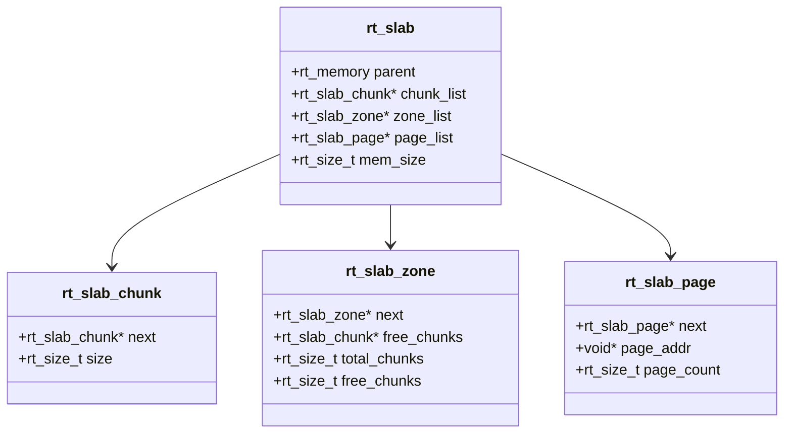
```mermaid
classDiagram
    class rt_slab {
        +rt_memory parent
        +rt_slab_chunk* chunk_list
        +rt_slab_zone* zone_list
        +rt_slab_page* page_list
        +rt_size_t mem_size
    }

    class rt_slab_chunk {
        +rt_slab_chunk* next
        +rt_size_t size
    }

    class rt_slab_zone {
        +rt_slab_zone* next
        +rt_slab_chunk* free_chunks
        +rt_size_t total_chunks
        +rt_size_t free_chunks
    }

    class rt_slab_page {
        +rt_slab_page* next
        +void* page_addr
        +rt_size_t page_count
    }

    rt_slab --> rt_slab_chunk
    rt_slab --> rt_slab_zone
    rt_slab --> rt_slab_page
```

- Efficient for frequent allocation/deallocation of same-sized objects
- Reduces fragmentation by grouping objects of similar sizes
- Supports page-level allocation for large requests

#### 6.3 Memory Pool (`RT_USING_MEMPOOL`)

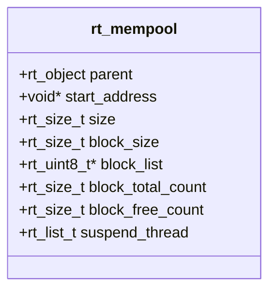
```mermaid
classDiagram
    class rt_mempool {
        +rt_object parent
        +void* start_address
        +rt_size_t size
        +rt_size_t block_size
        +rt_uint8_t* block_list
        +rt_size_t block_total_count
        +rt_size_t block_free_count
        +rt_list_t suspend_thread
    }
```

- Fixed-size block allocation
- Very fast O(1) allocation and deallocation
- Threads can suspend when no blocks available
- Ideal for real-time applications requiring deterministic allocation

#### 6.4 Memory Heap (`RT_USING_MEMHEAP`)

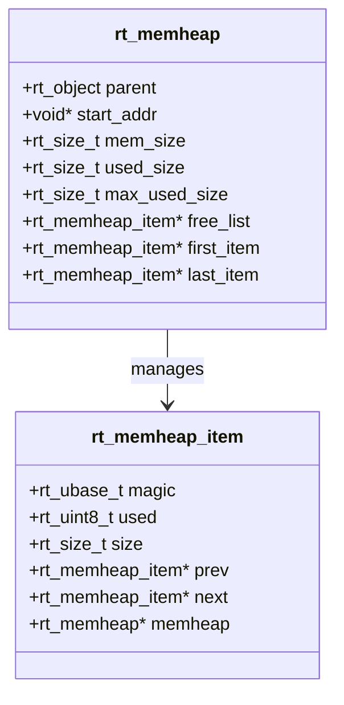
```mermaid
classDiagram
    class rt_memheap {
        +rt_object parent
        +void* start_addr
        +rt_size_t mem_size
        +rt_size_t used_size
        +rt_size_t max_used_size
        +rt_memheap_item* free_list
        +rt_memheap_item* first_item
        +rt_memheap_item* last_item
    }

    class rt_memheap_item {
        +rt_ubase_t magic
        +rt_uint8_t used
        +rt_size_t size
        +rt_memheap_item* prev
        +rt_memheap_item* next
        +rt_memheap* memheap
    }

    rt_memheap --> rt_memheap_item : manages
```

- Supports multiple independent heaps
- Each heap can be placed at different memory regions
- Useful for managing external RAM or special memory regions

---

### 7. Device Driver Framework

The device framework provides a uniform interface for all hardware devices.

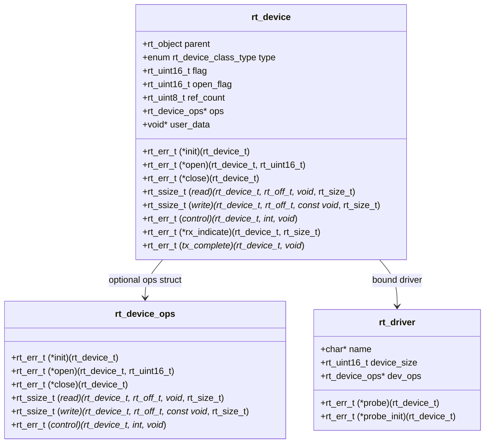
```mermaid
classDiagram
    class rt_device {
        +rt_object parent
        +enum rt_device_class_type type
        +rt_uint16_t flag
        +rt_uint16_t open_flag
        +rt_uint8_t ref_count
        +rt_device_ops* ops
        +rt_err_t (*init)(rt_device_t)
        +rt_err_t (*open)(rt_device_t, rt_uint16_t)
        +rt_err_t (*close)(rt_device_t)
        +rt_ssize_t (*read)(rt_device_t, rt_off_t, void*, rt_size_t)
        +rt_ssize_t (*write)(rt_device_t, rt_off_t, const void*, rt_size_t)
        +rt_err_t (*control)(rt_device_t, int, void*)
        +void* user_data
        +rt_err_t (*rx_indicate)(rt_device_t, rt_size_t)
        +rt_err_t (*tx_complete)(rt_device_t, void*)
    }

    class rt_device_ops {
        +rt_err_t (*init)(rt_device_t)
        +rt_err_t (*open)(rt_device_t, rt_uint16_t)
        +rt_err_t (*close)(rt_device_t)
        +rt_ssize_t (*read)(rt_device_t, rt_off_t, void*, rt_size_t)
        +rt_ssize_t (*write)(rt_device_t, rt_off_t, const void*, rt_size_t)
        +rt_err_t (*control)(rt_device_t, int, void*)
    }

    class rt_driver {
        +char* name
        +rt_uint16_t device_size
        +rt_device_ops* dev_ops
        +rt_err_t (*probe)(rt_device_t)
        +rt_err_t (*probe_init)(rt_device_t)
    }

    rt_device --> rt_device_ops : optional ops struct
    rt_device --> rt_driver : bound driver
```

**Device Types:**
- Character devices (serial, I2C, SPI, etc.)
- Block devices (MMC/SD, NAND, etc.)
- Network devices
- Graphics devices
- Audio devices
- Sensor devices
- RTC, Watchdog, PWM, ADC/DAC, etc.

**Key APIs:**
- `rt_device_register()` / `rt_device_unregister()`: Register/unregister a device
- `rt_device_find()`: Find a device by name
- `rt_device_init()` / `rt_device_open()` / `rt_device_close()`: Device lifecycle
- `rt_device_read()` / `rt_device_write()` / `rt_device_control()`: Device operations
- `rt_device_set_rx_indicate()` / `rt_device_set_tx_complete()`: Set callbacks

---

### 8. Interrupt Management

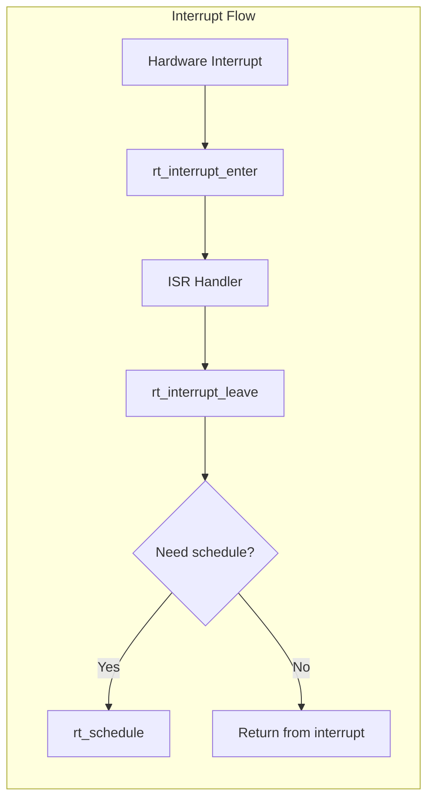
```mermaid
graph LR
    subgraph "Interrupt Flow"
        ISR[Hardware Interrupt] --> EI[rt_interrupt_enter]
        EI --> ISRHandler[ISR Handler]
        ISRHandler --> LI[rt_interrupt_leave]
        LI --> Check{Need schedule?}
        Check -->|Yes| Schedule[rt_schedule]
        Check -->|No| Return[Return from interrupt]
    end
```

**Key Components:**
- `rt_interrupt_nest`: Nested interrupt counter (per-CPU in SMP)
- `rt_interrupt_enter()` / `rt_interrupt_leave()`: Called by BSP at ISR entry/exit
- `rt_interrupt_get_nest()`: Check if in interrupt context
- Hook support for enter/leave events

---

### 9. Clock & Tick Management

```mermaid
graph TD
    subgraph "Tick Processing"
        TimerISR[Hardware Timer ISR] --> TI[rt_tick_increase]
        TI --> Inc[Increment rt_tick]
        TI --> TS[Decrement thread remaining_tick]
        TS --> Expired{remaining_tick == 0?}
        Expired -->|Yes| Yield[Set YIELD flag]
        Yield --> Schedule[rt_schedule]
        Expired -->|No| Continue[Continue]
        TI --> TC[rt_timer_check]
        TC --> Process[Process expired timers]
    end
```

**Key APIs:**
- `rt_tick_get()` / `rt_tick_set()`: Get/set system tick
- `rt_tick_increase()`: Called by timer ISR each tick
- `rt_tick_from_millisecond()`: Convert milliseconds to ticks
- `rt_tick_get_millisecond()`: Get milliseconds since boot

---

### 10. Kernel Services

The kernel provides basic utility functions that are used throughout the system.

**Memory Operations:**
- `rt_memset()`, `rt_memcpy()`, `rt_memmove()`, `rt_memcmp()`

**String Operations:**
- `rt_strlen()`, `rt_strcpy()`, `rt_strncpy()`, `rt_strcmp()`, `rt_strncmp()`
- `rt_strcat()`, `rt_strncat()`, `rt_strstr()`, `rt_strchr()`
- `rt_snprintf()`, `rt_vsnprintf()`, `rt_kprintf()`

**Error Handling:**
- `rt_get_errno()` / `rt_set_errno()`: Per-thread errno
- `rt_strerror()`: Convert error code to string

**Other:**
- `rt_show_version()`: Display RT-Thread version
- `rt_hw_us_delay()`: Microsecond delay (weak, needs BSP implementation)

---

### 11. Data Structures

#### Doubly Linked List (`rt_list_t`)

```c
struct rt_list_node {
    struct rt_list_node *next;
    struct rt_list_node *prev;
};
typedef struct rt_list_node rt_list_t;
```

**Operations:** `rt_list_init`, `rt_list_insert_after`, `rt_list_insert_before`, `rt_list_remove`, `rt_list_isempty`, `rt_list_len`

**Macros:** `rt_list_entry`, `rt_list_for_each`, `rt_list_for_each_safe`, `rt_list_for_each_entry`, `rt_list_first_entry`

#### Singly Linked List (`rt_slist_t`)

```c
struct rt_slist_node {
    struct rt_slist_node *next;
};
typedef struct rt_slist_node rt_slist_t;
```

**Operations:** `rt_slist_init`, `rt_slist_append`, `rt_slist_insert`, `rt_slist_remove`, `rt_slist_first`, `rt_slist_tail`, `rt_slist_next`, `rt_slist_isempty`, `rt_slist_len`

**Macros:** `rt_slist_entry`, `rt_slist_for_each`, `rt_slist_for_each_entry`, `rt_slist_first_entry`

---

### 12. Hook Framework

RT-Thread provides a comprehensive hook system for debugging, profiling, and extending kernel behavior.

```mermaid
graph TB
    subgraph "Available Hooks"
        TH[Thread Hooks<br/>suspend, resume, init]
        SCH[Scheduler Hooks<br/>schedule, switch]
        OBJ[Object Hooks<br/>attach, detach, trytake, take, put]
        TIM[Timer Hooks<br/>enter, exit]
        INT[Interrupt Hooks<br/>enter, leave]
        TICK[Tick Hook]
        MEM[Memory Hooks<br/>malloc, free]
        MP[MemPool Hooks<br/>alloc, free]
        IDLE[Idle Hooks<br/>up to 4]
    end
```

**Hook Configuration:** `RT_USING_HOOK` and `RT_HOOK_USING_FUNC_PTR` must be enabled.

---

### 13. System Initialization

The system boot sequence follows a well-defined initialization order.

```mermaid
graph TD
    Start["Reset Vector"] --> BoardInit["rt_hw_board_init"]
    BoardInit --> ShowVersion["rt_show_version"]
    ShowVersion --> TimerInit["rt_system_timer_init"]
    TimerInit --> SchedInit["rt_system_scheduler_init"]
    SchedInit --> SignalInit["rt_system_signal_init"]
    SignalInit --> AppInit["rt_application_init"]
    AppInit --> TimerThread["rt_system_timer_thread_init"]
    TimerThread --> IdleInit["rt_thread_idle_init"]
    IdleInit --> SchedStart["rt_system_scheduler_start"]
    SchedStart --> MainThread["Main Thread"]
    MainThread --> CompInit["rt_components_init"]
    CompInit --> BoardLevel["INIT_BOARD_EXPORT"]
    BoardLevel --> DeviceLevel["INIT_DEVICE_EXPORT"]
    DeviceLevel --> ComponentLevel["INIT_COMPONENT_EXPORT"]
    ComponentLevel --> EnvLevel["INIT_ENV_EXPORT"]
    EnvLevel --> AppLevel["INIT_APP_EXPORT"]
    AppLevel --> UserMain["User main()"]
```

**Initialization Levels:**
| Level | Macro | Description |
|-------|-------|-------------|
| 0 | `rti_start` | Start marker |
| 0.end | `rti_board_start` | Board start marker |
| 1 | `INIT_BOARD_EXPORT` | Board-level hardware init |
| 1.end | `rti_board_end` | Board end marker |
| 2 | `INIT_PREV_EXPORT` | Pre-device init |
| 3 | `INIT_DEVICE_EXPORT` | Device drivers init |
| 4 | `INIT_COMPONENT_EXPORT` | Components init (DFS, lwIP, etc.) |
| 5 | `INIT_ENV_EXPORT` | Environment init (mount, etc.) |
| 6 | `INIT_APP_EXPORT` | Application init |
| 6.end | `rti_end` | End marker |

---

### 14. SMP Support

RT-Thread supports Symmetric Multi-Processing (SMP) for multi-core systems.

```mermaid
graph TB
    subgraph "SMP Architecture"
        CPU0[CPU 0<br/>Boot Core]
        CPU1[CPU 1<br/>Application Core]
        CPUN[CPU N<br/>Application Core]
    end

    subgraph "Per-CPU Data"
        TICK0[tick]
        NEST0[irq_nest]
        CURRENT0[current_thread]
        PRIO0[current_priority]
        NEED0[need_schedule]
    end

    CPU0 --> TICK0
    CPU0 --> NEST0
    CPU0 --> CURRENT0
    CPU1 --> TICK1[tick]
    CPU1 --> NEST1[irq_nest]
    CPU1 --> CURRENT1[current_thread]
```

**SMP Features:**
- Per-CPU ready queues and scheduling
- Inter-Processor Interrupts (IPI) for cross-core scheduling
- Spinlocks for critical sections
- Thread affinity (binding threads to specific CPUs)
- Separate idle thread per CPU

**Key Files:**
- `scheduler_up.c`: Uniprocessor scheduler
- `scheduler_mp.c`: Multiprocessor scheduler
- `cpu.c`: CPU management

---

## Module Dependencies

```mermaid
graph TB
    subgraph "RT-Thread Kernel"
        KERNEL[Kernel Core]
        THREAD[Thread Management]
        SCHED[Scheduler]
        IPC[IPC Services]
        TIMER[Timer]
        MEM[Memory Management]
        DEV[Device Framework]
        OBJ[Object Management]
    end

    subgraph "External Modules"
        DFS[File System - DFS]
        DRIVERS[Device Drivers]
        LWP[Light Weight Process]
        MM[Memory Management - MM]
        FINSH[Finsh Shell]
        ULOG[ULog]
        UTEST[UTest]
    end

    KERNEL --> OBJ
    KERNEL --> THREAD
    KERNEL --> SCHED
    KERNEL --> TIMER
    KERNEL --> MEM
    KERNEL --> DEV

    DFS --> KERNEL
    DFS --> DEV
    DRIVERS --> DEV
    LWP --> THREAD
    LWP --> MEM
    LWP --> SCHED
    MM --> MEM
    FINSH --> KERNEL
    ULOG --> KERNEL
    UTEST --> KERNEL
```

---

## Configuration Options

The kernel behavior is highly configurable through `rtconfig.h`. Key configuration macros:

| Macro | Description |
|-------|-------------|
| `RT_THREAD_PRIORITY_MAX` | Maximum number of priority levels (8, 32, 256) |
| `RT_TICK_PER_SECOND` | Number of ticks per second |
| `RT_ALIGN_SIZE` | Memory alignment size |
| `RT_NAME_MAX` | Maximum length of object names |
| `RT_USING_SEMAPHORE` | Enable semaphore support |
| `RT_USING_MUTEX` | Enable mutex support |
| `RT_USING_EVENT` | Enable event support |
| `RT_USING_MAILBOX` | Enable mailbox support |
| `RT_USING_MESSAGEQUEUE` | Enable message queue support |
| `RT_USING_MEMPOOL` | Enable memory pool support |
| `RT_USING_MEMHEAP` | Enable memory heap support |
| `RT_USING_SMALL_MEM` | Enable small memory manager |
| `RT_USING_SLAB` | Enable slab allocator |
| `RT_USING_DEVICE` | Enable device framework |
| `RT_USING_TIMER_SOFT` | Enable soft timers |
| `RT_USING_SIGNALS` | Enable signal handling |
| `RT_USING_HOOK` | Enable hook framework |
| `RT_USING_SMP` | Enable SMP support |
| `RT_USING_HEAP` | Enable heap memory allocation |
| `RT_USING_CONSOLE` | Enable console output |
| `RT_USING_COMPONENTS_INIT` | Enable automatic component initialization |

---

## References

- [Device Drivers Framework](Device%20Drivers%20Framework.md) - Detailed documentation of device driver implementations
- [File System (DFS)](File%20System%20(DFS).md) - Virtual file system layer
- [Memory Management](Memory%20Management.md) - Advanced memory management (MMU, page allocator)
- [LWP (Light Weight Process)](LWP%20(Light%20Weight%20Process).md) - Process management and user-space support
- [Finsh Shell](Finsh%20Shell.md) - Command-line debugging interface
- [ULog](ULog.md) - Logging system
- [UTest](UTest.md) - Unit testing framework
