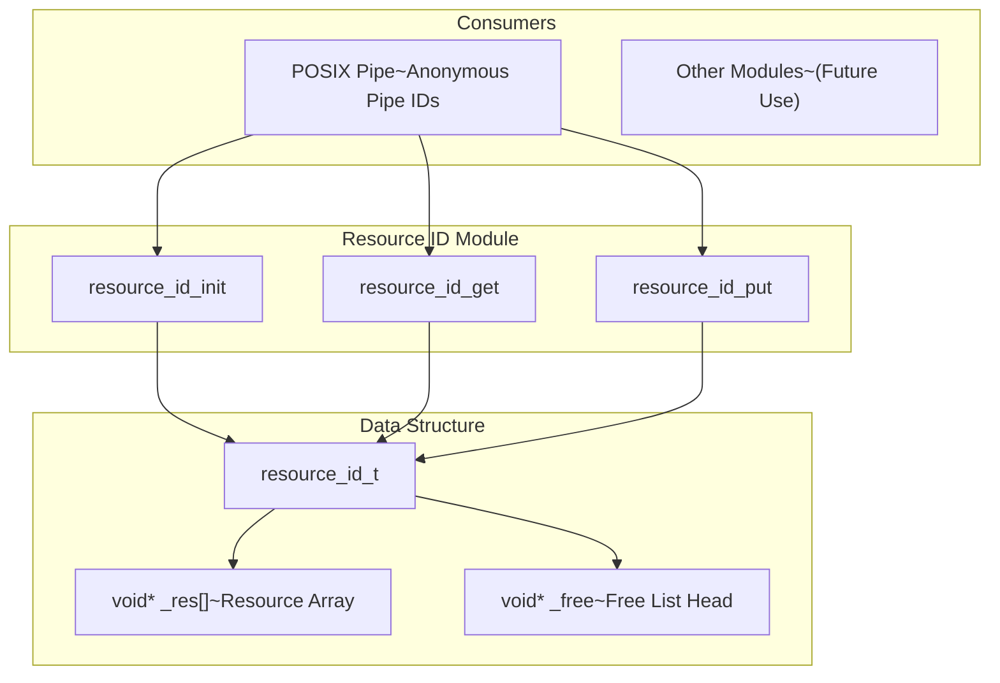
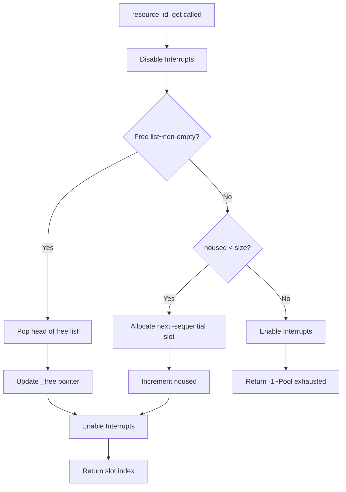
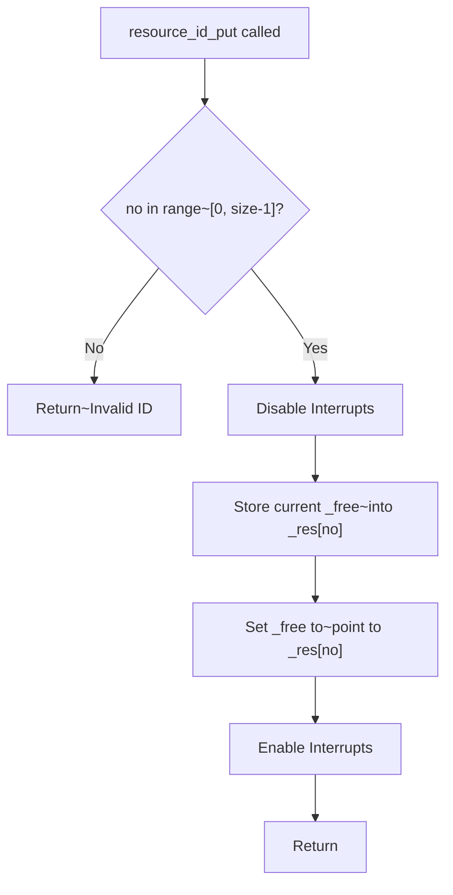
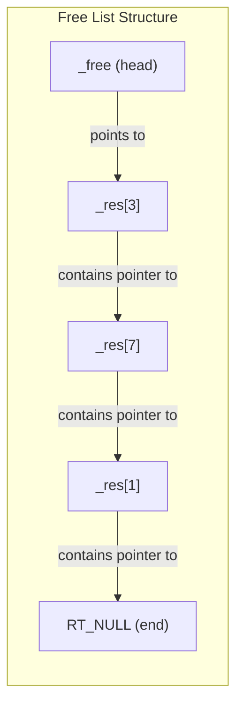

# Resource ID

## Introduction

The Resource ID module provides a lightweight, efficient **resource identifier allocation and management** system for RT-Thread. It implements a simple free-list-based ID allocator that manages a fixed-size pool of resource slots, allowing consumers to obtain unique integer IDs for resources and return them when no longer needed.

This module is primarily used by the POSIX pipe implementation to manage anonymous pipe numbers, but its design is generic enough to be used for any scenario requiring a fixed-size pool of reusable integer identifiers.

---

## Architecture Overview

The Resource ID module follows a minimal design pattern with a single data structure and three API functions. It uses a **free-list** approach to track available resource slots, providing O(1) allocation and deallocation.



---

## Core Components

### 1. Resource ID Structure (`resource_id_t`)

The `resource_id_t` structure is the central data structure that manages a pool of resource identifiers.

```c
typedef struct
{
    int size;       /**< Total number of resource slots in the pool */
    void **_res;    /**< Pointer to the resource array (array of void* pointers) */
    int noused;     /**< Number of slots currently allocated (used as next free index) */
    void **_free;   /**< Head of the free list (linked list of freed slots) */
} resource_id_t;
```

**Field Descriptions:**

| Field | Type | Description |
|-------|------|-------------|
| `size` | `int` | Total capacity of the resource pool (maximum number of IDs that can be allocated) |
| `_res` | `void **` | Pointer to the pre-allocated array of `void*` pointers that serves as the resource slot storage |
| `noused` | `int` | Number of slots currently in use; also serves as the index for the next sequential allocation when the free list is empty |
| `_free` | `void **` | Head pointer of the free list — a singly linked list threaded through the `_res` array entries that have been freed |

### 2. Initialization Macro (`RESOURCE_ID_INIT`)

```c
#define RESOURCE_ID_INIT(size, pool)  {size, pool, 0, RT_NULL}
```

This macro provides a convenient way to statically initialize a `resource_id_t` instance with:
- `size`: The total number of resource slots
- `pool`: The pre-allocated array of `void*` pointers
- `noused` initialized to `0`
- `_free` initialized to `RT_NULL` (empty free list)

---

## API Reference

### `resource_id_init()`

```c
void resource_id_init(resource_id_t *mgr, int size, void **res);
```

**Purpose:** Initialize a resource ID manager with a given pool size and storage array.

**Parameters:**
- `mgr`: Pointer to the `resource_id_t` structure to initialize
- `size`: Total number of resource slots
- `res`: Pointer to the pre-allocated array of `void*` pointers

**Behavior:**
- Sets `mgr->size = size`
- Sets `mgr->_res = res`
- Sets `mgr->noused = 0`
- Sets `mgr->_free = RT_NULL`
- If `mgr` is `RT_NULL`, the function does nothing

---

### `resource_id_get()`

```c
int resource_id_get(resource_id_t *mgr);
```

**Purpose:** Allocate a resource ID from the manager.

**Parameters:**
- `mgr`: Pointer to the `resource_id_t` structure

**Returns:**
- A non-negative integer ID on success (0 to `size - 1`)
- `-1` if all resource slots are exhausted

**Behavior:**
1. Disables interrupts (enters critical section)
2. If the free list is non-empty (`mgr->_free != RT_NULL`):
   - Pops the head of the free list
   - Updates `mgr->_free` to point to the next free node
   - Returns the index of the allocated slot
3. Else if there are still unused slots (`mgr->noused < mgr->size`):
   - Allocates the next sequential slot (`mgr->_res[mgr->noused]`)
   - Increments `mgr->noused`
   - Returns the index of the allocated slot
4. Otherwise, returns `-1` (pool exhausted)
5. Re-enables interrupts before returning

**Thread Safety:** This function is thread-safe and interrupt-safe as it disables interrupts during the critical section.

**Time Complexity:** O(1)

---

### `resource_id_put()`

```c
void resource_id_put(resource_id_t *mgr, int no);
```

**Purpose:** Return (free) a previously allocated resource ID back to the pool.

**Parameters:**
- `mgr`: Pointer to the `resource_id_t` structure
- `no`: The resource ID to free (must be in range `[0, size - 1]`)

**Behavior:**
1. Validates that `no` is in range `[0, mgr->size - 1]`
2. Disables interrupts (enters critical section)
3. Stores the current free list head pointer into `mgr->_res[no]`
4. Sets `mgr->_free` to point to `&mgr->_res[no]` (inserts at head of free list)
5. Re-enables interrupts

**Thread Safety:** This function is thread-safe and interrupt-safe as it disables interrupts during the critical section.

**Time Complexity:** O(1)

---

## Data Flow

### Allocation Flow



### Deallocation Flow



---

## Free List Mechanism

The Resource ID module uses an **intrusive free list** threaded through the resource array itself. This design avoids the need for additional memory allocation for free list nodes.



**How it works:**
1. When a slot is freed via `resource_id_put()`, the current `_free` pointer is stored in that slot's array entry, and `_free` is updated to point to that slot
2. When a slot is allocated via `resource_id_get()`, the head of the free list is popped, and `_free` is updated to the next entry in the chain
3. The free list is a singly linked list threaded through the `_res` array — no extra memory is needed

**Advantages:**
- No additional memory allocation for free list management
- O(1) allocation and deallocation
- Simple and lightweight

---

## Usage Example

The primary consumer of the Resource ID module is the **POSIX Pipe** implementation in RT-Thread. Below is how it is used:

```c
#include <resource_id.h>

/* Define the resource pool size */
#define RT_UNAMED_PIPE_NUMBER 64

/* Pre-allocate the resource array */
static void *resoure_id[RT_UNAMED_PIPE_NUMBER];

/* Initialize the resource ID manager using the macro */
static resource_id_t id_mgr = RESOURCE_ID_INIT(RT_UNAMED_PIPE_NUMBER, resoure_id);

/* Allocate a pipe number */
int pipe(int fildes[2])
{
    rt_pipe_t *pipe;
    char dname[8];
    int pipeno = 0;

    /* Get a unique pipe number */
    pipeno = resource_id_get(&id_mgr);
    if (pipeno == -1)
    {
        return -1;  /* No more pipe IDs available */
    }

    /* Create the pipe with the allocated number */
    rt_snprintf(dname, sizeof(dname), "pipe%d", pipeno);
    pipe = rt_pipe_create(dname, RT_USING_POSIX_PIPE_SIZE);
    if (pipe == RT_NULL)
    {
        resource_id_put(&id_mgr, pipeno);  /* Return the ID on failure */
        return -1;
    }

    pipe->pipeno = pipeno;
    /* ... continue with pipe setup ... */
    return 0;
}

/* Free a pipe number when the pipe is deleted */
int rt_pipe_delete(const char *name)
{
    /* ... */
    resource_id_put(&id_mgr, pipe->pipeno);
    /* ... */
}
```

---

## Dependencies

### Internal Dependencies

| Dependency | Description |
|------------|-------------|
| `rthw.h` | Required for `rt_hw_interrupt_disable()` / `rt_hw_interrupt_enable()` for critical section protection |
| `rtthread.h` | Required for RT-Thread base types and `RT_NULL` definition |

### Consumers

| Consumer Module | Description |
|-----------------|-------------|
| [RT-Thread Kernel]([RT-Thread Kernel].md) — POSIX Pipe | Uses Resource ID to manage anonymous pipe numbers (`pipe()` system call) |

The Resource ID module is compiled when `RT_USING_POSIX_PIPE` is enabled in the RT-Thread configuration (see `SConscript`).

---

## Design Considerations

### 1. Fixed-Size Pool
The resource pool size is determined at compile time. The consumer must pre-allocate an array of `void*` pointers of the desired size. This makes the module suitable for scenarios with a known maximum number of resources.

### 2. Interrupt Safety
Both `resource_id_get()` and `resource_id_put()` disable interrupts during their critical sections, making them safe to call from both thread context and interrupt context.

### 3. No Dynamic Memory
The module does not perform any dynamic memory allocation. All storage is provided by the consumer at initialization time.

### 4. Sequential Allocation with Free List
The allocator uses a hybrid approach:
- Initially, IDs are allocated sequentially (0, 1, 2, ...) using the `noused` counter
- After some IDs are freed, subsequent allocations reuse freed IDs from the free list
- This ensures that freed IDs are reused before new sequential IDs are allocated

### 5. No ID Reuse Validation
The module does not track which IDs are currently in use. It is the consumer's responsibility to ensure that:
- An ID is not freed twice (double-free)
- An ID is not used after being freed (use-after-free)

---

## Comparison with Other Allocation Schemes

| Feature | Resource ID | Bitmap Allocator | Linked List Allocator |
|---------|-------------|------------------|----------------------|
| Allocation Time | O(1) | O(n) worst-case | O(1) |
| Deallocation Time | O(1) | O(1) | O(1) |
| Memory Overhead | None (intrusive) | Bitmap storage | Pointer storage |
| Max Capacity | Configurable | Configurable | Configurable |
| Interrupt Safe | Yes | Yes | Yes |
| Dynamic Memory | No | No | No |

---

## References

- [RT-Thread Kernel]([RT-Thread Kernel].md) — Core kernel documentation including thread management, IPC, and memory management
- [File System (DFS)]([File System (DFS)].md) — File system layer that interacts with pipe devices
