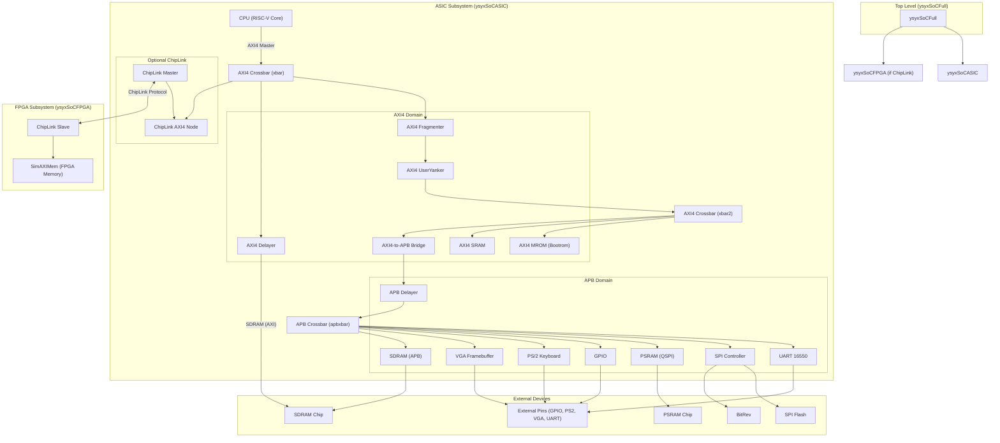
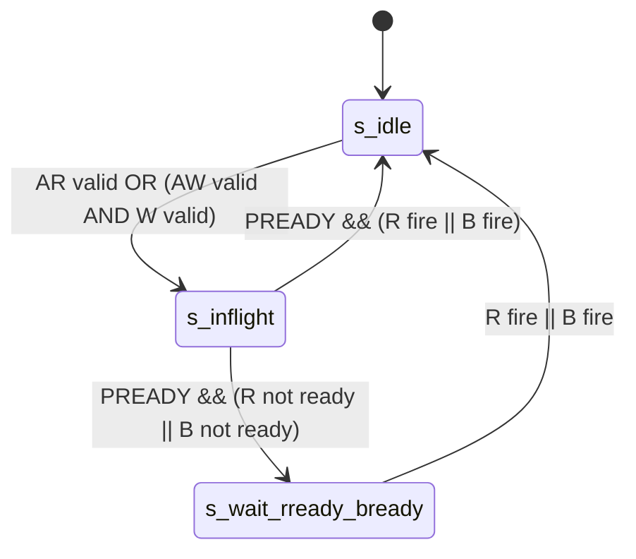
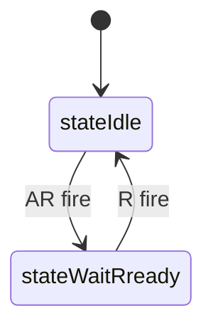
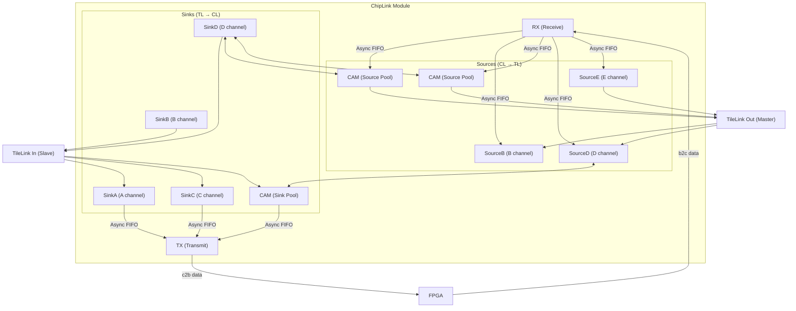
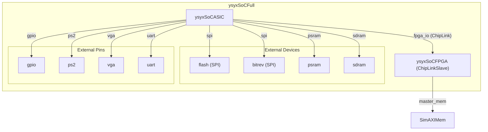
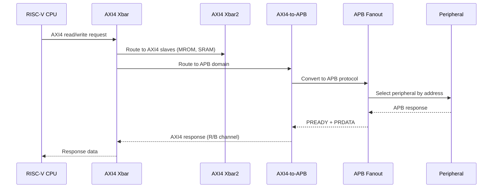
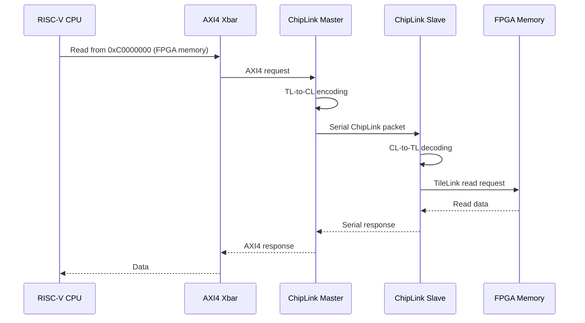
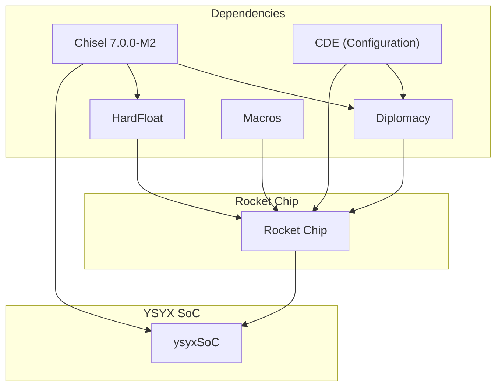

# Rocket Chip SoC

## Introduction

The **Rocket Chip SoC** module is a **Chisel-based System-on-Chip (SoC) design** that integrates a RISC-V CPU core (the student-designed processor from the "一生一芯" / YSYX project) with a comprehensive set of peripherals and memory controllers. It is built upon the [Rocket Chip](https://github.com/chipsalliance/rocket-chip) framework from UC Berkeley / Chip Alliance, leveraging its **Diplomacy** hardware construction system for parameterized, composable bus interconnects.

The SoC provides a complete hardware platform capable of booting and running the RT-Thread operating system, with support for:
- A **RISC-V CPU** (RV32) with AXI4 master and slave interfaces
- **On-chip memories**: Mask ROM (bootrom), SRAM
- **Off-chip memory controllers**: SDRAM, PSRAM (QSPI-based)
- **Peripheral devices**: UART 16550, SPI flash controller, GPIO, PS/2 keyboard, VGA framebuffer
- **Optional ChipLink interface** for FPGA-based co-simulation with a host system

The design is parameterized to support both **ASIC** (standalone) and **FPGA** (ChipLink-connected) configurations, making it suitable for both simulation and physical implementation.

---

## Architecture Overview

The Rocket Chip SoC follows a **layered bus hierarchy** using the Rocket Chip Diplomacy framework:



---

## Component Breakdown

### 1. Top-Level Module (`Top.scala`)

The top-level module `ysyxSoCTop` serves as the entry point for Chisel elaboration:

```scala
class ysyxSoCTop extends Module {
  implicit val config: Parameters = new Config(new Edge32BitConfig ++ new DefaultRV32Config)
  val io = IO(new Bundle { })
  val dut = LazyModule(new ysyxSoCFull)
  val mdut = Module(dut.module)
  mdut.dontTouchPorts()
  mdut.externalPins := DontCare
}
```

Key characteristics:
- Uses **RV32 configuration** (`DefaultRV32Config`) with 32-bit address and data buses
- The `Edge32BitConfig` configures the system for 32-bit AXI4/APB interfaces
- All external pins are left unconnected (`DontCare`) for simulation
- The `Elaborate` object emits SystemVerilog via CIRCT (Chisel IR Compiler Tools)

### 2. SoC ASIC Subsystem (`SoC.scala` - `ysyxSoCASIC`)

This is the main SoC subsystem containing the CPU, bus infrastructure, and all peripherals.

#### Bus Hierarchy

```mermaid
flowchart LR
    subgraph "CPU"
        CPU["CPU Core"]
    end

    subgraph "AXI4 Domain (32-bit)"
        XBAR["AXI4Xbar"]
        XBAR2["AXI4Xbar"]
        FRAG["AXI4Fragmenter"]
        YANK["AXI4UserYanker"]
    end

    subgraph "APB Domain (32-bit)"
        APBX["APBFanout"]
        APB_DELAY["APBDelayer"]
        AXI2APB["AXI4ToAPB"]
    end

    CPU -->|"masterNode"| XBAR
    XBAR --> FRAG --> YANK --> XBAR2
    XBAR2 --> AXI2APB --> APB_DELAY --> APBX
    XBAR2 --> MROM["AXI4MROM (0x20000000)"]
    XBAR2 --> SRAM["AXI4RAM (0x0f000000)"]
    XBAR --> AXI_DELAY["AXI4Delayer"] --> SDRAM_AXI["SDRAM (AXI) (0xa0000000)"]
    
    APBX --> UART["UART (0x10000000)"]
    APBX --> SPI["SPI (0x10001000)"]
    APBX --> PSRAM["PSRAM (0x80000000)"]
    APBX --> GPIO["GPIO (0x10002000)"]
    APBX --> KBD["Keyboard (0x10011000)"]
    APBX --> VGA["VGA (0x21000000)"]
    APBX --> SDRAM_APB["SDRAM (APB) (0xa0000000)"]
```

#### Address Map

| Peripheral | Address Range | Bus | Size | Description |
|------------|--------------|-----|------|-------------|
| **UART 16550** | `0x10000000 - 0x10000FFF` | APB | 4KB | Serial communication |
| **SPI Controller** | `0x10001000 - 0x10001FFF` | APB | 4KB | SPI flash control |
| **SPI XIP Flash** | `0x30000000 - 0x3FFFFFFF` | APB | 256MB | Execute-in-place flash |
| **GPIO** | `0x10002000 - 0x1000200F` | APB | 16B | General purpose I/O |
| **PS/2 Keyboard** | `0x10011000 - 0x10011007` | APB | 8B | Keyboard input |
| **VGA Framebuffer** | `0x21000000 - 0x211FFFFF` | APB | 2MB | Video output |
| **PSRAM** | `0x80000000 - 0x803FFFFF` | APB | 4MB | Pseudo-static RAM |
| **SDRAM** | `0xA0000000 - 0xA1FFFFFF` | AXI/APB | 32MB | Synchronous DRAM |
| **Mask ROM** | `0x20000000 - 0x20000FFF` | AXI4 | 4KB | Bootrom |
| **SRAM** | `0x0F000000 - 0x0F001FFF` | AXI4 | 8KB | On-chip SRAM |

#### CPU Reset Synchronization

The CPU receives a **delayed reset** (10 cycles of synchronization) to ensure that the ChipLink interface (if present) has finished its reset sequence before the CPU starts issuing requests:

```scala
cpu.module.reset := SynchronizerShiftReg(reset.asBool, 10) || reset.asBool
```

### 3. CPU Wrapper (`CPU.scala`)

The `CPU` class wraps the student-designed RISC-V processor as a Diplomacy `LazyModule`:

```scala
class CPU(idBits: Int)(implicit p: Parameters) extends LazyModule {
  val masterNode = AXI4MasterNode(...)  // AXI4 master port
  lazy val module = new Impl
  class Impl extends LazyModuleImp(this) {
    val cpu = Module(new ysyx_00000000)  // Student CPU blackbox
    // Connect AXI4 master, slave, and interrupt
  }
}
```

**CPU Interface (from `spec/cpu-interface.md`):**

| Port | Direction | Width | Description |
|------|-----------|-------|-------------|
| `clock` | Input | 1 | System clock |
| `reset` | Input | 1 | Synchronous reset (high active) |
| `io_interrupt` | Input | 1 | External interrupt signal |
| `io_master_*` | AXI4 Master | - | AXI4 read/write address, data, response channels |
| `io_slave_*` | AXI4 Slave | - | AXI4 slave interface (for ChipLink DMA) |

The CPU blackbox (`ysyx_00000000`) is a placeholder that students replace with their own RISC-V processor implementation. The naming convention follows `ysyx_<8-digit-student-id>`.

### 4. AMBA Bridge Components (`src/amba/`)

#### AXI4-to-APB Bridge (`AXI4ToAPB.scala`)

Converts AXI4 transactions to APB protocol with a 3-state FSM:



- Supports single-beat transfers only (no bursts)
- Data width: 32-bit AXI4 ↔ 32-bit APB
- Read data is duplicated (`Fill(2, ...)`) to match AXI4 32-bit to APB 32-bit

#### AXI4 Delayer (`AXI4Delayer.scala`)

A wrapper around a Verilog blackbox (`axi4_delayer`) that adds pipeline delay to the AXI4 path. Used specifically for SDRAM controller timing.

#### APB Delayer (`APBDelayer.scala`)

Similar to AXI4 Delayer but for the APB bus. Wraps a Verilog blackbox (`apb_delayer`) for timing adjustment.

### 5. Peripheral Devices (`src/device/`)

All peripherals follow a consistent pattern:
1. Define a **Bundle** for the external I/O signals
2. Define a **BlackBox** for the Verilog implementation (or provide a Chisel fallback)
3. Wrap in a **LazyModule** with an APB slave node for bus integration

#### UART 16550 (`Uart16550.scala`)

- **Address**: `0x10000000 - 0x10000FFF`
- **Interface**: `UARTIO` (rx, tx)
- **Blackbox**: `uart_top_apb` — 16550-compatible UART controller
- **Features**: Configurable baud rate, interrupt support

#### SPI Controller (`SPI.scala`)

- **Address**: `0x10001000 - 0x10001FFF` (control) + `0x30000000 - 0x3FFFFFFF` (XIP flash)
- **Interface**: `SPIIO` (sck, ss[7:0], mosi, miso)
- **Blackbox**: `spi_top_apb` — SPI master with 8 chip select lines
- **External devices**: SPI flash (CS0), BitRev (CS7)

#### PSRAM Controller (`PSRAM.scala`)

- **Address**: `0x80000000 - 0x803FFFFF`
- **Interface**: `QSPIIO` (sck, ce_n, dio[3:0])
- **Blackbox**: `psram_top_apb` — QSPI-based PSRAM controller
- **External device**: PSRAM chip (4MB)

#### GPIO (`GPIO.scala`)

- **Address**: `0x10002000 - 0x1000200F`
- **Interface**: `GPIOIO` (out[15:0], in[15:0], seg[7:0][7:0])
- **Blackbox**: `gpio_top_apb` — 16-bit GPIO with 7-segment display support

#### PS/2 Keyboard (`Keyboard.scala`)

- **Address**: `0x10011000 - 0x10011007`
- **Interface**: `PS2IO` (clk, data)
- **Blackbox**: `ps2_top_apb` — PS/2 keyboard controller

#### VGA Framebuffer (`VGA.scala`)

- **Address**: `0x21000000 - 0x211FFFFF` (2MB framebuffer)
- **Interface**: `VGAIO` (r[7:0], g[7:0], b[7:0], hsync, vsync, valid)
- **Blackbox**: `vga_top_apb` — VGA controller with framebuffer

#### SDRAM Controller (`SDRAM.scala`)

- **Address**: `0xA0000000 - 0xA1FFFFFF` (32MB)
- **Interface**: `SDRAMIO` (clk, cke, cs, ras, cas, we, a[12:0], ba[1:0], dqm[1:0], dq[15:0])
- **Two variants**:
  - `AXI4SDRAM`: AXI4 interface (when `Config.sdramUseAXI = true`)
  - `APBSDRAM`: APB interface (when `Config.sdramUseAXI = false`)
- **External device**: SDRAM chip (16-bit data bus)

#### Mask ROM (`MROM.scala`)

- **Address**: `0x20000000 - 0x20000FFF` (4KB)
- **Interface**: AXI4 slave (read-only)
- **Implementation**: Uses DPI-C (Direct Programming Interface) to call a C function `mrom_read()` for bootrom content
- **State machine**: 2-state FSM (idle → wait_rready → idle)



### 6. ChipLink Interface (`src/chiplink/`)

The ChipLink subsystem provides a **high-speed serial link** between the ASIC SoC and an FPGA-based host system. It is based on SiFive's ChipLink protocol.

#### ChipLink Parameters (`Parameters.scala`)

```scala
case class ChipLinkParams(
  TLUH: Seq[AddressSet],  // Uncached/MMIO address space
  TLC: Seq[AddressSet],   // Cacheable memory address space
  sourceBits: Int = 6,
  sinkBits: Int = 5,
  syncTX: Boolean = false,
  fpgaReset: Boolean = false
)
```

Key protocol parameters:
- **8 domains** for ordered transaction processing
- **16-bit CL source/sink IDs**
- **4-byte data width**
- **64-bit address space**
- **Credit-based flow control** with 20-bit credit counters

#### ChipLink Module (`ChipLink.scala`)

The ChipLink module bridges TileLink (TL) to the ChipLink serial protocol:



**Channel Mapping (TileLink ↔ ChipLink):**

| TileLink Channel | ChipLink Direction | Description |
|-----------------|-------------------|-------------|
| A (Acquire) | SinkA → TX | Read/write requests |
| B (Probe) | RX → SourceB | Probe requests from cache |
| C (Release) | SinkC → TX | Cache evictions |
| D (Grant) | RX → SourceD | Response data |
| E (Finish) | SinkE → TX | Transaction completion |

#### ChipLink Bridge (`ChipLinkBridge.scala`)

The bridge connects the ChipLink module to the AXI4 world:

**ChipLinkMaster** (in ASIC side):
- Connects ChipLink slave interface to the SoC's AXI4 crossbar
- Provides DMA access from FPGA to CPU's slave port
- Uses TileLink-to-AXI4 conversion with `TLToAXI4`

**ChipLinkSlave** (in FPGA side):
- Connects ChipLink to FPGA-side memory (`SimAXIMem`)
- Provides MMIO access to FPGA peripherals
- Supports both memory and MMIO address spaces

**Address Space Partitioning:**

| Region | Address Range | Type | Description |
|--------|--------------|------|-------------|
| Memory (Cached) | `0xC0000000 - 0xFFFFFFFF` | TLC | Cacheable DRAM (1GB) |
| MMIO (Uncached) | `0x40000000 - 0x7FFFFFFF` | TLUH | Uncached peripheral space (1GB) |

### 7. Full SoC Integration (`SoC.scala` - `ysyxSoCFull`)

The `ysyxSoCFull` module integrates the ASIC subsystem with optional FPGA co-simulation:



**SPI Flash and BitRev Sharing:**
The SPI bus is shared between the flash memory (CS0) and the BitRev peripheral (CS7). The MISO line uses a wired-AND connection:

```scala
masic.spi.miso := List(bitrev.io, flash.io).map(_.miso).reduce(_&&_)
```

### 8. Tri-State Buffer Utility (`util/TriState.scala`)

A utility module for handling bidirectional I/O pins (used by PSRAM and SDRAM controllers):

```verilog
module TriStateInBuf #(parameter width = 1) (
    inout  [width-1:0] dio,
    input  [width-1:0] dout,
    input              out_en,
    output [width-1:0] din
);
  assign din = dio;
  assign dio = out_en ? dout : {width{1'bz}};
endmodule
```

---

## Data Flow

### CPU Memory Request Flow



### ChipLink Transaction Flow



---

## Build System

### Build Flow (`build.sc`)

The project uses **Mill** (Scala build tool) with the following dependency chain:



### Makefile Targets

| Target | Description |
|--------|-------------|
| `verilog` | Generate SystemVerilog (`build/ysyxSoCFull.v`) |
| `clean` | Remove build artifacts |
| `dev-init` | Initialize git submodules and apply Rocket Chip patch |

The build process:
1. Replaces the default `firtool` with a newer version (1.105.0)
2. Runs Mill to elaborate the Chisel design
3. Post-processes the generated Verilog (renames signals, removes blackbox resource references)

---

## Configuration

### Config Object (`Top.scala`)

```scala
object Config {
  def hasChipLink: Boolean = false   // Enable ChipLink interface
  def sdramUseAXI: Boolean = false   // Use AXI4 (vs APB) for SDRAM
}
```

| Configuration | Default | Description |
|--------------|---------|-------------|
| `hasChipLink` | `false` | When enabled, connects ChipLink master for FPGA co-simulation |
| `sdramUseAXI` | `false` | When enabled, SDRAM controller uses AXI4 instead of APB |

### Rocket Chip Configuration

The SoC uses a 32-bit RISC-V configuration composed from:
- `Edge32BitConfig`: 32-bit address/data bus configuration
- `DefaultRV32Config`: Default RV32 Rocket Chip configuration

---

## Dependencies

The Rocket Chip SoC module depends on the following external modules:

| Dependency | Description | Integration |
|-----------|-------------|-------------|
| **[Rocket Chip](https://github.com/chipsalliance/rocket-chip)** | SoC generation framework | Provides Diplomacy, TileLink, AXI4/APB bus infrastructure |
| **Chisel 7.0.0-M2** | Hardware construction language | Scala DSL for hardware design |
| **CIRCT** | Chisel IR Compiler Tools | SystemVerilog emission via `firtool` |
| **Mill** | Scala build tool | Build system and dependency management |

---

## Related Modules

- [NEMU Emulator](NEMU%20Emulator.md) — Instruction-level emulator used for co-simulation and differential testing with the SoC
- [NPC Simulator](NPC%20Simulator.md) — Simplified simulator for the RISC-V CPU core
- [NVBoard](NVBoard.md) — FPGA board support for physical implementation
- [RT-Thread Kernel](RT-Thread%20Kernel.md) — The RTOS that runs on this SoC
- [FDT (Flattened Device Tree)](FDT%20(Flattened%20Device%20Tree).md) — Device tree format used for hardware description
- [VMM (Virtual Machine Manager)](VMM%20(Virtual%20Machine%20Manager).md) — Virtual machine management for the SoC
