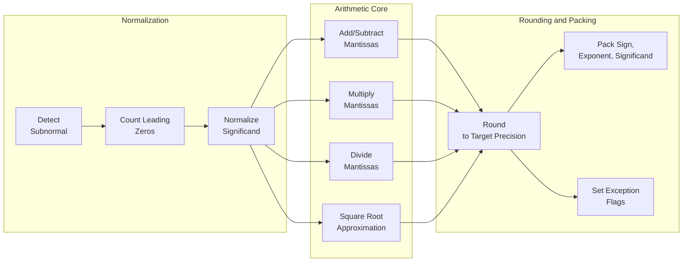
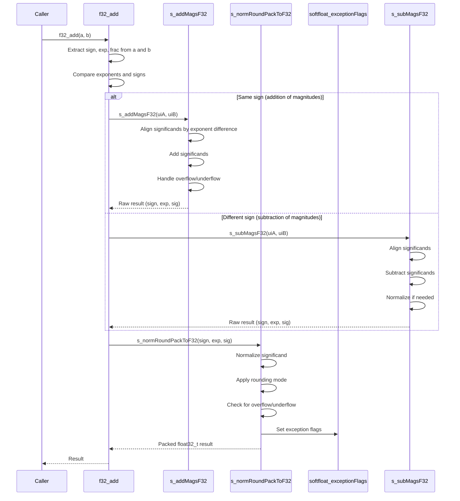
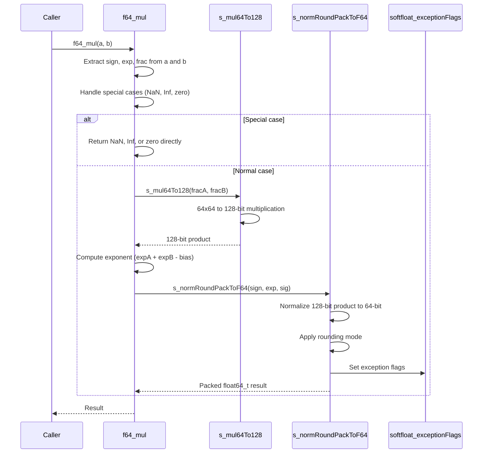
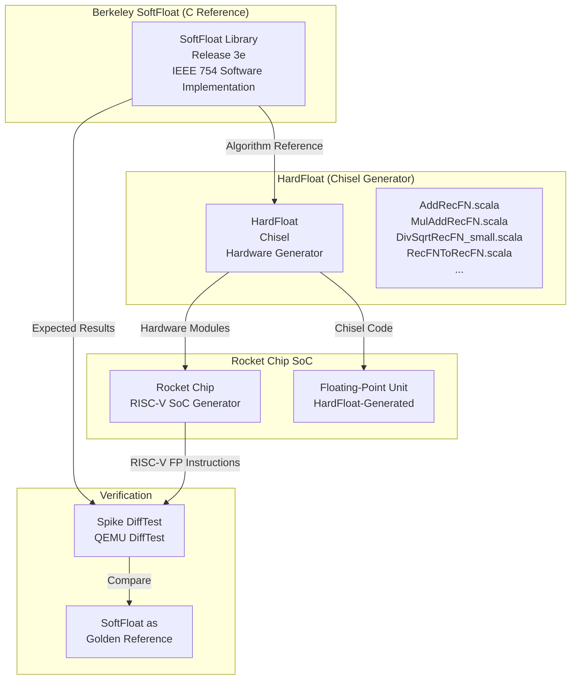

# SoftFloat Library

## Introduction

The **SoftFloat Library** (Berkeley SoftFloat Release 3e) is a software implementation of binary floating-point arithmetic that conforms to the IEEE Standard for Floating-Point Arithmetic. Developed by John R. Hauser at the University of California, Berkeley, this library provides complete software emulation of floating-point operations for systems without hardware floating-point units (FPUs).

Within this project, the SoftFloat Library serves as the foundational C reference implementation for the **HardFloat** hardware floating-point generator used in the **Rocket Chip SoC** ecosystem. The library provides the golden reference model against which hardware implementations are verified, and its algorithms are translated into hardware via the HardFloat Chisel generators.

The library supports five binary floating-point formats:
- **16-bit** half-precision (`float16_t`)
- **32-bit** single-precision (`float32_t`)
- **64-bit** double-precision (`float64_t`)
- **80-bit** double-extended-precision (`extFloat80_t`)
- **128-bit** quadruple-precision (`float128_t`)

---

## Architecture Overview

```mermaid
graph TB
    subgraph "SoftFloat Library Architecture"
        SFH[softfloat.h<br/>Public API Header]
        SFT[softfloat_types.h<br/>Type Definitions]
        PT[primitiveTypes.h<br/>Primitive Types]
        INT[internals.h<br/>Internal Helpers]
        PRIM[primitives.h<br/>Primitive Operations]
        
        subgraph "Floating-Point Formats"
            F16[float16_t<br/>16-bit Half]
            F32[float32_t<br/>32-bit Single]
            F64[float64_t<br/>64-bit Double]
            F80[extFloat80_t<br/>80-bit Extended]
            F128[float128_t<br/>128-bit Quad]
        end
        
        subgraph "Operation Categories"
            CONV[Conversions<br/>int/float to float]
            ARITH[Arithmetic<br/>+ - x / sqrt]
            FMA[Fused Multiply-Add]
            CMP[Comparisons]
            ROUND[Rounding<br/>roundToInt]
            REM[Remainder]
        end
        
        subgraph "Internal Primitives"
            ADDSUB[s_addMags / s_subMags]
            MUL[s_mul64To128 / s_mul128To256]
            DIV[s_approxRecip]
            SQRT[s_approxRecipSqrt]
            SHIFT[s_shiftRightJam / s_shortShiftLeft]
            ROUNDPACK[s_roundPackTo / s_normRoundPackTo]
        end
        
        SFH --> SFT
        SFH --> PT
        INT --> PRIM
        INT --> SFT
        SFH --> INT
        
        F16 --> CONV
        F32 --> CONV
        F64 --> CONV
        F80 --> CONV
        F128 --> CONV
        
        F16 --> ARITH
        F32 --> ARITH
        F64 --> ARITH
        F80 --> ARITH
        F128 --> ARITH
        
        F32 --> FMA
        F64 --> FMA
        F128 --> FMA
        F16 --> FMA
        
        CONV --> ADDSUB
        CONV --> ROUNDPACK
        ARITH --> ADDSUB
        ARITH --> MUL
        ARITH --> DIV
        ARITH --> SQRT
        ARITH --> SHIFT
        ARITH --> ROUNDPACK
        FMA --> MUL
        FMA --> ADDSUB
    end
    
    subgraph "External Dependencies"
        STDBOOL[stdbool.h]
        STDINT[stdint.h]
    end
    
    SFH --> STDBOOL
    SFH --> STDINT
```



---

## Module Components

### Core Data Types

The library defines the following fundamental floating-point types in `softfloat_types.h`:

| Type | Size | Description | IEEE Format |
|------|------|-------------|-------------|
| `float16_t` | 16 bits | Half-precision binary | 1 sign, 5 exponent, 10 significand |
| `float32_t` | 32 bits | Single-precision binary | 1 sign, 8 exponent, 23 significand |
| `float64_t` | 64 bits | Double-precision binary | 1 sign, 11 exponent, 52 significand |
| `extFloat80_t` | 80 bits | Extended double-precision | 1 sign, 15 exponent, 64 significand (explicit leading bit) |
| `float128_t` | 128 bits | Quadruple-precision binary | 1 sign, 15 exponent, 112 significand |

**Memory Representation of `extFloat80_t`:**
```c
struct extFloat80M {
#ifdef LITTLEENDIAN
    uint64_t signif;   // 64-bit significand
    uint16_t signExp;  // sign (bit 15) + exponent (bits 14:0)
#else
    uint16_t signExp;
    uint64_t signif;
#endif
};
typedef struct extFloat80M extFloat80_t;
```

### Primitive Types (for internal use)

Defined in `primitiveTypes.h` (available when `SOFTFLOAT_FAST_INT64` is defined):

| Type | Description |
|------|-------------|
| `struct uint128` | 128-bit unsigned integer (`{uint64_t v0, v64}` or `{uint64_t v64, v0}` depending on endianness) |
| `struct uint64_extra` | 64-bit value with extra bits (`{uint64_t extra, v}`) |
| `struct uint128_extra` | 128-bit value with extra bits (`{uint64_t extra; struct uint128 v}`) |

### Union Types for Bit Manipulation

Defined in `internals.h`:

```c
union ui16_f16 { uint16_t ui; float16_t f; };
union ui32_f32 { uint32_t ui; float32_t f; };
union ui64_f64 { uint64_t ui; float64_t f; };
union extF80M_extF80 { struct extFloat80M fM; extFloat80_t f; };
union ui128_f128 { struct uint128 ui; float128_t f; };
```

### Bit Field Extraction Macros

Each floating-point format has macros for extracting sign, exponent, and significand from the raw bit representation:

| Format | Sign | Exponent | Significand | Pack |
|--------|------|----------|-------------|------|
| f16 | `signF16UI(a)` | `expF16UI(a)` | `fracF16UI(a)` | `packToF16UI(sign, exp, sig)` |
| f32 | `signF32UI(a)` | `expF32UI(a)` | `fracF32UI(a)` | `packToF32UI(sign, exp, sig)` |
| f64 | `signF64UI(a)` | `expF64UI(a)` | `fracF64UI(a)` | `packToF64UI(sign, exp, sig)` |
| extF80 | `signExtF80UI64(a64)` | `expExtF80UI64(a64)` | (implicit in 64-bit significand) | `packToExtF80UI64(sign, exp)` |
| f128 | `signF128UI64(a64)` | `expF128UI64(a64)` | `fracF128UI64(a64)` | `packToF128UI64(sign, exp, sig64)` |

### NaN Detection Macros

```c
#define isNaNF16UI(a)   (((~(a) & 0x7C00) == 0) && ((a) & 0x03FF))
#define isNaNF32UI(a)   (((~(a) & 0x7F800000) == 0) && ((a) & 0x007FFFFF))
#define isNaNF64UI(a)   (((~(a) & UINT64_C(0x7FF0000000000000)) == 0) && ((a) & UINT64_C(0x000FFFFFFFFFFFFF)))
#define isNaNExtF80UI(a64, a0) ((((a64) & 0x7FFF) == 0x7FFF) && ((a0) & UINT64_C(0x7FFFFFFFFFFFFFFF)))
#define isNaNF128UI(a64, a0) (((~(a64) & UINT64_C(0x7FFF000000000000)) == 0) && (a0 || ((a64) & UINT64_C(0x0000FFFFFFFFFFFF))))
```

---

## Global State and Configuration

### Rounding Mode (`softfloat_roundingMode`)

```c
extern THREAD_LOCAL uint_fast8_t softfloat_roundingMode;
enum {
    softfloat_round_near_even   = 0,  // Round to nearest, ties to even
    softfloat_round_minMag      = 1,  // Round to minimum magnitude (toward zero)
    softfloat_round_min         = 2,  // Round toward negative infinity (floor)
    softfloat_round_max         = 3,  // Round toward positive infinity (ceil)
    softfloat_round_near_maxMag = 4,  // Round to nearest, ties away from zero
    softfloat_round_odd         = 6   // Round to odd (jamming, requires SOFTFLOAT_ROUND_ODD)
};
```

### Underflow Tininess Detection (`softfloat_detectTininess`)

```c
extern THREAD_LOCAL uint_fast8_t softfloat_detectTininess;
enum {
    softfloat_tininess_beforeRounding = 0,  // Detect tininess before rounding
    softfloat_tininess_afterRounding  = 1   // Detect tininess after rounding
};
```

### Exception Flags (`softfloat_exceptionFlags`)

```c
extern THREAD_LOCAL uint_fast8_t softfloat_exceptionFlags;
enum {
    softfloat_flag_inexact   =  1,  // Inexact result
    softfloat_flag_underflow =  2,  // Underflow
    softfloat_flag_overflow  =  4,  // Overflow
    softfloat_flag_infinite  =  8,  // Division by zero
    softfloat_flag_invalid   = 16   // Invalid operation
};
```

### 80-bit Rounding Precision (`extF80_roundingPrecision`)

```c
extern THREAD_LOCAL uint_fast8_t extF80_roundingPrecision;
// Valid values: 32, 64, 80
```

---

## API Reference

### Integer-to-Floating-Point Conversions

Convert unsigned/signed 32-bit and 64-bit integers to all floating-point formats:

```c
// Unsigned 32-bit to float
float16_t ui32_to_f16(uint32_t);
float32_t ui32_to_f32(uint32_t);
float64_t ui32_to_f64(uint32_t);
extFloat80_t ui32_to_extF80(uint32_t);  // Requires SOFTFLOAT_FAST_INT64
float128_t ui32_to_f128(uint32_t);      // Requires SOFTFLOAT_FAST_INT64
void ui32_to_extF80M(uint32_t, extFloat80_t *);
void ui32_to_f128M(uint32_t, float128_t *);

// Unsigned 64-bit to float
float16_t ui64_to_f16(uint64_t);
float32_t ui64_to_f32(uint64_t);
float64_t ui64_to_f64(uint64_t);
extFloat80_t ui64_to_extF80(uint64_t);  // Requires SOFTFLOAT_FAST_INT64
float128_t ui64_to_f128(uint64_t);      // Requires SOFTFLOAT_FAST_INT64
void ui64_to_extF80M(uint64_t, extFloat80_t *);
void ui64_to_f128M(uint64_t, float128_t *);

// Signed 32-bit to float
float16_t i32_to_f16(int32_t);
float32_t i32_to_f32(int32_t);
float64_t i32_to_f64(int32_t);
extFloat80_t i32_to_extF80(int32_t);    // Requires SOFTFLOAT_FAST_INT64
float128_t i32_to_f128(int32_t);        // Requires SOFTFLOAT_FAST_INT64
void i32_to_extF80M(int32_t, extFloat80_t *);
void i32_to_f128M(int32_t, float128_t *);

// Signed 64-bit to float
float16_t i64_to_f16(int64_t);
float32_t i64_to_f32(int64_t);
float64_t i64_to_f64(int64_t);
extFloat80_t i64_to_extF80(int64_t);    // Requires SOFTFLOAT_FAST_INT64
float128_t i64_to_f128(int64_t);        // Requires SOFTFLOAT_FAST_INT64
void i64_to_extF80M(int64_t, extFloat80_t *);
void i64_to_f128M(int64_t, float128_t *);
```

### Floating-Point-to-Integer Conversions

Convert floating-point values to signed/unsigned 32-bit and 64-bit integers with rounding mode and exception flags:

```c
// Pattern: <type>_to_<int_type>(<float_val>, roundingMode, exact)
// Pattern: <type>_to_<int_type>_r_minMag(<float_val>, exact)

// Example for f32:
uint_fast32_t f32_to_ui32(float32_t, uint_fast8_t, bool);
uint_fast64_t f32_to_ui64(float32_t, uint_fast8_t, bool);
int_fast32_t  f32_to_i32(float32_t, uint_fast8_t, bool);
int_fast64_t  f32_to_i64(float32_t, uint_fast8_t, bool);
uint_fast32_t f32_to_ui32_r_minMag(float32_t, bool);
uint_fast64_t f32_to_ui64_r_minMag(float32_t, bool);
int_fast32_t  f32_to_i32_r_minMag(float32_t, bool);
int_fast64_t  f32_to_i64_r_minMag(float32_t, bool);
```

### Inter-Format Conversions

Convert between any two floating-point formats:

```c
// Example conversions from f32:
float16_t f32_to_f16(float32_t);
float64_t f32_to_f64(float32_t);
extFloat80_t f32_to_extF80(float32_t);  // Requires SOFTFLOAT_FAST_INT64
float128_t f32_to_f128(float32_t);      // Requires SOFTFLOAT_FAST_INT64
void f32_to_extF80M(float32_t, extFloat80_t *);
void f32_to_f128M(float32_t, float128_t *);
```

### Basic Arithmetic Operations

Each format supports: `add`, `sub`, `mul`, `div`, `sqrt`, `rem`, `roundToInt`, `mulAdd`

```c
// Pattern for f32:
float32_t f32_add(float32_t, float32_t);
float32_t f32_sub(float32_t, float32_t);
float32_t f32_mul(float32_t, float32_t);
float32_t f32_div(float32_t, float32_t);
float32_t f32_sqrt(float32_t);
float32_t f32_rem(float32_t, float32_t);
float32_t f32_roundToInt(float32_t, uint_fast8_t, bool);
float32_t f32_mulAdd(float32_t, float32_t, float32_t);
```

**Note:** `mulAdd` (fused multiply-add) is supported for `f16`, `f32`, `f64`, and `f128`, but **not** for `extF80`.

### Comparison Operations

Each format supports six comparison functions:

```c
// Pattern for f32:
bool f32_eq(float32_t, float32_t);              // Equal
bool f32_le(float32_t, float32_t);              // Less than or equal
bool f32_lt(float32_t, float32_t);              // Less than
bool f32_eq_signaling(float32_t, float32_t);    // Equal (signals on NaN)
bool f32_le_quiet(float32_t, float32_t);        // Less/equal (quiet on NaN)
bool f32_lt_quiet(float32_t, float32_t);        // Less than (quiet on NaN)
bool f32_isSignalingNaN(float32_t);             // Is signaling NaN?
```

### Memory-Based (M) Variants

For `extF80` and `f128`, memory-based variants (suffixed with `M`) operate on pointers rather than value types. These are available even without `SOFTFLOAT_FAST_INT64`:

```c
// extF80M operations (operate on extFloat80_t pointers):
void extF80M_add(const extFloat80_t *, const extFloat80_t *, extFloat80_t *);
void extF80M_sub(const extFloat80_t *, const extFloat80_t *, extFloat80_t *);
void extF80M_mul(const extFloat80_t *, const extFloat80_t *, extFloat80_t *);
void extF80M_div(const extFloat80_t *, const extFloat80_t *, extFloat80_t *);
void extF80M_sqrt(const extFloat80_t *, extFloat80_t *);
void extF80M_rem(const extFloat80_t *, const extFloat80_t *, extFloat80_t *);
void extF80M_roundToInt(const extFloat80_t *, uint_fast8_t, bool, extFloat80_t *);

// f128M operations (operate on float128_t pointers):
void f128M_add(const float128_t *, const float128_t *, float128_t *);
void f128M_sub(const float128_t *, const float128_t *, float128_t *);
void f128M_mul(const float128_t *, const float128_t *, float128_t *);
void f128M_div(const float128_t *, const float128_t *, float128_t *);
void f128M_sqrt(const float128_t *, float128_t *);
void f128M_mulAdd(const float128_t *, const float128_t *, const float128_t *, float128_t *);
```

### Exception Handling

```c
void softfloat_raiseFlags(uint_fast8_t flags);
// Raises the specified exception flags (OR of softfloat_flag_* values)
```

---

## Internal Algorithm Architecture

### Normalization and Rounding Pipeline



### Key Internal Functions

The library's internal functions (declared in `internals.h`) implement the core algorithms:

**Normalization:**
- `softfloat_normSubnormalF16Sig`, `softfloat_normSubnormalF32Sig`, `softfloat_normSubnormalF64Sig`
- `softfloat_normSubnormalExtF80Sig`, `softfloat_normSubnormalF128Sig`
- `softfloat_normExtF80SigM`, `softfloat_shiftNormSigF128M`

**Rounding and Packing:**
- `softfloat_roundPackToF16/F32/F64/ExtF80/F128`
- `softfloat_normRoundPackToF16/F32/F64/ExtF80/F128`
- `softfloat_roundPackMToExtF80M`, `softfloat_roundPackMToF128M`
- `softfloat_normRoundPackMToExtF80M`, `softfloat_normRoundPackMToF128M`

**Addition/Subtraction:**
- `softfloat_addMagsF16/F32/F64/ExtF80/F128`
- `softfloat_subMagsF16/F32/F64/ExtF80/F128`
- `softfloat_addExtF80M`, `softfloat_addF128M`

**Multiply-Add:**
- `softfloat_mulAddF16/F32/F64/F128`
- `softfloat_mulAddF128M`

**Integer Rounding:**
- `softfloat_roundToUI32`, `softfloat_roundToUI64`
- `softfloat_roundToI32`, `softfloat_roundToI64`
- `softfloat_roundMToUI64`, `softfloat_roundMToI64`

**NaN Propagation:**
- `softfloat_tryPropagateNaNExtF80M`, `softfloat_tryPropagateNaNF128M`
- `softfloat_invalidExtF80M`, `softfloat_invalidF128M`
- `softfloat_isNaNF128M`

### Primitive Operations

The library uses a set of low-level primitive operations (in files prefixed with `s_`) for multi-word arithmetic:

| Function | Description |
|----------|-------------|
| `s_add128`, `s_sub128` | 128-bit add/subtract |
| `s_add256M`, `s_sub256M` | 256-bit add/subtract (memory-based) |
| `s_addM`, `s_subM` | Multi-word add/subtract |
| `s_mul64To128` | 64x64 to 128-bit multiplication |
| `s_mul128By32` | 128x32 to 128-bit multiplication |
| `s_mul128To256M` | 128x128 to 256-bit multiplication (memory-based) |
| `s_mul64ByShifted32To128` | 64x32 to 128-bit with shift |
| `s_approxRecip32_1` | Approximate 32-bit reciprocal |
| `s_approxRecipSqrt32_1` | Approximate 32-bit reciprocal square root |
| `s_approxRecip_1Ks` | Reciprocal approximation table |
| `s_approxRecipSqrt_1Ks` | Reciprocal square root approximation table |
| `s_countLeadingZeros8/16/32/64` | Leading zero count |
| `s_shiftRightJam32/64/128/256M` | Shift right with jam (sticky bit) |
| `s_shortShiftLeft128`, `s_shortShiftRight128` | Short shifts for 128-bit values |
| `s_compare128M`, `s_compare96M` | Multi-word comparison |
| `s_eq128`, `s_le128`, `s_lt128` | 128-bit comparison |
| `s_roundToI32`, `s_roundToUI32` | Integer rounding |
| `s_roundMToI64`, `s_roundMToUI64` | 64-bit integer rounding from multi-word |
| `s_remStepMBy32` | Remainder step for multi-word division |
| `s_negXM`, `s_sub1XM` | Multi-word negation and decrement |

---

## Data Flow

### Addition/Subtraction Flow



### Multiplication Flow



---

## Compile-Time Configuration

The library behavior can be customized through compile-time macros:

| Macro | Effect |
|-------|--------|
| `SOFTFLOAT_FAST_INT64` | Enable fast 64-bit integer paths (required for `extF80_t` and `f128_t` value-based APIs) |
| `SOFTFLOAT_ROUND_ODD` | Enable round to odd rounding mode |
| `LITTLEENDIAN` | Set for little-endian byte order |
| `THREAD_LOCAL` | Thread-local storage class (default: empty) |

### Platform-Specific Specializations

The library includes optimized specializations for specific platforms:

| Directory | Platform |
|-----------|----------|
| `source/8086/` | Intel 8086 without SSE |
| `source/8086-SSE/` | Intel 8086 with SSE |
| `source/ARM-VFPv2/` | ARM with VFPv2 |
| `source/ARM-VFPv2-defaultNaN/` | ARM with VFPv2 (default NaN) |
| `source/RISCV/` | RISC-V |

---

## Relationship with HardFloat and Rocket Chip



The SoftFloat Library serves as the **golden C reference model** for the HardFloat hardware generator. The HardFloat project (in `ysyxSoC/rocket-chip/dependencies/hardfloat/`) translates the algorithms from SoftFloat into hardware description language (Chisel), which is then used by Rocket Chip to generate FPU hardware. During verification, the Spike and QEMU differential testing frameworks use SoftFloat to compute expected results for comparison against the hardware simulation.

---

## Build System Integration

The library provides build templates for various platforms:

```
build/
├── Linux-386-GCC/
├── Linux-386-SSE2-GCC/
├── Linux-ARM-VFPv2-GCC/
├── Linux-x86_64-GCC/
├── Win32-MinGW/
├── Win32-SSE2-MinGW/
├── Win64-MinGW-w64/
├── template-FAST_INT64/      # Template with SOFTFLOAT_FAST_INT64
└── template-not-FAST_INT64/  # Template without SOFTFLOAT_FAST_INT64
```

Each build directory contains a `Makefile` and `platform.h` for the target platform.

---

## References

- [Rocket Chip SoC](../Rocket%20Chip%20SoC.md) - The SoC generator that uses HardFloat (generated from SoftFloat algorithms)
- [NEMU Emulator](../NEMU%20Emulator.md) - Uses SoftFloat for differential testing of floating-point instructions
- [NPC Simulator](../NPC%20Simulator.md) - May use SoftFloat for reference floating-point computation
- [Abstract Machine (AM)](../Abstract%20Machine%20(AM).md) - Defines floating-point types used across the system
- [Berkeley SoftFloat Website](http://www.jhauser.us/arithmetic/SoftFloat.html) - Official SoftFloat page
- [HardFloat GitHub Repository](https://github.com/ucb-bar/hardfloat) - Hardware floating-point generator
