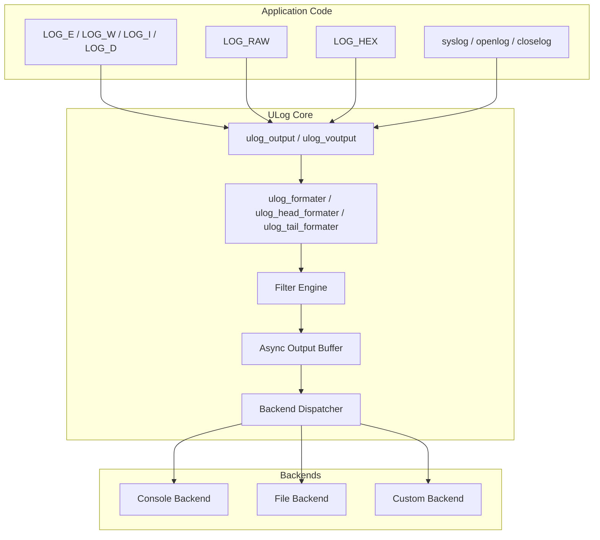
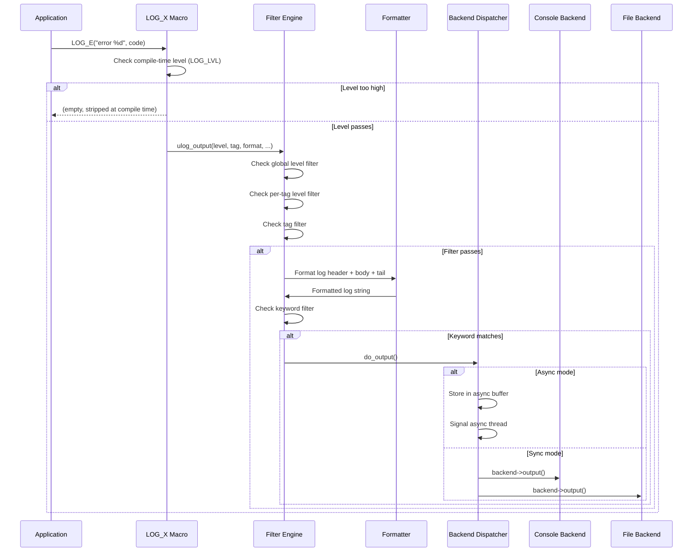
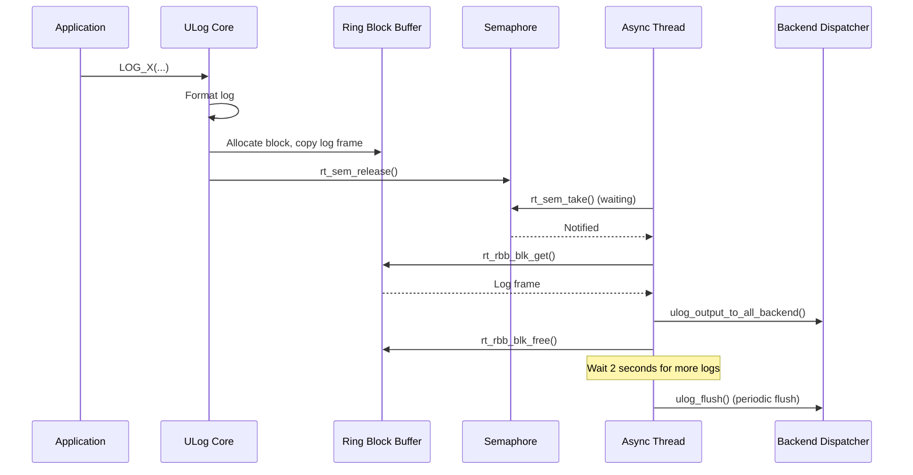
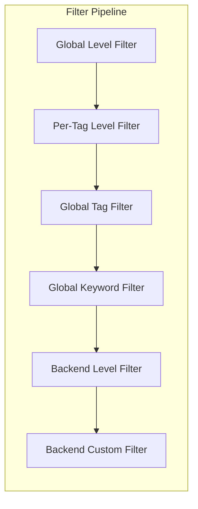
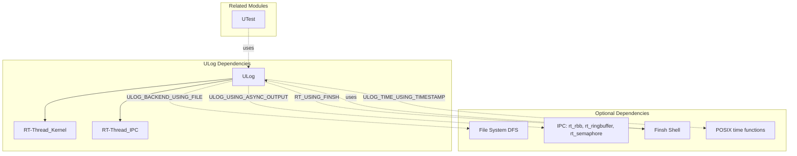

# ULog - RT-Thread Unified Logging Module

## Introduction

ULog is a lightweight, highly configurable logging module for RT-Thread RTOS. It provides a unified logging interface with support for multiple output backends, log level filtering, color-coded output, asynchronous logging, and syslog-compatible APIs. ULog is designed to be both efficient for production use (with compile-time log level stripping) and flexible for development debugging.

The module is located at `components/utilities/ulog/` and is enabled via the `RT_USING_ULOG` Kconfig option.

---

## Architecture Overview

ULog follows a **frontend-backend** architecture pattern:

- **Frontend (API Layer)**: Provides user-facing macros (`LOG_E`, `LOG_W`, `LOG_I`, `LOG_D`, `LOG_RAW`, `LOG_HEX`) and functions (`ulog_output`, `ulog_raw`, `ulog_hexdump`)
- **Core Engine**: Handles log formatting, filtering, and routing to registered backends
- **Backend Layer**: Pluggable output destinations (console, file, custom)
- **Syslog Compatibility Layer**: Optional POSIX syslog API (`syslog()`, `openlog()`, `closelog()`)



---

## Core Data Structures

### `struct rt_ulog` (Main Control Block)

The central singleton structure that manages all ULog state:

```c
struct rt_ulog
{
    rt_bool_t init_ok;                    // Initialization flag
    rt_bool_t output_lock_enabled;        // Whether output locking is enabled
    struct rt_mutex output_locker;        // Mutex for thread-safe output
    rt_slist_t backend_list;              // Singly-linked list of registered backends
    char log_buf_th[ULOG_LINE_BUF_SIZE + 1];  // Thread context log buffer

#ifdef ULOG_USING_ISR_LOG
    rt_base_t output_locker_isr_lvl;      // ISR interrupt level save
    char log_buf_isr[ULOG_LINE_BUF_SIZE + 1]; // ISR context log buffer
#endif

#ifdef ULOG_USING_ASYNC_OUTPUT
    rt_bool_t async_enabled;              // Async output enabled flag
    rt_rbb_t async_rbb;                   // Ring block buffer for async log frames
    struct rt_ringbuffer *async_rb;       // Ring buffer for raw log data
    rt_thread_t async_th;                 // Async output thread
    struct rt_semaphore async_notice;     // Semaphore for async output notification
#endif

#ifdef ULOG_USING_FILTER
    struct {
        rt_slist_t tag_lvl_list;          // Per-tag level filter list
        rt_uint32_t level;                // Global filter level
        char tag[ULOG_FILTER_TAG_MAX_LEN + 1];   // Global tag filter
        char keyword[ULOG_FILTER_KW_MAX_LEN + 1]; // Global keyword filter
    } filter;
#endif
};
```

### `struct ulog_frame` (Async Log Frame)

Packages log data for asynchronous output:

```c
struct ulog_frame
{
    rt_uint32_t magic:8;      // Magic word (0x10 = 'lo')
    rt_uint32_t is_raw:1;     // Raw log flag
    rt_uint32_t log_len:23;   // Length of log content
    rt_uint32_t level;        // Log level
    const char *log;          // Pointer to log content
    const char *tag;          // Pointer to tag string
};
```

### `struct ulog_backend` (Backend Interface)

Pluggable output backend descriptor:

```c
struct ulog_backend
{
    char name[RT_NAME_MAX];                    // Backend name
    rt_bool_t support_color;                   // Whether backend supports ANSI color
    rt_uint32_t out_level;                     // Per-backend output level filter
    void (*init)(struct ulog_backend *backend);    // Initialization callback
    void (*output)(struct ulog_backend *backend, rt_uint32_t level, const char *tag,
                   rt_bool_t is_raw, const char *log, rt_size_t len);  // Output callback
    void (*flush)(struct ulog_backend *backend);   // Flush callback
    void (*deinit)(struct ulog_backend *backend);  // Deinitialization callback
    rt_bool_t (*filter)(struct ulog_backend *backend, rt_uint32_t level, const char *tag,
                        rt_bool_t is_raw, const char *log, rt_size_t len);  // Filter callback
    rt_slist_t list;                           // List node for backend registration
};
```

### `struct ulog_tag_lvl_filter` (Per-Tag Level Filter)

```c
struct ulog_tag_lvl_filter
{
    char tag[ULOG_FILTER_TAG_MAX_LEN + 1];  // Tag name
    rt_uint32_t level;                       // Filter level for this tag
    rt_slist_t list;                         // List node
};
```

### `struct ulog_file_be` (File Backend Instance)

```c
struct ulog_file_be
{
    struct ulog_backend parent;           // Inherited backend interface
    int cur_log_file_fd;                  // Current log file descriptor
    rt_size_t file_max_num;               // Maximum number of rotated log files
    rt_size_t file_max_size;              // Maximum size per log file
    rt_size_t buf_size;                   // Internal buffer size
    rt_bool_t enable;                     // Enable/disable flag
    rt_uint8_t *file_buf;                 // Internal write buffer
    rt_uint8_t *buf_ptr_now;              // Current write position in buffer
    char cur_log_file_path[ULOG_FILE_PATH_LEN];  // Current log file path
    char cur_log_dir_path[ULOG_FILE_PATH_LEN];   // Log directory path
};
```

---

## Log Levels

ULog defines five standard log levels (compatible with syslog priority values):

| Level | Value | Macro | Description |
|-------|-------|-------|-------------|
| ASSERT | 0 | `LOG_LVL_ASSERT` | Assertion failure |
| ERROR | 3 | `LOG_LVL_ERROR` | Error conditions |
| WARNING | 4 | `LOG_LVL_WARNING` | Warning conditions |
| INFO | 6 | `LOG_LVL_INFO` | Informational messages |
| DEBUG | 7 | `LOG_LVL_DBG` | Debug-level messages |

When `ULOG_USING_SYSLOG` is enabled, the full POSIX syslog priority set is available (EMERG=0 through DEBUG=7).

---

## API Reference

### User-Level Macros

These macros must be used after defining `LOG_TAG` and `LOG_LVL` before including `<ulog.h>`:

```c
#define LOG_TAG   "my_module"
#define LOG_LVL   LOG_LVL_DBG
#include <ulog.h>

LOG_E("error code: %d", err);     // Error level
LOG_W("warning: %s", msg);        // Warning level
LOG_I("info: %d", value);         // Info level
LOG_D("debug: %s", data);         // Debug level
LOG_RAW("raw output");            // Raw (unformatted) output
LOG_HEX("data", 16, buf, size);   // Hex dump
```

The `LOG_LVL` definition controls compile-time stripping: if a log level is higher than `LOG_LVL`, its corresponding macro expands to nothing, saving code space.

### Core Functions

| Function | Description |
|----------|-------------|
| `ulog_init()` | Initialize ULog subsystem (called automatically via `INIT_BOARD_EXPORT`) |
| `ulog_deinit()` | Deinitialize ULog, clean up all backends and resources |
| `ulog_output(level, tag, newline, format, ...)` | Output a formatted log message |
| `ulog_voutput(level, tag, newline, hex_buf, hex_size, hex_width, hex_addr, format, args)` | Output log with va_list (supports hex mode) |
| `ulog_raw(format, ...)` | Output raw (unformatted) string |
| `ulog_hexdump(tag, width, buf, size)` | Dump memory buffer in hex format |
| `ulog_flush()` | Flush all backends' log buffers |
| `ulog_output_lock_enabled(enabled)` | Enable/disable output locking |

### Backend Management

| Function | Description |
|----------|-------------|
| `ulog_backend_register(backend, name, support_color)` | Register a new output backend |
| `ulog_backend_unregister(backend)` | Unregister an existing backend |
| `ulog_backend_set_filter(backend, filter)` | Set a custom filter callback for a backend |
| `ulog_backend_find(name)` | Find a registered backend by name |

### Filter Control (requires `ULOG_USING_FILTER`)

| Function | Description |
|----------|-------------|
| `ulog_tag_lvl_filter_set(tag, level)` | Set per-tag level filter |
| `ulog_tag_lvl_filter_get(tag)` | Get per-tag level filter |
| `ulog_global_filter_lvl_set(level)` | Set global level filter |
| `ulog_global_filter_lvl_get()` | Get global level filter |
| `ulog_global_filter_tag_set(tag)` | Set global tag filter (only logs containing this tag pass) |
| `ulog_global_filter_tag_get()` | Get global tag filter |
| `ulog_global_filter_kw_set(keyword)` | Set global keyword filter (only logs containing this keyword pass) |
| `ulog_global_filter_kw_get()` | Get global keyword filter |

### Async Output (requires `ULOG_USING_ASYNC_OUTPUT`)

| Function | Description |
|----------|-------------|
| `ulog_async_init()` | Initialize async output thread (called via `INIT_PREV_EXPORT`) |
| `ulog_async_output()` | Process all pending async log frames |
| `ulog_async_output_enabled(enabled)` | Enable/disable async output mode |
| `ulog_async_waiting_log(time)` | Wait for async log availability |

### Syslog API (requires `ULOG_USING_SYSLOG`)

| Function | Description |
|----------|-------------|
| `openlog(ident, option, facility)` | Open connection to syslog |
| `syslog(priority, format, ...)` | Generate a syslog message |
| `vsyslog(priority, format, args)` | Generate a syslog message with va_list |
| `closelog()` | Close the syslog connection |
| `setlogmask(mask)` | Set log priority mask |

---

## Data Flow

### Synchronous Output Path



### Asynchronous Output Path



---

## Backend Implementations

### Console Backend

The console backend (`backend/console_be.c`) outputs logs to the system console. It is automatically initialized via `INIT_PREV_EXPORT(ulog_console_backend_init)` when `ULOG_BACKEND_USING_CONSOLE` is enabled.

- Uses `rt_hw_console_output()` when no console device is registered
- Uses `rt_device_write()` when a console device is available
- Supports ANSI color codes (when `ULOG_USING_COLOR` is enabled)

### File Backend

The file backend (`backend/file_be.c`) writes logs to rotating files on a filesystem. It requires `ULOG_BACKEND_USING_FILE` and `RT_USING_DFS`.

Key features:
- **Multi-instance**: Multiple file backends can be created with different configurations
- **Log rotation**: Automatically rotates log files when they reach `file_max_size`
- **Buffered writes**: Uses an internal buffer to reduce filesystem I/O
- **Directory auto-creation**: Creates the log directory if it doesn't exist

File naming convention:
- Current log: `<name>.log`
- Rotated logs: `<name>_0.log`, `<name>_1.log`, ..., `<name>_N.log`

### Custom Backend

Developers can create custom backends by:
1. Defining a `struct ulog_backend` instance
2. Implementing the `output` callback (required)
3. Optionally implementing `init`, `flush`, `deinit`, and `filter` callbacks
4. Registering via `ulog_backend_register()`

---

## Filter System

ULog provides a multi-layered filtering system (enabled via `ULOG_USING_FILTER`):



1. **Global Level Filter**: Filters all logs below a certain level
2. **Per-Tag Level Filter**: Allows different level thresholds for different tags
3. **Global Tag Filter**: Only allows logs whose tag contains the filter string
4. **Global Keyword Filter**: Only allows logs whose content contains the keyword
5. **Backend Level Filter**: Each backend has its own output level threshold
6. **Backend Custom Filter**: Per-backend filter callback for custom filtering logic

### Finsh Commands

When `RT_USING_FINSH` and `ULOG_USING_FILTER` are enabled, the following shell commands are available:

| Command | Description |
|---------|-------------|
| `ulog_lvl <level>` | Set global filter level |
| `ulog_tag <tag>` | Set global tag filter |
| `ulog_kw <keyword>` | Set global keyword filter |
| `ulog_tag_lvl <tag> <level>` | Set per-tag level filter |
| `ulog_be_lvl <name> <level>` | Set per-backend level filter |
| `ulog_filter` | Show current filter settings |

---

## Configuration Options

ULog is highly configurable via Kconfig. Key options include:

| Option | Default | Description |
|--------|---------|-------------|
| `RT_USING_ULOG` | n | Enable ULog module |
| `ULOG_OUTPUT_LVL` | 7 (Debug) | Static compile-time output level |
| `ULOG_LINE_BUF_SIZE` | 128 | Per-line log buffer size |
| `ULOG_USING_ISR_LOG` | n | Enable logging from ISR context |
| `ULOG_ASSERT_ENABLE` | y | Enable assertion support |
| `ULOG_USING_ASYNC_OUTPUT` | n | Enable asynchronous output mode |
| `ULOG_ASYNC_OUTPUT_BUF_SIZE` | 2048 | Async output buffer size |
| `ULOG_ASYNC_OUTPUT_BY_THREAD` | y | Use dedicated thread for async output |
| `ULOG_ASYNC_OUTPUT_THREAD_STACK` | 1024 | Async thread stack size |
| `ULOG_ASYNC_OUTPUT_THREAD_PRIORITY` | 30 | Async thread priority |
| `ULOG_USING_COLOR` | y | Enable ANSI color output |
| `ULOG_OUTPUT_TIME` | y | Include timestamp in log output |
| `ULOG_OUTPUT_LEVEL` | y | Include level indicator in log output |
| `ULOG_OUTPUT_TAG` | y | Include tag in log output |
| `ULOG_OUTPUT_THREAD_NAME` | n | Include thread name in log output |
| `ULOG_BACKEND_USING_CONSOLE` | y | Enable console backend |
| `ULOG_BACKEND_USING_FILE` | n | Enable file backend |
| `ULOG_USING_FILTER` | n | Enable runtime filter system |
| `ULOG_USING_SYSLOG` | n | Enable syslog-compatible API |

---

## Dependencies



- **RT-Thread Kernel**: Core kernel types, threading, and synchronization primitives
- **DFS** (File System): Required by the file backend for file I/O operations
- **IPC Components**: Ring buffer (`rt_ringbuffer`), ring block buffer (`rt_rbb`), and semaphores for async output
- **Finsh Shell**: Provides runtime filter configuration commands
- **UTest**: RT-Thread's test framework uses ULog for test output

For more details on related modules, see:
- [RT-Thread Kernel](RT-Thread%20Kernel.md)
- [File System (DFS)](File%20System%20(DFS).md)
- [Finsh Shell](Finsh%20Shell.md)

---

## Usage Examples

### Basic Usage

```c
#define LOG_TAG   "app"
#define LOG_LVL   LOG_LVL_DBG
#include <ulog.h>

void app_main(void)
{
    int counter = 0;
    
    while (1)
    {
        LOG_I("Counter: %d", counter++);
        LOG_D("Debug info: %s", some_debug_string);
        
        if (error_occurred)
        {
            LOG_E("Error occurred: %d", error_code);
        }
        
        rt_thread_mdelay(1000);
    }
}
```

### Hex Dump

```c
uint8_t buffer[64] = { ... };
LOG_HEX("packet", 16, buffer, sizeof(buffer));
```

### File Backend Setup

```c
#include <ulog_be.h>

static struct ulog_file_be file_be;

void setup_file_logging(void)
{
    /* Initialize file backend: name, directory, max files, max size, buffer size */
    ulog_file_backend_init(&file_be, "app_log", "/logs", 3, 1024 * 1024, 4096);
    ulog_file_backend_enable(&file_be);
}
```

### Custom Backend

```c
static void my_backend_output(struct ulog_backend *backend, rt_uint32_t level,
                              const char *tag, rt_bool_t is_raw,
                              const char *log, rt_size_t len)
{
    /* Custom output logic, e.g., send over network */
    my_network_send(log, len);
}

static struct ulog_backend my_be = {
    .output = my_backend_output,
};

void init_custom_backend(void)
{
    ulog_backend_register(&my_be, "network", RT_FALSE);
}
```

### Runtime Filter Configuration

```c
/* Only show ERROR and above for all logs */
ulog_global_filter_lvl_set(LOG_LVL_ERROR);

/* Only show logs containing "wifi" tag */
ulog_global_filter_tag_set("wifi");

/* Only show logs containing "timeout" keyword */
ulog_global_filter_kw_set("timeout");

/* Set per-tag level: only show WARNING+ for "wifi" tag */
ulog_tag_lvl_filter_set("wifi", LOG_LVL_WARNING);
```

---

## Thread Safety

ULog is designed to be thread-safe:

- **Output Locking**: A mutex (`output_locker`) protects the formatting and output path
- **ISR Support**: When `ULOG_USING_ISR_LOG` is enabled, logging from interrupt context uses interrupt disable/enable for synchronization
- **Lock Bypass**: The `output_lock_enabled` flag allows disabling locking during early boot stages before the scheduler is active
- **Recursion Protection**: `ulog_voutput` detects recursive calls and falls back to `rt_kprintf()` to avoid deadlocks

---

## Memory Usage

ULog's memory footprint depends on configuration:

| Component | Memory | Condition |
|-----------|--------|-----------|
| `struct rt_ulog` | ~100-200 bytes | Always |
| Thread log buffer | `ULOG_LINE_BUF_SIZE + 1` | Always |
| ISR log buffer | `ULOG_LINE_BUF_SIZE + 1` | `ULOG_USING_ISR_LOG` |
| Async RBB | `ULOG_ASYNC_OUTPUT_BUF_SIZE` | `ULOG_USING_ASYNC_OUTPUT` |
| Async thread stack | `ULOG_ASYNC_OUTPUT_THREAD_STACK` | `ULOG_ASYNC_OUTPUT_BY_THREAD` |
| File backend buffer | `buf_size` | Per file backend instance |
| Tag level filters | ~32 bytes per filter | Per unique tag filtered |

---

## Error Handling

- **Initialization failure**: Returns `-RT_ENOMEM` if memory allocation fails
- **Backend registration**: Asserts on null pointers; returns `RT_EOK` on success
- **Filter operations**: Returns `-RT_EINVAL` for invalid levels, `-RT_ENOMEM` for allocation failures
- **Assertions**: When `ULOG_ASSERT_ENABLE` is set, failed assertions halt the system with a diagnostic message
