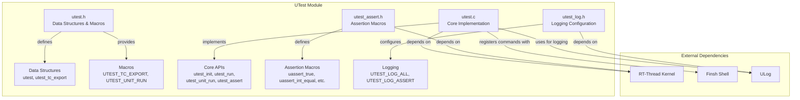
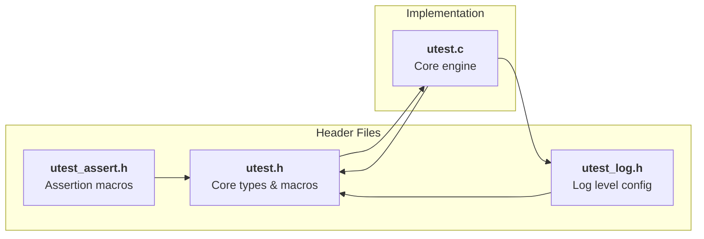
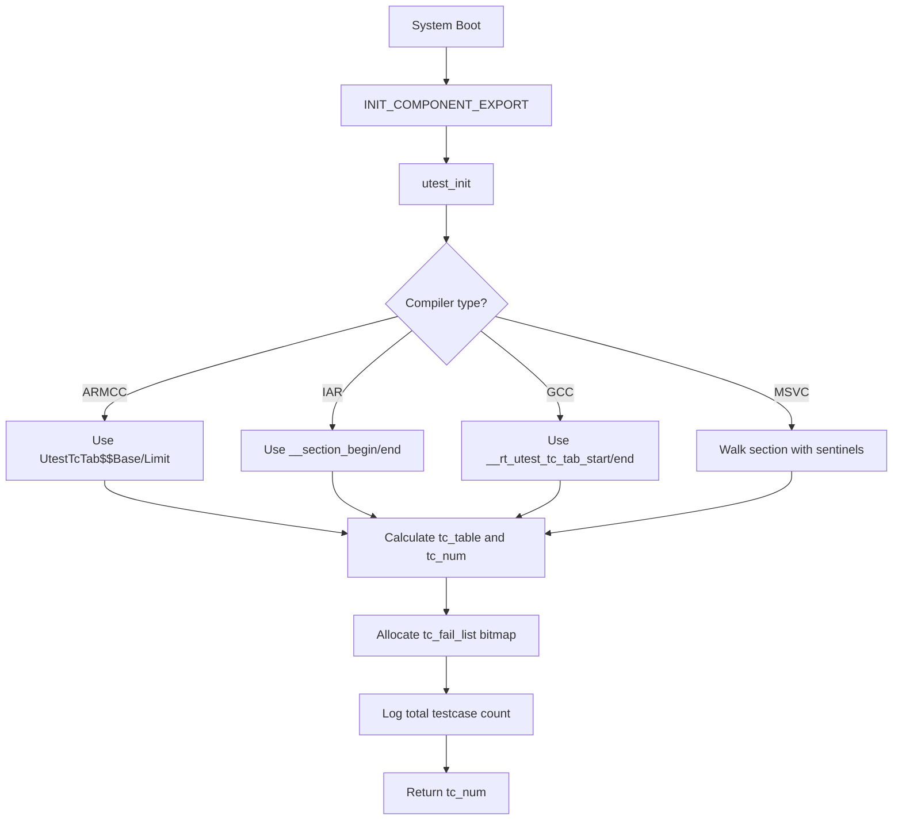
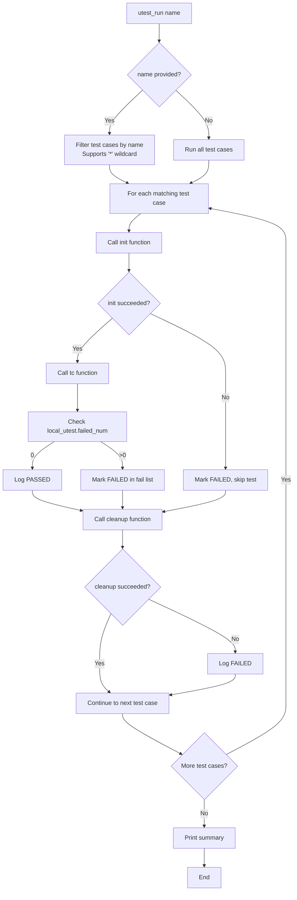
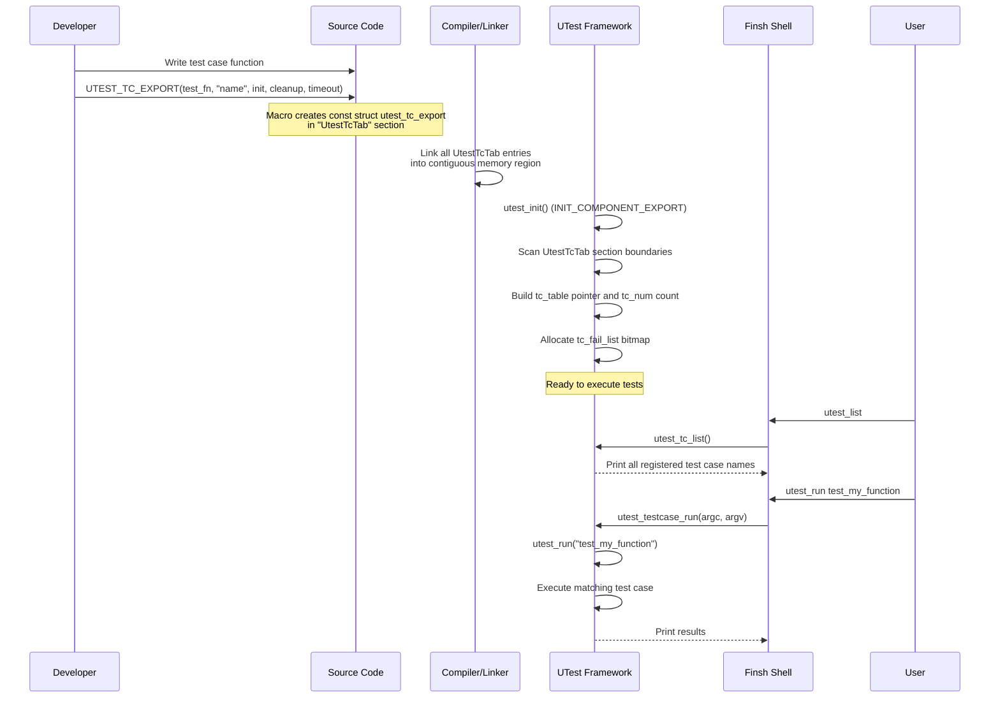
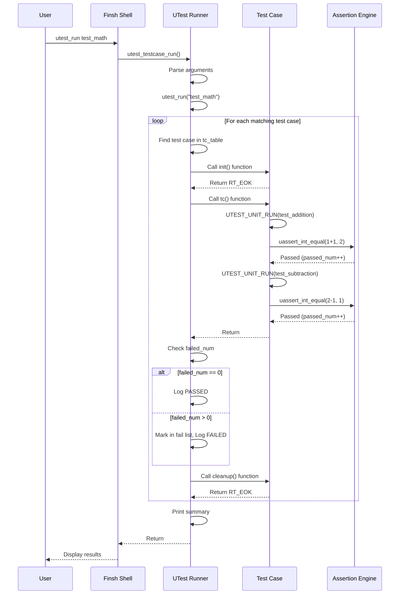
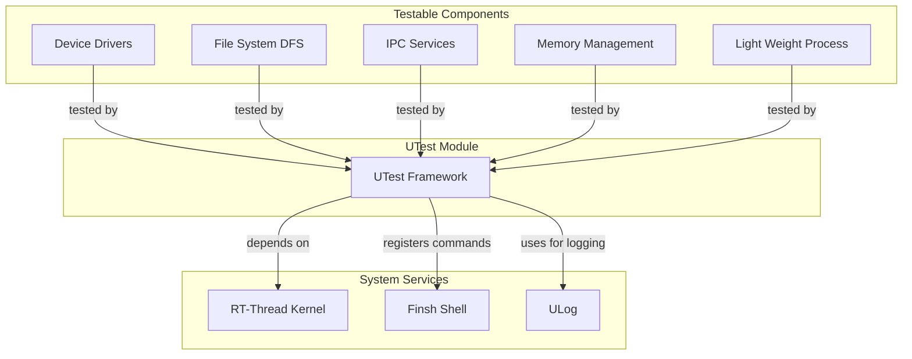

# UTest - RT-Thread Unit Testing Framework

## Introduction

The **UTest** module is a lightweight, embedded-friendly unit testing framework for the RT-Thread operating system. It provides a structured way to define, register, and execute test cases on target hardware or in simulation environments. UTest is designed specifically for resource-constrained embedded systems, offering:

- **Minimal overhead**: Test cases are exported to a special linker section (`UtestTcTab`) with zero runtime cost until executed
- **Finsh integration**: Test cases can be discovered and executed via the Finsh command-line shell
- **Structured test lifecycle**: Each test case follows an `init → test → cleanup` pattern
- **Comprehensive assertion macros**: A rich set of assertion macros for validating conditions, strings, buffers, and ranges
- **Loop execution**: Support for running test cases multiple times for stress testing
- **Threaded execution**: Optional execution in a dedicated thread to test thread-safety and timeout behavior

The module is located at `components/utilities/utest/` and is enabled via the `RT_USING_UTEST` Kconfig option.

---

## Architecture Overview

UTest follows a **registration-based** architecture where test cases are statically defined at compile time and dynamically discovered at runtime.



### Component Dependency Diagram



---

## Core Data Structures

### `struct utest` — Test Run State

Defined in `utest.h`, this structure tracks the state of a single test run:

```c
struct utest
{
    utest_err_e error;        /* Error number from enum utest_error */
    uint32_t passed_num;      /* Total number of tests passed */
    uint32_t failed_num;      /* Total number of tests failed */
};
typedef struct utest *utest_t;
```

- **error**: Current error state (`UTEST_PASSED`, `UTEST_FAILED`, or `UTEST_SKIPPED`)
- **passed_num**: Accumulated count of passed assertions within the current unit test
- **failed_num**: Accumulated count of failed assertions within the current unit test

A global singleton `local_utest` is maintained in `utest.c` and accessed via `utest_handle_get()`.

### `enum utest_error` — Test Result Enumeration

```c
enum utest_error
{
    UTEST_PASSED  = 0,    /* Test success */
    UTEST_FAILED  = 1,    /* Test failed */
    UTEST_SKIPPED = 2     /* Test skipped */
};
```

### `struct utest_tc_export` — Test Case Export Descriptor

This is the core data structure that represents a single test case. Instances are placed in the `UtestTcTab` linker section for automatic discovery:

```c
struct utest_tc_export {
    const char  *name;          /* Testcase name */
    uint32_t     run_timeout;   /* Testcase maximum test time (seconds) */
    rt_err_t   (*init)(void);   /* Initialization function (optional) */
    void       (*tc)(void);     /* Test case function (required) */
    rt_err_t   (*cleanup)(void);/* Cleanup function (optional) */
};
typedef struct utest_tc_export *utest_tc_export_t;
```

| Field | Description |
|-------|-------------|
| `name` | Human-readable test case name (max `UTEST_NAME_MAX_LEN` = 128) |
| `run_timeout` | Maximum allowed execution time in seconds (for watchdog/timeout purposes) |
| `init` | Optional setup function called before the test; returns `RT_EOK` on success |
| `tc` | The actual test function containing unit test assertions |
| `cleanup` | Optional teardown function called after the test; returns `RT_EOK` on success |

### `test_unit_func` — Unit Test Function Pointer

```c
typedef void (*test_unit_func)(void);
```

A function pointer type for individual unit test functions within a test case.

---

## Key Macros

### `UTEST_TC_EXPORT(testcase, name, init, cleanup, timeout)`

This is the primary macro for registering a test case. It creates a `const struct utest_tc_export` instance and places it in the `UtestTcTab` linker section.

```c
UTEST_TC_EXPORT(testcase, name, init, cleanup, timeout)
```

**Parameters:**
- `testcase`: The test case function (must be `void func(void)`)
- `name`: String name for the test case
- `init`: Initialization function (can be `RT_NULL`)
- `cleanup`: Cleanup function (can be `RT_NULL`)
- `timeout`: Maximum execution time in seconds

**Example:**
```c
static rt_err_t utest_tc_init(void)
{
    /* Setup code */
    return RT_EOK;
}

static rt_err_t utest_tc_cleanup(void)
{
    /* Teardown code */
    return RT_EOK;
}

static void test_my_function(void)
{
    /* Test assertions */
    uassert_int_equal(1 + 1, 2);
}

UTEST_TC_EXPORT(test_my_function, "test_my_function",
                utest_tc_init, utest_tc_cleanup, 10);
```

**Implementation Details:**

For GCC/ARMCC/IAR compilers, the macro uses `rt_section("UtestTcTab")` to place the structure in a named section:

```c
#define UTEST_TC_EXPORT(testcase, name, init, cleanup, timeout)                \
    rt_used static const struct utest_tc_export _utest_testcase                \
    rt_section("UtestTcTab") =                                                 \
    {                                                                          \
        name,                                                                  \
        timeout,                                                               \
        init,                                                                  \
        testcase,                                                              \
        cleanup                                                                \
    }
```

For MSVC, it uses `__declspec(allocate("UtestTcTab$f"))` with linker merging.

### `UTEST_UNIT_RUN(test_unit_func)`

Executes a unit test function within a test case. If the unit test fails, the macro returns early from the enclosing function:

```c
#define UTEST_UNIT_RUN(test_unit_func)                                         \
    utest_unit_run(test_unit_func, #test_unit_func);                           \
    if(utest_handle_get()->failed_num != 0) return;
```

**Example:**
```c
static void test_math_operations(void)
{
    UTEST_UNIT_RUN(test_addition);
    UTEST_UNIT_RUN(test_subtraction);
    UTEST_UNIT_RUN(test_multiplication);
}
```

---

## Assertion Macros

Defined in `utest_assert.h`, these macros provide a rich set of validation primitives:

| Macro | Description | Pass Condition |
|-------|-------------|----------------|
| `uassert_true(value)` | Assert value is true | `value` is non-zero |
| `uassert_false(value)` | Assert value is false | `value` is zero |
| `uassert_null(value)` | Assert value is NULL | `value == RT_NULL` |
| `uassert_not_null(value)` | Assert value is not NULL | `value != RT_NULL` |
| `uassert_int_equal(a, b)` | Assert integers equal | `a == b` |
| `uassert_int_not_equal(a, b)` | Assert integers not equal | `a != b` |
| `uassert_str_equal(a, b)` | Assert strings equal | `strcmp(a, b) == 0` |
| `uassert_str_not_equal(a, b)` | Assert strings not equal | `strcmp(a, b) != 0` |
| `uassert_buf_equal(a, b, sz)` | Assert buffers equal | `memcmp(a, b, sz) == 0` |
| `uassert_buf_not_equal(a, b, sz)` | Assert buffers not equal | `memcmp(a, b, sz) != 0` |
| `uassert_in_range(value, min, max)` | Assert value in range | `value >= min && value <= max` |
| `uassert_not_in_range(value, min, max)` | Assert value out of range | `value < min \|\| value > max` |

All assertion macros automatically capture the source file, line number, and function name for diagnostic output.

---

## Core Implementation (`utest.c`)

### Initialization — `utest_init()`

The initialization function is automatically called during system startup via `INIT_COMPONENT_EXPORT(utest_init)`. It performs the following:

1. **Discovers the test case table** by locating the `UtestTcTab` section boundaries using compiler-specific symbols:
   - **ARMCC**: `UtestTcTab$$Base` and `UtestTcTab$$Limit`
   - **IAR**: `__section_begin("UtestTcTab")` and `__section_end("UtestTcTab")`
   - **GCC**: `__rt_utest_tc_tab_start` and `__rt_utest_tc_tab_end`
   - **MSVC**: Custom section walking with `__tc_export_begin` and `__tc_export_end` sentinels

2. **Allocates a fail list** (`tc_fail_list`) — a bitmap used to track which test cases failed during execution

3. **Logs the total number** of registered test cases



### Test Case Execution — `utest_run()`

The core execution function iterates through all registered test cases and runs them:



**Key behaviors:**
- Supports wildcard matching: `utest_run test*` runs all test cases starting with "test"
- Maintains a fail list bitmap to track which test cases failed
- Supports loop execution: `utest_run testcaseA 10` runs the test case 10 times
- Prints a detailed summary showing passed/failed counts and listing failed test names

### Finsh Command Interface

UTest registers two commands with the Finsh shell:

#### `utest_list` — List All Test Cases

```bash
msh /> utest_list
[testcase name]:test_my_function; [run timeout]:10
[testcase name]:test_another; [run timeout]:5
```

#### `utest_run` — Execute Test Cases

```bash
msh /> utest_run -help

Command: utest_run
   info: Execute test cases.
 format: utest_run [-thread or -help] [testcase name] [loop num]
  usage:
         1. utest_run
            Do not specify a test case name. Run all test cases.
         2. utest_run -thread
            Do not specify a test case name. Run all test cases in threaded mode.
         3. utest_run testcaseA
            Run 'testcaseA'.
         4. utest_run testcaseA 10
            Run 'testcaseA' ten times.
         5. utest_run -thread testcaseA
            Run 'testcaseA' in threaded mode.
         6. utest_run -thread testcaseA 10
            Run 'testcaseA' ten times in threaded mode.
         7. utest_run test*
            support '*' wildcard. Run all test cases starting with 'test'.
         8. utest_run -help
            Show utest help information
```

### Threaded Execution Mode

When the `-thread` flag is used, UTest creates a dedicated thread to run the test cases:

```c
tid = rt_thread_create("utest",
                        (void (*)(void *))utest_run, thr_param,
                        UTEST_THREAD_STACK_SIZE, UTEST_THREAD_PRIORITY, 10);
```

- **Stack size**: Configurable via `UTEST_THR_STACK_SIZE` (default: 4096 bytes)
- **Priority**: Configurable via `UTEST_THR_PRIORITY` (default: `FINSH_THREAD_PRIORITY`)

This mode is useful for:
- Testing thread-safety of components
- Avoiding blocking the shell thread during long-running tests
- Testing timeout behavior (the shell can still accept commands)

### Assertion Functions

#### `utest_assert()` — Core Assertion

```c
void utest_assert(int value, const char *file, int line, 
                  const char *func, const char *msg);
```

- If `value` is non-zero (true): increments `passed_num`, logs debug message
- If `value` is zero (false): increments `failed_num`, logs error with file/line/function/msg

#### `utest_assert_string()` — String Comparison

```c
void utest_assert_string(const char *a, const char *b, rt_bool_t equal,
                         const char *file, int line, const char *func, 
                         const char *msg);
```

- Compares two strings using `rt_strcmp()`
- `equal = RT_TRUE`: passes if strings are equal
- `equal = RT_FALSE`: passes if strings are not equal

#### `utest_assert_buf()` — Buffer Comparison

```c
void utest_assert_buf(const char *a, const char *b, rt_size_t sz, 
                      rt_bool_t equal, const char *file, int line, 
                      const char *func, const char *msg);
```

- Compares two memory buffers using `rt_memcmp()`
- `equal = RT_TRUE`: passes if buffers are equal
- `equal = RT_FALSE`: passes if buffers are not equal

---

## Data Flow

### Test Case Registration Flow



### Test Case Execution Flow



---

## Configuration Options

The module is configured via Kconfig (`components/utilities/utest/Kconfig`):

| Option | Default | Description |
|--------|---------|-------------|
| `RT_USING_UTEST` | n | Master switch for UTest module |
| `UTEST_THR_STACK_SIZE` | 4096 | Stack size for threaded test execution |
| `UTEST_THR_PRIORITY` | `FINSH_THREAD_PRIORITY` | Priority for threaded test execution |
| `UTEST_DEBUG` | y | Enable debug-level logging for test output |

### Build Integration

From `SConscript`:
```python
from building import *

cwd     = GetCurrentDir()
src     = Glob('*.c')
CPPPATH = [cwd]
group   = DefineGroup('UTest', src, depend = ['RT_USING_UTEST'], CPPPATH = CPPPATH)

Return('group')
```

The module is conditionally compiled based on the `RT_USING_UTEST` dependency.

---

## Usage Examples

### Basic Test Case

```c
#include <rtthread.h>
#include "utest.h"

static void test_addition(void)
{
    uassert_int_equal(1 + 1, 2);
    uassert_int_equal(100 + 200, 300);
}

static void test_subtraction(void)
{
    uassert_int_equal(5 - 3, 2);
    uassert_int_not_equal(5 - 3, 3);
}

static void test_math_operations(void)
{
    UTEST_UNIT_RUN(test_addition);
    UTEST_UNIT_RUN(test_subtraction);
}

UTEST_TC_EXPORT(test_math_operations, "test_math_operations",
                RT_NULL, RT_NULL, 10);
```

### Test Case with Setup/Teardown

```c
#include <rtthread.h>
#include "utest.h"

static rt_device_t test_dev = RT_NULL;

static rt_err_t utest_tc_init(void)
{
    test_dev = rt_device_find("uart1");
    if (test_dev == RT_NULL)
    {
        return -RT_ERROR;
    }
    return RT_EOK;
}

static rt_err_t utest_tc_cleanup(void)
{
    test_dev = RT_NULL;
    return RT_EOK;
}

static void test_device_open(void)
{
    rt_err_t result;
    
    uassert_not_null(test_dev);
    result = rt_device_open(test_dev, RT_DEVICE_OFLAG_RDWR);
    uassert_int_equal(result, RT_EOK);
    rt_device_close(test_dev);
}

static void test_device_control(void)
{
    /* Test device control operations */
    uassert_true(1); /* Placeholder */
}

static void test_device_operations(void)
{
    UTEST_UNIT_RUN(test_device_open);
    UTEST_UNIT_RUN(test_device_control);
}

UTEST_TC_EXPORT(test_device_operations, "test_device_operations",
                utest_tc_init, utest_tc_cleanup, 10);
```

### Stress Testing with Loop

```bash
# Run a specific test case 100 times
msh /> utest_run test_device_operations 100

# Run all test cases 5 times in threaded mode
msh /> utest_run -thread 5
```

### Using Wildcard Matching

```bash
# Run all test cases starting with "test_device"
msh /> utest_run test_device*
```

---

## Dependencies and Integration

### Internal Dependencies

| Component | Depends On | Purpose |
|-----------|-----------|---------|
| `utest.c` | `rtthread.h`, `string.h`, `stdlib.h` | Core kernel APIs, string/memory operations |
| `utest.c` | `utest.h`, `utest_log.h` | Data structures and logging |
| `utest.c` | `rtdbg.h` | Debug logging infrastructure |
| `utest.h` | `rtthread.h`, `stdint.h` | Basic RT-Thread types |
| `utest.h` | `utest_log.h`, `utest_assert.h` | Logging and assertion support |
| `utest_assert.h` | `utest.h`, `rtthread.h` | Core types for assertion macros |
| `utest_log.h` | `rtthread.h`, `rtdbg.h` | Log level definitions |

### External Module Dependencies

- **[RT-Thread Kernel](RT-Thread%20Kernel.md)**: Provides threads, timers, memory management, and the object system. UTest uses `rt_thread_create()`, `rt_thread_mdelay()`, `rt_malloc()`, `rt_memset()`, `rt_memcmp()`, `rt_strcmp()`, `rt_strncpy()`, and other kernel primitives.
- **[Finsh Shell](Finsh%20Shell.md)**: UTest registers its commands (`utest_run`, `utest_list`) using `MSH_CMD_EXPORT_ALIAS`, making them accessible from the shell.
- **[ULog](ULog.md)**: UTest uses the ULog infrastructure for diagnostic output via `LOG_I`, `LOG_E`, `LOG_D` macros (through `rtdbg.h`).

### Integration with Other Modules



---

## Logging and Output

UTest uses the ULog infrastructure through `rtdbg.h` for all its output. The log tag is `"utest"` for framework messages and `"testcase"` for test case output.

### Log Level Configuration

```c
// In utest_log.h
#define UTEST_LOG_ALL    (1u)    /* Show all log output including debug */
#define UTEST_LOG_ASSERT (2u)    /* Show only assertion failures */
```

The log level can be set at runtime:
```c
void utest_log_lv_set(rt_uint8_t lv);
```

### Output Format

UTest produces structured output with clear pass/fail indicators:

```
[==========] [ utest    ] loop 1/1
[==========] [ utest    ] started
[----------] [ testcase ] (test_math_operations) started
[  PASSED  ] [ result   ] testcase (test_math_operations)
[----------] [ testcase ] (test_math_operations) finished
[==========] [ utest    ] finished
[==========] [ utest    ] 1 tests from 1 testcase ran.
[  PASSED  ] [ result   ] 1 tests.
```

On failure:
```
[  FAILED  ] [ result   ] testcase (test_device_operations)
[  ASSERT  ] [ unit     ] at (utest_example.c); func: (test_device_open:42); msg: (test_dev is null)
```

---

## Porting and Extending

### Adding New Assertion Types

New assertion macros can be added by:
1. Implementing a new assertion function in `utest.c` (following the pattern of `utest_assert_string` or `utest_assert_buf`)
2. Declaring it in `utest_assert.h`
3. Creating a macro wrapper that captures `__FILE__`, `__LINE__`, and `__func__`

### Custom Test Case Discovery

The `UtestTcTab` section mechanism can be extended to support dynamic test case registration by:
1. Adding a linked list of dynamically registered test cases
2. Merging them with the static table during `utest_init()`

---

## Limitations and Considerations

1. **Static Registration Only**: Test cases must be defined at compile time; there is no runtime registration API
2. **Single-threaded Execution**: Test cases within a single run are executed sequentially (though the entire run can be in a separate thread)
3. **No Test Isolation**: Failed assertions do not crash the system but mark the test as failed; the test continues
4. **No Mocking Framework**: UTest is a simple assertion framework without built-in mock/stub support
5. **Memory Usage**: The `tc_fail_list` bitmap is allocated dynamically based on the number of test cases
6. **Console Buffer Requirement**: Requires `RT_CONSOLEBUF_SIZE >= 256` for proper output formatting
