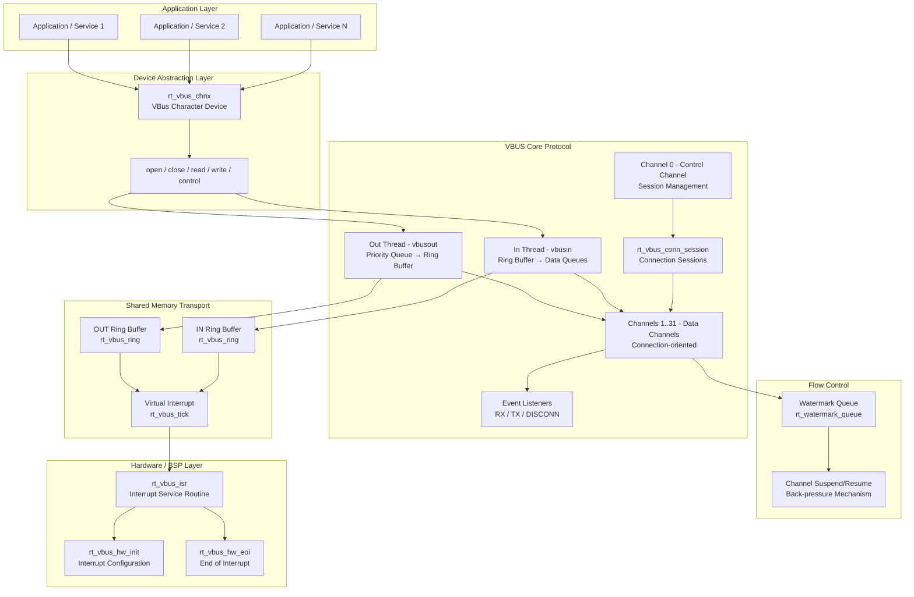
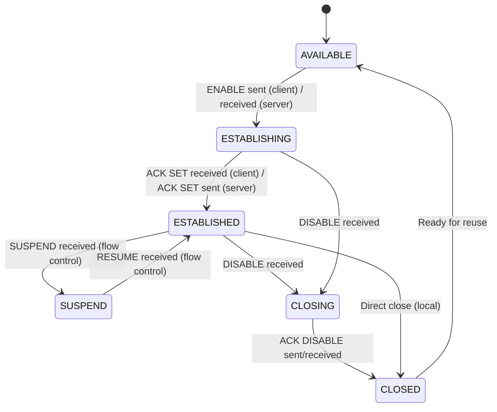
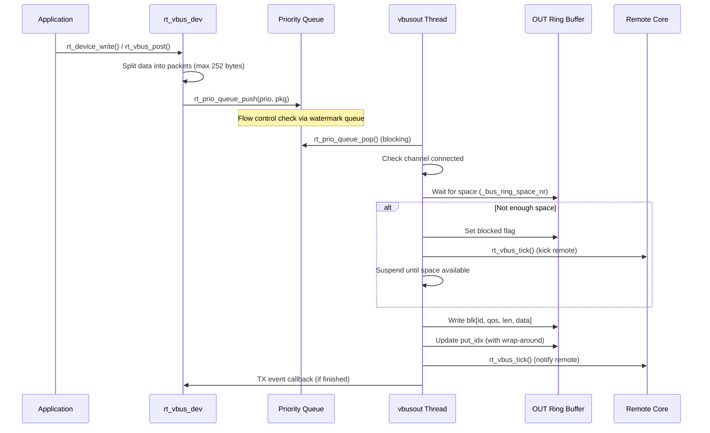
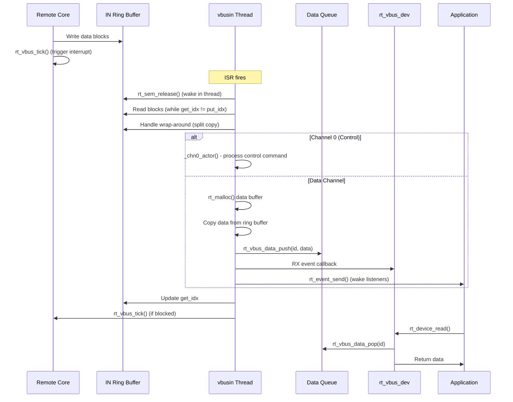
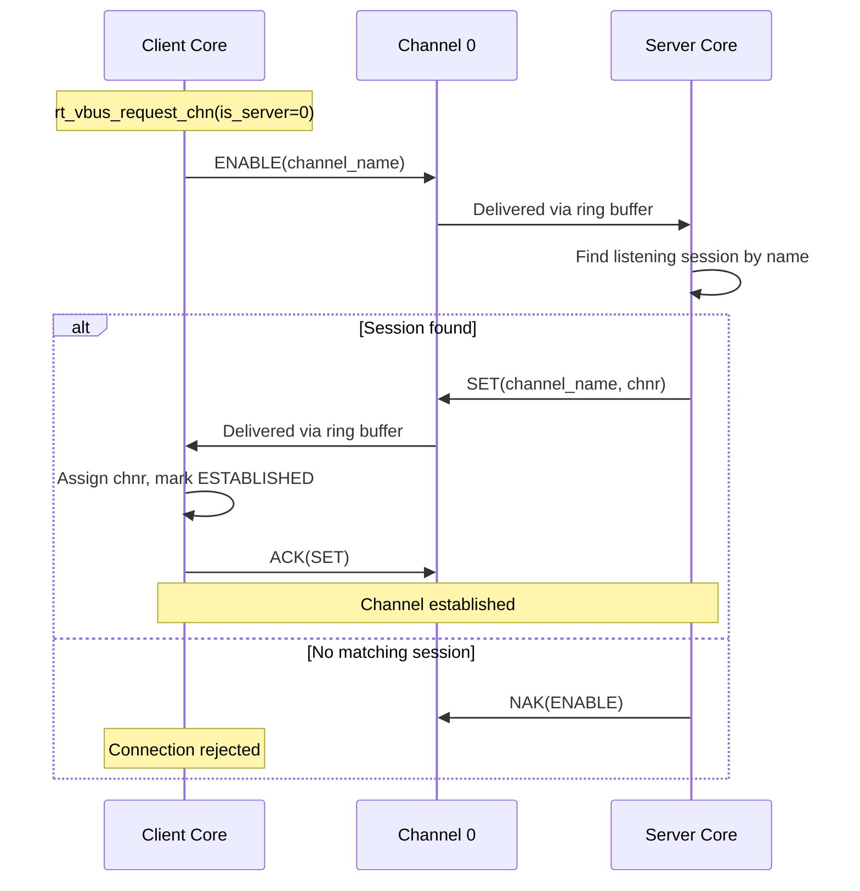
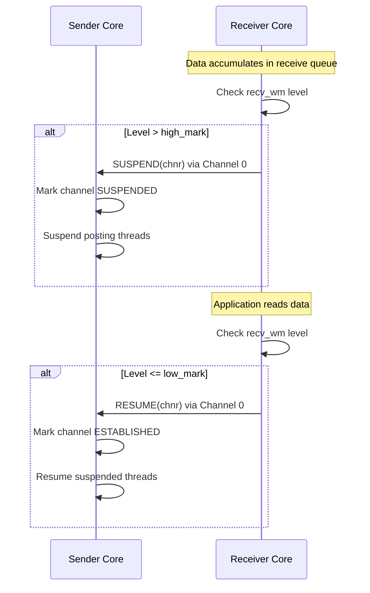

# VBUS: Virtual Software Bus

## Introduction

VBUS (Virtual Software Bus) is a **shared-memory-based inter-processor communication (IPC) framework** within the RT-Thread ecosystem. It enables efficient, high-speed data exchange between two processor cores (e.g., an MCU and a co-processor, or a host and a guest in a virtualized environment) using a **lock-free ring buffer** design.

Unlike traditional serial-based communication (UART, SPI), VBUS leverages **shared memory** and **virtual interrupts** to achieve near-zero-copy data transfer with minimal CPU overhead. It provides:

- **Multi-channel communication** — up to 31 logical channels (plus channel 0 for control)
- **Priority-based message queuing** — messages are delivered in priority order
- **Flow control** — watermark-based back-pressure to prevent buffer overflow
- **Connection-oriented sessions** — request/establish/close lifecycle for each channel
- **Device abstraction** — channels exposed as standard RT-Thread devices for POSIX-like read/write access
- **Event-driven notifications** — RX, TX, and disconnect event listeners

VBUS is part of the RT-Thread `components/vbus` package and is designed for **multi-core** or **virtualized** systems where two operating system instances share a region of physical memory.

---

## Architecture Overview

VBUS follows a **layered architecture** with a shared-memory transport layer, a control channel for session management, data channels for payload transfer, and a device abstraction layer for application access.



### Component Relationships

```mermaid
classDiagram
    class rt_vbus_ring {
        +volatile size_t put_idx
        +volatile size_t get_idx
        +volatile unsigned int blocked
        +rt_vbus_blk blks[RT_VMM_RB_BLK_NR]
    }

    class rt_vbus_blk {
        +unsigned char id
        +unsigned char qos
        +unsigned char len
        +unsigned char reserved
        +unsigned char data[60]
    }

    class rt_vbus_pkg {
        +rt_uint8_t id
        +rt_uint8_t prio
        +rt_uint8_t finished
        +rt_uint8_t len
        +const void* data
    }

    class rt_vbus_data {
        +unsigned char size
        +rt_vbus_data* next
        +data follows struct
    }

    class rt_vbus_request {
        +unsigned char prio
        +const char* name
        +int is_server
        +rt_vbus_wm_cfg recv_wm
        +rt_vbus_wm_cfg post_wm
    }

    class rt_vbus_conn_session {
        +int chnr
        +enum _vbus_session_st st
        +rt_completion cmp
        +rt_vbus_request* req
    }

    class rt_vbus_dev {
        +rt_uint8_t chnr
        +rt_vbus_data* act
        +rt_size_t pos
        +rt_vbus_request req
    }

    class rt_vbus_dev_liscfg {
        +enum rt_vbus_event_id event
        +rt_vbus_event_listener listener
        +void* ctx
    }

    class rt_vbus_wm_cfg {
        +unsigned int low
        +unsigned int high
    }

    class rt_prio_queue {
        +rt_uint32_t bitmap
        +rt_prio_queue_item* head[32]
        +rt_prio_queue_item* tail[32]
        +rt_list_t suspended_pop_list
        +rt_size_t item_sz
        +rt_mempool pool
    }

    class rt_watermark_queue {
        +unsigned int level
        +unsigned int high_mark
        +unsigned int low_mark
        +rt_list_t suspended_threads
    }

    rt_vbus_ring --> rt_vbus_blk : contains
    rt_vbus_conn_session --> rt_vbus_request : req
    rt_vbus_dev --> rt_vbus_request : req
    rt_vbus_dev --> rt_vbus_data : act
    rt_vbus_dev_liscfg --> rt_vbus_event_listener : listener
    rt_prio_queue --> rt_prio_queue_item : manages
    rt_watermark_queue --> rt_list_t : suspended_threads
```



---

## Core Components

### 1. Shared Memory Ring Buffer (`rt_vbus_ring` / `rt_vbus_blk`)

The foundation of VBUS is a **lock-free ring buffer** residing in shared memory accessible by both processor cores. Two ring buffers are used:

- **OUT Ring** (`RT_VBUS_OUT_RING`): Used by the local core to send data to the remote core
- **IN Ring** (`RT_VBUS_IN_RING`): Used by the remote core to send data to the local core

**Ring Buffer Structure (`rt_vbus_ring`):**
| Field | Description |
|-------|-------------|
| `put_idx` | Write index (volatile for SMP safety) |
| `get_idx` | Read index (volatile for SMP safety) |
| `blocked` | Flag indicating a writer is blocked waiting for space |
| `blks[]` | Array of block descriptors (`rt_vbus_blk`) |

**Block Structure (`rt_vbus_blk`):** 64 bytes per block
```
Offset: 0    1    2    3    4...63
        +----+----+----+----+---------+
        | id | qos| len| rsr|  data   |
        +----+----+----+----+---------+
```
| Field | Size | Description |
|-------|------|-------------|
| `id` | 1 byte | Channel number (0-31) |
| `qos` | 1 byte | Priority / QoS level |
| `len` | 1 byte | Data length (max 60 bytes) |
| `reserved` | 1 byte | Reserved |
| `data` | 60 bytes | Payload data |

**Key Design Points:**
- **Lock-free**: Uses memory barriers (`rt_vbus_smp_wmb()`, `rt_vbus_smp_rmb()`) instead of locks
- **Fixed-size blocks**: Each block is 64 bytes (4 header + 60 data), enabling simple index arithmetic
- **Wrap-around**: Handles ring buffer wrap-around with split-copy logic for data spanning the end of the buffer
- **Space calculation**: `_bus_ring_space_nr()` computes available space accounting for the full/empty ambiguity

### 2. Priority Queue (`rt_prio_queue`)

The **priority queue** is the internal queuing mechanism used by the VBUS out thread. It provides **32 priority levels** (0-31, where 0 is highest) and is backed by a memory pool for efficient allocation.

**Structure (`rt_prio_queue`):**
| Field | Description |
|-------|-------------|
| `bitmap` | 32-bit bitmap indicating which priority levels have items |
| `head[32]` | Head pointers for each priority level's linked list |
| `tail[32]` | Tail pointers for each priority level's linked list |
| `suspended_pop_list` | List of threads waiting to pop data |
| `item_sz` | Size of each item's data payload |
| `pool` | Memory pool for allocating queue items |

**Key Operations:**
- `rt_prio_queue_push()`: Push data with a priority level. Uses `__rt_ffs()` (find first set) for efficient priority lookup
- `rt_prio_queue_pop()`: Pop the highest-priority item. Suspends the calling thread if the queue is empty
- `rt_prio_queue_create()`: Dynamically create a priority queue with heap allocation

### 3. Watermark Queue (`rt_watermark_queue`)

The **watermark queue** implements flow control with high/low watermarks. It is used to prevent buffer overflow by suspending producer threads when the queue level exceeds the high mark, and resuming them when it drops below the low mark.

**Structure (`rt_watermark_queue`):**
| Field | Description |
|-------|-------------|
| `level` | Current water level |
| `high_mark` | High watermark threshold |
| `low_mark` | Low watermark threshold |
| `suspended_threads` | List of threads suspended due to high water level |

**Key Operations:**
- `rt_wm_que_inc()`: Increase water level. Suspends the calling thread if level > high_mark
- `rt_wm_que_dec()`: Decrease water level. Resumes all suspended threads when level reaches low_mark
- `rt_wm_que_set_mark()`: Configure the high/low thresholds

### 4. Channel 0 — Control Channel

Channel 0 is a **special, always-connected channel** used exclusively for control messages. It manages session establishment, teardown, and flow control commands between the two cores.

**Control Commands (enum):**
| Command | Value | Description |
|---------|-------|-------------|
| `RT_VBUS_CHN0_CMD_ENABLE` | 0 | Client requests to establish a channel |
| `RT_VBUS_CHN0_CMD_DISABLE` | 1 | Request to close a channel |
| `RT_VBUS_CHN0_CMD_SET` | 2 | Server assigns a channel number |
| `RT_VBUS_CHN0_CMD_ACK` | 3 | Acknowledgment of a command |
| `RT_VBUS_CHN0_CMD_NAK` | 4 | Negative acknowledgment |
| `RT_VBUS_CHN0_CMD_SUSPEND` | 5 | Suspend a channel (flow control) |
| `RT_VBUS_CHN0_CMD_RESUME` | 6 | Resume a suspended channel |

### 5. Connection Session (`rt_vbus_conn_session`)

Sessions manage the lifecycle of channel establishment. Each session tracks the state of a connection request.

**Session States:**
| State | Description |
|-------|-------------|
| `SESSIOM_AVAILABLE` | Session slot is free |
| `SESSIOM_LISTENING` | Server is listening for incoming connections |
| `SESSIOM_ESTABLISHING` | Connection is being established (waiting for ACK/SET) |

### 6. Channel States (`rt_vbus_chn_status`)

Each data channel (1-31) has a state machine:



### 7. Device Abstraction (`rt_vbus_dev` / `rt_vbus_chnx`)

VBUS channels are exposed as standard RT-Thread character devices through the `rt_vbus_chnx` module. This allows applications to use the familiar `rt_device_open/read/write/close` API.

**Device Operations:**
| Operation | Description |
|-----------|-------------|
| `_open()` | Requests a channel via `rt_vbus_request_chn()` and registers RX/TX listeners |
| `_close()` | Closes the channel via `rt_vbus_close_chn()` |
| `_read()` | Reads data from the channel's receive queue (blocks if empty) |
| `_write()` | Posts data to the channel via `rt_vbus_post()` |
| `_control()` | Configures watermark levels and event listeners via IOCTL |

**IOCTL Commands:**
| Command | Description |
|---------|-------------|
| `VBUS_IOCRECV_WM` | Set receive watermark levels |
| `VBUS_IOCPOST_WM` | Set post (send) watermark levels |
| `VBUS_IOC_LISCFG` | Configure event listener (RX, TX, DISCONN) |

### 8. Event Listeners

Applications can register callbacks for three types of events on any channel:

```c
enum rt_vbus_event_id {
    RT_VBUS_EVENT_ID_RX,       // Data received on channel
    RT_VBUS_EVENT_ID_TX,       // Data has been written to ring buffer
    RT_VBUS_EVENT_ID_DISCONN,  // Channel has been closed by remote
    RT_VBUS_EVENT_ID_MAX,
};
```

---

## Data Flow

### Send Path (Local → Remote)



### Receive Path (Remote → Local)



### Channel Establishment (Client/Server Handshake)



### Flow Control Mechanism



---

## Configuration

### Kconfig Options

| Option | Default | Description |
|--------|---------|-------------|
| `RT_USING_VBUS` | n | Enable VBUS module |
| `RT_USING_VBUS_RFS` | n | Enable Remote File System over VBUS |
| `RT_USING_VBUS_RSHELL` | n | Enable Remote Shell over VBUS |
| `RT_VBUS_USING_TESTS` | n | Enable VBUS test suite |
| `_RT_VBUS_RING_BASE` | - | Physical address of the ring buffer in shared memory |
| `_RT_VBUS_RING_SZ` | - | Size of the ring buffer |
| `RT_VBUS_GUEST_VIRQ` | - | Virtual IRQ number for notifying the guest |
| `RT_VBUS_HOST_VIRQ` | - | Virtual IRQ number for notifying the host |
| `RT_VBUS_SHELL_DEV_NAME` | "vbser0" | Device name for remote shell |
| `RT_VBUS_RFS_DEV_NAME` | "rfs" | Device name for remote file system |

### Key Constants (from `vbus_api.h`)

| Constant | Value | Description |
|----------|-------|-------------|
| `RT_VBUS_CHANNEL_NR` | 32 | Maximum number of channels (0-31) |
| `RT_VBUS_BLK_HEAD_SZ` | 4 | Header size of each block |
| `RT_VBUS_MAX_PKT_SZ` | 252 | Maximum payload per packet (256 - 4) |
| `RT_VMM_RB_BLK_NR` | `(_RT_VBUS_RING_SZ / 64 - 1)` | Number of blocks in the ring buffer |
| `RT_VBUS_CHN_NAME_MAX` | 16 | Maximum channel name length |

---

## API Reference

### Core VBUS API

```c
// Initialize VBUS with two ring buffers (out, in)
int rt_vbus_init(void *outr, void *inr);

// Post data on a channel
rt_err_t rt_vbus_post(rt_uint8_t chnr, rt_uint8_t prio,
                      const void *datap, rt_size_t size,
                      rt_int32_t timeout);

// Request a channel (client or server)
int rt_vbus_request_chn(struct rt_vbus_request *req, int timeout);

// Close a channel
void rt_vbus_close_chn(unsigned char chnr);

// Register event listener
void rt_vbus_register_listener(unsigned char chnr,
                               enum rt_vbus_event_id eve,
                               rt_vbus_event_listener indi,
                               void *ctx);

// Block until an event occurs on a channel
rt_err_t rt_vbus_listen_on(rt_uint8_t chnr, rt_int32_t timeout);

// Push/pop data from a channel's receive queue
void rt_vbus_data_push(unsigned int chnr, struct rt_vbus_data *data);
struct rt_vbus_data* rt_vbus_data_pop(unsigned int chnr);

// Set watermark levels
void rt_vbus_set_post_wm(unsigned char chnr, unsigned int low, unsigned int high);
void rt_vbus_set_recv_wm(unsigned char chnr, unsigned int low, unsigned int high);
```

### Device Abstraction API

```c
// Initialize VBUS character devices
rt_err_t rt_vbus_chnx_init(void);

// Get channel number from a VBUS device
rt_uint8_t rt_vbus_get_chnnr(rt_device_t dev);

// Register disconnect callback on a VBUS device
void rt_vbus_chnx_register_disconn(rt_device_t dev,
                                   rt_vbus_event_listener indi,
                                   void *ctx);
```

### Hardware Interface (BSP must implement)

```c
// Initialize hardware (interrupts, etc.)
int rt_vbus_hw_init(void);

// Interrupt Service Routine
void rt_vbus_isr(int irqnr, void *param);

// End of Interrupt
int rt_vbus_hw_eoi(int irqnr, void *param);
```

### Debug/Dump Functions

```c
void rt_vbus_rb_dump(void);       // Dump ring buffer state
void rt_vbus_chn_dump(void);      // Dump channel status
void rt_vbus_sess_dump(void);     // Dump connection sessions
void rt_vbus_que_dump(void);      // Dump priority queue
void rt_vbus_data_pkt_dump(void); // Dump data packets in queues
void rt_vbus_chm_wm_dump(void);   // Dump watermark levels
unsigned int rt_vbus_total_data_sz(void); // Total data transferred
```

---

## Dependencies

### Internal Dependencies

| Component | Usage |
|-----------|-------|
| [RT-Thread Kernel](RT-Thread%20Kernel.md) | Thread management, semaphores, events, timers, memory management, completion objects |
| [Device Drivers Framework](Device%20Drivers%20Framework.md) | Device registration and operations (`rt_device_t`) |
| Memory Pool (`rt_mempool`) | Backing storage for priority queue items |
| SMP Primitives | Memory barriers (`rt_vbus_smp_wmb()`, `rt_vbus_smp_rmb()`) |

### External Dependencies

| Component | Usage |
|-----------|-------|
| **BSP/Hardware** | Must provide shared memory region, interrupt routing, and `rt_vbus_hw_init()`, `rt_vbus_isr()`, `rt_vbus_hw_eoi()` |
| **VMM** (optional) | When used in virtualized environments, VBUS can be integrated with the [Virtual Machine Manager](VMM%20(Virtual%20Machine%20Manager).md) |

---

## Comparison with RT-Link

VBUS and [RT-Link](RT-Link.md) serve different communication needs:

| Feature | VBUS | RT-Link |
|---------|------|---------|
| **Transport** | Shared memory (lock-free ring buffer) | Serial/SPI (byte stream) |
| **Use Case** | Multi-core / virtualized systems | Device-to-device (MCU ↔ MCU) |
| **Max Channels** | 31 data + 1 control | 31 services |
| **Max Packet Size** | 252 bytes per block | 1012 bytes per frame |
| **Flow Control** | Watermark-based suspend/resume | Sliding window ACK |
| **Reliability** | No built-in retransmission | ACK/NACK with retransmission |
| **Data Integrity** | None (assumes reliable shared memory) | CRC32 checksum |
| **Overhead** | Very low (lock-free, zero-copy) | Moderate (frame headers, CRC) |
| **Synchronization** | Memory barriers + virtual interrupts | Hardware flow control + timers |

---

## Usage Example

```c
#include <rtthread.h>
#include <vbus.h>

/* Server side: listen for incoming connections */
static void vbus_server_entry(void *parameter)
{
    struct rt_vbus_request req;
    int chnr;

    req.prio = 0;
    req.name = "echo";
    req.is_server = 1;
    req.recv_wm.low = 10;
    req.recv_wm.high = 50;
    req.post_wm.low = 10;
    req.post_wm.high = 50;

    chnr = rt_vbus_request_chn(&req, RT_WAITING_FOREVER);
    if (chnr < 0)
    {
        rt_kprintf("Failed to request channel\n");
        return;
    }

    while (1)
    {
        struct rt_vbus_data *data;

        rt_vbus_listen_on(chnr, RT_WAITING_FOREVER);
        data = rt_vbus_data_pop(chnr);
        if (data)
        {
            /* Echo back the received data */
            rt_vbus_post(chnr, 0, data + 1, data->size, RT_WAITING_FOREVER);
            rt_free(data);
        }
    }
}

/* Client side: connect to server */
static void vbus_client_entry(void *parameter)
{
    struct rt_vbus_request req;
    int chnr;
    const char *msg = "Hello VBUS!";

    req.prio = 0;
    req.name = "echo";
    req.is_server = 0;
    req.recv_wm.low = 10;
    req.recv_wm.high = 50;
    req.post_wm.low = 10;
    req.post_wm.high = 50;

    chnr = rt_vbus_request_chn(&req, RT_WAITING_FOREVER);
    if (chnr < 0)
    {
        rt_kprintf("Failed to connect\n");
        return;
    }

    rt_vbus_post(chnr, 0, msg, rt_strlen(msg) + 1, RT_WAITING_FOREVER);
}
```

---

## Error Handling

| Error Code | Condition |
|-----------|-----------|
| `-RT_ERROR` | Invalid channel number, uninitialized bus, or general failure |
| `-RT_ENOMEM` | Memory allocation failure (data buffer, session, etc.) |
| `-RT_EFULL` | Flow control: watermark high mark reached with timeout=0 |
| `-RT_ETIMEOUT` | Operation timed out (channel request, data post, listen) |
| `-RT_EIO` | Channel not connected or I/O error |

---

## Porting Guide

To port VBUS to a new platform:

1. **Allocate shared memory**: Reserve a region of physical memory accessible by both cores
2. **Configure ring buffer size**: Set `_RT_VBUS_RING_SZ` in Kconfig (must be multiple of 64)
3. **Set ring buffer base address**: Configure `_RT_VBUS_RING_BASE` with the physical address
4. **Implement hardware interface**:
   - `rt_vbus_hw_init()` — Configure interrupts and shared memory mapping
   - `rt_vbus_isr()` — Called when remote core triggers an interrupt
   - `rt_vbus_hw_eoi()` — Clear interrupt flag
5. **Configure virtual IRQs**: Set `RT_VBUS_GUEST_VIRQ` and `RT_VBUS_HOST_VIRQ`
6. **Initialize VBUS**: Call `rt_vbus_init(out_ring_ptr, in_ring_ptr)` during system startup
