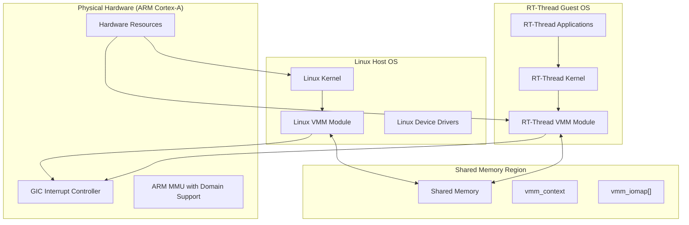
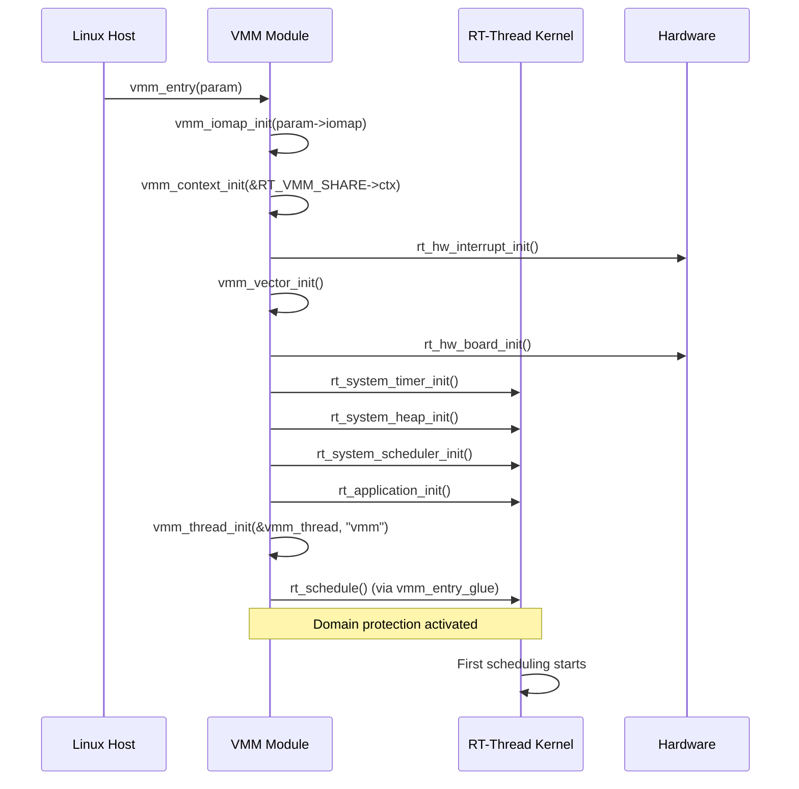
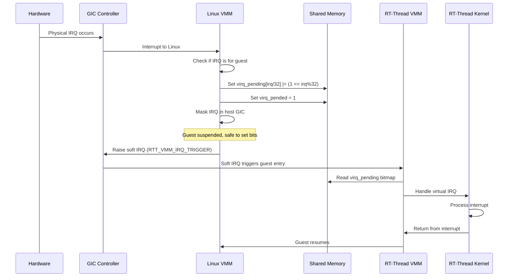
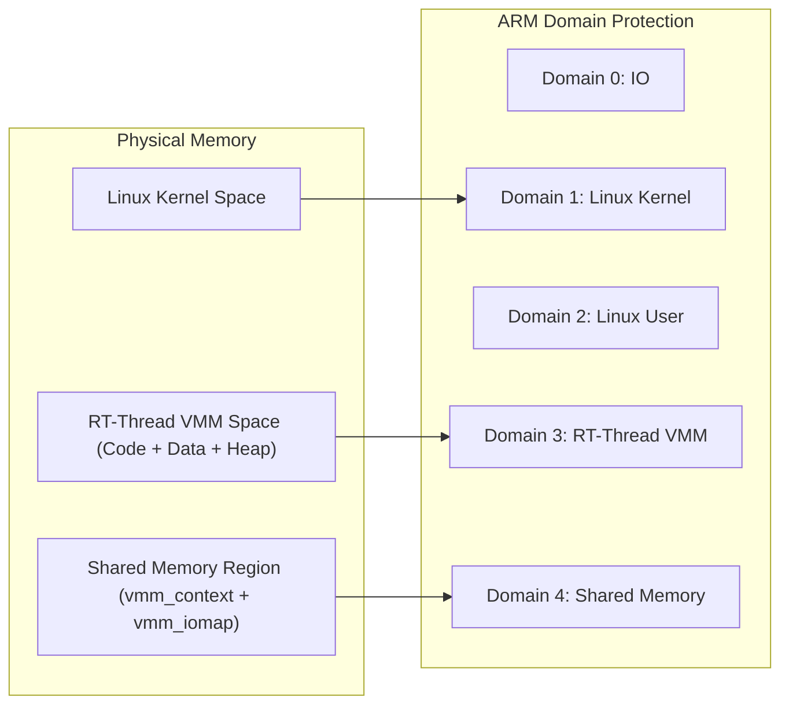
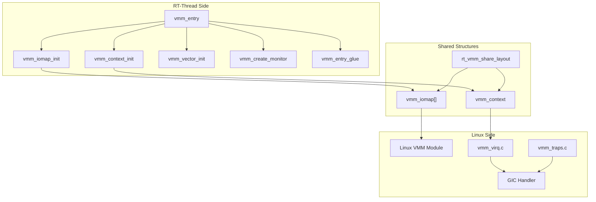
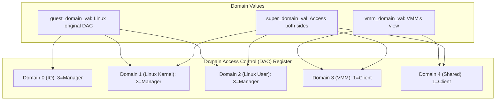

# VMM (Virtual Machine Manager) Module

## Introduction

The **Virtual Machine Manager (VMM)** module enables RT-Thread to run as a **guest operating system** alongside a **host operating system** (typically Linux) on ARM Cortex-A platforms. This dual-system architecture allows RT-Thread to leverage the rich ecosystem of Linux while maintaining its real-time capabilities for time-critical tasks.

The VMM module implements a lightweight virtualization layer that allows RT-Thread and Linux to share the same physical hardware, with memory protection via ARM domain-based isolation and a virtual interrupt (vIRQ) mechanism for interrupt delegation between the two systems.

---

## Architecture Overview

The VMM module is designed around a **co-operative dual-kernel** model where:

- **Linux** acts as the **host OS**, booting first and managing hardware resources
- **RT-Thread** runs as a **guest OS** within a reserved memory region
- A **shared memory region** facilitates communication between the two systems
- **ARM Domain protection** provides memory isolation between host and guest
- A **virtual IRQ (vIRQ) mechanism** allows interrupt delegation between systems



---

## Core Components

### 1. VMM Entry Point (`vmm.c`)

The main entry point for the VMM guest system. When Linux boots RT-Thread, it calls `vmm_entry()` which initializes the RT-Thread kernel as a guest OS.

**Key Functions:**

| Function | Description |
|----------|-------------|
| `vmm_entry()` | Main entry point called by Linux to start RT-Thread as a guest |
| `vmm_thread_init()` | Initializes the VMM management thread |
| `vmm_entry_glue()` | Transitions from VMM initialization to the RT-Thread scheduler |
| `vmm_create_monitor()` | Creates a monitoring thread for guest verification |

**Initialization Flow:**



### 2. VMM Context Management (`vmm_context.c` / `vmm_context.h`)

Manages the shared context between Linux and RT-Thread, including virtual interrupt state and ARM domain protection.

**Key Data Structures:**

```c
// From Linux patch (vmm_virhw.h)
struct vmm_context {
    volatile unsigned long virq_status;    // Virtual IRQ status (0=enabled, 1=disabled)
    volatile unsigned long virq_pended;    // Has interrupt pended on guest
    volatile unsigned long virq_pending[]; // Bitmap of pending virtual IRQs
};

// From RT-Thread side
struct rt_vmm_share_layout rt_vmm_share;  // Shared layout instance
```

**Key Functions:**

| Function | Description |
|----------|-------------|
| `vmm_context_init()` | Initializes the shared VMM context structure |
| `vmm_context_init_domain()` | Configures ARM domain protection values |
| `vmm_virq_pending()` | Marks a virtual IRQ as pending for the guest |
| `vmm_virq_update()` | Triggers a virtual IRQ if conditions are met |
| `vmm_virq_check()` | Checks if guest should handle a pending IRQ |
| `vmm_verify_guest_status()` | Monitors guest OS status for anomalies |
| `vmm_show_guest()` | Debug function to display guest state |

### 3. IO Map Management (`vmm_iomap.c`)

Manages the I/O memory mapping table that translates between physical addresses and virtual addresses for device access.

**Key Data Structures:**

```c
struct vmm_iomap {
    const char *name;  // Device name
    unsigned long pa;  // Physical address
    unsigned long va;  // Virtual address
};
```

**Key Functions:**

| Function | Description |
|----------|-------------|
| `vmm_iomap_init()` | Initializes the I/O map from parameters passed by Linux |
| `vmm_find_iomap()` | Finds virtual address by device name |
| `vmm_find_iomap_by_pa()` | Finds virtual address by physical address |

### 4. Vector/Interrupt Management (`vmm_vector.c`)

Handles the virtual interrupt vector installation for the guest system.

**Key Functions:**

| Function | Description |
|----------|-------------|
| `vmm_vector_init()` | Installs the virtual IRQ handler |
| `vmm_guest_isr()` | Guest interrupt handler (clears interrupt, lets guest OS handle it) |

### 5. Linux-Side VMM Components (from `linux_patch-v3.8`)

The Linux kernel is patched with VMM support to act as the host. Key components include:

| Component | Description |
|-----------|-------------|
| `vmm.c` (Linux) | Manages VMM status and context pointer |
| `vmm_virq.c` | Implements virtual IRQ save/restore/enable/disable |
| `vmm_traps.c` | Sets up trap vectors for IRQ/FIQ forwarding |
| `vmm_virhw.h` | Defines `vmm_context` structure and hardware IRQ helpers |

---

## Data Flow

### Virtual IRQ Flow



### Memory Layout



---

## Component Interaction Diagram



---

## Dependencies

### Internal Dependencies

| Component | Depends On | Description |
|-----------|------------|-------------|
| `vmm.c` | `vmm.h`, `vmm_context.h`, `board.h` | Main entry depends on context and board init |
| `vmm_context.c` | `vmm.h`, `vmm_context.h`, `rthw.h`, `rtthread.h` | Context management uses kernel APIs |
| `vmm_iomap.c` | `vmm.h`, `rtthread.h` | IO map uses string comparison |
| `vmm_vector.c` | `vmm.h`, `rthw.h`, `interrupt.h` | Vector init uses hardware interrupt API |

### External Dependencies

| Module | Relationship |
|--------|--------------|
| [RT-Thread Kernel](RT-Thread%20Kernel.md) | Core kernel services (threading, scheduling, timers, heap) |
| [Memory Management](Memory%20Management.md) | Heap initialization and memory allocation |
| [LWP (Light Weight Process)](LWP%20(Light%20Weight%20Process).md) | Shares ARM architecture context structures (`rt_hw_stack`) |
| [Finsh Shell](Finsh%20Shell.md) | Debug commands via `FINSH_FUNCTION_EXPORT_ALIAS` |

---

## Configuration Options

The VMM module is configured via Kconfig options (defined in the Linux patch):

| Option | Description | Default |
|--------|-------------|---------|
| `RT_USING_VMM` | Enable VMM support | N |
| `RT_VMM_USING_DOMAIN` | Enable ARM domain protection | N |
| `VMM_VERIFY_GUEST` | Enable guest status monitoring | Y |
| `HOST_VMM_ADDR_END` | End address of VMM space | 0xE0000000 |
| `HOST_VMM_SIZE` | Size of VMM space | 0x400000 (4MB) |
| `RTVMM_SHARED_SIZE` | Size of shared memory | 0x100000 (1MB) |

---

## ARM Domain Protection

When `RT_VMM_USING_DOMAIN` is enabled, the VMM uses ARM's domain-based memory protection to isolate the guest and host:



---

## Debug and Monitoring

The VMM module includes several debugging features:

- **`vmm_verify_guest_status()`**: Periodically checks the guest's CPSR register for anomalies (bad modes, disabled IRQs, etc.)
- **`vmm_show_guest()`**: Displays guest register state, virtual IRQ status, and domain configuration
- **`vmm_dump_virq()`**: Dumps the virtual IRQ pending bitmap
- **Finsh command**: `vmm` command registered via `FINSH_FUNCTION_EXPORT_ALIAS` for interactive debugging

---

## Linux Patch Integration

The VMM module includes patches for Linux kernel v3.8 that modify:

1. **GIC driver**: Intercept IRQ handling to check for virtual IRQs
2. **IRQ flags**: Replace direct CPSR manipulation with VMM-aware functions
3. **MMU initialization**: Reserve memory for VMM and create page table entries with proper domain attributes
4. **Exception handling**: Modify entry/exit paths to manage virtual IRQ state
5. **Domain configuration**: Add new domain definitions for VMM and shared memory

---

## Summary

The VMM module enables a powerful dual-OS architecture where RT-Thread runs alongside Linux on ARM Cortex-A platforms. Key design highlights:

- **Co-operative model**: Both OSes are aware of each other and collaborate
- **ARM domain isolation**: Hardware-enforced memory protection between systems
- **Virtual IRQ mechanism**: Efficient interrupt delegation via soft IRQs
- **Shared memory communication**: Simple, low-latency inter-OS communication
- **Minimal overhead**: Lightweight virtualization without full hypervisor complexity
