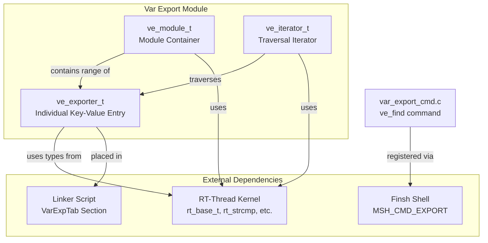
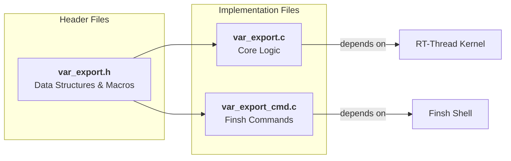
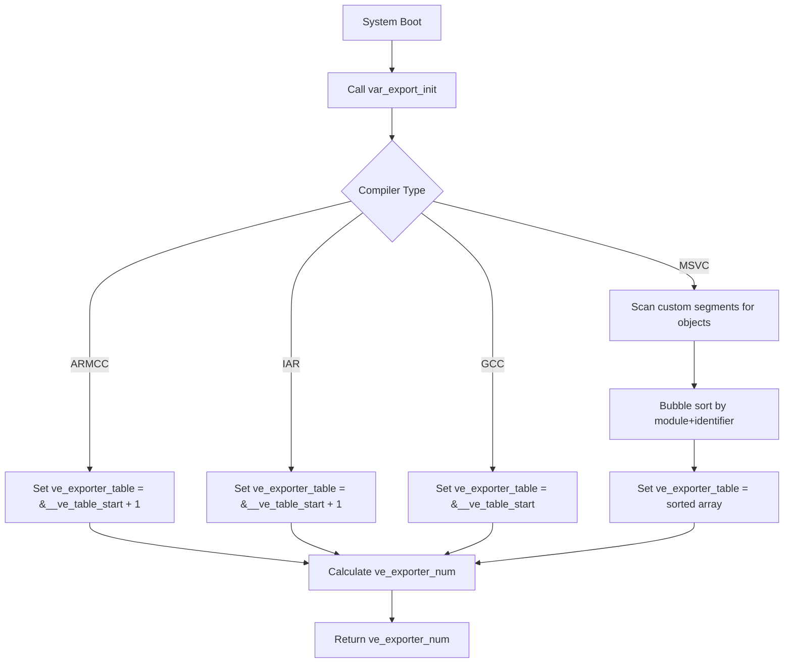
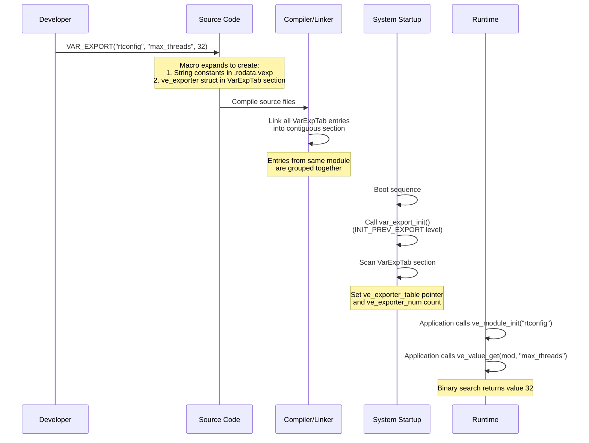
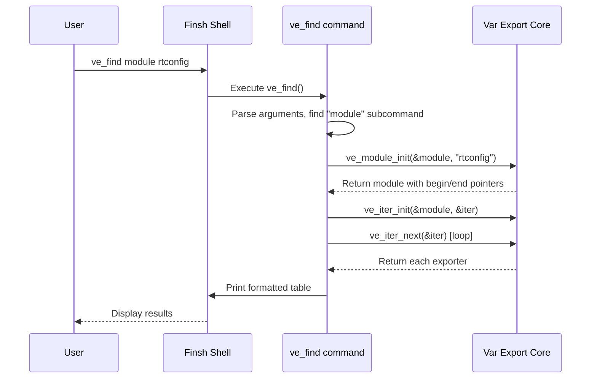
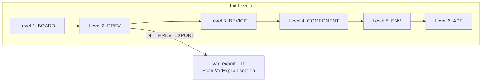

# Var Export Module

## Introduction

The **Var Export** (Variable Export) module is a lightweight utility component of the RT-Thread operating system that provides a mechanism for exporting key-value pairs (variables) from the codebase into a structured, searchable table. It enables developers to declare named constants or configuration values in source code and retrieve them at runtime by module name and identifier.

This module is particularly useful for:

- **Configuration Management**: Exposing system configuration parameters that can be queried at runtime.
- **Feature Detection**: Allowing runtime discovery of available features or capabilities.
- **Debugging and Diagnostics**: Providing a structured way to inspect system parameters via the [Finsh Shell](Finsh%20Shell.md) command-line interface.
- **Module Metadata**: Associating metadata (version numbers, capabilities, limits) with specific modules.

The Var Export module uses a **linker section-based** approach, similar to how the Finsh Shell exports commands and how the kernel's initialization system (`INIT_EXPORT`) works. Entries are placed into a custom ELF section (`VarExpTab`) at compile time, and the module scans this section at startup to build a runtime-accessible table.

---

## Architecture Overview

The Var Export module is organized around three core abstractions: **exporters** (individual key-value entries), **modules** (logical groupings of exporters), and **iterators** (mechanisms for traversing exporters within a module).



### Component Dependency Diagram



---

## Core Data Structures

### `struct ve_exporter` — Exported Variable Entry

Defined in `var_export.h`, this structure represents a single exported key-value pair:

```c
struct ve_exporter
{
    const char *module;             /* module name */
    const char *identifier;         /* module identifier */
    rt_base_t   value;              /* module value */
};
typedef struct ve_exporter ve_exporter_t;
```

| Field | Description |
|-------|-------------|
| `module` | Pointer to a string literal naming the module this entry belongs to (e.g., `"rtconfig"`, `"version"`) |
| `identifier` | Pointer to a string literal naming the specific variable (e.g., `"max_threads"`, `"heap_size"`) |
| `value` | The integer value associated with this identifier (type `rt_base_t`, typically a signed long) |

### `struct ve_module` — Module Container

```c
struct ve_module
{
    const ve_exporter_t *begin;     /* the first module of the same name */
    const ve_exporter_t *end;       /* the last module of the same */
};
typedef struct ve_module ve_module_t;
```

This structure defines a range of `ve_exporter_t` entries that all belong to the same module name. The `begin` pointer points to the first entry, and `end` points to the last entry. Since all entries with the same module name are contiguous in the sorted table, this range fully describes all variables for a given module.

### `struct ve_iterator` — Traversal Iterator

```c
struct ve_iterator
{
    const ve_exporter_t *exp_index; /* iterator index */
    const ve_exporter_t *exp_end;   /* iterate over exporter */
};
typedef struct ve_iterator ve_iterator_t;
```

Provides a forward-iteration mechanism over the exporters within a module. The iterator starts at `exp_index` (set to `mod->begin`) and advances until it passes `exp_end` (set to `mod->end`).

### `struct ve_cmd_des` — Command Descriptor (for Finsh)

Defined in `var_export_cmd.c`, this structure maps subcommand names to handler functions:

```c
struct ve_cmd_des
{
    const char *cmd;
    int (*fun)(int argc, char **argv);
};
```

---

## Key Macros

### `VAR_EXPORT(module, identi, value)`

This is the primary macro for exporting a variable. It creates a `ve_exporter_t` structure and places it into a special linker section.

```c
VAR_EXPORT(module, identi, value)
```

**Parameters:**
- `module`: A string literal naming the module (e.g., `"rtconfig"`)
- `identi`: A string literal naming the identifier (e.g., `"max_threads"`)
- `value`: An integer expression of type `rt_base_t`

**What it does:**
1. Creates two string constants: `_vexp_##identi##_module` containing the module name, and `_vexp_##identi##_identi` containing the identifier name. Both are placed in the `.rodata.vexp` section.
2. Creates a `ve_exporter` struct named `_vexp_##module##identi` with pointers to the above strings and the given value.
3. Places this struct into a linker section named according to the compiler:
   - **ARMCC/IAR**: `"1."#module".VarExpTab."#identi"`
   - **GCC**: `#module".VarExpTab."#identi`
   - **MSVC**: `"VarExpTab$f"`

The section naming convention ensures that entries from the same module are grouped together by the linker, enabling efficient range-based lookups.

### `VE_NOT_FOUND`

```c
#define VE_NOT_FOUND (0xFFFFFFFFu)
```

Return value indicating that a requested identifier was not found in a module.

---

## Module Components

### 1. `var_export.c` — Core Implementation

This file implements the core logic of the Var Export module.

#### Initialization: `var_export_init()`

```c
int var_export_init(void);
```

This function is called automatically during system startup via `INIT_PREV_EXPORT(var_export_init)`, which places it in the `.rti_fn.2` initialization level (pre-initialization, before device and component initialization).

**Initialization process by compiler:**



- **ARMCC/IAR**: Uses sentinel entries (`__ve_table_start` and `__ve_table_end`) placed at the beginning and end of the `VarExpTab` section. The start sentinel is skipped (`+ 1`), and the count is calculated from the difference between end and start pointers.
- **GCC**: Uses extern symbols `__ve_table_start` and `__ve_table_end` defined in the linker script. The table pointer points directly to the start symbol.
- **MSVC**: Since MSVC may create holes between objects in different files, it scans the memory range between start and end sentinels, collects valid entries, and then performs a **bubble sort** to order them by concatenated module+identifier strings.

#### Module Initialization: `ve_module_init()`

```c
int ve_module_init(ve_module_t *mod, const char *module);
```

Scans the global exporter table to find all entries belonging to the specified module name. Sets `mod->begin` to the first matching entry and `mod->end` to the last matching entry. Returns `RT_EOK` on success, or `-RT_ERROR` if no entries match the module name.

#### Iterator Operations

```c
void ve_iter_init(ve_module_t *mod, ve_iterator_t *iter);
const ve_exporter_t *ve_iter_next(ve_iterator_t *iter);
```

- `ve_iter_init()`: Initializes an iterator with the begin and end pointers from a module.
- `ve_iter_next()`: Returns the current exporter and advances the iterator. Returns `RT_NULL` when the iterator has passed the end.

#### Binary Search: `ve_binary_search()`

```c
const ve_exporter_t *ve_binary_search(ve_module_t *mod, const char *identifier);
```

Performs a **binary search** on the module's exporter range to find an entry by identifier. This is efficient because all entries within a module are sorted by identifier (the MSVC path explicitly sorts them; other compilers rely on the linker maintaining order).

#### Value Lookup: `ve_value_get()`

```c
rt_base_t ve_value_get(ve_module_t *mod, const char *identifier);
```

Uses `ve_binary_search()` to find an identifier and returns its value. Returns `VE_NOT_FOUND` if not found.

#### Existence Check: `ve_value_exist()`

```c
rt_bool_t ve_value_exist(ve_module_t *mod, const char *identifier);
```

Returns `RT_TRUE` if the identifier exists in the module, `RT_FALSE` otherwise.

#### Count: `ve_value_count()`

```c
rt_size_t ve_value_count(ve_module_t *mod);
```

Returns the number of exporters in the module (`end - begin + 1`).

### 2. `var_export_cmd.c` — Finsh Shell Commands

This file provides a command-line interface to the Var Export module via the [Finsh Shell](Finsh%20Shell.md).

#### Command: `ve_find`

Registered via `MSH_CMD_EXPORT(ve_find, find the specified export variable)`, this command supports two subcommands:

| Subcommand | Syntax | Description |
|------------|--------|-------------|
| `module` | `ve_find module <module>` | Lists all identifiers and values for a given module |
| `value` | `ve_find value <module> <identifier>` | Finds and displays a specific identifier's value |

**Example usage:**
```
msh /> ve_find module rtconfig
ve_module        identifier       value
----------------------------------------
rtconfig         max_threads      32
rtconfig         heap_size        65536

msh /> ve_find value rtconfig max_threads
ve_module        identifier       value
----------------------------------------
rtconfig         max_threads      32
```

---

## Data Flow

### Variable Export Registration Flow



### Query Flow via Finsh Shell



---

## Initialization Sequence

The Var Export module is initialized as part of the RT-Thread component initialization system:



The `INIT_PREV_EXPORT(var_export_init)` macro places the initialization function at level "2" (pre-initialization), ensuring the Var Export table is ready before device drivers, file systems, and applications are initialized. This allows any component to use Var Export during its own initialization.

---

## Configuration

The module is enabled via Kconfig (`components/utilities/Kconfig`):

| Option | Default | Description |
|--------|---------|-------------|
| `RT_USING_VAR_EXPORT` | n | Master switch for the Var Export module |

When enabled, the build system compiles `var_export.c` and `var_export_cmd.c` (the latter only if Finsh Shell is also enabled).

---

## Dependencies and Integration

### Internal Dependencies

| Component | Depends On | Purpose |
|-----------|-----------|---------|
| `var_export.c` | `var_export.h`, `rtthread.h` | Core logic, uses kernel types and string functions |
| `var_export_cmd.c` | `var_export.h` | Finsh command interface |

### External Module Dependencies

- **[RT-Thread Kernel](RT-Thread%20Kernel.md)**: Provides fundamental types (`rt_base_t`, `rt_bool_t`, `rt_size_t`), string functions (`rt_strcmp`, `rt_snprintf`), and the component initialization system (`INIT_PREV_EXPORT`).
- **[Finsh Shell](Finsh%20Shell.md)**: Provides the `MSH_CMD_EXPORT` macro and command execution framework for the `ve_find` command.
- **Linker Script**: Must define the `VarExpTab` section (or equivalent) to collect all exported entries into a contiguous memory region. For GCC, the linker script typically includes:
  ```ld
  . = ALIGN(4);
  __ve_table_start = .;
  KEEP(*(SORT(*.VarExpTab.*)))
  __ve_table_end = .;
  ```

### Build Integration

From `SConscript`:
```python
from building import *

cwd     = GetCurrentDir()
src     = Glob('*.c')
CPPPATH = [cwd]
group   = DefineGroup('Utilities', src, depend = ['RT_USING_VAR_EXPORT'], CPPPATH = CPPPATH)

Return('group')
```

All `.c` files in the `var_export` directory are compiled when `RT_USING_VAR_EXPORT` is enabled.

---

## Comparison with Similar Mechanisms

The Var Export module shares design patterns with other RT-Thread subsystems that use linker section-based registration:

| Mechanism | Macro | Section | Purpose |
|-----------|-------|---------|---------|
| **Var Export** | `VAR_EXPORT()` | `VarExpTab` | Export key-value pairs |
| **Finsh Commands** | `MSH_CMD_EXPORT()` | `FSymTab` | Export shell commands |
| **Init Functions** | `INIT_EXPORT()` | `.rti_fn.*` | Register initialization functions |
| **UTest** | `UTEST_TC_EXPORT()` | `UtestTcTab` | Register test cases |

All these mechanisms follow the same pattern: a macro places a structure into a named linker section, and an initialization function scans that section at startup to build a runtime table.

---

## Usage Example

### Declaring Exported Variables

```c
#include <var_export.h>

/* Export configuration parameters */
VAR_EXPORT("rtconfig", "max_threads",    32);
VAR_EXPORT("rtconfig", "heap_size",      65536);
VAR_EXPORT("rtconfig", "tick_per_second", 1000);

/* Export version information */
VAR_EXPORT("version", "major", 5);
VAR_EXPORT("version", "minor", 0);
VAR_EXPORT("version", "patch", 1);
```

### Querying at Runtime

```c
#include <var_export.h>

void query_config(void)
{
    ve_module_t mod;
    rt_base_t value;

    /* Initialize module */
    if (ve_module_init(&mod, "rtconfig") != RT_EOK)
    {
        rt_kprintf("Module not found\n");
        return;
    }

    /* Get a specific value */
    value = ve_value_get(&mod, "max_threads");
    if (value != VE_NOT_FOUND)
    {
        rt_kprintf("max_threads = %d\n", value);
    }

    /* Check if a value exists */
    if (ve_value_exist(&mod, "heap_size"))
    {
        rt_kprintf("heap_size is defined\n");
    }

    /* Iterate over all values in the module */
    ve_iterator_t iter;
    const ve_exporter_t *exp;

    ve_iter_init(&mod, &iter);
    while ((exp = ve_iter_next(&iter)) != RT_NULL)
    {
        rt_kprintf("%s = %d\n", exp->identifier, exp->value);
    }
}
```

### Using the Finsh Command

```
msh /> ve_find module rtconfig
ve_module        identifier       value
----------------------------------------
rtconfig         max_threads      32
rtconfig         heap_size        65536
rtconfig         tick_per_second  1000

msh /> ve_find value version major
ve_module        identifier       value
----------------------------------------
version          major            5
```
