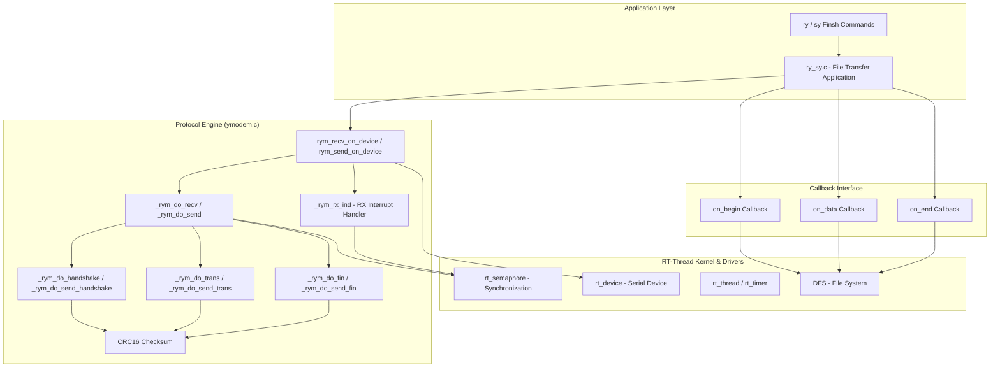
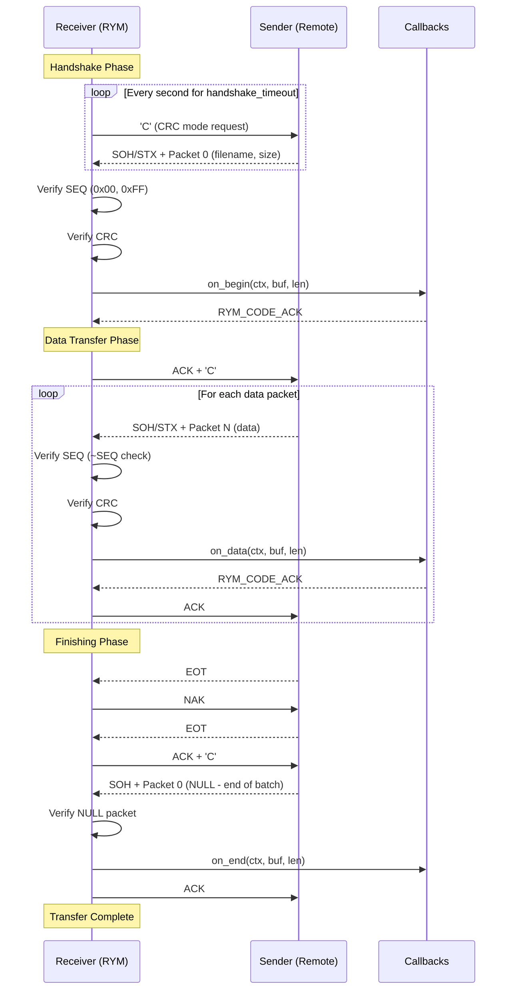
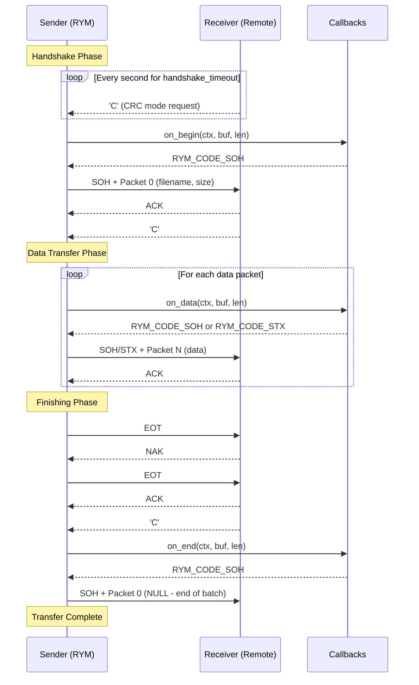
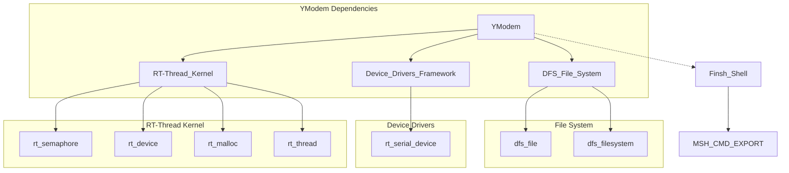

# YModem - RT-Thread YModem File Transfer Protocol Module

## Introduction

The YModem module (codename "RYM" - Real-YModem) provides an implementation of the **YModEM file transfer protocol** for RT-Thread RTOS. YModem is an enhanced version of the XModem protocol that supports batch file transfers, larger packet sizes (1024 bytes via STX), and file metadata (filename and size) transmission.

This module enables RT-Thread devices to:
- **Receive files** from a remote sender (e.g., a PC running a terminal program like Tera Term, SecureCRT, or Minicom)
- **Send files** to a remote receiver over serial communication

The module is located at `components/utilities/ymodem/` and is enabled via the `RT_USING_RYM` Kconfig option.

---

## Architecture Overview

The YModem module follows a **layered architecture** with a clear separation between the protocol engine and the application-level file handling:



### Key Design Principles

1. **Callback-Driven**: The protocol engine is decoupled from file I/O through three callbacks (`on_begin`, `on_data`, `on_end`), allowing flexible integration with different storage backends.
2. **Single-Session**: Currently supports only one active transfer session (`_rym_the_ctx` global variable) for simplicity.
3. **Interrupt-Driven Reception**: Uses the device's RX indicate callback and a semaphore for efficient data reception without busy-waiting.
4. **Error Recovery**: Implements retry logic with configurable maximum error count (`RYM_MAX_ERRORS`).

---

## Core Data Structures

### `struct rym_ctx` (Protocol Context)

The central context structure for a YModem transfer session:

```c
struct rym_ctx
{
    rym_callback on_begin;       // Callback invoked when first packet (file info) arrives
    rym_callback on_data;        // Callback invoked for each data packet
    rym_callback on_end;         // Callback invoked when transfer finishes
    enum rym_stage stage;        // Current protocol stage
    rt_uint8_t *buf;             // Internal data buffer (allocated dynamically)
    struct rt_semaphore sem;     // Semaphore for RX synchronization
    rt_device_t dev;             // The serial device used for transfer
};
```

### `struct custom_ctx` (File Transfer Context)

Extends `rym_ctx` for file-based transfers (defined in `ry_sy.c`):

```c
struct custom_ctx
{
    struct rym_ctx parent;       // Inherited protocol context
    int fd;                      // File descriptor for the transferred file
    int flen;                    // Expected file length (-1 if unknown)
    char fpath[DFS_PATH_MAX];    // File path for storage
};
```

### `enum rym_code` (Protocol Codes & Error Codes)

Defines all YModem protocol bytes and RYM-specific error codes:

| Code | Value | Description |
|------|-------|-------------|
| `RYM_CODE_NONE` | 0x00 | No code / timeout |
| `RYM_CODE_SOH` | 0x01 | Start of Header (128-byte packet) |
| `RYM_CODE_STX` | 0x02 | Start of Text (1024-byte packet) |
| `RYM_CODE_EOT` | 0x04 | End of Transmission |
| `RYM_CODE_ACK` | 0x06 | Acknowledge |
| `RYM_CODE_NAK` | 0x15 | Negative Acknowledge |
| `RYM_CODE_CAN` | 0x18 | Cancel transmission |
| `RYM_CODE_C` | 0x43 | ASCII 'C' - Request CRC mode |
| `RYM_ERR_TMO` | 0x70 | Timeout on handshake |
| `RYM_ERR_CODE` | 0x71 | Wrong protocol code received |
| `RYM_ERR_SEQ` | 0x72 | Wrong sequence number |
| `RYM_ERR_CRC` | 0x73 | CRC checksum mismatch |
| `RYM_ERR_DSZ` | 0x74 | Not enough data received |
| `RYM_ERR_CAN` | 0x75 | Transmission cancelled by user |
| `RYM_ERR_ACK` | 0x76 | Wrong ACK response |
| `RYM_ERR_FILE` | 0x77 | Invalid file for transmission |

### `enum rym_stage` (Protocol Stages)

Tracks the current state of the YModem session:

| Stage | Description |
|-------|-------------|
| `RYM_STAGE_NONE` | Initial state, no activity |
| `RYM_STAGE_ESTABLISHING` | Handshake in progress (sending 'C') |
| `RYM_STAGE_ESTABLISHED` | First packet (packet 0) received and acknowledged |
| `RYM_STAGE_TRANSMITTING` | Data packets being transferred |
| `RYM_STAGE_FINISHING` | EOT received, finishing sequence in progress |
| `RYM_STAGE_FINISHED` | Transfer fully complete |

### `rym_callback` (Callback Function Type)

```c
typedef enum rym_code(*rym_callback)(struct rym_ctx *ctx, rt_uint8_t *buf, rt_size_t len);
```

- **Receiving**: `buf` contains received data, `len` is data size. Return `RYM_CODE_ACK` to accept, `RYM_CODE_CAN` to abort.
- **Sending**: `len` is the buffer size available. Fill `buf` with data to send. Return `RYM_CODE_EOT` to terminate, `RYM_CODE_SOH` for 128-byte packet, `RYM_CODE_STX` for 1024-byte packet.

---

## Packet Format

YModem uses two packet sizes:

### 128-byte Packet (SOH)

```
+------+------+------+--------+--------+--------+
| SOH  | SEQ  | ~SEQ | DATA   | CRC_H  | CRC_L  |
| 0x01 | 1B   | 1B   | 128B   | 1B     | 1B     |
+------+------+------+--------+--------+--------+
```

### 1024-byte Packet (STX)

```
+------+------+------+--------+--------+--------+
| STX  | SEQ  | ~SEQ | DATA   | CRC_H  | CRC_L  |
| 0x02 | 1B   | 1B   | 1024B  | 1B     | 1B     |
+------+------+------+--------+--------+--------+
```

- **SEQ**: Sequence number (starts at 0, increments by 1, wraps at 256)
- **~SEQ**: Bitwise complement of SEQ (for error detection)
- **CRC**: 16-bit CRC-CCITT checksum over the data field

### Packet 0 (File Info Packet)

The first packet (sequence number 0) contains file metadata:
- **Filename**: Null-terminated string
- **File Size**: ASCII decimal number after the null terminator

Example: `"myfile.bin\0 12345\0"` (filename = "myfile.bin", size = 12345 bytes)

---

## Protocol Flow

### Receive Flow (Receiver)



### Send Flow (Sender)



---

## API Reference

### Core Protocol API

#### `rym_recv_on_device`

```c
rt_err_t rym_recv_on_device(struct rym_ctx *ctx, rt_device_t dev, rt_uint16_t oflag,
                            rym_callback on_begin, rym_callback on_data, rym_callback on_end,
                            int handshake_timeout);
```

Receive one or more files from a remote sender via YModem protocol.

| Parameter | Description |
|-----------|-------------|
| `ctx` | YModem session context (must be allocated by caller) |
| `dev` | Serial device for communication |
| `oflag` | Device open flags (e.g., `RT_DEVICE_OFLAG_RDWR \| RT_DEVICE_FLAG_INT_RX`) |
| `on_begin` | Callback for first packet (filename/size). Can be NULL. |
| `on_data` | Callback for data packets. Can be NULL (auto-ACK). |
| `on_end` | Callback for transfer completion. Can be NULL. |
| `handshake_timeout` | Handshake timeout in seconds |

**Returns**: `RT_EOK` on success, negative error code on failure.

#### `rym_send_on_device`

```c
rt_err_t rym_send_on_device(struct rym_ctx *ctx, rt_device_t dev, rt_uint16_t oflag,
                            rym_callback on_begin, rym_callback on_data, rym_callback on_end,
                            int handshake_timeout);
```

Send a file to a remote receiver via YModem protocol.

| Parameter | Description |
|-----------|-------------|
| `ctx` | YModem session context (must be allocated by caller) |
| `dev` | Serial device for communication |
| `oflag` | Device open flags |
| `on_begin` | Callback to prepare first packet (filename/size). **Cannot be NULL**. |
| `on_data` | Callback to fill data packets. **Cannot be NULL**. |
| `on_end` | Callback for transfer completion. **Cannot be NULL**. |
| `handshake_timeout` | Handshake timeout in seconds |

**Returns**: `RT_EOK` on success, negative error code on failure.

### File Transfer Application (ry_sy.c)

When `YMODEM_USING_FILE_TRANSFER` is enabled, the module provides a complete file transfer application with Finsh commands.

#### Finsh Commands

| Command | Syntax | Description |
|---------|--------|-------------|
| `ry` | `ry <file_path> [device]` | Receive file via YModem. Default device is console. |
| `sy` | `sy <file_path> [device]` | Send file via YModem. Default device is console. |

**Examples:**
```
msh />ry /sdcard/received_file.bin uart2
msh />sy /sdcard/myfile.bin uart1
msh />ry /tmp/download.bin
```

#### Internal Callbacks

The file transfer application implements the three callbacks:

| Callback | Function | Description |
|----------|----------|-------------|
| `on_begin` | `_rym_recv_begin` / `_rym_send_begin` | Opens/creates file, parses filename and size |
| `on_data` | `_rym_recv_data` / `_rym_send_data` | Reads/writes file data, handles EOF padding |
| `on_end` | `_rym_recv_end` / `_rym_send_end` | Closes file, sends NULL packet |

---

## Configuration Options

| Option | Default | Description |
|--------|---------|-------------|
| `RT_USING_RYM` | n | Enable YModem protocol module |
| `YMODEM_USING_FILE_TRANSFER` | n | Enable file transfer application (ry_sy.c) |
| `YMODEM_USING_CRC_TABLE` | n | Use precomputed CRC-CCITT table (faster but larger) |
| `RYM_WAIT_CHR_TICK` | `RT_TICK_PER_SECOND * 3` | Ticks to wait for characters between packets |
| `RYM_WAIT_PKG_TICK` | `RT_TICK_PER_SECOND * 3` | Ticks to wait for between packets |
| `RYM_CHD_INTV_TICK` | `RT_TICK_PER_SECOND * 3` | Ticks between handshake code retries |
| `RYM_END_SESSION_SEND_CAN_NUM` | 7 | Number of CAN bytes sent on abort |
| `RYM_MAX_ERRORS` | 5 | Maximum retry count on errors |

---

## Error Handling

The module implements robust error recovery:

1. **Timeout Recovery**: If no response is received within `RYM_WAIT_PKG_TICK`, a NAK is sent to request retransmission.
2. **CRC Error Recovery**: On CRC mismatch, a NAK is sent to request retransmission.
3. **Sequence Error Recovery**: On sequence number mismatch, a NAK is sent.
4. **Max Retries**: After `RYM_MAX_ERRORS` consecutive errors, the transfer is aborted with the corresponding error code.
5. **Cancel Detection**: If the remote sends CAN, the receiver sends 7 CAN bytes and aborts.

Error codes can be retrieved from `ctx->stage` and the return value of `rym_recv_on_device` / `rym_send_on_device`.

---

## Dependencies



### Module Dependencies

| Dependency | Module | Description |
|------------|--------|-------------|
| `rt_device` | [RT-Thread Kernel](RT-Thread%20Kernel.md) | Serial device I/O for protocol communication |
| `rt_semaphore` | [RT-Thread Kernel](RT-Thread%20Kernel.md) | Synchronization for RX interrupt handling |
| `rt_malloc/free` | [RT-Thread Kernel](RT-Thread%20Kernel.md) | Dynamic buffer allocation |
| `dfs_file` | [File System (DFS)](File%20System%20(DFS).md) | File operations for file transfer (ry_sy.c) |
| `finsh` | [Finsh Shell](Finsh%20Shell.md) | Command-line interface for ry/sy commands |

---

## Usage Examples

### Basic File Reception

```c
#include "ymodem.h"

static enum rym_code on_begin(struct rym_ctx *ctx, rt_uint8_t *buf, rt_size_t len)
{
    /* buf contains: "filename\0filesize\0" */
    rt_kprintf("Receiving file: %s\n", buf);
    return RYM_CODE_ACK;
}

static enum rym_code on_data(struct rym_ctx *ctx, rt_uint8_t *buf, rt_size_t len)
{
    /* Process received data chunk */
    process_data(buf, len);
    return RYM_CODE_ACK;
}

static enum rym_code on_end(struct rym_ctx *ctx, rt_uint8_t *buf, rt_size_t len)
{
    rt_kprintf("Transfer complete!\n");
    return RYM_CODE_ACK;
}

void start_ymodem_receive(void)
{
    struct rym_ctx ctx;
    rt_device_t dev = rt_device_find("uart2");

    rym_recv_on_device(&ctx, dev,
                       RT_DEVICE_OFLAG_RDWR | RT_DEVICE_FLAG_INT_RX,
                       on_begin, on_data, on_end, 10);
}
```

### Basic File Transmission

```c
#include "ymodem.h"

static enum rym_code on_begin(struct rym_ctx *ctx, rt_uint8_t *buf, rt_size_t len)
{
    /* Fill buf with: "filename\0filesize\0" */
    rt_sprintf((char *)buf, "myfile.bin%c%d", '\0', file_size);
    return RYM_CODE_SOH;
}

static enum rym_code on_data(struct rym_ctx *ctx, rt_uint8_t *buf, rt_size_t len)
{
    rt_size_t read_size = read_data_from_source(buf, len);
    if (read_size < len) {
        rt_memset(buf + read_size, 0x1A, len - read_size);
        ctx->stage = RYM_STAGE_FINISHING;
    }
    return (read_size > 128) ? RYM_CODE_STX : RYM_CODE_SOH;
}

static enum rym_code on_end(struct rym_ctx *ctx, rt_uint8_t *buf, rt_size_t len)
{
    rt_memset(buf, 0, len);
    return RYM_CODE_SOH;
}

void start_ymodem_send(void)
{
    struct rym_ctx ctx;
    rt_device_t dev = rt_device_find("uart2");

    rym_send_on_device(&ctx, dev,
                       RT_DEVICE_OFLAG_RDWR | RT_DEVICE_FLAG_INT_RX,
                       on_begin, on_data, on_end, 10);
}
```

---

## Comparison with ZModem

The YModem module is related to the [ZModem](ZModem.md) module, which provides a more advanced file transfer protocol:

| Feature | YModem | ZModem |
|---------|--------|--------|
| Packet Size | 128B / 1024B | Variable (up to 8KB) |
| Batch Transfer | Yes (multiple files) | Yes |
| File Metadata | Filename + Size | Filename + Size + Timestamp |
| CRC | CRC-16 CCITT | CRC-16 / CRC-32 |
| Streaming | No (stop-and-wait) | Yes (sliding window) |
| Auto-Download | No | Yes (ZMODEM auto-download) |
| Complexity | Low | Medium |

---

## References

- [RT-Thread Kernel](RT-Thread%20Kernel.md) - Core kernel services used by YModem
- [File System (DFS)](File%20System%20(DFS).md) - File system interface for file transfer
- [Finsh Shell](Finsh%20Shell.md) - Command shell for ry/sy commands
- [ZModem](ZModem.md) - Related ZModem file transfer protocol module
- [Device Drivers Framework](Device%20Drivers%20Framework.md) - Serial device driver framework
- YModem Protocol Specification: [Wikipedia - YMODEM](https://en.wikipedia.org/wiki/YMODEM)
