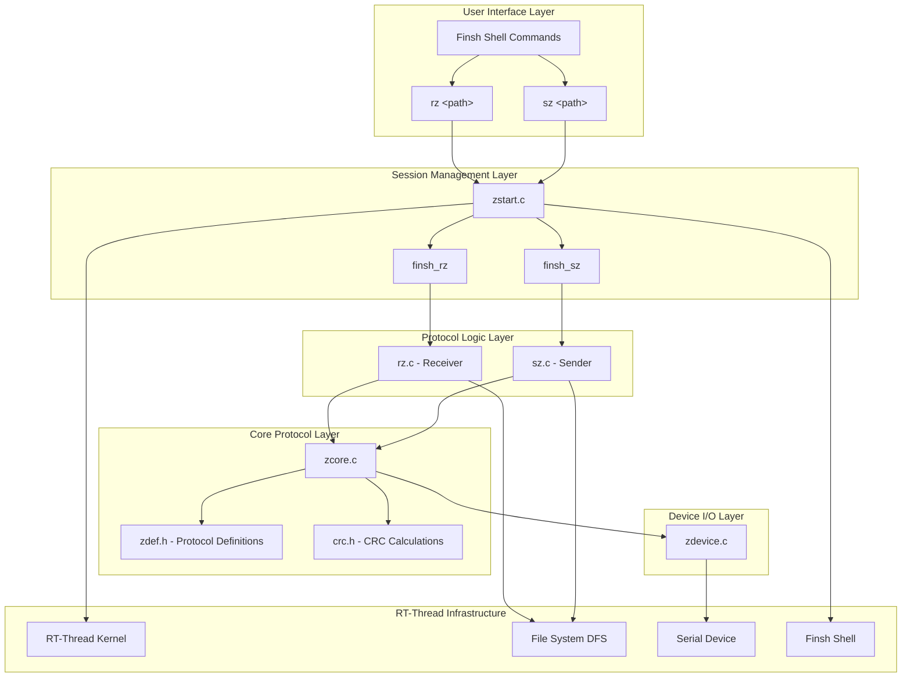
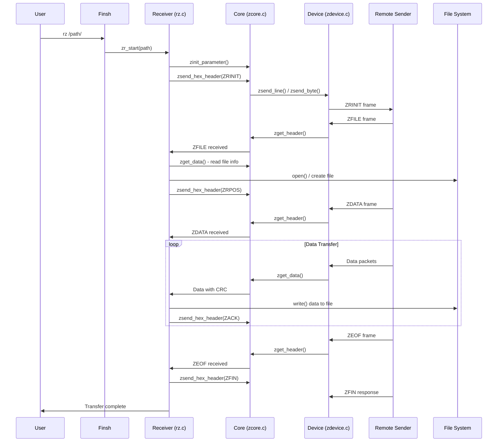
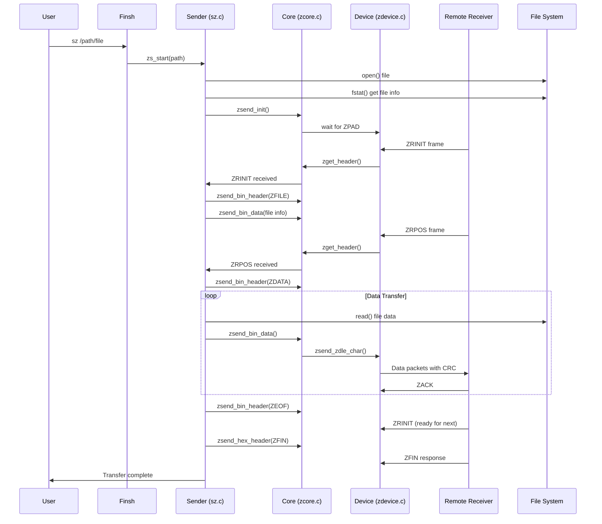
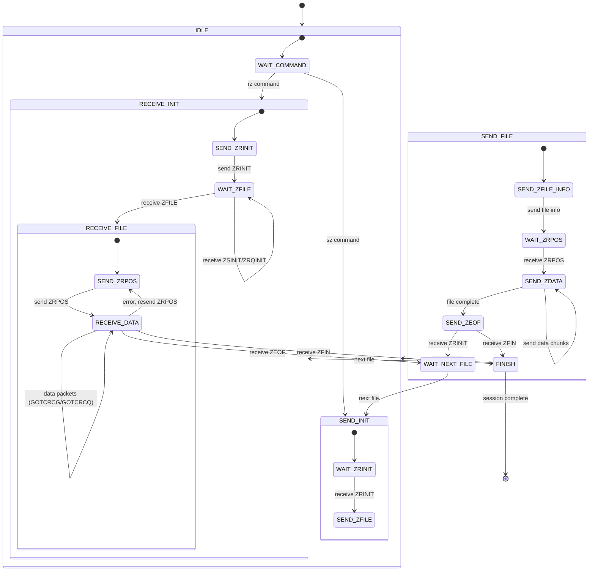

# ZModem Module

## Introduction

The ZModem module implements the **ZMODEM file transfer protocol** for the RT-Thread operating system. ZMODEM is an advanced file transfer protocol that provides reliable, efficient, and full-duplex file transfers between a local RT-Thread system and a remote computer over a serial connection. This module enables both **receiving files (rz)** and **sending files (sz)** using the ZMODEM protocol, with support for CRC-16 and CRC-32 error checking, Run-Length Encoding (RLE) compression, and automatic file management options.

The module is designed to integrate seamlessly with the RT-Thread Finsh shell, allowing users to invoke file transfers directly from the command line interface.

---

## Architecture Overview

The ZModem module is organized into several layers, each responsible for a specific aspect of the protocol:



---

## Component Details

### 1. Core Data Structures

#### `struct zmodemf` (zdef.h)
The global ZMODEM session structure that holds the device handle and synchronization semaphore:

```c
struct zmodemf
{
    struct rt_semaphore zsem;  // Semaphore for synchronization
    rt_device_t device;        // Serial device handle
};
extern struct zmodemf zmodem;
```

#### `struct zfile` (zdef.h)
Represents a file being transferred, tracking its metadata and transfer progress:

```c
struct zfile
{
    char *fname;              // File name/path
    rt_int32_t fd;            // File descriptor
    rt_uint32_t ctime;        // Creation/modification time
    rt_uint32_t mode;         // File mode
    rt_uint32_t bytes_total;  // Total file size
    rt_uint32_t bytes_sent;   // Bytes sent (sender)
    rt_uint32_t bytes_received; // Bytes received (receiver)
    rt_uint32_t file_end;     // File end marker
};
```

### 2. Protocol Definitions (zdef.h)

The header file defines all ZMODEM protocol constants, including:

- **Frame Indicators**: `ZBIN` (binary CRC-16), `ZBIN32` (binary CRC-32), `ZBINR32` (RLE + CRC-32), `ZHEX` (hexadecimal)
- **Frame Types**: 19 frame types including `ZRQINIT`, `ZRINIT`, `ZFILE`, `ZDATA`, `ZEOF`, `ZFIN`, `ZACK`, `ZNAK`, `ZSKIP`, `ZABORT`, `ZCAN`, `ZRPOS`, etc.
- **ZDLE Sequences**: `ZCRCE`, `ZCRCG`, `ZCRCQ`, `ZCRCW` for frame continuation/termination
- **Flags**: `CANFDX` (full duplex), `CANOVIO` (overlap I/O), `CANRLE` (RLE support), `CANFC32` (32-bit CRC), etc.
- **File Management Options**: `ZMNEWL`, `ZMCRC`, `ZMAPND`, `ZMCLOB`, `ZMNEW`, `ZMDIFF`, `ZMPROT`, `ZMCHNG`
- **Buffer Sizes**: `TX_BUFFER_SIZE` (1024), `RX_BUFFER_SIZE` (1024)

### 3. CRC Calculation (crc.h)

Provides two CRC algorithms for data integrity verification:

- **CRC-16**: Uses the `updcrc16` macro with a 256-entry lookup table (`crctab[]`)
- **CRC-32**: Uses the `updcrc32` macro with a 256-entry lookup table (`cr3tab[]`) based on polynomial `0xedb88320`

### 4. Core Protocol Engine (zcore.c)

Implements the fundamental ZMODEM protocol operations:

| Function | Description |
|----------|-------------|
| `zinit_parameter()` | Initializes all protocol parameters and flags |
| `zsend_bin_header()` | Sends a binary frame header with CRC-16 or CRC-32 |
| `zsend_hex_header()` | Sends a hexadecimal frame header with CRC-16 |
| `zsend_bin_data()` | Sends binary data with frame end marker and CRC |
| `zget_header()` | Receives and parses any type of frame header |
| `zget_bin_header()` | Receives a binary frame header |
| `zget_hex_header()` | Receives a hexadecimal frame header |
| `zget_data()` | Receives data with appropriate CRC check (16/32/RLE) |
| `zrec_data16()` | Receives data with CRC-16 verification |
| `zrec_data32()` | Receives data with CRC-32 verification |
| `zrec_data32r()` | Receives RLE-encoded data with CRC-32 verification |
| `zput_pos()` / `zget_pos()` | Manages file position tracking |
| `zsend_zdle_char()` | Escapes special characters for transmission |

### 5. Device I/O Layer (zdevice.c)

Provides low-level serial communication functions:

| Function | Description |
|----------|-------------|
| `zsend_byte()` | Writes a single byte to the serial device |
| `zsend_line()` | Writes a character to the serial device |
| `zread_line()` | Reads a character from the serial device with timeout |
| `zsend_break()` | Sends a break/attention string to the remote end |
| `zsend_can()` | Sends cancel sequence (10 CAN bytes) to abort transfer |
| `get_device_baud()` | Returns the configured baud rate |

### 6. Receiver (rz.c) - File Reception

Implements the ZMODEM receiver (rz - "receive ZMODEM"):

| Function | Description |
|----------|-------------|
| `zr_start()` | Entry point for receiving files; allocates resources and manages the receive session |
| `zrec_init()` | Initializes the receiver, sends `ZRINIT`, waits for file information |
| `zrec_files()` | Main receive loop: initializes, receives file data, handles completion |
| `zrec_file()` | Receives a single file: handles `ZDATA`, `ZEOF`, `ZFIN`, `ZCAN` frames |
| `zrec_file_data()` | Processes incoming data packets with flow control (GOTCRCW, GOTCRCQ, GOTCRCG, GOTCRCE) |
| `zget_file_info()` | Parses file name and metadata from the sender, creates the output file |
| `zwrite_file()` | Writes received data to the file system |
| `zrec_ack_bibi()` | Performs the end-of-session handshake (ZFIN exchange) |

### 7. Sender (sz.c) - File Transmission

Implements the ZMODEM sender (sz - "send ZMODEM"):

| Function | Description |
|----------|-------------|
| `zs_start()` | Entry point for sending files; allocates resources and manages the send session |
| `zsend_init()` | Initializes the sender, waits for receiver's `ZRINIT`, negotiates capabilities |
| `zsend_files()` | Opens the file, extracts metadata, initiates the send process |
| `zsend_file()` | Sends file name and metadata via `ZFILE` frame, waits for `ZRPOS` to begin data transfer |
| `zsend_file_data()` | Sends file data in chunks using `ZDATA` frames with flow control |
| `zfill_buffer()` | Reads file data into the transmit buffer |
| `zget_sync()` | Waits for synchronization/acknowledgment from the receiver |
| `zsay_bibi()` | Performs the end-of-session handshake |

### 8. Session Startup (zstart.c)

Bridges the Finsh shell commands with the protocol implementation:

| Function | Description |
|----------|-------------|
| `finsh_rz()` | Thread function for receiving files; configures device, calls `zr_start()` |
| `finsh_sz()` | Thread function for sending files; configures device, calls `zs_start()` |
| `zmodem_rx_ind()` | RX indication callback that releases the synchronization semaphore |
| `rz()` | Finsh command handler for `rz <path>` |
| `sz()` | Finsh command handler for `sz <path>` |

---

## Data Flow

### File Receive Flow (rz)



### File Send Flow (sz)



---

## Protocol State Machine



---

## Dependencies

The ZModem module depends on the following RT-Thread subsystems:

| Dependency | Module | Usage |
|------------|--------|-------|
| **RT-Thread Kernel** | [RT-Thread Kernel](RT-Thread%20Kernel.md) | Thread creation, semaphores, memory allocation, device management |
| **Device Framework** | Device Drivers Framework | Serial device I/O (`rt_device_read`/`write`, `rt_device_set_rx_indicate`) |
| **File System (DFS)** | [File System (DFS)](File%20System%20(DFS).md) | File operations (`open`, `close`, `read`, `write`, `lseek`, `fstat`, `unlink`, `statfs`) |
| **Finsh Shell** | [Finsh Shell](Finsh%20Shell.md) | Command registration (`FINSH_FUNCTION_EXPORT`), shell device access |
| **YModem** | [YModem](YModem.md) | Related file transfer protocol (sibling module in utilities) |

---

## Configuration

The ZModem module can be configured through the following parameters in `zdef.h`:

| Parameter | Default | Description |
|-----------|---------|-------------|
| `BITRATE` | 115200 | Default serial baud rate |
| `TX_BUFFER_SIZE` | 1024 | Transmit buffer size |
| `RX_BUFFER_SIZE` | 1024 | Receive buffer size |
| `ERRORMAX` | 5 | Maximum consecutive errors before abort |
| `RETRYMAX` | 5 | Maximum retry attempts |
| `ZATTNLEN` | 32 | Maximum length of attention string |

---

## Usage

### Receiving Files (rz)

```bash
# Start receiving files to the current directory
rz /sdcard/

# Start receiving files to a specific path
rz /tmp/downloads/
```

The receiver will:
1. Send a `ZRINIT` frame to announce readiness
2. Wait for the remote sender to initiate the transfer
3. Automatically create files and write received data
4. Report transfer statistics upon completion

### Sending Files (sz)

```bash
# Send a file from the filesystem
sz /sdcard/myfile.bin

# Send a file from another location
sz /tmp/data.txt
```

The sender will:
1. Wait for the remote receiver to send `ZRINIT`
2. Send file metadata (name, size, timestamp)
3. Transmit file data in chunks with CRC verification
4. Complete the session with a `ZFIN` handshake

---

## Error Handling

The ZModem module implements robust error recovery:

- **CRC Verification**: Every frame and data packet includes CRC-16 or CRC-32 checksums
- **Retransmission**: Corrupted packets trigger `ZNAK` responses and retransmission
- **Timeout Handling**: Configurable timeouts (`Rxtimeout`) prevent indefinite blocking
- **Cancel Mechanism**: `ZCAN` frames (5 consecutive CAN bytes) abort transfers cleanly
- **Attention String**: The receiver can send an attention string (`Attn[]`) to interrupt the sender
- **Error Counters**: Maximum error thresholds (`ERRORMAX`, `RETRYMAX`) prevent infinite retry loops

---

## Key Features

1. **Full-Duplex Communication**: Supports simultaneous send and receive (`CANFDX`)
2. **Overlap I/O**: Can receive data during disk I/O operations (`CANOVIO`)
3. **Multiple CRC Options**: CRC-16, CRC-32, and CRC-32 with RLE
4. **Run-Length Encoding (RLE)**: Optional compression for repetitive data
5. **File Management Options**: Skip, overwrite, append, rename, protect, and timestamp-based transfer decisions
6. **Resume Support**: Can resume interrupted file transfers (`ZCRESUM`)
7. **Batch Transfers**: Supports multiple file transfers in a single session
8. **Finsh Integration**: Easy-to-use command-line interface
