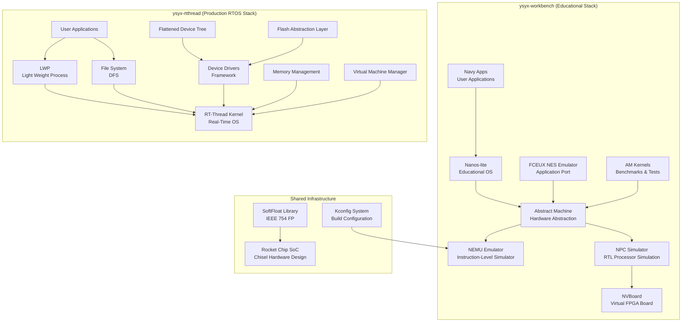

# YSYX Repository Overview

## Purpose

The **YSYX** (涓€鐢熶竴鑺?/ "One Student, One Chip") repository is a comprehensive educational ecosystem designed to teach computer architecture, operating systems, and system software through hands-on project-based learning. The repository provides a complete, vertically integrated computing stack that allows students to design, simulate, and run software on their own custom RISC-V processor.

The core mission is to enable a single student to design and implement a complete computer system鈥攆rom the transistor level to running user applications鈥攚ithin a single academic project. The repository achieves this by providing a layered architecture where each module builds upon the previous one, allowing students to progressively understand and implement each layer of the computing stack.

## End-to-End Architecture

The YSYX repository is organized into two main workbenches that together form a complete computing stack:

### Layer Descriptions

1. **Hardware/Simulation Layer**: NEMU (instruction-level emulator) and NPC (RTL processor simulator) provide the hardware foundation. NVBoard adds visual FPGA simulation.

2. **Hardware Abstraction Layer**: The Abstract Machine (AM) provides a uniform, platform-independent API across all supported ISAs (x86, RISC-V, MIPS32, LoongArch32r).

3. **Operating System Layer**: Two OS options exist:
   - **Nanos-lite**: A minimal educational OS demonstrating core OS concepts
   - **RT-Thread**: A production-grade real-time OS with full process management, file systems, and device drivers

4. **Application Layer**: Navy Apps provides a complete application runtime with multimedia libraries, games, and utilities. AM Kernels provides benchmarks and test suites.

5. **Hardware Design Layer**: The Rocket Chip SoC module provides a Chisel-based hardware design that can be synthesized for FPGA implementation.

## Core Modules

### Educational Stack (ysyx-workbench)

| Module | Description | Key Components |
|--------|-------------|----------------|
| [Abstract Machine (AM)](modules/Abstract%20Machine%20(AM).md) | Hardware abstraction layer with TRM, IOE, CTE, VME, MPE models | `Area`, `Event`, `Context`, `AddrSpace` |
| [NEMU Emulator](modules/NEMU%20Emulator.md) | Full-system instruction-level emulator with SDB debugger | `Decode`, `IOMap`, `NEMUState`, `watchpoint` |
| [NPC Simulator](modules/NPC%20Simulator.md) | Verilator-based RISC-V RTL simulation with DiffTest | `IOMap`, `DiffContext`, 5-stage pipeline |
| [NVBoard](modules/NVBoard.md) | SDL2-based virtual FPGA board for visual simulation | `PinNode`, `VGA_MODE`, component system |
| [Nanos-lite](modules/Nanos-lite.md) | Minimal educational OS with 9 system calls | `Finfo`, PCB, ELF loader, ramdisk |
| [Navy Apps](modules/Navy%20Apps.md) | Application runtime with SDL-compatible multimedia libraries | `libndl`, `libminiSDL`, `libos`, Lua, games |
| [AM Kernels](modules/AM%20Kernels.md) | Benchmark suites and demonstration programs | CoreMark, Dhrystone, MicroBench, LiteNES |
| [FCEUX NES Emulator](modules/FCEUX%20NES%20Emulator.md) | Full NES emulator port running on AM | `X6502`, `PPU_STATE`, `CartInfo`, `ines_header` |

### Production RTOS Stack (ysyx-rtthread)

| Module | Description | Key Components |
|--------|-------------|----------------|
| [RT-Thread Kernel](modules/RT-Thread%20Kernel.md) | Real-time OS kernel with thread/scheduler/IPC/timer/memory management | `rt_thread`, `rt_timer`, `rt_semaphore`, `rt_mutex`, `rt_event` |
| [Device Drivers Framework](modules/Device%20Drivers%20Framework.md) | Unified device driver interface for serial, I2C, SPI, GPIO, etc. | `rt_serial_device`, `rt_i2c_bus_device`, `rt_spi_bus` |
| [File System (DFS)](modules/File%20System%20(DFS).md) | POSIX-compliant virtual file system with multiple FS backends | `dfs_file`, `dfs_vnode`, `dfs_filesystem`, `dfs_fdtable` |
| [LWP (Light Weight Process)](modules/LWP%20(Light%20Weight%20Process).md) | Process management with MMU/MPU isolation, IPC, signals | `rt_lwp`, `rt_channel_msg`, `rt_futex`, `lwp_avl_struct` |
| [Memory Management](modules/Memory%20Management.md) | Virtual memory management with address spaces and page tables | `rt_aspace`, `rt_varea`, `rt_mem_obj`, `rt_page` |
| [VMM (Virtual Machine Manager)](modules/VMM%20(Virtual%20Machine%20Manager).md) | Dual-OS virtualization for RT-Thread + Linux on ARM | `vmm_context`, `vmm_iomap`, `vmm_domain` |
| [FDT (Flattened Device Tree)](modules/FDT%20(Flattened%20Device%20Tree).md) | Device tree parsing and manipulation library | `dtb_node`, `dtb_property`, `fdt_header`, `fdt_phandle_args` |
| [FAL (Flash Abstraction Layer)](modules/FAL%20(Flash%20Abstraction%20Layer).md) | Unified flash storage management with partition support | `fal_flash_dev`, `fal_partition`, `fal_blk_device` |

### Shared Infrastructure

| Module | Description | Key Components |
|--------|-------------|----------------|
| [Kconfig System](modules/Kconfig%20System.md) | Build configuration management (adapted from Linux kernel) | `symbol`, `menu`, `expr`, `confdata` |
| [SoftFloat Library](modules/SoftFloat%20Library.md) | IEEE 754 floating-point software implementation | `float32_t`, `float64_t`, `float128_t`, `extFloat80_t` |
| [Rocket Chip SoC](modules/Rocket%20Chip%20SoC.md) | Chisel-based RISC-V SoC with AXI4/APB bus infrastructure | `ysyxSoCFull`, `CPU`, `ChipLink`, `AXI4ToAPB` |

### Utility Modules

| Module | Description |
|--------|-------------|
| [Finsh Shell](modules/Finsh%20Shell.md) | Command-line interface with MSH mode and C-style interpreter |
| [ULog](modules/ULog.md) | Unified logging system with multiple backends and filtering |
| [UTest](modules/UTest.md) | Unit testing framework for embedded systems |
| [Var Export](modules/Var%20Export.md) | Key-value pair export mechanism using linker sections |
| [YModem](modules/YModem.md) | YModem file transfer protocol implementation |
| [ZModem](modules/ZModem.md) | ZModem file transfer protocol implementation |
| [Resource ID](modules/Resource%20ID.md) | Lightweight resource identifier allocator |
| [AVL Tree](modules/AVL%20Tree.md) | Self-balancing binary search tree implementations |
| [RT-Link](modules/RT-Link.md) | Session-oriented communication protocol framework |
| [VBUS](modules/VBUS.md) | Shared-memory inter-processor communication framework |

## Key Design Principles

1. **Layered Abstraction**: Each module provides a clean API that hides implementation details, allowing students to focus on one layer at a time.

2. **Educational Focus**: The entire stack is designed for learning, with minimal implementations that demonstrate core concepts without unnecessary complexity.

3. **Cross-ISA Support**: All software runs on x86, RISC-V, MIPS32, and LoongArch32r through the AM abstraction layer.

4. **Differential Testing**: The DiffTest framework compares RTL simulation against a golden reference (NEMU) for automated verification.

5. **Linker Section Registration**: Multiple modules (Finsh, UTest, Var Export) use the same pattern of placing structures in named linker sections for automatic discovery.

## References

- [Abstract Machine (AM)](modules/Abstract%20Machine%20(AM).md)
- [NEMU Emulator](modules/NEMU%20Emulator.md)
- [NPC Simulator](modules/NPC%20Simulator.md)
- [NVBoard](modules/NVBoard.md)
- [Nanos-lite](modules/Nanos-lite.md)
- [Navy Apps](modules/Navy%20Apps.md)
- [AM Kernels](modules/AM%20Kernels.md)
- [FCEUX NES Emulator](modules/FCEUX%20NES%20Emulator.md)
- [RT-Thread Kernel](modules/RT-Thread%20Kernel.md)
- [Device Drivers Framework](modules/Device%20Drivers%20Framework.md)
- [File System (DFS)](modules/File%20System%20(DFS).md)
- [LWP (Light Weight Process)](modules/LWP%20(Light%20Weight%20Process).md)
- [Memory Management](modules/Memory%20Management.md)
- [VMM (Virtual Machine Manager)](modules/VMM%20(Virtual%20Machine%20Manager).md)
- [FDT (Flattened Device Tree)](modules/FDT%20(Flattened%20Device%20Tree).md)
- [FAL (Flash Abstraction Layer)](modules/FAL%20(Flash%20Abstraction%20Layer).md)
- [Kconfig System](modules/Kconfig%20System.md)
- [SoftFloat Library](modules/SoftFloat%20Library.md)
- [Rocket Chip SoC](modules/Rocket%20Chip%20SoC.md)
- [Finsh Shell](modules/Finsh%20Shell.md)
- [ULog](modules/ULog.md)
- [UTest](modules/UTest.md)
- [Var Export](modules/Var%20Export.md)
- [YModem](modules/YModem.md)
- [ZModem](modules/ZModem.md)
- [Resource ID](modules/Resource%20ID.md)
- [AVL Tree](modules/AVL%20Tree.md)
- [RT-Link](modules/RT-Link.md)
- [VBUS](modules/VBUS.md)

