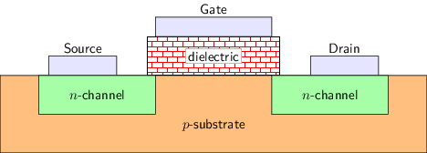

## F3 数字逻辑电路基础

#### 不要使用黑夜模式阅读本章节

在黑夜模式下, 图片的显示将难以识别, 建议使用白天模式进行阅读.

处理器芯片本质上是数字电路. 数字电路是用来处理数字信号的电路, 而数字信号简单来说是指 `0` 和 `1` 这两种离散的信号. 这里的 `0` 和 `1` 并不是数学意义上的自然数, 它是指信号的两种不同状态, 为了简单叙述, 就分别称它们为 `0` 和 `1`. 为了和数学上的 `0` 和 `1` 区分开来, 有时候也将上面两种状态称为 `逻辑0` 和 `逻辑1`.

与数字信号相对的是模拟信号, 模拟信号通常是连续的, 例如电流, 电压等都属于模拟信号. 用来处理模拟信号的电路称为模拟电路, 不过在处理器设计中, 我们很少关注它.

因此, 处理器芯片本质上也是处理 `0` 和 `1` 这两种信号的芯片. 要学习处理器芯片设计, 数字电路的知识是基础. 而要学习数字电路, 就是需要学习信息在数字电路中是如何表示, 处理和存储的. 具体地, 你将会了解:

- 如何表示 - 数字信号 `0` 和 `1` 在数字电路中的物理含义
- 如何处理 - 门电路和组合逻辑电路的工作原理
- 如何存储 - 时序逻辑电路的工作原理

## 通过晶体管实现0和1

`0` 和 `1` 是两个抽象的概念. 在数字电路中, `0` 和 `1` 的表示和晶体管有关.

常用的晶体管是 `金属-氧化物-半导体场效应晶体管` (Metal-Oxide-Semiconductor Field-Effect Transistor, MOSFET), 简称MOS管. 根据工作原理的不同, MOS管又分nMOS(N型MOS, N表示Negative)和pMOS(P型MOS, P表示Positive)两种, 它们都有三个接口, 分别是栅极(gate), 源极(source)和漏极(drain), 其侧视图如下图所示.

|  |  |
| --- | --- |

晶体管通常作为电路元件, 像开关一样接入到电路中. 在生活中, 开关一般是手动控制的(例如灯的开关), 如果开关打开, 开关两端的电路将会被连通. 但和人工操作的开关不同, 晶体管是一个特殊的开关, 它是由电路中的电压来控制的. 通过控制MOS管栅极的电压, 来控制其源极和漏极是否连通.

以nMOS为例, 根据其电气特性, nMOS的功能如下:

- 当栅极电压与源极电压之间的差值()较大时, 源极和漏极导通, 相当于开关合上
- 当栅极电压与源极电压之间的差值()较小时, 源极和漏极截止, 相当于开关断开

pMOS的功能表现与nMOS类似, 较大时导通, 较小时截止.

#### 晶体管具体如何通过电压控制开关

要理解这个问题需要一些高中的物理和化学的知识, 但这已经超出了处理器设计的范畴, 因此这并非"一生一芯"学习过程中必须掌握的内容. 如果你确实对这个问题感兴趣, 我们可以简单说明.

我们知道, 硅是制造半导体的主要材料. 两个4价硅元素之间很容易形成共价键, 从而达到稳定状态. 因此, 纯净的硅材料并不导电.

以nMOS为例, 制造nMOS时, 需要将少量的3价元素(如硼)作为杂质掺入到硅材料中, 形成P型衬底(上图中的p-substrate). P型衬底中的杂质元素为了和4价的硅元素形成稳定的共价键, 还缺少一个电子, 因此很容易从其他已经形成共价键的位置吸引来一个电子. 但电子离开原来的位置后, 这个位置为了再次形成共价键, 会再次吸引其他电子. 如此反复, P型衬底中就像是存在可以自由移动的电子.

制造P型衬底后, 在衬底上方挖出两个N区(上图中的n-channel), 并将少量的5价元素(如磷)作为杂质掺入到硅材料中. N区中的杂质元素为了和4价的硅元素形成稳定的共价键, 很容易失去一个电子. 这个电子在N区中自由移动.

为了方便连接电源, 还需要用金属从两个N区分别引出两个电极, 分别作为源极和漏极. 之后在衬底表面覆盖一层二氧化硅作为绝缘层(上图中的dielectric), 在绝缘层上方再用金属引出一个电极作为栅极.

工作时, 打开连接源极和漏极和电源. 默认情况下, 源极N区中的自由电子无法跨越P型衬底移动到漏极N区. 此时, 源极和漏极之间并不导通, nMOS处于截止状态.

此时如果在栅极加足够大的电压, 就会在绝缘体下方形成电场. 在电场的作用下, P型衬底中自由移动的电子将向绝缘体方向移动. 但由于电子无法穿过绝缘体, 因此会聚集在绝缘体下方, 形成一条导电的沟道. 这条沟道连接了源极和漏极, 使得nMOS处于导通状态.

pMOS的工作原理和nMOS类似, 但不完全相同, 感兴趣的同学可以搜索相关资料.

由于nMOS和pMOS具有互补的特性, 在数字电路中通常将两者联合使用, 称为CMOS(Complementary Metal-Oxide-Semiconductor)技术. 下面是一个最简单的CMOS电路:

|  |  |  |
| --- | --- | --- |

这个CMOS电路的工作方式如下:

- 在A点加高电压时, 下方的n管(nMOS)导通, 上方的p管(pMOS)截止, 相当于Y点与地相连(中图), Y点电压低
- 在A点加低电压时, 下方的n管(nMOS)截止, 上方的p管(pMOS)导通, 相当于Y点与电源相连(右图), Y点电压高

可以看到, CMOS电路将n管和p管的开关特性转换成了电路输出电压的高低. 将物理上的高电压(如)定义为 `逻辑1` (高电平), 低电压(如)定义为 `逻辑0` (低电平), 我们就得到了数字电路中信号的两种基本状态!

## 通过晶体管搭建门电路

光表示 `0` 和 `1` 还不够, 我们还需要通过CMOS电路对 `0` 和 `1` 进行各种有意义的转换, 这个过程就是对数字信号进行运算.

### 非门(反相器)

考虑上文的CMOS电路, A点输入为 `1` 时, Y点输出为 `0`; 而A点输入为 `0` 时, Y点输出为 `1`. 这正好就是逻辑上的非运算! 这个门电路就是非门, 也称为反相器.

### 与非门

我们来看下面的另一个门电路.

|  |  |
| --- | --- |

直接看结构不容易理解功能, 我们需要梳理一下它的行为. 具体地, 由于P1和P2并联, 其中一者导通时, Y为 `1`; 此外, 由于N1和N2串联, 两者均导通时, Y为 `0`. 因此, 我们可以整理出如下表格:

| A | B | P1 | P2 | N1 | N2 | Y |
| --- | --- | --- | --- | --- | --- | --- |
| 0 | 0 | 导通 | 导通 | 截止 | 截止 | 1 |
| 0 | 1 | 导通 | 截止 | 截止 | 导通 | 1 |
| 1 | 0 | 截止 | 导通 | 导通 | 截止 | 1 |
| 1 | 1 | 截止 | 截止 | 导通 | 导通 | 0 |

根据上表, 两个输入均为 `1` 时, 电路输出 `0`, 否则输出 `1`. 这正好就是逻辑上的与非运算! 这个门电路就是与非门.

### 与门

将与非门的输出连接到非门的输入, 就得到了与门. 和与非门相比, 与门的逻辑符号的输出端少了一个圆圈. 在门电路的逻辑符号中, 这个圆圈表示取反.

|  |  |
| --- | --- |

#### 分析门电路

尝试分析以下门电路的行为和功能.

#### 或门的晶体管结构

以下是或门的逻辑符号, 尝试画出或门的晶体管结构.

### 三输入与非门

上面介绍的门电路都是两个输入的, 有时候需要对多个输入信号进行运算. 一个例子是三输入与非门, 如果用逻辑表达式来表示其行为, 则有 `Y = ~(A & B & C)`, 这里的 `&` 表示与操作. 根据这个逻辑表达式, 我们可以通过一个两输入与门和一个两输入与非门来搭建一个三输入与非门(左图). 另一种方式是使用晶体管来搭建三输入与非门(右图).

|  |  |
| --- | --- |

#### 对比两种实现的晶体管所需要的数量

不难分析, 上述晶体管结构同样实现了三输入与非门的功能. 尝试对比两种实现方式中所需晶体管的数量.

Hint: 对于用门电路搭建的设计, 其晶体管数量可看作是设计中用到的所有门电路的晶体管数量之和.

#### 全定制电路: 通过晶体管设计电路

在晶体管层次设计的电路称为全定制电路. 通过三输入与非门的例子, 我们可以看到, 全定制电路所需要的晶体管数量更少, 因此电路面积也更小. 在实际生产中, 除了面积更小之外, 全定制电路的主频也更高, 功耗更低.

但是, 全定制电路的设计难度大, 开发周期也很长. 现代处理器芯片包含动辄上亿个晶体管, 全部使用全定制电路来开发是不现实的. 对于超大规模集成电路的设计, 更常见的是采用的是半定制电路设计方法.

半定制电路的设计又分为基于标准单元的设计方法和基于门阵列的设计方法. 前者是预先用全定制方式设计出一些常用的逻辑单元, 例如与门、或门、触发器等, 这些逻辑单元称为标准单元; 然后再通过这些标准单元构建出大规模电路. 回到上面三输入与非门的例子, 如果把两输入的与门和两输入的与非门看成是标准单元, 那么通过它们搭建三输入与非门就可以看成是半定制电路的设计方法. 至于基于门阵列的设计方法, 一个常见的例子是FPGA. 但我们接下来不打算使用FPGA, 感兴趣的同学可以搜索相关资料.

在现代的处理器芯片设计中, 大部分情况下都使用基于标准单元的半定制电路设计方法; 只有在追求极致表现时(例如企业产品通过追求高性能占领市场), 才会对电路中的部分核心模块进行全定制设计.

### 异或门

异或门用于进行异或(eXclusive OR, XOR)运算, 其逻辑符号如下图所示.

异或是一个特殊的运算, 通常在处理逻辑数据时使用, 其真值表如下:

| A | B | Y |
| --- | --- | --- |
| 0 | 0 | 0 |
| 0 | 1 | 1 |
| 1 | 0 | 1 |
| 1 | 1 | 0 |

异或运算的行为有两种理解方式:

1. 异或的"异"表示"不同", 因此当输入A和B不同时, 结果为 `1`, 否则为 `0`.
2. 或运算表示两个输入中至少一个为 `1`. 和或运算不同, 异或运算排除了两个输入均为 `1` 的情况, 因此也称为"排斥或", 其中的"排斥"和英文exclusive对应; 相对地, 或运算也称为"相容或", 表示允许两个输入均为 `1`.

有了真值表, 我们可以得到相应的逻辑表达式, 相应步骤如下:

1. 根据输入情况描述一个表项. 对于真值表中的每个表项, 考虑每个输入信号, 若输入为 `1`, 则取输入信号本身; 若输入为 `0`, 则取输入信号的非. 对这些信号进行与运算, 即可得到该表项的描述. 例如, 表中 `A = 1, B = 0` 的对应描述是 `A & ~B`.
2. 将输出为 `1` 的表项的对应描述组合成最终的逻辑表达式. 考虑真值表中输出为 `1` 的表项, 对这些表项的描述进行或运算即可. 例如, 在异或运算的真值表中, 输出为 `1` 的情况有两种, 一种是 `A = 1, B = 0`, 对应描述是 `A & ~B`; 另一种是 `A = 0, B = 1`, 对应描述是 `~A & B`. 将这两种描述进行或运算, 得到异或运算的逻辑表达式 `Y = A ^ B = (A & ~B) | (~A & B)`.

上述步骤总是可以将一个真值表转换为一个由与运算和或运算组成的逻辑表达式. 根据这个逻辑表达式, 你可以很容易地用与门和或门搭建出相应的电路.

#### 卡诺图化简

你可能会在一些数字电路的教科书上听说过这个技术; 如果你没有听说过, 那很好. 你可能需要为了考试而学习它, 但在"一生一芯"这种面向动手实践的项目中, 你几乎不会使用它.

我们想说的是, 这个技术的可扩展性非常低: 在真实的项目中, 你面对的变量数量很可能是5个以上, 甚至多达十几个, 要用卡诺图去化简这样的表达式, 效率是很低的. 事实上, 现代工具通常会采用QMC算法或者espresso算法来对逻辑表达式进行化简, 因此, 你很少需要对逻辑表达式进行手动化简, 上文介绍的方法已经足够帮助你写出一个正确的逻辑表达式, 化简的工作交给现代工具即可. 如果你感兴趣, 你可以搜索相关资料来进一步了解这些算法.

#### 用其他门电路搭建异或门

尝试在Logisim中用上文提到的门电路搭建一个异或门. 搭建后, 通过仿真检查你的方案是否正确.

实现正确后, 计算你的方案使用了多少个晶体管.

#### 寻找更优的搭建方案

不考虑全定制电路, 尝试寻找一种晶体管数量最少的方案来实现异或门, 并在Logisim中测试你的方案是否正确.

Hint: 有一种方案只需要使用14个晶体管, 因此最优方案的晶体管数量应不多于14个.

#### 异或门的全定制电路

下图是异或门的一种全定制实现, 尝试分析其行为.

#### 设计同或门

还有另一种操作是"同或"操作, 当输入A和B相同时, 结果为 `1`, 否则为 `0`. 同或操作可以认为是异或操作结果的取反.

尝试在Logisim中用上文提到的门电路搭建一个同或门. 搭建后, 通过仿真检查你的方案是否正确.

#### 同或门的全定制电路

尝试用最少数量的晶体管搭建一个同或门.

Hint: 有一种方案只需要使用6个晶体管, 因此最优方案的晶体管数量应不多于6个.

## 进位计数法

我们已经知道, CMOS电路可以表示并处理 `0` 和 `1`. 但我们生活的物理世界并非只有 `0` 和 `1`, 因此需要考虑如何用 `0` 和 `1` 来表示物理世界中的各种信息, 这种表示方式称为"编码"(encoding). 物理世界中的信息有很多, 我们先考虑如何表示自然数.

### 二进制计数法

我们在小学甚至幼儿园的时候就已经对"数"的概念有基本的认识. 在日常生活中, 我们使用的是十进制(decimal)计数法. 一个十进制数的真值(即其表示的实际数值), 可以通过加权求和(weighted sum)展开式得到. 例如, 十进制数 `734` 的加权展开如下:

通常, 对于位进制数, 其真值可通过以下加权求和展开式得到:

其中称为基(base), 称为每一位的权(weight).

令, 并让只在 `0` 和 `1` 中取值, 我们就得到了二进制(binary)计数法. 由于十进制也使用 `0` 和 `1`, 一般在书面上需要添加一些前缀或下标, 表明某数采用二进制表示: 有的编程语言通过前缀 `0b` 表示二进制数, 如 `0b00101110`; 有的教材采用下标 `B` 表示二进制数, 如. 在讲义中, 我们主要采用前缀 `0b`. 例如, 二进制数 `0b00101110` 的真值是

要将一个二进制数转换为十进制数, 可通过如下加权求和展开式求得:

要将一个十进制数转换为二进制数, 就需要求出加权求和展开式中各个二进制位. 为此, 我们可以将上述加权求和展开式改写如下:

通过上述改写, 我们可以发现, 如果将十进制数不断除以2, 这个过程中得到的余数就分别对应. 我们可以使用"短除法"来列出这一计算过程, 例如, 对于十进制数 `46`:

```
2 | 46   -> 0          ^  低位
  +----                |
 2 | 23   -> 1         |
   +----               |
  2 | 11   -> 1        |
    +----              |
   2 | 5    -> 1       |
     +----             |
    2 | 2    -> 0      |
      +----            |
     2 | 1    -> 1     |  高位
       +----
         0 (商为0, 结束)
```

最后将所得余数从高位到低位组合, 得到 `0b101110`, 即为 `46` 的二进制表示, 与上文提到的 `0b00101110` 在省略高位的 `0` 后一致.

### 十六进制计数法

二进制虽然能被数字电路直接处理, 但对人来说很难阅读和记忆. 例如, 对于二进制数 `0b1011111011101111`, 我们很难一眼就看出来有多少位. 此外, 在二进制数和十进制数之间互相转换, 需要经过一定的数学计算过程, 对人来说, 这些计算过程通常无法快速完成.

为了解决这些问题, 计算机领域还通常采用十六进制(hexadecimal)计数法. 十六进制计数法中, 每一位数字有16种可能, 除了 `0~9` 以外, 还有 `a`, `b`, `c`, `d`, `e`, `f` (大写亦可), 数值上分别表示 `10`, `11`, `12`, `13`, `14`, `15`. 有的编程语言通过前缀 `0x` 表示十六进制数, 如 `0xbeef`; 有的教材采用下标 `H` 表示十六进制数, 如. 在讲义中, 我们主要采用前缀 `0x`. 类似地, 在十进制和十六进制之间进行转换, 可以通过加权求和展开式和短除法来进行. 例如, 十六进制数 `0xbeef` 的加权求和展开式如下:

虽然数字电路无法直接处理十六进制数, 但由于, 因此可以在1位十六进制数和4位二进制数之间相互转换, 这大大提升了十六进制和二进制之间的转换效率. 例如, 对于二进制数 `0b1011111011101111`, 我们可以从右到左每4位分成一组(高位不足4位时补 `0`), 直接写出每组对应的十六进制数字:

```
1011 1110 1110 1111
 |    |    |    |
 b    e    e    f
```

因此, 该二进制数对应的十六进制数即为 `0xbeef`. 可以看到, 和二进制表示的 `0b1011111011101111` 相比, 十六进制表示的 `0xbeef` 更加简洁紧凑.

#### 八进制(octal)计数法

在计算机中, 有的场景也会使用八进制, 其原理和十六进制类似, 感兴趣的同学可以自行推导八进制和十进制之间, 以及八进制和二进制之间的转换方法.

## 通过门电路搭建基本组合逻辑电路

有了门电路后, 我们就可以通过多个门电路的组合来搭建一些在数字电路中常用的模块了.

### 译码器

译码器(decoder)是一种将位输入转换成最多种不同输出的电路. 一类常见的译码器是n选1译码器(1-of-n decoder), 它有位输入, 位输出, 其行为如下: 将输入解析为一个二进制数值, 并使输出的第位为 `1`, 其他位为 `0`. 由于该输出仅有1位为 `1`, 因此也称为"独热码"(One-hot). 例如, 一个2-4译码器有2位输入, 有4位输出, 其真值表和电路图如下:

|  |  |  |  |  |  |  |
| --- | --- | --- | --- | --- | --- | --- |
| 0 | 0 |  | 0 | 0 | 0 | 1 |
| 0 | 1 |  | 0 | 0 | 1 | 0 |
| 1 | 0 |  | 0 | 1 | 0 | 0 |
| 1 | 1 |  | 1 | 0 | 0 | 0 |

#### 搭建2-4译码器

尝试在Logisim中用门电路搭建一个2-4译码器, 它有2位输入, 4位输出. 搭建后, 通过仿真检查你的方案是否正确.

Logisim中也直接提供了译码器等现成的元件, 但我们还是要求大家使用门电路来搭建它们, 从而更好地学习数字电路的基本原理.

在计算机中, n选1译码器常用于实现寻址的部分功能, 此时译码器的输入即为地址, 输出则是选择信号, 其中与地址对应的选择信号为 `1`.

#### 配置门电路输入的数量和极性

在Logisim中, 用户可以配置门电路输入的数量和极性, 其中极性属性可以选择一个信号在送入逻辑门前是否取反, 若是, 相应输入端将多出一个圆圈, 表示取反. 具体配置方式可阅读官方文档中关于门电路的内容.

#### 地址和寻址

"地址"是计算机领域中的一个专业术语, 但我们也可以通过生活中的一些例子来理解它. 你应该使用过Excel软件来查看表格, 在表格中, 每一行会存放一个条目(item), 多个条目通常按行号递增的顺序连续存放. 在Excel软件中, 最左侧还会显示行号, 它可以让你快速了解当前浏览的是哪一行. 如果需要查看第176行的条目, 你并不会从第1行开始逐行判断当前行是否第176行, 而是直接拖动窗口的滚动条, 很快就定位到第176行的位置, 这是因为行号是连续的, 我们可以快速跳过前面的行.

事实上, 在计算机中, 很多数据也是像表格那样连续存放的. 例如, 内存就可以看作是一个巨大的表格, 每一行是一个存储单元, 可以存放1字节的数据. 对于一根4GB的内存条, 这个表格有行. 类似地, 得益于存储单元之间的连续性, 如果计算机要访问其中一个存储单元, 它并不需要从第1个存储单元开始按顺序检查, 而是可以通过一个"行号"来快速找到对应的存储单元. 这个"行号"在计算机中称为"地址", 根据地址找到相应存储单元的过程称为"寻址".

之所以计算机能通过地址快速找到对应的存储单元, 本质上是计算机可以通过n选1译码器将地址快速转换成一组选择信号, 后续通过这组选择信号选出目标数据.

#### Logisim中的子电路功能

译码器在后续的数字电路设计中会经常用到, 为了避免用户重复设计相同的电路, Logisim提供了子电路功能, 相应电路只需要设计一次, 后续即可反复实例化. 具体操作方式请阅读官方手册中的 `Subcircuits(子电路)` 部分.

学习如何使用Logisim的子电路功能后, 尝试将你设计的译码器封装成子电路.

#### 译码器的扩展

3-8译码器有3位输入, 8位输出. 尝试实例化若干个2-4译码器(具体数量交给你的思考), 并添加少量门电路, 从而实现3-8译码器的功能. 搭建后, 通过仿真检查你的方案是否正确.

在Logisim中, 模块的输入信号和输出信号通常连接到一些输入或输出元件, 通过这些元件的状态, 可以得知输入信号或输出信号的当前值. 如果你想了解中间信号的当前值, 可以使用元件库提供的 `Probe(探针)` 元件, 你可以在Logisim元件库的 `Wiring(线路)` 类别下找到它, 具体使用方式请RTFM.

#### 配置元件的数据位宽

在Logisim中, 用户可以配置元件的数据位宽. 例如, 当一个与门的数据位宽设置为 `4` 时, 表示每个端口可以连接4位信号, 此时功能上等价于通过4个1位的与门分别对4位信号中的每一位进行处理. 通过数据位宽的功能, 用户可以方便地设计出处理模式相似的电路. 具体配置方式可阅读官方文档中关于门电路的内容.

同时, 你可能需要抽取一组信号中的若干位, 或者将若干位信号组合成一组信号来整体连接, 这需要用到 `Splitter(分线器)`, 你可以在Logisim元件库的 `Wiring(线路)` 类别下找到它, 具体使用方式请RTFM.

另一类常见的译码器是转码器(code translator), 它可以按照指定的规则将一种编码的输入转换成另一种编码的输出. 和n选1译码器不同, 转码器不要求输出中最多包含1个 `1`.

转码器的一个常见应用是七段数码管译码器(7-segment decoder). 七段数码管是一个由7段发光二极管按"8"字型排列组成的输出元件, 其示意图如下图所示. 图中用字母a-g分别标识每一段发光二极管的位置, 只要某控制信号有效, 相应的发光二极管就会被点亮. 图中还有一个用h标识的小数点, 在一些需要使用小数的场景会使用.

```
a
  ---
f| g |b
  ---
e|   |c
  ---    .h
   d
```

七段数码管译码器的功能是将一组4位的输入信号解析为二进制整数, 然后输出一组用于控制七段数码管亮灭情况的控制信号, 使得七段数码管可以显示和输入对应的数字. 例如:

```
input    output
        abcdefgh
 0100   01100110
```

上述例子展示了如何在七段数码管中显示数字 `4`. 具体地, 显示数字 `4` 需要点亮七段数码管中的b, c, f, g这4根发光二极管, 因此相应的控制信号需要设置为有效(此处假设高电平有效, 实际使用中需要核实七段数码管元件的输入极性); 对于其他无需点亮的发光二极管, 相应的控制信号需要设置为无效. 若按照a-h从左到右排列, 输出的控制信号应为 `01100110`. 因为 `4` 对应的二进制表示为 `0b0100`, 因此七段数码管译码器需要在输入为 `0100` 时输出 `01100110`. 按照同样的方式, 可分析出0-9各数字的输入输出情况.

#### 搭建七段数码管译码器

尝试在Logisim中通过门电路搭建一个七段数码管译码器, 它有4位输入和8位输出, 分别与拨码开关和七段数码管相连. 七段数码管译码器支持十进制数字的显示, 即当输入对应0-9时, 七段数码管显示对应的数字; 对于其他输入, 七段数码管只显示小数点. 搭建后, 通过仿真检查你的实现是否正确.

Hint:

- 七段数码管元件可在元件库中找到, 实例化后, 可以通过将鼠标指针悬停在元件的端口上, 来查看该端口的功能描述.
- 可以先用n选1译码器生成一组独热码, 然后再通过一层或门来分别决定每个发光二极管在哪些输入的情况下应该点亮.

#### 搭建七段数码管译码器(2)

尝试在Logisim中通过门电路搭建一个支持十六进制数字的七段数码管译码器. 和上述的十进制数字相比, 当输入对应10-15时, 七段数码管分别显示A, b, C, d, E, F. 搭建后, 通过仿真检查你的实现是否正确.

### 编码器

编码器(encoder)的功能和n选1译码器相反, 它用于将独热码转换成相应的二进制数值. 具体地, 编码器有位输入, 位输出, 如果输入为独热码, 且第位为1, 则输出的二进制数值; 如果输入不为独热码, 则输出是未定义的.

例如, 一个4-2编码器有4位输入, 有2位输出, 其真值表如下. 下表在输入不为独热码时, 输出为 `X`, 表示输出未定义(undefined), 可为任意值.

|  |  |  |  |  |  |  |
| --- | --- | --- | --- | --- | --- | --- |
| 0 | 0 | 0 | 1 |  | 0 | 0 |
| 0 | 0 | 1 | 0 |  | 0 | 1 |
| 0 | 1 | 0 | 0 |  | 1 | 0 |
| 1 | 0 | 0 | 0 |  | 1 | 1 |
| 其 | 他 | 情 | 况 |  | X | X |

#### 理解未定义的输出

有一些运算或模块需要满足一定的前提条件, 才能得到有意义的输出. 一个例子是数学上的除法运算. 你多少会听说过类似的说法: 除数为 `0` 时, 是不能除的. 这里的"不能除"这三个字其实是自然语言, 并不是数学系统中的语言. 如果用数学语言来描述, "除数不为 `0` "是进行除法运算的前提条件, 当除数为 `0` 时, 这个前提条件不再成立, 此时无法定义出一个正确且有意义的计算结果, 因此也称结果是未定义的.

上述编码器的例子也是类似的, "输入为独热码”是编码器正确工作的前提条件, 当输入不为独热码时, 这个前提条件不再成立, 此时无法定义出一个正确且有意义的输出.

这背后其实隐含着一种约定: 如果编码器的使用者希望编码器能输出正确的结果, 就需要保证"输入为独热码"的前提条件得到满足; 反之, 如果不满足这个前提条件, 那就算是编码器的使用者违反约定, 此时编码器的输出是无意义的, 如果后续电路对这些无意义的输出进行处理, 引发的结果由编码器的使用者承担.

具体到数字电路层次, 编码器的输出信号要么为 `0`, 要么为 `1`. 但在输出结果未定义的情况下, 无论输出信号取什么值, 都是不具备实际含义的. 既然如此, 编码器的设计者就可以为这些未定义情况下的输出信号取任意值, 因为根据上述的使用约定, 编码器的使用者不应该让后续电路处理那些未定义的输出信号.

因此, 设计编码器时, 我们可以不关心其他情况的输出, 只需要保证在输入为独热码时能得到正确的输出即可: , .

#### 搭建编码器

尝试在Logisim中通过门电路搭建一个16-4编码器, 它有16位输入和4位输出, 分别与拨码开关和七段数码管译码器相连, 使得编码器的输出结果通过十六进制数字显示在七段数码管中. 搭建后, 通过仿真检查你的实现是否正确.

在计算机中, 编码器常用于根据用独热码表示的选择信号生成相应地址. 另一种理解是用于找出独热码中 `1` 的位置.

上述编码器要求使用者保证输入是独热码, 如果希望在输入不为独热码的时候仍然输出有效的信息, 则需要使用另一种编码器——优先编码器(priority encoder). 优先编码器有位输入, 位输出, 和上文介绍的编码器不同, 优先编码器允许输入信号中出现多个 `1`, 此时最高位的 `1` 将被优先编码. 因此, 如果输入不全为0, 则输出最高位的 `1` 的位置; 如果输入全为0, 则输出是未定义的.

例如, 一个4-2优先编码器有4位输入, 有2位输出, 其真值表如下.

|  |  |  |  |  |  |  |
| --- | --- | --- | --- | --- | --- | --- |
| 0 | 0 | 0 | 1 |  | 0 | 0 |
| 0 | 0 | 1 | X |  | 0 | 1 |
| 0 | 1 | X | X |  | 1 | 0 |
| 1 | X | X | X |  | 1 | 1 |
| 0 | 0 | 0 | 0 |  | X | X |

#### 搭建4-2优先编码器

根据上述真值表, 尝试列出每一位输出的逻辑表达式. 然后尝试在Logisim中通过门电路搭建一个4-2优先编码器. 搭建后, 通过仿真检查你的方案是否正确.

实现后, 对比4-2编码器和4-2优先编码器所需的门电路数量.

#### 优先编码器的扩展

16-4优先编码器有16位输入, 4位输出. 尝试实例化若干个4-2优先编码器, 并添加少量门电路, 从而实现16-4优先编码器的功能. 然后将16-4优先编码器与拨码开关和七段数码管译码器相连, 使其输出结果通过十六进制数字显示在七段数码管中. 搭建后, 通过仿真检查你的实现是否正确.

#### 前导0和前导1的计数

计算机有时候需要计算一个数据的"前导0"的数量, 即需要计算该数据的二进制表示的高位有多少个连续的 `0`. 假设数据的位宽是16位, 那么对于数据 `16392`, 其二进制表示是 `0b0100000000001000`, 因此前导0的数量为1.

类似可定义"尾随0", 即数据的二进制表示的低位有多少个连续的 `0`. 同样以数据 `16392` 为例, 其尾随0的数量为3. 类似可定义"前导1"和"尾随1".

思考一下, 如何通过优先编码器快速计算它们?

### 多路选择器

多路选择器可以根据控制端的输入来从多个数据端中选择一路进行输出. 多路选择器也称"多路复用器", 或简称"选择器". 最简单的选择器是"1位2选1选择器", 它可以根据控制端的输入从两路1位的数据中选择一路进行输出. 1位2选1选择器的逻辑符号, 电路结构和真值表如下:

|  |  |
| --- | --- |

|  |  |  |
| --- | --- | --- |
| 0 |  |  |
| 1 |  |  |

可以看到, 选择器中包含了一个n选1译码器, 如果把选择器的控制信号看作地址, 这个n选1译码器则生成了相应的选择信号, 这组选择信号让被选择的一路数据成功通过与门, 未被选择的数据通过与门后将会变成 `0`, 最后通过一个或门将被选择的数据传递到输出端.

#### 搭建1位2选1选择器

尝试在Logisim中通过门电路搭建一个1位2选1选择器. 搭建后, 通过仿真检查你的方案是否正确.

在计算机中, 选择器是使用频率很高的元件, 因为计算机的本质是用于处理数据, 而数据的来源和处理方式都很多, 因此需要大量的选择器来对数据来源和处理结果进行选择.

#### 搭建3位4选1选择器

尝试画出3位4选1选择器的电路结构图, 然后在Logisim中通过门电路搭建一个3位4选1选择器. 搭建后, 通过仿真检查你的方案是否正确.

Hint:

- 如果你不理解"3位4选1选择器"的含义, 你需要先仔细阅读上文对"1位2选1选择器"的说明
- 对于数据中的每一位, 都可以复用n选1译码器生成的选择信号进行选择

#### 搭建可切换进位计数制的七段数码管

通过5个拨码开关和1个七段数码管, 实现如下功能: 其中4个拨码开关当作数据输入, 剩下1个拨码开关作为进位计数制的选择, 当选择信号为 `0` 时, 七段数码管以十进制方式显示数据; 当选择信号为 `1` 时, 七段数码管以十六进制方式显示数据. 在输入数据为10-15时, 两种显示方式有所不同.

### 比较器

比较器用于检查两个输入的每一位是否完全一致. 由于异或门(和同或门)已经具备比较1位数据的功能, 因此可通过异或门(和同或门)搭建多位数据的比较器. 下图是一个4位比较器的电路结构图:

#### 搭建比较器

尝试在Logisim中通过门电路搭建一个4位比较器, 然后通过两组拨码开关对比两组数据是否相等, 若相等, 则点亮一个LED灯. 搭建后, 通过仿真检查你的方案是否正确.

### 加法器

加法是算术运算的基础, 因此需要考虑如何通过门电路实现加法. 首先考虑1位加法器. 加法的输入是两个加数, 输出和 `S` (sum); 加法的结果可能会产生进位, 为了不丢失这部分信息, 还需要输出进位 `C` (carry). 根据加法运算的规则, 我们很容易列出1位加法器的真值表:

| `A` | `B` |  | `S` | `C` |
| --- | --- | --- | --- | --- |
| 0 | 0 |  | 0 | 0 |
| 0 | 1 |  | 1 | 0 |
| 1 | 0 |  | 1 | 0 |
| 1 | 1 |  | 0 | 1 |

具体地, 当且仅当两个加数不同时, 和为 `1`; 当且仅当两个加数都为 `1` 时, 进位为 `1`. 根据真值表, 我们可以得到 `S` 和 `C` 的逻辑表达式: `S = A ^ B`, `C = A & B`.

考虑多位加法器, 由于低位产生的进位需要参与到高位的加法运算过程, 因此我们需要设计一种新的加法器, 让其能将从低位传播过来的进位作为输入: 具体地, 这种加法器有3个输入 `A`, `B`, `Cin`, 其中 `Cin` 表示从低位传入的进位; 有2个输出 `S`, `Cout`, 其中 `Cout` 表示加法运算产生的进位输出. 为了与上文的加法器区别开来, 这种输入有进位的加法器称为全加器(Full Adder, FA), 上文介绍的输入无进位的加法器称为半加器(Half Adder, HA).

#### 搭建1位全加器

尝试列出1位全加器的真值表, 并在Logisim中通过门电路搭建一个1位全加器. 搭建后, 通过仿真检查你的方案是否正确.

#### 搭建1位全加器(2)

尝试实例化若干个半加器, 并添加少量门电路, 从而实现一个1位全加器. 搭建后, 通过仿真检查你的方案是否正确.

有了全加器之后, 我们就可以用它来搭建多位加法器了. 例如, 下图展示了一个4位加法器的电路结构. 可以看到, 多位加法器的工作原理和小学学习的多位数加法的计算过程很类似, 都是从低位到高位逐位计算, 只不过小学学习的是十进制加法, 这里讨论的是二进制加法. 这种多位加法器称为"行波进位加法器"(Ripple-Carry Adder, RCA), 因为计算过程中产生的进位就像波浪一样从低位向高位传播.

#### 搭建4位加法器

尝试在Logisim中通过门电路搭建一个4位加法器, 用七段数码管按十六进制显示加法器的两个输入和结果, 并用一个LED灯指示加法结果是否产生进位. 搭建后, 通过仿真检查你的方案是否正确.

## 整数的机器级表示

回顾上文介绍的二进制表示中提到的案例

在这种表示方式中, 每一个二进制位都代表真值的大小, 这种表示称为"无符号二进制整数"(unsigned binary integer), 简称"无符号数". 显然, 在一个位的无符号数中, 最小数是, 最大数是. 而刚才你实现的加法器, 其实也是一个无符号数的加法器.

那么, 计算机应该如何表示负数呢? 我们在数学上表示一个负数, 是在一个负号 `-` 后添加这个负数的绝对值, 例如 `-5`. 既然计算机只能处理二进制, 那就需要考虑如何用二进制来对包括负数在内的整数进行编码. 一个直接的想法是通过一个二进制位来编码整数的符号位, 剩下的二进制位用于编码整数的绝对值. 这种表示称为"有符号二进制整数"(signed binary integer), 简称"有符号数".

### 原码(sign-and-magnitude)

原码是一种直观的编码方式, 最高位表示符号位, `0` 表示正数, `1` 表示负数, 其余位表示对应真值的绝对值. 例如:

```
0b00000111 = 7
0b10000111 = -7
0b00100010 = 34
0b10100010 = -34
```

考虑采用8位的RCA进行原码加法:

```
0b00000111 (7)     0b10000111 (-7)     0b10000111 (-7)    0b00000111 (7)
+0b00100010 (34)   +0b10100010 (-34)   +0b00100010 (34)   +0b10000111 (-7)
-----------        -----------         -----------        -----------
 0b00101001 (41)    0b00101001 (41)     0b10101001 (-41)   0b10001110 (-14)
```

通过上述观察, 我们可以得出以下结论:

- 当两数皆为正数时, 通过RCA进行加法所得的结果按原码解释, 与将两数按原码解释后得到的结果在数学意义上相加, 两者一致. 因此, 在这种情况下, 可以直接通过RCA进行原码加法.
- 当两数为负时, RCA所得结果与数学意义不符, 区别在于符号位. 因此, 在这种情况下, 电路需要对符号位进行特殊处理.
- 当仅有一数为负时, RCA所得结果与数学意义不符, 不仅符号位有可能错误, 绝对值也错误. 因此, 在这种情况下, 不能使用RCA进行原码加法.

事实上, 在数学意义上计算第三种情况时, 应该让绝对值较大的一方减去另一方, 符号取绝对值较大的一方. 这意味着, 为了计算原码加法, 电路上还需要设计一个减法器, 然后根据两数符号和绝对值的情况, 选择出正确的处理结果.

#### 搭建4位减法器

根据4位加法器的设计思路, 尝试在Logisim中通过门电路搭建一个4位减法器, 用七段数码管按十六进制显示减法器的两个输入和结果, 并用一个LED灯指示减法结果是否产生借位. 搭建后, 通过仿真检查你的方案是否正确.

#### 搭建4位原码加法器

理解原码加法器的工作原理后, 尝试用加法器, 减法器和多路选择器等部件, 在Logisim中搭建一个4位原码加法器. 为了显示符号位, 你可以额外实例化一个七段数码管, 结果为负数时显示负号 `-`, 否则不显示. 搭建后, 通过仿真检查你的方案是否正确.

### 反码(one's complement)

反码是另一种编码方式, 它尝试解决原码加法中涉及负数的问题. 具体地, 对于正数和 `0`, 其表示与原码一致; 对于负数, 其表示为相应相反数的原码的按位取反. 例如:

```
0b00000111 = 7
0b11111000 = -7
0b00100010 = 34
0b11011101 = -34
```

考虑采用8位的RCA进行反码加法:

```
0b00000111 (7)     0b11111000 (-7)     0b11111000 (-7)    0b00000111 (7)
+0b00100010 (34)   +0b11011101 (-34)   +0b00100010 (34)   +0b11111000 (-7)
-----------        -----------         -----------        -----------
 0b00101001 (41)    0b11010101 (-42)    0b00011010 (26)    0b11111111 (-0)
```

通过上述观察, 我们可以得出以下结论:

- 当两数皆为正数时, 通过RCA进行加法所得的结果按反码解释, 与将两数按反码解释后得到的结果在数学意义上相加, 两者一致. 因此, 在这种情况下, 可以直接通过RCA进行反码加法.
- 当有一数为负时, RCA所得结果与数学意义不符, 虽然符号位正确, 但绝对值部分不正确
- 特别地, 当互为相反数的两数相加时, 根据反码的定义, 结果总是 `0b11111111`. 按反码解释, 所得结果的真值为 `-0`, 如果将其看成数学意义上的 `0`, 则RCA结果正确.

但是, 让 `-0` 作为RCA的输入进行计算, 则又会得到不正确的结果:

```
0b00000111 (7)     0b11111000 (-7)
+0b11111111 (-0)   +0b11111111 (-0)
-----------        -----------
 0b00000110 (6)     0b11110111 (-8)
```

上述例子说明, 不能直接使用RCA计算反码加法. 为了计算反码加法, 一种方式是先将反码转换为真值等价的原码, 然后使用原码加法器计算结果, 再将结果转换为真值等价的反码.

#### 搭建4位反码加法器

尝试按照上述思路, 在Logisim中搭建一个4位反码加法器. 搭建后, 通过仿真检查你的方案是否正确.

#### 搭建4位反码加法器(2)

事实上, 我们只需要在RCA所得结果的基础上做一些微小的调整, 就能得到正确的反码加法结果. 观察3位反码的计算, 尝试找出反码计算结果时结果出现偏差的规律, 然后根据这一规律, 在RCA的基础上添加相应电路, 从而用更简单的方法搭建出4位反码加法器. 搭建后, 通过仿真检查你的方案是否正确.

### 补码(two's complement)

补码是现代计算机中常用的整数编码方式, 它进一步修复了反码计算错误时结果的偏差. 具体地, 对于正数和 `0`, 其表示与原码一致; 对于负数, 其表示为相应相反数的原码的按位取反后加 `1`. 例如:

```
0b00000111 = 7
0b11111001 = -7
0b00100010 = 34
0b11011110 = -34
```

对于位的补码, 最大数是 `0b011...11`, 对应的真值是, 最小数是 `0b100...00`, 对应的真值是. 在补码中, 最小数是一个特殊的数, 它不能通过对某个正数进行"取反加1"来得到. 以8位补码为例, 最大数 `0b01111111=127`, 对其进行"取反加1", 得到的是 `0b10000001=-127`; 而最小数 `0b10000000=-128`, 对其进行"取反加1", 得到的是 `0b01111111+1=0b10000000=-128`, 与其自身相同. 这是因为 `128` 已经超过了8位补码所能表示的范围.

设某正数的补码表示为, 并设其相反数的补码表示为. 根据补码的定义, 有, 其中表示的按位取反. 将两侧的二进制表示加权展开, 有

此外, 由于为 `0` 或 `1`, 故为 `1` 或 `0`, 因此有.

考虑的真值, 有

因此, 补码的符号位可以以为权来展开, 从而求得其真值. 例如, 用这种方式对 `0b11111001` 加权展开, 则有

与编码的真值一致.

考虑采用8位的RCA进行补码加法:

```
0b00000111 (7)     0b11111001 (-7)     0b11111001 (-7)    0b00000111 (7)
+0b00100010 (34)   +0b11011110 (-34)   +0b00100010 (34)   +0b11111001 (-7)
-----------        -----------         -----------        -----------
 0b00101001 (41)    0b11010111 (-41)    0b00011011 (27)    0b00000000 (0)
```

通过上述观察, 我们可以看到, 用RCA计算补码加法时, 即使输入包含负数, RCA所得结果仍然符合数学意义. 这意味着, 我们也可以用RCA来计算补码的减法. 这是因为在数学意义上, `A-B=A+(-B)`, 但我们已经说明了, 无论 `A` 和 `B` 为何值, RCA所得结果都符合数学意义, 因此有

```
用RCA计算A+(-B) = 数学意义上的A+(-B) = 数学意义上的A-B
```

正是由于可以用加法器计算补码的加法和减法, 现代计算机中普遍用补码来表示整数.

为什么通过RCA计算补码加法可以得出正确的结果呢? 以4位二进制数为例, 我们将二进制数按顺时针顺序排列, 构成一个时钟模型:

```
0000 (0)
      (-1) 1111  0001 (1)
   (-2) 1110   ^    0010 (2)
 (-3) 1101     |      0011 (3)
(-4) 1100      +       0100 (4)
 (-5) 1011            0101 (5)
   (-6) 1010        0110 (6)
      (-7) 1001  0111 (7)
              1000 (-8)
```

RCA是在二进制层次上进行加法, 加一个正数, 相当于把指针按顺时针方向拨动格; 加一个负数, 相当于把指针按逆时针方向拨动格. 而要让某种编码的加法结果符合数学意义, 就要使得该编码对应的真值也按顺时针递增. 上图的括号 `()` 展示了补码的例子, 可以看到, 只要不跨越 `7` 和 `-8` 之间的边界, 用RCA计算补码加法的结果总是符合数学意义. 我们会在下文进一步讨论跨越边界的情况.

```
原码                                  反码
              0000 (0)                             0000 (0)
      (-7) 1111  0001 (1)                  (-0) 1111  0001 (1)
   (-6) 1110   ^    0010 (2)            (-1) 1110   ^    0010 (2)
 (-5) 1101     |      0011 (3)        (-2) 1101     |      0011 (3)
(-4) 1100      +       0100 (4)      (-3) 1100      +       0100 (4)
 (-3) 1011            0101 (5)        (-4) 1011            0101 (5)
   (-2) 1010        0110 (6)            (-5) 1010        0110 (6)
      (-1) 1001  0111 (7)                  (-6) 1001  0111 (7)
              1000 (-0)                            1000 (-7)
```

而对于原码和反码, 就不满足上述性质. 具体地, 原码的编码方式存在两个问题:

1. 在 `0b0000` 和 `0b1111` 之间存在一个不连续的边界, 在这个边界的两侧, 虽然二进制编码是连续的, 但编码对应的真值并不连续, 从而使得计算结果与数学意义不符. 例如, 用原码计算 `0+(-1)` 时, 相当于是让指针指向 `0` 后, 往逆时针拨动一格, 结果是 `-7`, 与数学意义不符.
2. 负数的编码方式让真值按顺时针递减, 不满足上文提到的"让真值按顺时针递增"的要求, 从而使得计算结果与数学意义不符. 例如, 用原码计算 `(-4)+1` 时, 相当于是让指针指向 `-4` 后, 往顺时针拨动一格, 结果是 `-5`, 与数学意义不符.

反码通过取反操作让负数对应的真值按顺时针递增, 修复了原码的第2个问题. 但原码的第1个问题, 在反码中仍然存在. 例如, 用反码计算 `0+(-1)` 时, 相当于是让指针指向 `0` 后, 往逆时针拨动一格, 结果是 `-0`, 与数学意义不符.

补码在反码的基础上, 通过编码上的 `+1` 操作, 将负数部分的真值往顺时针转动了1格, 进一步修复了第1个问题.

#### 为什么反码和补码的英文分别是one's complement和two's complement?

事实上, complement是计数系统中的一个概念, 中文是"补数". 在这个计数系统中, 要减去一个数, 可以通过加上该数的补数来计算得到.

在一个 `n` 位的 `b` 进制的计数系统中, 对于某数, 有两种补数: 一种是基数的补数(radix complement), 在这个例子中是 `b` 's complement, 定义为; 另一种是减基数的补数(diminished radix complement), 在这个例子中是 `b-1` 's complement, 定义为. 这两种补数都可以通过相应的计算方法得出减法的结果. 特别地, 当 `b=2` 时, 这两种补数分别是two's complement和one's complement.

如果你对相关内容感兴趣, 可以参考 [维基百科的相关页面](https://en.wikipedia.org/wiki/Method_of_complements).

### 溢出检测

回顾上文的分析, 即使是补码, 也存在编码连续但真值不连续的边界, 即 `0b0111...111` 和 `0b1000...000` 之间的边界, 它们分别表示最大数和最小数. 如果加法的计算跨越了这个边界, 计算所得结果将与数学意义不符. 特别地, 这个边界之所以存在, 是因为对于给定的二进制位数, 其表示范围总是有限的, 因此必定存在超过表示范围的数值, 使得真值的分布无法一直连续. 这种计算结果超过编码表示范围的情况, 称为"溢出"(overflow). 显然, 如果计算发生溢出, 则所得结果肯定与数学意义不符. 为此, 通常需要在计算加法的同时, 检测结果是否发生溢出.

从时钟模型的角度来看, 跨越不连续边界分两种情况:

1. 在正数部分往顺时针方向拨动指针, 跨越到负数部分
2. 在负数部分往逆时针方向拨动指针, 跨越到正数部分

从数学意义的角度来看, 这两种情况分别对应了:

1. 两个正数相加, 结果为负数
2. 两个负数相加, 结果为正数

从这个视角来看, 我们只需要考虑符号位的加法情况, 即可检查是否发生溢出. 符号位的加法也是通过全加器来进行的, 因此我们可以考虑全加器的真值表:

|  |  |  |  |  |  | 溢出 |
| --- | --- | --- | --- | --- | --- | --- |
| 0 | 0 | 0 |  | 0 | 0 | 否 |
| 0 | 0 | 1 |  | 0 | 1 | 是 |
| ... | ... | ... |  | ... | ... | ... |

此处只列出了真值表的前两项. 给出两个输入, 和进位输入, 根据全加器的逻辑, 可以得到进位输出以及和. 要根据两个加数以及和的符号位来判断是否溢出, 只需要看, 和即可. 例如, 第一种情况相当于是"两个正数相加, 结果为正数", 因此未发生溢出; 而第二种情况相当于是"两个正数相加, 结果为负数", 因此发生溢出.

#### 检测补码加法是否发生溢出

将上述真值表补充完整, 尝试列出溢出条件的逻辑表达式. 然后在Logisim中在4位加法器的基础上添加溢出判断逻辑. 添加后, 通过仿真检查你的方案是否正确.

## 时序逻辑电路

上一小节介绍的模块有一个共同的特点, 其输出完全由当前输入决定. 但光靠上文的模块还不能实现所有电路, 例如电子表需要实现 `新的秒数 = 旧的秒数 + 1` 的功能, 当前输出还取决于其旧值.

因此, 我们需要实现一种新的电路, 它具备以下两种特性: (1) 可以读出电路的旧状态; (2) 可以更新电路的状态. 具备上述特性的电路称为时序逻辑电路, 它可以存储状态, 其输出由当前输入和旧状态共同决定; 相对地, 上一小节介绍的电路称为组合逻辑电路, 它们没有新旧状态的概念.

### 交叉配对反相器

为此, 我们先来考虑如何存储并读出电路的状态. 可以存储状态的最简单电路是交叉配对反相器(Cross-Coupled Inverters), 其电路结构如下图所示:

假设通过线网传播到, 以及经过反相器传播到的总延迟为 `T`, 则通过线网传播到, 以及经过反相器传播到的总延迟也为 `T`. 上述电路的行为分4种情况讨论:

1. 假设一开始, 也即. 经过时间 `T` 后, 变为的取反, 即 `1`, 而变为的取反, 即 `0`. 也即, 经过时间 `T` 后, 仍有, 与时间 `T` 之前一致, 因此电路的状态保持不变.
2. 假设一开始, 也即. 同样分析可得, 经过时间 `T` 后, 仍有, 与时间 `T` 之前一致, 因此电路的状态保持不变.
3. 假设一开始, 也即. 经过时间 `T` 后, 变为的取反, 即 `1`, 而变为的取反, 即 `1`. 也即, 经过时间 `T` 后, 有, 因此电路的状态发生变化.
4. 假设一开始, 也即. 同样分析可得, 经过时间 `T` 后, 有, 因此电路的状态发生变化.

由上述分析可知, 当或时, 电路处于保持不变的稳定状态. 我们认为电路此时可以稳定地存储1 bit的信息: 当时, 认为电路存储 `0`; 当时, 认为电路存储 `1`. 此时可通过端读出电路存储的状态.

而当或时, 电路会在这两个状态之间反复震荡, 端一会为 `0`, 一会为 `1`, 无法表示稳定的信息. 这个状态称为亚稳态(metastable state), 它可能会破坏电路中的其他信息, 使得电路的输出不符合预期, 因此在电路设计的过程中需要避免,

下表总结了交叉配对反相器的行为:

|  |  |  | 新 | 新 | 说明 |
| --- | --- | --- | --- | --- | --- |
| 0 | 0 |  | 1 | 1 | 亚稳态 |
| 0 | 1 |  | 0 | 1 | 存储 `0` |
| 1 | 0 |  | 1 | 0 | 存储 `1` |
| 1 | 1 |  | 0 | 0 | 亚稳态 |

不过, 即使上述交叉配对反相器处于稳定状态, 我们却无法更新其状态, 因为这个电路没有外部输入, 我们无法控制它, 难以在实际中应用. 为了解决这个问题, 我们需要一种更实用的存储元件.

#### Logisim无法搭建交叉配对反相器

由于交叉配对反相器没有输入, Logisim无法决定其初始状态, 因而无法搭建可仿真的交叉配对反相器. 你只需要了解交叉配对反相器的工作原理即可, 不必完成相关的实验内容.

### S-R锁存器

SR锁存器(S-R Latch)通过将交叉配对反相器中的反相器换成或非门, 来向外部提供控制功能. 其中, S表示Set, 相应控制端用于对锁存器置位(设置为 `1`); R表示Reset, 相应控制端用于对锁存器复位(设置为 `0`). SR锁存器的逻辑符号和电路结构如下:

|  |  |
| --- | --- |

根据输入的不同, 我们可以分4种情况讨论SR锁存器的行为:

1. 当 `S=1, R=0` 时, 上方或非门的行为和反相器一致, 下方或非门的输出恒为 `0`. 此时 `Q` 为 `1`, 故将SR锁存器存储的值更新为 `1`.
2. 当 `S=0, R=1` 时, 上方或非门的输出恒为 `0`, 下方或非门的行为和反相器一致. 此时 `Q` 为 `0`, 故将SR锁存器存储的值更新为 `0`.
3. 当 `S=0, R=0` 时, 两个或非门的行为和反相器一致. 此时SR锁存器的行为与交叉配对反相器一致, 故SR锁存器将保持之前存储的值.
4. 当 `S=1, R=1` 时, 两个或非门的输出恒为 `0`, 此时无法表示有效的信息. 同时, 输入从 `S=1, R=1` 变为 `S=0, R=0` 时, 相当于让交叉配对反相器进入的状态. 根据上文的分析, 这将导致SR锁存器进入亚稳态, 因此需要避免.

下表总结了SR锁存器的行为:

| `S` | `R` |  | `Q` |
| --- | --- | --- | --- |
| 0 | 0 |  | 保持 |
| 0 | 1 |  | 0 |
| 1 | 0 |  | 1 |
| 1 | 1 |  | 禁止 |

#### 搭建SR锁存器

尝试在Logisim中通过门电路搭建一个SR锁存器. 搭建后, 通过仿真检查你的方案是否正确.

由于手工操作时, 无法通过一次点击直接将两个拨码开关从 `11` 变成 `00`. 为了触发亚稳态, 你可以在SR锁存器前额外增加若干与门, 让另一个拨码开关同时控制这些与门的其中一个输入端, 这样就可以通过这一个拨码开关来让SR锁存器的两个输入端同时变成 `0` 了. 如果你成功触发了亚稳态, Logisim会在窗口底部显示 `Oscillation apparent` 的信息. 此时仿真将无法继续, 你需要通过Logisim的菜单重置仿真.

#### 用与非门搭建的SR锁存器

上文介绍的SR锁存器是用或非门搭建的, 事实上也可以将或非门换成与非门, 这种结构的锁存器称为锁存器. 尝试列出锁存器的真值表, 并分析其行为.

### D锁存器

为了从源头避免亚稳态, 我们可以在SR锁存器前添加若干门电路, 将SR锁存器的4种输入限制成3种合法输入, 这就是D锁存器的基本思想. D锁存器的逻辑符号和电路结构如下, 其中 `D` 为输入数据, `WE` 为写使能(Write Enable).

|  |  |
| --- | --- |

#### 分析D锁存器的行为

尝试根据电路结构图列出真值表, 分析D锁存器的行为.

#### 搭建D锁存器

尝试在Logisim中通过门电路搭建一个D锁存器. 搭建后, 通过仿真检查你的方案是否正确.

#### 搭建带复位功能的D锁存器

尝试为D锁存器添加一个用于复位的输入端和复位功能. 当复位信号有效时, D锁存器中存放的值将变为 `0`.

#### 用D锁存器实现位翻转功能

实例化一个带复位功能的D锁存器, 并将其输出取反后作为输入. 我们预期看到D锁存器的输出将在 `0` 和 `1` 之间反复变化, 但你应该在仿真过程中看到 `Oscillation apparent` 的信息, 请分析原因.

### 同步电路

一个复杂的系统会包含多个模块, 如何控制多个模块协同工作是一个需要考虑的问题. 例如, 某系统包含3个模块, 分别是读数据模块, 加法模块和写结果模块. 我们期望按顺序发生以下事件:

1. 读数据模块先工作
2. 读出数据后, 加法模块才开始计算
3. 加法模块的结果计算好后, 再将结果写入目标存储元件

因此, 我们需要实现一种同步关系: 让事件A在事件B之后发生. 这需要额外的机制来支撑, 总体上有两种:

- 同步电路: 通过全局的周期性时钟信号来实现同步. 时钟信号是如下图所示的脉冲信号, 它在高低电平之间来回翻转, 一次高电平和一次低电平加起来称为一个周期. 在同步电路中, 存储元件仅在时钟信号正边沿(positive edge, 从低电平翻转为高电平, 也称上升沿) 或负边沿(negative edge, 从高电平翻转为低电平, 也称下降沿)达到时写入数据, 且能在后续时钟周期稳定读出该数据. 有了这一特性, 我们可以把需要同步的事件划分到不同的周期中, 由时钟信号来控制这些事件的先后顺序.
```
时钟信号示例
            +--- positive edge          +--- negative edge
            V                           V
    +---+   +---+   +---+   +---+   +---+   +---+   +---+   +---+
    |   |   |   |   |   |   |   |   |   |   |   |   |   |   |   |
+---+   +---+   +---+   +---+   +---+   +---+   +---+   +---+   +
```
- 异步电路: 通过模块之间的局部通信信号来实现同步.

相对于异步电路, 同步电路的设计较简单, 对同步电路的分析也比较容易, 尽管由于引入了周期性翻转的时钟信号, 其功耗要高于异步电路, 同步电路仍然被业界广泛采用. 我们后续的学习也会基于同步电路.

但是, D锁存器作为存储元件, 却无法满足同步电路的要求, 即使将时钟信号连接到D锁存器的写使能端, 也仍然不满足上述要求. 如下图所示, 我们期望数据在时钟上升沿到来时写入存储元件, 且在后续时钟周期能从存储元件稳定读出该数据, 但图中红圈处违反了该特性.

这是因为锁存器属于电平触发(level-triggered)的存储元件, 只要输入发生变化, 锁存器就能立即感知, 并将该变化传播到输出端. 相比之下, 我们需要一种边沿触发(edge-triggered)的存储元件, 只有信号边沿到来时, 才将输入传播到输出端.

### D触发器

D触发器(D Flip-Flop)是一种边沿触发的存储元件, 它基于锁存器搭建, 但可以在时钟信号维持电平的时刻巧妙地阻塞输入信号的传播. D触发器的逻辑符号如下图所示, 其中左下方的 `>` 符号表示该端口需要连接时钟信号. D触发器有多种实现方式, 这里先介绍主从式D触发器, 其结构如下图所示.

|  |  |
| --- | --- |

主从式D触发器由两个D锁存器构成, 左边的称为主锁存器, 右边的称为从锁存器. 两个D锁存器的写使能端分别与时钟信号及其取反结果相连. 主从式D触发器的工作过程分为如下阶段:

1. 数据准备阶段. 此时时钟信号 `clk` 处于低电平, 故主锁存器的写使能端有效, 数据信号 `D` 可从外部进入主锁存器; 但由于从锁存器的写使能端无效, 故数据信号无法传播到从锁存器, 因而整个D触发器的输出端 `Q` 保持不变.
2. 采样阶段. 当时钟信号 `clk` 的上升沿到来时, 主锁存器的写使能端无效, 数据信号 `D` 无法从外部进入主锁存器, `D` 的后续变化将无法对主锁存器造成影响, 从而将时钟信号上升沿到来前的外部数据 `D` "锁"在主锁存器中. 与此同时, 从锁存器的写使能端开始有效, 主锁存器中"锁住"的数据将传播到从锁存器, 并作为整个D触发器的输出.
3. 维持阶段. 此时时钟信号 `clk` 处于高电平, 故主锁存器的写使能端无效, 因此不受数据信号 `D` 变化的影响; 从锁存器的写使能端虽然有效, 但由于主锁存器保持不变, 故从锁存器也保持不变, 因而整个D触发器的输出端 `Q` 保持不变.

从整体上看, 当时钟上升沿到来时, 数据被写入D触发器, 并能在后续时钟周期稳定读出该数据, 符合同步电路对存储元件的要求. 因此, D触发器是同步电路设计中的基本存储元件.

#### 搭建D触发器

尝试在Logisim中通过门电路搭建一个D触发器. 搭建后, 将时钟端口与一个按钮相连, 按钮的按下和释放分别会产生高低电平, 因此点击一次按钮可产生一个脉冲, 以此来充当时钟信号. 尝试长按按钮, 来观察主从式D触发器的工作过程.

#### 搭建带复位功能的D触发器

尝试为D触发器添加一个用于复位的输入端和复位功能. 当复位信号有效时, D触发器中存放的值将变为 `0`.

#### 用D触发器实现位翻转功能

实例化一个带复位功能的D触发器, 并将其输出取反后作为输入. 我们预期看到D触发器的输出将在 `0` 和 `1` 之间反复变化. 尝试和上文D锁存器的结果进行对比.

#### 搭建下降沿触发的D触发器

上文的主从式D触发器是上升沿触发的, 尝试搭建一个下降沿触发的D触发器. 搭建后, 通过仿真检查你的方案是否正确.

#### D触发器的另一种实现

下图是D触发器的另一种实现方式, 称为维持-阻塞式D触发器. 和主从式D触发器相比, 它对输入的限制更宽松. 感兴趣的同学可以查阅相关资料了解并分析维持-阻塞式D触发器的行为.

有时候我们并不希望无条件更新D触发器, 因此需要为D触发器添加一个使能端, 形成带使能端的D触发器, 其逻辑符号如下图所示.

#### 搭建带使能端的D触发器

尝试在Logisim中通过D触发器和若干电路, 搭建一个带使能端的D触发器. 搭建后, 通过仿真检查你的方案是否正确.

### 寄存器

上述的D触发器只能存储1位数据, 但有时候需要将多位数据作为一个整体来存储和处理. 寄存器(register)是由多个D触发器组成的存储元件, 其电路结构如下图所示. 这些D触发器之间共享相同的时钟信号和使能信号, 从而实现整体存储的效果.

#### 搭建4位寄存器

尝试在Logisim中通过D触发器搭建一个4位的寄存器, 具备复位功能. 搭建后, 尝试从拨码开关向寄存器写入4位数据, 并将寄存器的输出接到七段数码管进行显示.

#### 搭建4位计数器

通过上述4位寄存器和之前搭建的加法器, 实现一个4位计数器, 每次时钟到来时, 寄存器中的值加1, 加到最大值时重新从 `0` 开始. 在Logisim中, 你可以通过元件库中的 `Wiring(线路)` 类别下的 `Constant(常数)` 元件实例化一个常数, 具体使用方式请RTFM.

#### 设计数列求和电路

尝试通过寄存器和加法器, 计算出 `1+2+...+10` 的结果. 为了容纳计算结果, 你可以考虑实现8位的寄存器和加法器.

#### 实现电子时钟

利用寄存器和七段数码管, 实现一个电子时钟, 具备"分"和"秒"的功能.

Hint: 使用 `Clock(时钟)` 元件可以自动产生时钟信号, 无需像按钮那样手动点击. 你可以在Logisim元件库的 `Wiring(线路)` 类别下找到它, 具体使用方式请RTFM.