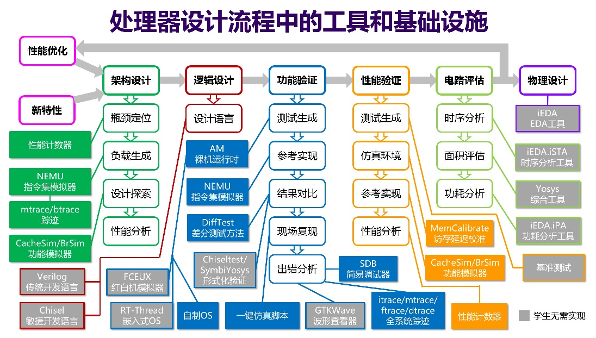

## F6 功能完备的迷你RISC-V处理器

我们已经实现了sCPU, 可以计算 `1+2+...+10` 的和. 虽然实现这个处理器确实让我们对处理器如何工作有更深入的认识, 但从实用性的角度来看, sCPU由于各种限制, 无法运行更复杂的程序. 事实上, 这些限制归根到底是因为sISA这个指令集过于简单, 例如

- PC寄存器的位宽只有4位, 这意味着, 程序最多只能包含16条指令
- GPR的位宽只有8位, 无法表示大于255的数据
- 指令的功能有限, 例如无法进行减法操作, 更不用说乘法和除法

接下来, 你将会实现一个功能完备的RISC-V处理器, 它可以运行更多程序, 甚至有潜力运行超级玛丽游戏!

## 迷你RISC-V指令集

RISC-V是近十年流行起来的开放指令集架构, 它采用模块化的思想, 把指令划分成不同模块, 除了基础指令集RV32I, 还有各种指令扩展, 包括乘除扩展, 浮点扩展, 原子操作扩展等. 开发者可以根据自身需求选择一个或多个扩展, 也可以一个扩展都不选, 这种灵活性受到了开发者的喜爱.

RV32I共有42条指令, 通过实现RV32I, 处理器已经足够完成绝大部分的计算工作. 不过为了进一步降低开发的工作量, 我们提出了一个"迷你RISC-V"指令集minirv, 从RV32I中选出了8条指令, 用它们来替代其他RV32I指令的功能, 使得RV32I能完成的工作, minirv也能完成. 这样, 我们就不必实现完整的42条RV32I指令, 也能让处理器运行更复杂的程序了.

作为一个真实的ISA, RISC-V规范的细节有相应的官方手册来描述. 我们希望大家能养成阅读官方手册的好习惯, 因此你需要下载 [RISC-V的官方手册](https://github.com/riscv/riscv-isa-manual/releases/download/20240411/unpriv-isa-asciidoc.pdf). 如果你是第一次接触ISA和处理器设计的相关知识, 你可能会感到理解官方手册的每一处细节对你来说并不容易, 不过我们将引导你从手册中寻找一些RV32I相关的关键信息.

#### 通过RTFM初步了解RISC-V指令集

查阅RISC-V手册的目录, 你发现RV32I在哪一章进行介绍? 尝试在该章节中查阅RV32I的相关内容, 回答下列问题:

1. PC寄存器的位宽是多少?
2. GPR共有多少个? 每个GPR的位宽是多少?
3. `R[0]` 和sISA的 `R[0]` 有什么不同之处?
4. 指令编码的位宽是多少? 指令有多少种基本格式?
5. 在指令的基本格式中, 需要多少位来表示一个GPR? 为什么?
6. `add` 指令的格式具体是什么?
7. 还有一种基础指令集称为RV32E, 它和RV32I有什么不同?

了解RISC-V指令集的一些细节之后, 我们就可以给出minirv这一ISA的规范了, 具体如下:

- PC初值为 `0`
- GPR数量与RV32E中定义的GPR数量一致
- 支持如下8条指令: `add`, `addi`, `lui`, `lw`, `lbu`, `sw`, `sb`, `jalr`
- 其他的ISA细节与RV32I相同

## 只有两条指令的minirv处理器

minirv有8条指令, 我们先实现其中的两条: `addi`, `jalr`. 首先考虑 `addi` 指令.

#### RTFM(2)

查阅RISC-V手册, 找到 `addi` 指令的编码和相应的功能描述. 在第34章 `RV32/64G Instruction Set Listings` 中有一些指令表, 可以帮助你查阅 `addi` 指令的编码.

针对取指过程, 你需要修改ROM的宽度和PC寄存器的位宽. 你之前使用门电路搭建多路选择器, 已经理解了多路选择器的电路结构, 而搭建更大的多路选择器只是工程上的重复劳动, 对学习并无明显帮助. 因此, 我们建议你使用Logisim提供的 `Multiplexer(多路复用器)` 组件, 你可以在元件库的 `Plexers(复用器)` 类别下找到它, 实例化后可以轻松地调整各种参数. 同样地, 你也可以在元件库的 `Memory(存储库)` 类别下找到 `Register(寄存器)`, 用于方便地实现PC寄存器. 关于这两种组件的具体使用方式, 请RTFM.

不过, 存储器的概念在电路层次和ISA层次都存在, 如何通过电路层次的存储器实现ISA层次的存储器, 就成了需要考虑的问题.

#### RTFM(3)

为了了解RISC-V对存储器的若干约定, 你需要阅读RISC-V手册第1.4节的第一段, 从ISA的层面了解存储器的规格, 尤其是宽度的定义.

为了便于描述, 我们称RISC-V手册中的定义的存储器宽度为. 显然, 在ISA层面, PC寄存器是以为单位寻址的. 而在电路层次, 如果ROM的宽度和不一致, 则不能直接用PC值对ROM进行寻址. 你需要思考如何在电路层面解决这个问题.

针对译码过程, 首先考虑操作码的译码. 虽然Logisim元件库中也有译码器, 但由于minirv中的指令并不多, 操作码编码较为稀疏, 使用译码器反而会带来一些不便. 因此, 我们建议你使用比较器, 直接比较指令中的操作码字段是否与 `addi` 指令的编码一致, 来进行译码操作. 例如, 可以通过以下操作判断一条指令是否为 `addi` 指令:

```
is_addi = (inst[6:0] == ?) && (inst[14:12] == ?)
```

其中 `inst` 表示取出的指令, `?`需要根据你查阅手册的结果来决定. 你可以在元件库的 `Arithmetic(运算器)` 类别下找到 `Comparator(比较器)`, 用于方便地实现比较功能.

至于操作数的译码, 一个需要注意的是立即数. 由于指令中的立即数位宽较短, 要与位宽较长的GPR进行计算, 先要将立即数扩展成与GPR位宽一致的数据. 通常来说, 扩展方式有两种, 一种是零扩展(zero-extend), 这种方式总是在高位添加 `0`, sISA中的 `li` 指令就是要求对立即数进行零扩展; 另一种是符号扩展(sign-extend), 这种方式是在高位添加补码的符号位. 你可以在元件库的 `Wiring(线路)` 类别下找到 `Bit Extender(位扩展器)`, 可根据配置实现不同的扩展方式.

特别地, 我们还能证明, 在符号扩展前后, 补码的真值保持一致. 假设有位二进制数, 将其符号扩展至位, 得到. 若, 扩展前后的真值显然一致. 若, 按补码方式加权展开, 有

易见时, 上述结论成立. 根据数学归纳法, 可证命题成立.

对于GPR, 其设计思路和之前类似, 不过你可以使用元件库中的 `Register(寄存器)`, `Multiplexer(多路复用器)` 和 `Plexers(复用器)` 类别下的 `Decoder(译码器)` 来帮助你节约设计的工作量. 特别地, 译码器中可将 `Include Enable?(包含使能?)` 属性配置为 `Yes(是)`, 此时译码器将多出一个 `Enable(启用)` 端口, 你可以考虑如何使用它方便地实现写使能的功能. 此外, 在RISC-V中, `R[0]` 的功能比较特殊, 你还需要考虑如何正确实现它.

针对执行过程, 你可以在元件库的 `Arithmetic(运算器)` 类别下找到 `Adder(加法器)`, 用于方便地实现加法功能.

对于更新PC, 由于RISC-V的指令位宽与sISA不同, 因此你还需要思考如何更新PC, 才能让PC正确地指向下一条指令.

#### RTFM(4)

查阅RISC-V手册, 找到 `jalr` 指令的编码和相应的功能描述.

#### 实现两条指令的minirv处理器

理解 `addi` 和 `jalr` 指令的功能后, 根据你之前设计sISA处理器的经验, 尝试设计一个支持这两条RISC-V指令的处理器.

由于GPR需要进行较多的连线工作, 为了减轻大家的负担, 我们准备了一个预先完成大量连线工作的 [GPR子模块](https://ysyx.oscc.cc/slides/2407/resources/code/logisim/GPR.circ). 下载后, 通过Logisim打开文件 `GPR.circ`, 即可看到GPR的电路设计, 你可以整体选择这个电路后, 通过复制和粘贴将其加入到你工程中. 不过, 这个电路并没有实现GPR的完整功能, 你需要根据你对GPR的理解完善它.

为了帮助你对处理器进行简单的测试, 我们准备了如下测试程序. 在下面的汇编指令中, GPR采用了ABI助记符(mnemonic), 名称更能反映其功能, 例如, 用 `zero` 表示编号为 `0` 的GPR. 汇编指令中还有 `a0` 和 `ra`, 你可以通过解析相应的指令编码得知对应的GPR编号.

```
00000000 <_start>:
   0:    01400513              addi    a0,zero,20
   4:    010000e7              jalr    ra,16(zero) # 10 <fun>
   8:    00c000e7              jalr    ra,12(zero) # c <halt>

0000000c <halt>:
   c:    00c00067              jalr    zero,12(zero) # c <halt>

00000010 <fun>:
  10:    00a50513              addi    a0,a0,10
  14:    00008067              jalr    zero,0(ra)
```

尝试通过指令集的状态机理解这个程序的功能. 理解后, 将程序其放置在ROM中, 并尝试运行你的处理器, 然后检查处理器的运行结果是否符合预期.

#### 测试addi指令

在上述测试程序中, `addi` 指令的立即数比较小. 为了测试符号扩展的实现是否正确, 你需要让处理器执行一些立即数为负数的 `addi` 指令. 尝试编写若干条这种类型的 `addi` 指令, 并放置到ROM中, 检查你的实现是否正确.

## 实现完整的minirv处理器

接下来, 我们考虑如何实现minirv的剩余6条指令. RTFM后你会发现, `add` 指令的功能与sISA中的 `add` 指令非常类似, 因此不难实现. 而对于 `lui` 指令, 则和sISA中的 `li` 指令很相似, 只不过要考虑不同类型的立即数格式.

#### 实现完整的minirv处理器

实现 `add` 和 `lui` 指令. 实现后, 尝试编写一些简单的指令序列放置到ROM中, 来初步检查你的实现是否正确.

剩余的4条指令都是访存指令, 它们都需要访问存储器. 访存操作分为读内存(load)和写内存(store)两种. 由于store指令需要写入内存, 因此ROM无法满足这一要求, 我们需要采用RAM.

你之前已经学习过RAM的工作原理了, 但为了方便支持更大的程序, 我们还是使用Logisim提供的 `RAM` 组件, 你可以在元件库的 `Memory(存储库)` 类别下找到它. 实例化后, 你需要按照以下配置修改其中的一些关键参数:

- Address Bit Width(地址位宽) - 根据后续的程序大小和你的理解进行配置
- Data Bit Width(数据位宽) - 32
- Enables(启用方式) - Use byte enables(使用字节启用)
- Ram type(RAM型) - non volatile(非易失性)
- Use clear pin(使用清除销) - No(否)
- Trigger(触发器) - Rising Edge(上升沿)
- Asynchronous read(异步读取) - Yes(是)
- Read write control(读写控制) - Use byte enables(使用字节启用)
- Data bus implementation(数据总线实现) - Separate data bus for read and write(用于读写的独立数据总线)

完成上述配置工作后, RAM组件的端口包括: 读写地址 `A`, 写使能 `WE`, 读使能 `OE`, 字节写使能 `BE0`, `BE1`, `BE2`, `BE3`, 写数据 `D` (输入), 读数据 `D` (输出), 以及时钟. 在进一步考虑如何将RAM接入处理器的数据通路前, 你还需要了解RISC-V对存储器的约定, 以及相应访存指令的具体行为.

#### RTFM(5)

查阅RISC-V手册, 找到 `lw`, `lbu`, `sw` 和 `sb` 这4条指令的编码和相应的功能描述. 手册中还介绍了 `EEI` 和不对齐访存的相关内容, 目前暂不使用, 因此你可以忽略这些内容.

`lw` 指令较容易实现, 计算出访存地址后, 将其接入到RAM, 并使RAM的读使能 `OE` 有效, 即可读出相应地址的数据. 和上文讨论的取指过程类似, 这个配置后的电路层次的存储器规格与ISA层次的存储器定义有所区别, 你需要思考如何正确地连接地址信号. 此外, 由于读操作不改变存储器的状态, 为了简单起见, 你可以将读使能 `OE` 总是置为有效.

`sw` 指令的实现也不难, 除了需要考虑不同类型的立即数格式外, 还需要连接写数据, 写使能和字节写使能. 由于写操作会改变存储器的状态, 因此只有执行store指令时, 才能将写使能置为有效. 至于字节写使能, 它可以用于控制需要写入一个字中的哪些字节, 字节写使能无效的那些字节将不会在这次写操作中被更新. 关于如何为 `sw` 设置正确的字节写使能, 就交给你来思考了.

#### 不必考虑不对齐访存

如果访存地址 `addr` 除以访存指令的数据位宽 `w`, 余数为 `0`, 则表示此次访存是对齐的. 对于 `lw` 和 `sw`, 有 `w = 4`, 因此如果满足 `addr % 4 == 0` (`%` 为求余操作), 则访存是对齐的; 如果不满足, 则访存是不对齐的.

为了简化处理器的实现, 对于 `lw` 和 `sw` 指令计算出的访存地址, 我们可以假设其二进制表示的最低2位均为0. 我们提供的测试程序会保证这一性质, 因此不会出现需要访问的内容跨越了RAM中两个存储字的情况. 这样, 实现处理器时就不需要考虑不对齐访存的情况.

感兴趣的同学可以尝试阅读手册中的相关内容.

#### 实现完整的minirv处理器(2)

实现 `lw` 和 `sw` 指令, 然后编写一些简单的指令序列放置到ROM中, 来初步检查你的实现是否正确. 特别地, 你可以用鼠标右键点击RAM组件, 然后通过 `Edit Contents` 在RAM中放置一些数据, 来帮助你测试访存指令的行为.

`lbu` 指令只需要读出一个字节, 但RAM的宽度比一个字节大. 你需要根据具体的访存地址, 从读出的数据中选择出相应的字节, 并写回目的寄存器.

#### 实现完整的minirv处理器(3)

实现 `lbu` 指令, 并通过一些指令序列来初步检查你的实现是否正确.

Hint: 你可以先在RAM中放置一个4字节的数据 `0x12345678`, 并通过 `lw` 指令读出它(假设数据位于内存地址 `a`), 确认读出结果为 `0x12345678`. 然后通过若干条 `lbu` 指令分别从内存地址 `a`, `a+1`, `a+2`, `a+3` 中读出数据, 我们预期这些 `lbu` 指令分别读出 `0x78` (对应地址 `a`), `0x56`, `0x34`, `0x12` (对应地址 `a+3`).

`sb` 则相反, 它只需要往目标地址写入一个字节, 因此需要通过具体的访存地址生成合适的字节写使能信号, 从而控制哪一个字节被写入.

#### 实现完整的minirv处理器(4)

实现 `sb` 指令, 并通过一些指令序列来初步检查你的实现是否正确.

Hint: 你可以先在RAM中放置一个4字节的数据 `0x12345678`, 并通过 `lw` 指令读出它(假设数据位于内存地址 `a`), 确认读出结果为 `0x12345678`. 然后通过若干条 `sb` 指令分别往内存地址 `a+3`, `a+2`, `a+1`, `a+0` 中写入 `0x90` (对应地址 `a+3`), `0xab`, `0xcd`, `0xef` (对应地址 `a`); 写入之前, 可以通过 `addi` 指令配合零号寄存器, 来向目的寄存器写入一个立即数, 从而实现sISA中 `li` 指令的效果. 最后再次通过 `lw` 指令读出新数据, 我们预期读出结果为 `0x90abcdef`.

你已经实现了完整的minirv处理器了, 为了进一步测试处理器, 需要考虑在处理器上运行更多更复杂的程序. 我们之前都是人工编写指令序列, 并将指令一条条放入ROM中, 但这种方式开发规模更大的程序, 是非常麻烦的. 为此, 我们准备了一些C程序, 并将它们编译成minirv的指令, 点击 [这里](https://ysyx.oscc.cc/slides/resources/archive/logisim-bin.tar.bz2) 下载编译结果(`.hex` 文件, 可被Logisim直接加载)和反汇编(`.txt` 文件). 但这些程序的指令有很多, 为了快速将这些程序对应的指令序列放置到ROM中, 我们建议你使用Logisim提供的 `ROM` 组件, 你可以在元件库的 `Memory(存储库)` 类别下找到它. 实例化后, 你需要按照以下配置修改其中的一些关键参数:

- Address Bit Width(地址位宽) - 根据后续的程序大小和你的理解进行配置
- Data Bit Width(数据位宽) - 32
- Line size(行大小) - Single(单行)
- Allow misaligned?(是否允许未对齐?) - No(否)

以 `mem` 程序为例, 用鼠标右键点击ROM组件, 选择 `Load Image(加载图像)`, 然后选择 `mem.hex` 文件, 这个过程将会把 `mem.hex` 中描述的内容按顺序加载到ROM中. 事实上, `.hex` 文件中不仅仅包含程序的指令序列, 还包含程序所处理的数据, 程序会通过访存指令访问这些数据, 因此我们还需要将`.hex` 文件加载到RAM中, 具体操作和ROM类似. 这相当于将同一个`.hex` 文件同时加载到ROM和RAM中, 会导致ROM中包含程序所处理的数据, RAM中也包含指令序列, 但程序自身的功能保证它不会通过访存指令访问RAM中的指令序列, 也不会从ROM中错误地将数据当作指令取出并执行, 因此这并不会影响程序执行的正确性.

由于这些程序的运行需要执行很多指令, 为了判断程序的运行是否正确, 我们需要检查如下两点属性:

1. 程序已经执行结束. 针对这一点, 我们让程序在执行结束时陷入一个死循环, 在指令层面表现为不断重复执行几条指令. 不过每个程序什么时候执行结束并不是确定的, 为此, 我们给出相应程序执行结束所花费的周期数, 你可以额外实现一个每个周期都加 `1` 的64位计数器, 当计数器的值超过我们给定的周期数, 即可认为执行结束, 并进行下一点属性的检查.
2. 程序的结束状态符合预期. 针对这一点, 我们让程序结束时的PC值总是位于一个特定的函数 `halt` 附近, 具体地, 当上一点属性满足时, 查看此时的PC值, 并在反汇编文件中查找该PC值, 你应该发现该PC值位于 `halt` 函数附近. 此外, 我们还让程序以 `a0` 寄存器为 `0` 的状态结束运行, 也即, 当上一点属性满足时, 你应该发现 `a0` 寄存器的值为 `0`.

#### 在minirv处理器上执行C程序

分别加载并运行 `mem.hex` 和 `sum.hex`. 运行指定时间后, 检查处理器的状态, 若PC位于 `halt` 函数附近, 且 `a0` 寄存器为 `0`, 则说明程序运行正确. 两个程序的预期运行时间如下:

- `mem.hex` - 6000周期
- `sum.hex` - 6000周期

如果你发现运行指定时间后, PC位于其他位置, 或 `a0` 寄存器不为 `0`, 则说明程序运行错误. 但由于这个过程中已经运行了上千条指令, 很难发现是哪一条指令执行出错, 因此我们还是推荐你做好上一道必做题的验证工作, 通过一些简单的指令序列来检查你的处理器实现是否正确.

## 为minirv处理器添加图形显示功能

你已经实现了minirv的处理器了, 原则上来说, RV32I指令集能完成的功能, 这个处理器也可以完成. 接下来我们给这个minirv处理器添加一个"屏幕", 并通过运行程序在这个屏幕上显示一张图片.

首先, 你需要在Logisim中实例化一个屏幕组件, 你可以在元件库的 `Input/Output(输入/输出)` 类别下找到 `RGB Video(RGB视频)` 组件. 实例化后, 你需要按照以下配置修改其中的一些关键参数:

- Cursor(光标) - No Cursor
- Reset Behavior(重置行为) - Asynchronous
- Color Model(颜色模式) - 888 RGB (24 bit)
- Width(宽度) - 256
- Height(高度) - 256

实例化后可以看到, `RGB Video` 组件包含以下端口: 时钟, 复位, 写使能, X坐标, Y坐标, 以及待写入像素数据. 不难得知, 其功能是: 在写使能有效时, 将像素数据更新到组件的X-Y坐标处. 接下来我们需要考虑的是, 处理器如何通过指令来向 `RGB Video` 组件写入像素.

对处理器来说, 类似 `RGB Video` 这样的部件称为外部设备, 简称"外设". 事实上, 如何访问外设属于ISA规范的其中一部分. 具体到RISC-V中, 访问外设是通过"内存映射I/O"(Memory-mapped I/O)方式来进行的. 这种方式的本质是, 根据访存地址的范围来决定处理器的访问对象是内存还是外设.

具体到 `RGB Video` 中, 根据上述配置, 一个像素数据占3字节. 但为了方便处理, 我们可以将其视为4字节. 这样, 整个屏幕所存储的像素数据大小为 `256x256x4B=256KB`. 我们约定屏幕上的每个像素数据对应的地址是连续的, 因此我们需要为整个屏幕的像素数据划分出一段连续的地址区域, 例如 `[0x20000000, 0x20040000)`. 当访存指令的目标地址落在这个范围之内, 相应指令将访问 `RGB Video`, 而不是访问RAM.

为了实现“根据访存地址范围就决定访问对象”的功能, 你需要在处理器的数据通路上添加一个地址译码器模块, 它输入访存地址, 输出两个控制信号 `isVGA` 和 `isMem`. 其中当访存地址落在上述区间时, `isVGA` 有效, 否则 `isMem` 有效. 接下来就可以通过这两个控制信号来控制相应组件的访问行为了.

对 `RGB Video` 来说, 其写入操作需要受到 `isVGA` 信号的控制, 也即, 只有当前指令为store指令, 且地址落在上述区间时, 才能写入 `RGB Video`. 为了简化处理, 我们约定程序只能通过 `sw` 指令来将像素写入屏幕, 因此 `sw` 的待写入数据可以直接连接到 `RGB Video`. 最后还需要考虑X坐标和Y坐标的连接. 事实上, 因为像素数据对应的地址是连续的, 给出一个落在 `RGB Video` 范围内的地址, 我们很容易得到这个地址所对应像素的X坐标和Y坐标, 例如, 地址 `0x20000000` 对应第0行第0列的像素, 而地址 `0x20000408` 对应第1行第2列的像素.

对RAM来说, 其写操作也需要受到 `isMem` 信号的控制, 从而避免在访问 `RGB Video` 时错误地往RAM中写入.

上面只是关于外设访问原理的简单介绍, 我们会在D阶段中进一步讨论外设的各种细节.

#### 为minirv处理器添加图形显示功能

在处理器的数据通路上添加 `RGB Video` 组件. 我们约定, 屏幕像素对应的存储区域是 `[0x20000000, 0x20040000)`.

添加组件后, 加载并运行 `vga.hex` 程序. 这个程序的预期运行时间是628000周期, 你可能需要等待1~2分钟. 如果你的实现正确, 你将看到程序运行结束时, `RGB Video` 组件中显示"一生一芯"logo.

我们在2025年11月14日将讲义中的Logisim版本更新到4.0.0, 可以大幅提升仿真效率. 在Logisim 3.8.0中, `vga.hex` 程序需要运行1~2小时, 因此建议你采用新版本的Logisim.

#### 修复logo显示问题

我们修复了logo左上角存在两格黑色像素的问题. 如果你在2026/01/30 15:40:00之前获取 `vga.hex` 程序, 请重新获取.

## 迈向现代化的处理器设计

恭喜你, 你已经成功在Logisim中设计出一个有点展示效果的处理器了. 但同时你也应该感觉到, 在Logisim中设计处理器也存在不少缺陷:

- 设计繁琐. 虽然拖动组件和连线让你确实有设计电路的感觉, 但当设计的规模增加后, 这些操作将会变得繁琐. 目前你设计的minirv处理器只有8条指令, 但完整的RV32I有42条指令; 而要实现一个可以启动现代操作系统的RISC-V处理器, 需要实现上百条指令; 如果考虑现代的Intel和ARM这些成熟的商业处理器, 它们需要支持上千条指令, 光是ISA手册就有几千页, 芯片的晶体管数量更是到达几百亿的量级.
- 仿真速度慢. 一方面, Logisim的仿真效率本身就不高, 而随着设计规模变得复杂, 仿真速度也会因为组件数量增多而变得越来越慢. 另一方面, 虽然minirv原则上可以实现RV32I指令集的所有功能, 但为了这一点, 我们将那些不属于minirv中的RV32I指令翻译成行为等价的几条甚至几十条minirv指令, 也即, 对于一个程序, 相比于将其编译到RV32I, 将其编译到minirv的执行效率将会降低数倍甚至数十倍. 从目前的仿真情况来看, 通过执行程序在 `RGB Video` 组件中显示一张 `256x256` 的图片, 都要花费1~2分钟. 即使minirv具备运行超级玛丽游戏的潜能, 游戏体验也会因为仿真效率过低而变得难以忍受.
- 调试困难. 只要在设计过程中不小心连错了一根线, 处理器运行程序的结果就可能不符合预期. 如果程序规模不大, 我们还能逐条指令地检查处理器的执行状态是否与ISA的状态一致; 但对于上面的 `mem.hex` 和 `sum.hex`, 就已经要执行6000多条指令; 而 `vga.hex` 甚至要执行628000条指令, 要找到哪一条指令的执行不符合预期, 是非常困难的; 如果要运行超级玛丽, 执行的指令数量将会是一个天文数字! 而要在这么多的指令中找到错误, 简直比大海捞针还难!

这些问题都说明, 使用Logisim设计处理器并不是一种扩展性良好的方案. 事实上, 现代的处理器设计流程主要采用代码开发的方式, 通过硬件描述语言(Hardware Description Language, HDL)描述硬件组件之间如何连接, 来给出处理器的逻辑结构, 而不需要手工进行连线操作. 完成代码开发后, 需要通过仿真工具来检查代码所给出的逻辑结构是否符合预期, 还需要通过EDA工具将代码转变成版图, 就像编译器将C代码转变成指令序列那样.

除了上文提到的步骤, 现代的处理器设计流程还包含更多环节, 如下图所示. 我们列举出在现代处理器设计流程中需要解决的一部分问题:

- 架构设计: 给定一个新特性(可能是添加新指令等来自ISA规范的功能, 也可能是处理器层次上的功能优化方案), 如何给出一个设计方案, 将其分解成合适的硬件模块来实现它?
- 逻辑设计: 有了设计方案, 如何通过HDL在电路层次将设计方案中的硬件模块实现出来?
- 功能验证: 如何验证HDL所描述的电路满足新特性所期望的功能?
- 性能验证: 如何保证处理器的性能符合预期?
- 电路评估: 如何评估并优化处理器的频率, 面积和功耗等指标?
- 物理设计: 如何将HDL代码转变成可流片的版图?
- 性能优化: 如何发现并定位处理器中性能瓶颈, 并设计出相应的优化方案?



同时, 你也应该发现, 即使是上文提到的Logisim的设计过程, 也还有很多你目前可能不了解的步骤, 例如:

- C语言是如何生成RISC-V指令序列的?
- 如何用C语言开发一个能在屏幕上显示"一生一芯"logo的程序?
- 如何开发更多的程序在处理器上运行?

#### 处理器设计!= HDL编码

很多就读电子类专业的同学, 很可能会把处理器设计简单地看作是HDL编码的工作. 这种观点是片面的: 从上图来看, HDL编码只是逻辑设计环节的工作, 而整个流程有非常多环节. 事实上, 处理器设计的过程中的很多环节都与软件相关, 这是因为:

- 处理器离开了软件就无法工作. 你已经知道处理器的工作原理就是不断执行指令, 而这些指令就是软件. 要评估一个处理器, 就是看软件在这个处理器上运行得对不对, 运行得好不好.
- 在上图所示的流程中, 要完成这些步骤, 就需要各种工具和基础设施的支撑. 而这些工具和基础设施的本质也是软件, 尤其是那些与处理器功能紧密相关的工具 (如图中的指令集模拟器, 功能模拟器, 差分测试方法等), 它们对相关步骤的开展起着重要的作用.
- HDL代码虽然描述的对象是硬件, 但它本身作为代码, 也是一种软件. 既然是代码, 就需要使用合适的软件技术对其进行管理, 维护, 测试, 评估和优化. 尤其是随着代码规模的增大, 这些问题也会显得越来越重要. 幸运的是, 软件工程领域已经针对这些问题研究数十年了, 在需要的时候, 我们可以借鉴软件工程领域的经验来帮助我们解决相关问题.

总之, 要设计出一个好的处理器, 就需要重视软件在其中发挥的作用.

目前你不一定能完全明白上述问题的意义, 我们也不打算在此展开介绍它们. 往后, 我们将会抛弃Logisim的设计方式, 引导大家逐渐搭建上述的现代处理器设计流程, 而你对上述问题的认识, 也将会在这个过程中变得越来越清晰.

马上就要踏入代码的世界了, 你准备好了吗?