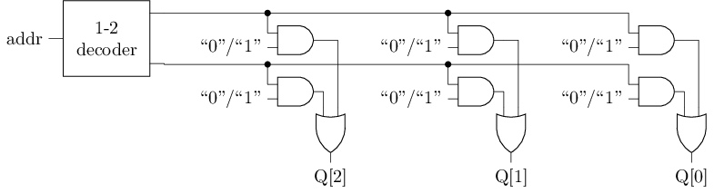

## F5 支持数列求和的简单处理器

通过ISA和状态机模型, 我们已经了解程序如何执行. 此外, 我们也已经学习了数字逻辑电路的基础知识. 现在是时候用数字电路实现一个CPU了!

在此之前, 我们需要再次明确需要实现的指令集sISA的细节. 和上一小节相比, 此处还约定了一些寄存器的位宽:

- PC位宽为4位, 初值为 `0`
- GPR有4个, 位宽均为8位
- 支持如下3条指令
	```
	7  6 5  4 3   2 1   0
	+----+----+-----+-----+
	| 00 | rd | rs1 | rs2 | R[rd]=R[rs1]+R[rs2]       add指令, 寄存器相加
	+----+----+-----+-----+
	| 10 | rd |    imm    | R[rd]=imm                 li指令, 装入立即数, 高位补0
	+----+----+-----+-----+
	| 11 |   addr   | rs2 | if (R[0]!=R[rs2]) PC=addr bner0指令, 若不等于R[0]则跳转
	+----+----------+-----+
	```

我们将这个用数字电路实现的sISA指令集的CPU称为sCPU. 要实现sCPU, 我们需要用数字电路实现sISA中的每一个概念. 为了简单起见, 我们先从最简单的 `li` 指令开始考虑, 也即, 先实现一个只支持 `li` 指令的sCPU.

## 只有一条指令的sCPU

我们先从ISA的状态机模型回顾执行一条 `li` 指令的具体过程. 事实上, 无论是执行什么指令, 其步骤都是类似的, 有一个叫"指令周期"(instruction cycle)的概念专门描述这些步骤:

1. 取指(fetch): 根据当前PC, 在存储器中找到一条指令
2. 译码(decode): 看这条指令具体是什么指令, 操作数是哪些
	- 以 `li` 指令为例, 操作数需要看立即数是多少, 需要写入哪个目的寄存器
3. 执行(execute): 对操作数进行处理, 必要时更新指定的目的寄存器
4. 更新PC: 让PC指向下一条指令

因此, 我们的目标就是用数字电路实现上述过程的每一个步骤.

### 取指

首先需要一个PC寄存器, 你之前已经用数字电路实现过寄存器了, 因此PC寄存器并不难实现. 然后需要根据PC在存储器中找到一条指令, 因此我们还需要实现存储器.

存储器和寄存器都可以存储信息, 但存储器还支持寻址(addressing), 也即, 存储器中的内容按顺序进行排布, 给出一个地址, 存储器可以读出该地址对应的内容. 我们可以将存储器看成一个由比特构成的矩阵, 矩阵的每一行称为一个存储字(word), 地址就是行的编号, 行的数量也称为存储器的深度(depth). 通常一个存储字包含多位数据, 其位宽称为存储器的宽度(width). 通常用 `深度x宽度` 表示一个存储器的规格. 例如, 一个 `2x3` 的存储器排布如下, 其中表示第行第列所存储的比特:

| 地址 | 存储字 |
| --- | --- |
| 0 |  |
| 1 |  |

从功能上划分, 存储器可以分别只读存储器(Read-Only Memory, ROM) 和随机访问存储器(Random Access Memory, RAM), 前者不支持写入, 而后者支持. 对于sISA来说, 因为3条指令都不会访问存储器, 只有取指操作需要从存储器中读出指令, 因此这里可以采用ROM.

一个 `2x3` 的ROM的结构如下图所示. 左上方的译码器又称"地址译码器". 和地址译码器输出相连的导线称为"字线"(word line), 每条字线对应一个存储字. 和或门输出相连的导线称为"位线"(bit line), 每条位线对应存储字的一位.



给定地址 `addr`, 可以读出ROM中的相应存储字, 其工作过程如下. 地址译码器将输入的地址转换成一组独热码, 由于独热码中只有一位有效, 故所有字线中, 只有地址 `addr` 对应的字线有效, 使得该行中存放的信息可以通过与门. 其余行因字线无效, 存放的信息均被与门过滤为 `0`. 被选中的存储字的每一位经过或门传输到位线, 向存储器外部输出.

实际上, 图中的地址译码器, 与门和或门, 在功能上共同构成了一个3位的2选1多路选择器. 因此ROM的读操作也可以看作是从多个存储字中选择一个, 地址 `addr` 就是多路选择器的选择端, 所有存储字分别作为多路选择器的数据端. 特别地, ROM中存储的信息是直接通过高低电平编码的, 因此ROM从功能上也可以看作是数据端为常数的多路选择器.

#### 实现取指功能

通过多路选择器实现一个ROM, 并在其中存放数列求和的指令序列, 然后通过PC寄存器取出指令. 你需要根据你的理解来确定ROM的规格.

### 译码

译码的目的是根据指令的编码识别指令的功能. 我们在ISA的状态机上执行指令时, 是通过指令的汇编表示直接识别其功能(如 `li r0, 10`), 或者给出指令的二进制表示(如 `10001010`), 然后查阅指令的功能说明来了解其功能, 本质上来说都是属于人工进行译码操作. 但现在我们需要用电路来实现这一操作, 注意电路中存放的指令是其二进制表示, 因此我们需要在二进制层面对指令进行译码.

译码的工作进一步分为操作码译码和操作数译码, 前者是根据指令的操作码来识别指令的功能, 后者是从指令的编码中识别出相应的操作数. 对于操作码译码, 由于目前只需要实现一条 `li` 指令, 因此我们可以认为取到的指令就是 `li`, 不存在其他情况. 对于操作数译码, 我们只需要解析出 `li` 指令中的 `rd` 和 `imm` 字段即可. 从电路的角度上看, 这只是一些位抽取操作, 并不难实现.

### 执行

`li` 指令的功能是将立即数 `imm` 写入 `rd` 寄存器中, 因此我们需要考虑如何实现ISA的GPR.

GPR通常包含多个寄存器, 一次访问通常只访问其中的几个寄存器, 因此GPR也应该支持寻址. 可以看到, GPR的电路本质也是一个存储器. 不过GPR需要作为目的寄存器被指令写入, 因此GPR是一个支持写入的存储器, 即RAM.

考虑一个 `2x3` 的RAM, 其读操作涉及的结构如下图所示. 可以看到, 除了存储单元采用了D触发器之外, 其余结构与ROM基本一致, 因此RAM的读出操作的工作过程可参考上文ROM相关的部分.

至于RAM的写操作, 涉及的结构如下图所示. 进行写操作除了需要提供地址外, 还需要提供待写入数据 `D`. 对于RAM来说, 并非所有时刻都需要进行写入操作, 例如, 在执行 `bner0` 指令时, 就不需要写入GPR, 因此还需要一个写使能信号 `EN`, 指示当前是否需要写入.

给定地址 `addr` 和待写入数据 `D`, 在写使能 `EN` 有效时, 可以将数据 `D` 写入RAM中的相应存储字, 其工作过程如下. 待写入数据 `D` 通过位线将每一位分别连接到每一个存储字中相应位的 `D` 端, 写使能 `EN` 通过与门对地址译码器输出的独热码进行过滤, 并与字线连接, 因此在 `EN` 有效的情况下, 只有地址 `addr` 对应的字线有效, 其余行因字线无效. 将每一行的字线分别连接到对应存储器中相应的 `EN` 端, 被选中的存储字将更新为待写入数据 `D`, 从而完成写入操作.

将读操作和写操作的结构合并, 得到RAM的结构如下图所示. 这种RAM在同一时刻只能通过一个地址访问其中的一个存储字, 称为"单端口RAM"(single port RAM). 相应地, 有的RAM在同一时刻可以通过多个地址访问其中的多个存储字, 称为"多端口RAM"(multi-port RAM). 可见, 增加RAM的"端口", 需要添加额外的电路逻辑, 从而使得多个端口的电路逻辑可以同时工作.

和ROM类似, 图中的地址译码器, 读操作通路上的与门和或门, 在功能上共同构成了一个3位的2选1多路选择器. 因此对于RAM的读取功能, 也可以看作是数据端为寄存器的多路选择器, 但写入功能需要在寄存器的基础上额外实现.

#### 实现GPR及其写入功能

在寄存器的基础上搭建一个RAM, 从而实现GPR的写入功能. 你需要根据你的理解来确定RAM的规格.

### 更新PC

更新PC的操作十分简单, 对PC寄存器加1即可, 这可以通过数字电路中的计数器来实现.

#### 实现仅支持li指令的sCPU

根据上文, 用数字电路实现 `li` 的指令周期涉及的各个部件, 并将它们连接起来. 实现后, 尝试让sCPU执行数列求和程序中的前几条 `li` 指令, 并观察电路中GPR的状态是否与ISA的状态一致.

## 实现完整的sCPU

接下来考虑如何实现 `add` 指令. 由于对所有指令来说, 取指和更新PC这两个步骤的行为都一样, 因此可以直接复用之前实现的取指逻辑.

对于译码, 由于 `add` 指令的行为和 `li` 指令不同, 因此有必要识别当前取出的是什么指令. 为了实现这一点, 需要检查指令的 `opcode` 字段, 如果是 `00`, 则是 `add` 指令, 如果是 `10`, 则是 `li` 指令. 要识别输入的取值, 最适合的电路就是译码器! 由于 `opcode` 只有2位, 我们可以使用一个2-4译码器, 它输出的独热码可以指示当前指令属于何种指令, 这样的译码器称为指令译码器. 这组独热码通常作为控制信号, 用于控制部分电路如何工作, 从而支持不同指令的功能.

考虑完操作码之后, 还需要考虑操作数. 和 `li` 指令相比, `add` 指令除了需要写入 `rd`, 还需要读出 `rs1` 和 `rs2` 作为源操作数, 需要同时通过两个读端口和一个写端口访问GPR. 因此, 我们还需要为GPR添加两个读口, 添加后, GPR模块应至少包含如下端口信号:

- 第1个读端口: `raddr1` (读地址), `rdata1` (读数据)
- 第2个读端口: `raddr2`, `rdata2`
- 写端口: `waddr` (写地址), `wdata` (写数据), `wen` (写使能), `clk` (时钟)

读出源操作数后, `add` 指令的行为是将两数相加, 然后将加法结果写入 `rd` 寄存器. 前者可以通过加法器实现, 但后者写入GPR时, GPR的 `wdata` 端口已经被 `li` 指令的结果占用. 考虑到指令 `opcode` 编码的唯一性, 一条指令不可能既是 `li` 指令又是 `add` 指令, 因此可以根据指令的类别对写入GPR的数据进行选择: 如果当前指令是加法指令, 就选择加法器的结果, 否则选择 `li` 指令的立即数. 可以通过多路选择器实现这样的选择功能, 将写入GPR的两个数据来源作为多路选择器的数据端, 然后让译码时独热码中合适的信号连接到多路选择器的选择端, 来控制多路选择器按照指令类型选出正确的数据, 即可实现上述功能.

#### 添加add指令

根据上文, 在sCPU中添加 `add` 指令. 实现后, 尝试让sCPU继续执行数列求和程序中的几条 `add` 指令, 并观察电路中GPR的状态是否与ISA的状态一致.

最后是 `bner0` 指令. 为了识别 `bner0` 指令, 我们可以复用指令译码器的功能. 至于操作数, 除了指令中的 `rs2` 和 `addr`, 还有一个隐含的 `R[0]`. 由于 `bner0` 指令中 `rs2` 字段的位置和 `add` 指令中 `rs2` 字段的位置一样, 因此可以复用 `add` 指令中读出 `rs2` 寄存器的逻辑. 但 `bner0` 还需要读出 `R[0]`, 因此可以把 `0` 作为GPR的 `raddr1` 端口的输入. 不过这个端口已经被 `add` 指令的 `rs1` 占用, 但也同样可以通过多路选择器的解决问题.

读出源操作数后, `bner0` 指令需要比较两数是否相等, 这可以通过比较器来实现. 若比较结果不相等, 需要将PC更新为 `addr` 字段. 换句话说, 只有当前指令为 `bner0` 指令, 且比较结果不相等, 才将PC更新为 `addr` 字段, 其余情况应将PC更新为PC加1. 同样地, 我们可以借助多路选择器对PC寄存器的输入端进行选择.

最后, `bner0` 指令不会写入GPR, 因此需要将GPR的 `wen` 置为无效.

#### 添加bner0指令

根据上文, 在sCPU中添加 `bner0` 指令. 实现后, 尝试让sCPU执行完整的数列求和程序, 如果你的实现正确, 你应该能看到PC最终为 `7`, 且在某GPR中存放求和结果 `55`.

#### 和数列求和电路进行对比

在学习数字电路时, 有一道必做题要求你通过寄存器和加法器, 计算出 `1+2+...+10` 的结果. 现在你用sCPU完成了同样的计算, 尝试对比两个方案各有什么优点和缺点.

## 重新审视CPU

恭喜! 这可能是你实现的第一个CPU! 尽管这个sCPU非常简单, 但也能从中窥探出一些可以帮助我们理解CPU的性质.

上文讨论如何添加指令时, 都是先分析指令的预期行为, 然后根据指令的行为在数据流动的方向上依次添加所需的部件. 数据在CPU中流动的路径和路径上的相关部件, 称为CPU的数据通路(data path), 在上文的讨论中, 属于数据通路的部件有GPR, 加法器, 存储器, 比较器等.

当多条指令的数据通路出现冲突时, 通常需要引入一些额外的电路, 来控制数据如何流动, 使得每条指令都能完成符合ISA规范的操作. 这些额外的电路属于CPU中的控制逻辑, 其中决定控制逻辑行为的信号称为控制信号. 事实上, 设计数据通路和控制信号, 正是CPU设计中最关键的两个步骤.

我们将前文涉及到的控制逻辑及其在不同指令执行时的预期行为整理如下:

| 指令 | `wdata` 的选择 | `wen` | `raddr1` 的选择 | 更新PC的选择 |
| --- | --- | --- | --- | --- |
| `add` | 加法器的输出 | `1` | 指令的 `rs1` | `PC + 1` |
| `li` | 立即数 | `1` | `X` | `PC + 1` |
| `bner0` | `X` | `0` | `0` | 指令的 `addr` |

其中, `X` 表示无关项(don't care), 选择什么都可以. 例如 `bner0` 指令不会写入GPR, 因此无论 `wdata` 选择什么, 都不影响sCPU的正确性. 注意到这些选择与指令的类型相关, 也即, 指令的类型决定了控制逻辑的行为, 从而决定了数据通路中数据的流向, 最终完成指令约定的功能.

观察你在Logisim中设计的sCPU, 如果把取出的指令作为边界, 将sCPU划分为左右两侧, 你应该能发现, 左侧向右侧传递的信息只有指令. 同时, 右侧电路的控制逻辑最终都是由指令译码器所输出的独热码控制的, 而指令译码器的输入端就是指令的操作码, 因此可以说, 右侧的电路完全受到指令的控制. 这恰恰印证了上一节所说的, `在CPU上执行程序 = 用程序编译出的指令序列控制CPU电路进行状态转移`.

最后, 我们通过一些必做题来加深对指令的理解.

#### 计算10以内的奇数之和

编写一段指令序列, 计算10以内的奇数之和, 即 `1+3+5+7+9`. 然后尝试用你设计的sCPU指令这段指令序列, 检查运行结果是否符合预期.

完成后, 你对计算机的"存储程序"思想有什么认识?

#### 添加新指令

尝试为sISA添加一条新指令 `out rs`, 执行该指令后, 会将 `R[rs]` 以十六进制的形式输出到七段数码管. 你可以自行决定这条指令的编码.

然后, 在sCPU中实现 `out` 指令, 并修改数列求和程序, 使得在计算出结果后, 能在七段数码管中显示计算结果.

#### 能设计一条让10个数相加的指令吗?

上述数列求和的程序需要执行数十条指令才能计算出结果. 有同学建议, 为了提升sCPU的计算效率, 应该设计一条让10个数相加的指令, 这样就可以通过一条指令直接计算 `1+2+...+10`. 该建议是否合理? 尝试从程序, ISA和CPU电路设计的角度给出你的理由.